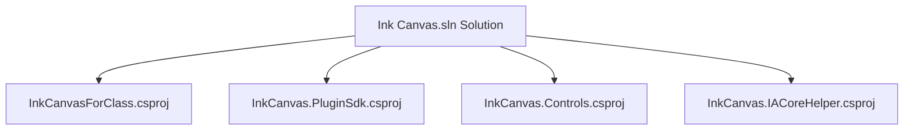
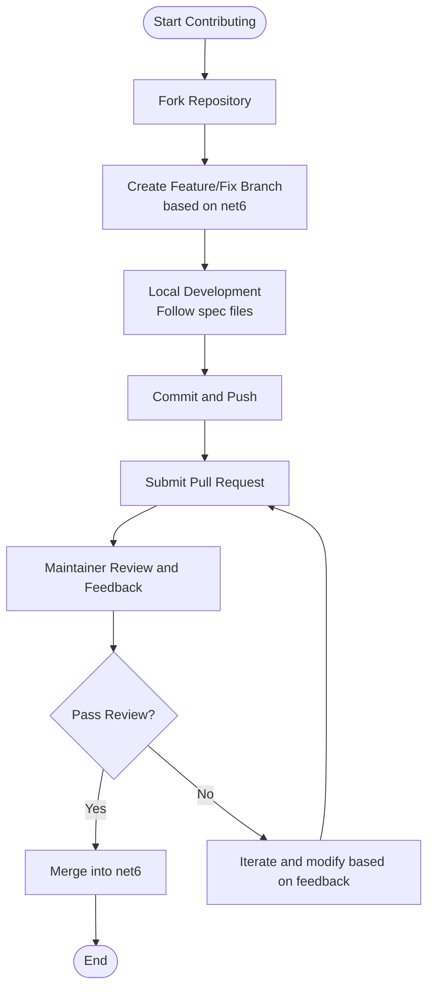
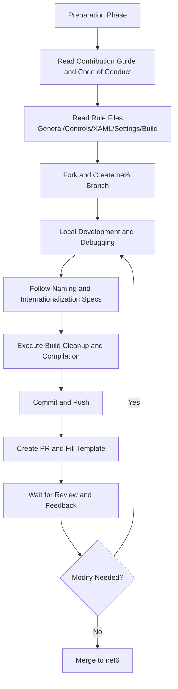
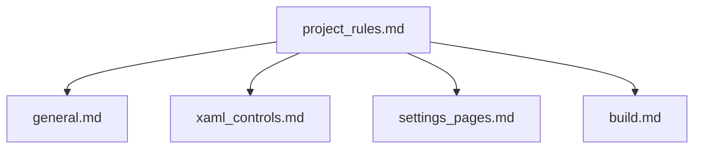

# Contribution Guide and Community

## Introduction
This guide is intended for contributors who wish to participate in the construction of the InkCanvasForClass Community Edition. It covers everything from forking the project, branch strategies, commit and PR processes, to code of conduct, participation specifications, different types of contributions, governance structure and decision-making processes, community resources and support channels, new contributor onboarding, roadmap and future plans, and contributor recognition and celebration mechanisms. The goal is to help you participate in the project efficiently and safely, and jointly build a better teaching writing experience.

## Project Structure
InkCanvasForClass is organized as a multi-project solution. The core project, Plugin SDK, Control Library, and IACore helper tools are located in separate csproj projects and compiled and integrated through a unified solution file. Development specifications and rules are concentrated in the rules directory, covering general development, XAML control usage, settings page development, build processes, etc.

## Core Components
- Code Contribution and Branch Strategy
  - Commits need to be merged into the net6 branch to ensure that the net6 version is always ahead of main.
- Code of Conduct and Participation Specifications
  - Adhere to the Contributor Covenant code of conduct, respect diversity and inclusion, encourage constructive feedback and positive interaction.
- Contribution Types and Recognition
  - Various forms of contribution including code, documentation, design, testing, tutorials, videos, infrastructure, financial support, etc., are recognized and recorded.
- Community Resources and Support
  - Channels such as Discord, QQ, and forums are used for communication and troubleshooting support.
- Governance and Decision Making
  - Maintainers are responsible for coordinating and promoting maintenance, documentation, design, and code contributions.
- Roadmap and Planning
  - The project includes a TODO list and change logs, reflecting phase-oriented goals and functional evolution.

## Architecture Overview
The community contribution workflow revolves around "Fork → Branch → Commit → PR → Review → Merge", combined with the code of conduct and specification files, to ensure contribution quality and community health.

## Detailed Component Analysis

### Code Contribution Flow and Specifications
- Fork and Branch
  - After forking the repository, create your feature or fix branch based on the net6 branch to ensure that subsequent PRs target net6.
- Commit and PR
  - Follow build and code specifications before submitting to ensure local build and tests pass.
  - The PR description should clearly explain the motivation for the change, scope of impact, and verification results.
- Specification Compliance
  - General development specifications, XAML control usage specifications, settings page development specifications, build specifications, and other documents provide specific constraints and best practices.

### Code of Conduct and Participation Specifications
- Core Commitments and Standards
  - Promote an open, welcoming, diverse, inclusive, and healthy community atmosphere; prohibit harassment, discrimination, and offensive speech.
- Enforcement and Scope
  - Community leaders are responsible for clarifying and enforcing standards, applicable in community spaces and official representative scenarios.
- Reporting and Handling
  - Inappropriate behavior can be reported through specified channels, and the community will handle it timely, fairly, and protect the reporter's privacy.
- Impact Levels and Consequences
  - Ranging from correction to warning, temporary ban, up to permanent ban, determined by the impact and severity of the violation.

### Community Resources and Support Channels
- Discussion and Exchange
  - Discord servers, QQ groups, and forum sections are used for daily discussions, help requests, and experience sharing.
- Use and Disclaimer
  - Please understand the open source license and disclaimer before using and distributing; Beta versions are used at your own risk.
- FAQ and Common Problems
  - Includes guidance and troubleshooting steps for common issues like icon display, PPT playback, startup failures, etc.

### Different Types of Contribution Methods
- Code Contribution
  - Follow general and XAML control specifications, focusing on naming, internationalization, and settings page development flows.
- Document Improvement
  - Keep consistent with i18n resources, avoid hard-coded text; improve README, FAQ, and rule documents.
- Translation Work
  - Uniformly manage multi-language text via i18n resource keys to ensure consistency and maintainability.
- Testing Feedback
  - Pay attention to settings items and interaction details, and provide compatibility feedback across systems and devices.
- Other Contributions
  - Infrastructure, tutorials, videos, design, ideas, and planning are all recognized and recorded.

### Governance Structure and Decision-making Process
- Maintainer Responsibilities
  - Responsible for coordinating and promoting maintenance, documentation, design, and code contributions to ensure project quality and direction.
- Decision-making Process
  - Decisions are formed through community discussion and maintainer evaluation; major changes follow open and transparent principles.
- Release and Planning
  - The project includes a TODO list and change logs, reflecting phase-oriented goals and functional evolution.

### Community Celebration and Contributor Recognition
- Contributor List
  - Display various contributions through the All Contributors list to create an atmosphere of recognition and incentive.
- Achievements and Milestones
  - The project homepage displays statistics like stars, forks, and licenses to reflect community activity.

### New Contributor Onboarding Guide
- Development Environment Setup
  - Use VS or .NET CLI, ensure .NET Runtime 6+ is installed; devcontainer configuration can be used to restore dependencies in one click.
- First PR
  - Start with simple issues or document improvements, follow spec files and the submission workflow, and patiently wait for review and feedback.
- Mentorship System
  - Seek guidance and answers from experienced maintainers or contributors through community channels.

### Project Roadmap and Future Plans
- Prepare for version 2.0 development
- CI integrated plugins
- Change logs and TODO list
  - Understand recent priorities and future directions through change logs and the TODO list.

## Dependency Analysis
- Dependencies between rule files
  - project_rules.md acts as an index, guiding to general, xaml_controls, settings_pages, build, and other specific specifications.
- Impact of specs on development
  - General specs constrain naming and internationalization; XAML control specs constrain UI component usage; settings page specs constrain configuration items and interaction; build specs constrain the compilation flow.

## Performance Considerations
- Build Stability
  - Strictly follow the build process, clean bin/obj, and terminate related processes to reduce compilation cache interference.
- Interaction Performance
  - Pay attention to performance hot spots such as ink fading, smoothing algorithms, and multi-touch to avoid introducing stutter and latency.
- Resources and Internationalization
  - Use i18n resources to avoid hard-coded text, reducing maintenance costs and potential errors.

## Troubleshooting Guide
- Common Problem Location
  - Icons display as squares: Install the Segoe MDL2 font.
  - PPT playback crash: Activate Microsoft Office.
  - Unable to switch to PPT mode: Check protected mode, COM components, and permission consistency.
  - Startup failure: Confirm .NET Runtime 6+ and Microsoft Office are installed.
- Feedback and Support
  - Ask questions in forum sections in compliance with management rules, or seek help through community channels.

## Conclusion
By following this guide, you can participate in the building of the InkCanvasForClass Community Edition efficiently and compliantly. Please always build on respect and inclusion, strictly follow the spec files, actively contribute various resources, and jointly promote the project toward a more stable, easier-to-use, and teaching-valuable direction.

## Appendix
- Contribution Checklist and Recognition
  - The contributor list and contribution types can be viewed in the README and All Contributors configuration.
- Rule Index
  - project_rules.md provides quick navigation to each specification file.

Chapter Source
