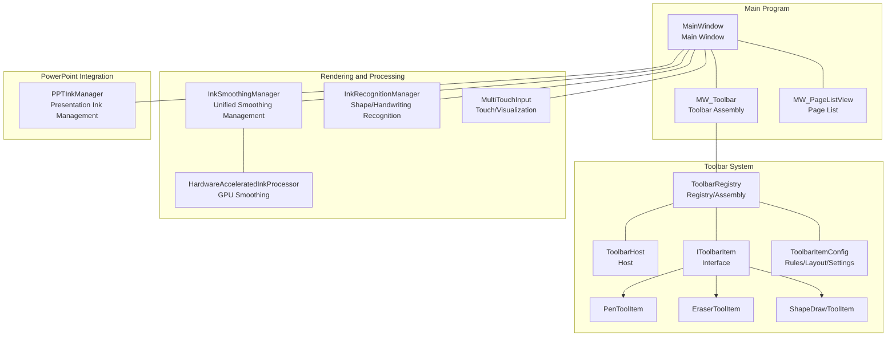
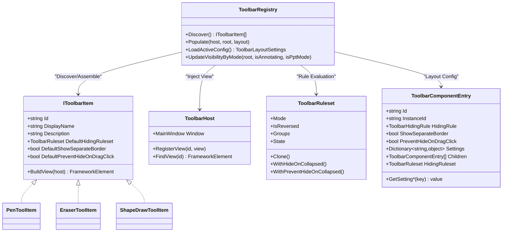
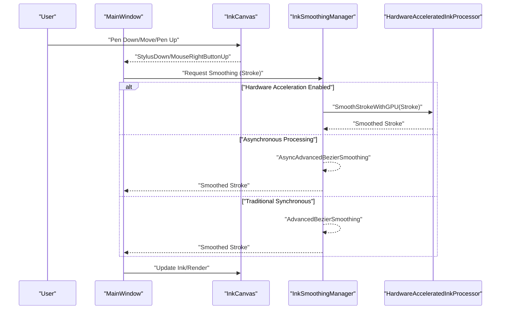
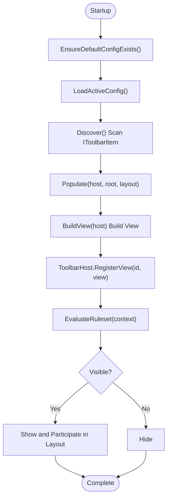
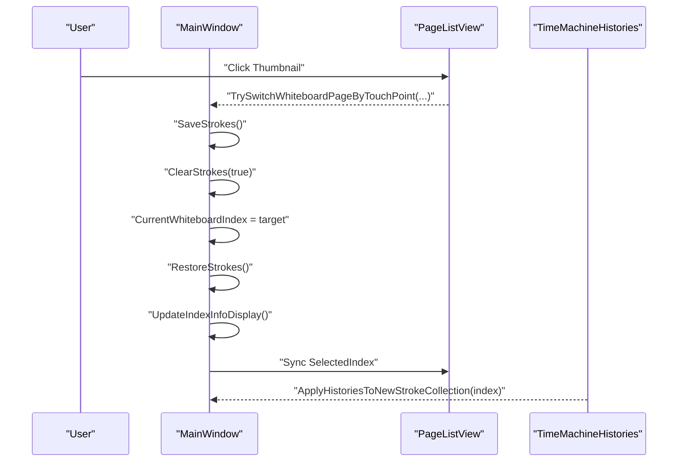
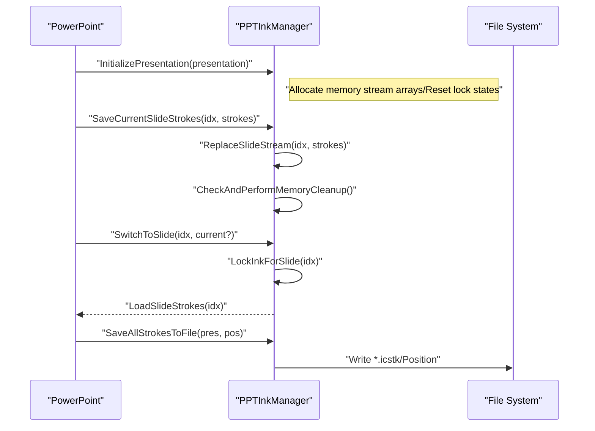
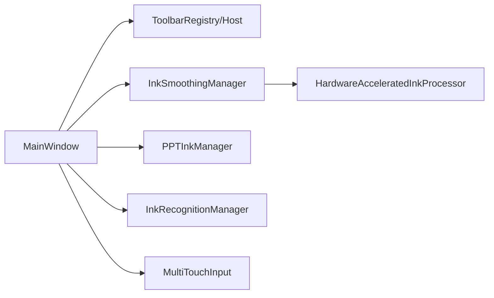

# Core Functional Modules

## Introduction
This document focuses on the core functional modules of InkCanvasForClass, revolving around the following topics: working principles of the whiteboard writing system, ink rendering technology, and real-time interaction mechanisms; architectural design of the toolbar system (configurable items, drag-and-drop sorting, custom extensions); page management (multiple pages, switching, properties); color and brush management (color picker, brush presets, custom brushes); PowerPoint integration (presentation mode, slide navigation synchronization, ink transmission); gesture recognition, shape drawing, and erasing functions. The document provides flowcharts, sequence diagrams, and class diagrams to help with understanding, as well as usage examples, key configuration points, and performance optimization suggestions.

## Project Structure
- The main window and core logic are concentrated in MainWindow and its partial files (such as MW_Toolbar, MW_PageListView, etc.).
- The toolbar system is located in Controls/Toolbar, using a registry + configuration file + runtime assembly approach.
- Ink processing and rendering involve modules under Helpers such as smoothing, recognition, and multi-touch.
- PowerPoint integration manages memory and persistence of ink per slide via PPTInkManager.

## Core Components
- Toolbar System: Discovers IToolbarItem implementations via ToolbarRegistry, assembles them into ToolbarHost based on configuration files, and supports rule-driven visibility control and extensible custom items.
- Page Management: Maintains multiple Canvas pages, provides thumbnail lists, touch/mouse switching, and saving/restoring of ink.
- Ink Smoothing and Rendering: InkSmoothingManager uniformly dispatches asynchronous, hardware-accelerated, and traditional smoothing paths; HardwareAcceleratedInkProcessor uses the GPU for Bezier curve smoothing; MultiTouchInput provides touch visualization.
- PowerPoint Integration: PPTInkManager manages per-page ink memory, auto-save/load, switching protection, and memory cleanup.
- Shape Recognition and Handwriting Recognition: InkRecognitionManager abstracts WinRT/IACore recognition paths, supporting shape recognition and handwriting beautification.

## Architecture Overview
The toolbar system uses a three-tier architecture: "Discovery - Assembly - Rule Evaluation":
- Discovery Layer: Scans assemblies and instantiates IToolbarItem implementations.
- Assembly Layer: Builds items into views according to configuration files (JSON) and injects them into ToolbarHost.
- Rule Layer: Dynamically determines visibility based on context (annotation mode, PPT mode, user collapsed state).

## Detailed Component Analysis

### Whiteboard Writing System and Ink Rendering
- Input Events and Ink Collection: MainWindow registers events like StylusDown/MouseRightButtonUp, combined with InkCanvas's EditingMode to control writing/erasing/selection.
- Smoothing and Rendering: InkSmoothingManager chooses asynchronous, hardware-accelerated, or traditional paths based on configurations; HardwareAcceleratedInkProcessor uses RenderTargetBitmap + PathGeometry for GPU-accelerated smoothing; MultiTouchInput provides StrokeVisual and VisualCanvas, drawing lines based on pressure.
- Performance Monitoring: InkSmoothingManager has a built-in performance monitor to record processing time and provide statistics.

### Toolbar System: Configurable, Extensible, and Sortable
- Discovery and Assembly: ToolbarRegistry.Discover scans IToolbarItem implementations, and Populate builds views according to layout configurations and injects them into ToolbarHost.
- Rules and Visibility: ToolbarRuleset/Group/Rule support And/Or/Inverse combinations, dynamically hiding/showing based on context (annotation/PPT/collapsed).
- Custom Extensions: The IToolbarItem interface defines BuildView(host); built-in items like Pen/Erase/ShapeDraw are easily implemented via ToolbarImageButtonItemBase.
- Configuration File: Supports default.json and multiple layout JSON files, including component settings (width, height, alignment, margins, opacity, styles, etc.).

### Page Management: Multiple Pages, Switching, and Properties
- Page Container: MainWindow maintains the whiteboardPages list, one Canvas per page; ShowPage switches the current Canvas.
- Thumbnail List: RefreshBlackBoardSidePageListView generates thumbnails of historical and current pages; TrySwitchWhiteboardPageByTouchPoint supports touch hit testing and switching.
- Save/Restore: SaveStrokes before switching, and RestoreStrokes after switching, keeping independent ink for each page.

### Color and Brush Management: Picker, Presets, and Customization
- Brush Popup Layer: PenPalette/BoardPenPalette provide pen type, pen tip mode, pressure overlay, laser pen fade-in/fade-out, opacity/width, etc.
- Color Themes: Supports theme switching buttons to quickly switch between default/highlight/laser pen colors.
- Quick Color Palette: QuickColorPaletteControl finds and links the current brush color via ToolbarHost.

### PowerPoint Integration: Presentation Mode, Navigation Sync, and Ink Transmission
- Presentation Initialization: InitializePresentation allocates memory stream arrays, expanding according to the number of slides.
- Save/Load Ink: SaveCurrentSlideStrokes/LoadSlideStrokes/SwitchToSlide; supports forced save and auto-save.
- Switch Protection: LockInkForSlide/CanWriteInk prevents conflicts when turning pages; fast switching protection avoids jitter.
- Memory Management: CheckAndPerformMemoryCleanup/CleanupInactiveSlideStrokes controls memory limits.
- Auto Save: SaveAllStrokesToFile/LoadSavedStrokes supports disk persistence and position recording.

### Gesture Recognition, Shape Drawing, and Erasing
- Gesture Recognition: InkRecognitionManager abstracts WinRT/IACore paths, providing shape recognition and handwriting beautification.
- Shape Drawing: ShapeDrawToolItem forwards click events to MainWindow's shape drawing entry, cooperating with the ShapeDraw popup layer.
- Erasing: EraserToolItem forwards click events to MainWindow's erase entry, supporting full page/by stroke erasing.

## Dependency Analysis
- Component Coupling
  - MainWindow depends on ToolbarHost/Registry for toolbar assembly and visibility control.
  - InkSmoothingManager depends on HardwareAcceleratedInkProcessor or traditional smoothing algorithms.
  - PPTInkManager depends on memory streams and file systems, affected by auto-save configuration.
- Rules and Configuration
  - ToolbarRuleset/ComponentEntry determines visibility and layout of items.
  - InkSmoothingConfig determines smoothing strategies and concurrent task count.
- External Dependencies
  - Windows Ink/WinRT API for shape recognition and handwriting recognition.
  - PowerPoint Interop for presentation control.

## Performance Considerations
- Ink Smoothing
  - Recommended configuration: Enable high quality and concurrent tasks when there are more than four cores and hardware acceleration is supported; degrade to high performance mode on low-performance devices.
  - Asynchronous processing: Avoid blocking the UI thread; timeout protection and cancellation tokens.
- Rendering and Caching
  - Use RenderTargetBitmap + DrawingVisual + BitmapCache to improve GPU rendering efficiency.
  - StrokeVisual is submitted in batches to reduce frequent creation of visual objects.
- Memory Management
  - PPTInkManager sets a 100MB memory limit and regularly cleans up inactive pages.
  - Memory stream arrays expand according to the number of slides to avoid out-of-bounds access.
- Touch and Interaction
  - MultiTouchInput linearly maps pressure, balancing visual consistency.
  - Page switching incorporates fast switching protection to avoid frequent IO.

## Troubleshooting Guide
- Toolbar Not Displayed/Misaligned
  - Check if configuration file exists and is readable; verify ToolbarRegistry.LoadActiveConfig returns a valid layout.
  - Use UpdateVisibilityByMode to check if context (annotation/PPT/collapsed) causes it to hide.
- Smoothing Fails or Stutters
  - Check InkSmoothingConfig settings; verify hardware acceleration availability.
  - View performance statistics and logs to locate time-consuming bottlenecks.
- PowerPoint Ink Lost/Corrupted
  - Verify no cross-page writing occurred during LockInkForSlide/CanWriteInk.
  - Check auto-save path permissions and disk space.
- Touch Drawing Abnormalities
  - Check MultiTouchInput pressure mapping and StrokeVisual submission thresholds.
  - Ensure VisualCanvas cache and rendering options are correct.

## Conclusion
The core functionality of InkCanvasForClass is designed around modularity and configurability: the toolbar system achieves flexible visibility through rules and configurations; page management ensures stable switching under multi-page scenarios; rendering and smoothing combine hardware acceleration with asynchronous processing to boost performance; PowerPoint integration offers reliable ink persistence and switching protection; gesture recognition and shape drawing complete the writing experience. It is recommended to adjust smoothing strategies and concurrent task counts based on device performance during deployment, and to provide complete configuration files and fallback mechanisms for toolbar and page management.

## Appendix
- Usage Examples (Step-by-step)
  - Toolbar Customization: Implement IToolbarItem, providing Id/DisplayName/Description/BuildView; add items to layout via configuration files.
  - Page Switching: Click thumbnails in PageListView, triggering TrySwitchWhiteboardPageByTouchPoint to save, switch, and restore.
  - PowerPoint Ink: After initializing the presentation, call SaveCurrentSlideStrokes page by page; call SaveAllStrokesToFile when the slideshow ends.
  - Smoothing Optimization: Enable hardware acceleration and asynchronous smoothing in settings, or choose recommended configurations based on device performance.
- Configuration Options
  - Toolbar: Component settings (width/height/alignment/margins/opacity/styles), rules (And/Or/Inverse), grouping, and separate borders.
  - Smoothing: Quality levels, interpolation steps, resampling intervals, concurrent tasks, hardware acceleration.
  - PPT: Auto-save switch, save path, max slide count, memory limit.
- Performance Optimization Suggestions
  - Prioritize hardware acceleration and asynchronous processing.
  - Set concurrent task counts reasonably to avoid CPU/GPU overload.
  - Periodically clean up memory cache of inactive pages.
  - Use the batch submission threshold of StrokeVisual to reduce visual object creation.
