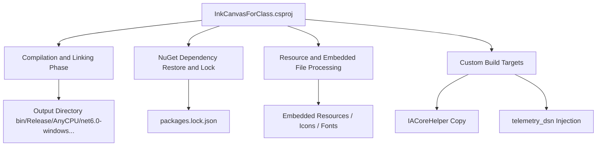
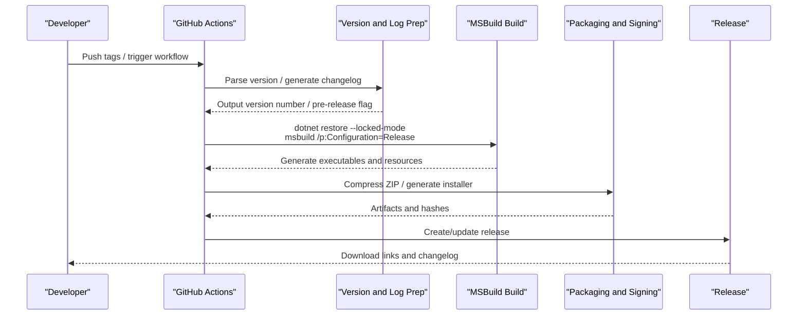
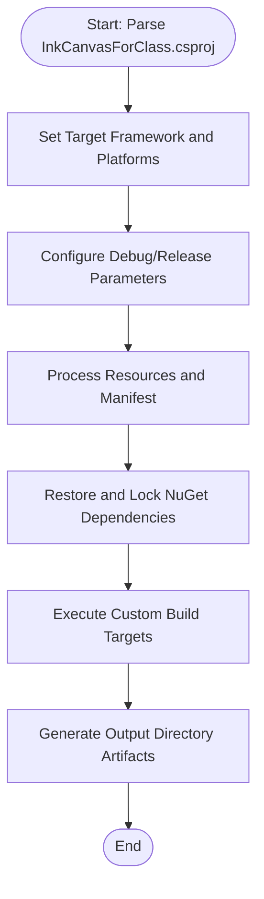
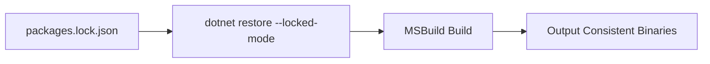
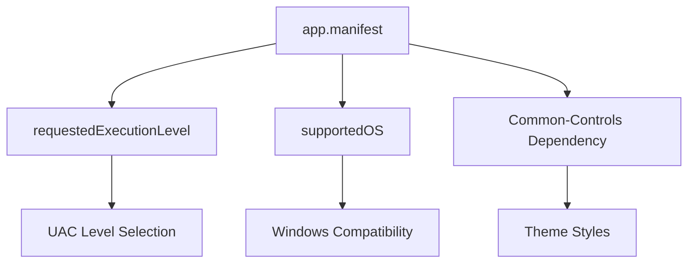
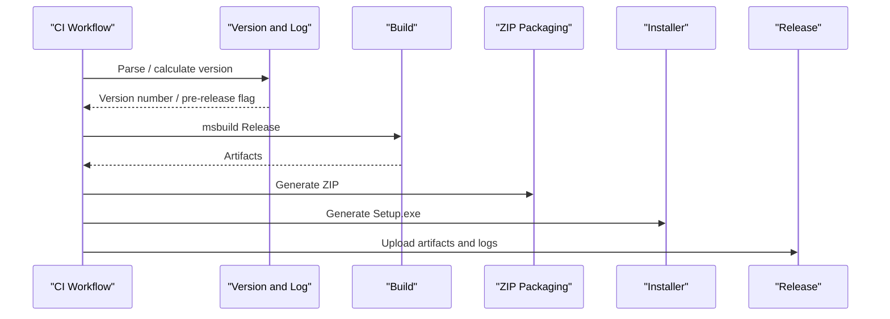
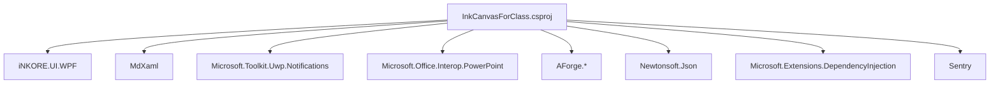

# Build and Release

## Introduction
This document focuses on the build and release processes of InkCanvasForClass, covering the following topics:
- MSBuild Build Configurations: Project file structure, compilation parameters, output directories, and platform targets.
- Dependency Management Strategies: NuGet package management, packages.lock.json locking mechanism, and version pinning.
- Application Manifest app.manifest: UAC permissions, compatibility, and icon resource references.
- Release Process: Version number management, artifact packaging, and release channels.
- CI/CD Workflows: Automated build, test, and release deployment.
- Common Build Issues and Solutions.

## Project Structure
InkCanvasForClass is a WPF desktop application targeting the .NET 6 framework, built via MSBuild. The project file defines multi-platform targets (win-x86/win-x64/win-arm64), debug and release configurations, resource embedding and external dependencies, as well as custom build targets (such as copying IACore auxiliary programs and injecting telemetry DSN).

## Core Components
- Project File (MSBuild): Defines target frameworks, platforms, debug symbols, output types, resources and dependencies, COM references, custom targets, etc.
- Application Manifest (app.manifest): Declares UAC request levels, compatibility OS support, and common control theme dependencies.
- Dependency Pinning (packages.lock.json): Pins NuGet package versions to ensure reproducible builds.
- CI/CD Workflows: PR checks, pre-releases and changelog generation, building and packaging, and publishing.

## Architecture Overview
The diagram below shows the key steps from source code to release artifacts: CI Trigger → Version and Changelog Preparation → MSBuild Build → Artifact Packaging → Release Channels.

## Detailed Component Analysis

### MSBuild Build Configuration
- Target Framework and Platforms
  - Target Framework: net6.0-windows10.0.19041.0
  - Platform Identifiers: win-x86;win-x64;win-arm64
  - Platform Targets: AnyCPU/x86/x64/ARM64 (differences across configuration branches)
- Compilation Parameters and Outputs
  - Output Type: WinExe
  - Debug Symbols: Debug uses embedded; Release uses embedded/pdbonly (depending on platform)
  - Output Directory: bin\$(Configuration)\$(Platform)\, containing TFM subdirectories
  - High DPI: Per Monitor V2
- Resources and Icons
  - Application Icon: Resources\icc.ico
  - Manifest File: app.manifest
  - Embedded Resources: IACore DLLs, sound effects, fonts, icon sets, etc.
- Custom Targets
  - CopyIACoreHelper: Copies the IACoreHelper executable to the output directory after building.
  - GenerateTelemetryDsn/CleanTelemetryDsn: Injects/clears telemetry DSN files based on environment variables.
- Project References and COM References
  - Project References: InkCanvas.PluginSdk, InkCanvas.Controls, InkCanvas.IACoreHelper (not output with this project)
  - COM References: Wsh, stdole (handled differently in different runtime type branches)

### Dependency Management Strategy and Version Pinning
- NuGet Package Management
  - Pins versions via packages.lock.json to ensure consistency across environments.
  - Project file declares direct dependencies (such as Newtonsoft.Json, Microsoft.Extensions.DependencyInjection, AForge.* series, Sentry, etc.).
- Locking Mechanism
  - Uses `dotnet restore --locked-mode` in CI to force the use of lock files.
  - Locked mode is recommended for local development to prevent drift.
- Transitive Dependencies
  - packages.lock.json displays the transitive dependency tree, helpful for auditing and troubleshooting.

### Application Manifest app.manifest
- UAC Permissions
  - Default requested execution level is asInvoker, without elevating privileges; can be adjusted as needed.
  - uiAccess=false, avoiding UIAccess scenarios.
- Compatibility
  - supportedOS nodes are commented out, not explicitly declaring supported Windows versions.
- Common Control Themes
  - Depends on Microsoft.Windows.Common-Controls v6 to ensure theme styles take effect.

### Release Process
- Version Number Management
  - Semantic Versioning (major.minor.patch.build), CI calculates the new version based on tags or interactive inputs.
  - Pre-release: Deemed a pre-release when the build number is non-zero.
- Artifact Packaging
  - ZIP: Contains the complete runtime artifacts.
  - Installer: Generates Setup.exe using Inno Setup scripts.
- Release Channels
  - GitHub Releases: Uploads the ZIP and installer, accompanied by a changelog.
  - Classified Archiving: Release/Beta directories separate stable and pre-release builds.

### CI/CD Workflow Configuration Examples
- PR Check (prcheck.yml)
  - Trigger Condition: PR opened/synchronized, ignoring Markdown changes.
  - Steps: Install MSBuild/dotnet → Restore dependencies (locked mode) → Build Debug → Upload artifact build.
- .NET Build & Package (dotnet-desktop.yml)
  - Trigger Condition: Push to net6 branch or manual trigger.
  - Steps: Install tools → Restore dependencies (locked mode) → Build Debug → Upload artifacts.
- Pre-release and Changelog (prerelease.yml)
  - Trigger Condition: Push tags or manual trigger.
  - Steps: Parse/calculate version → Generate changelog → Build Release → Artifact packaging → Upload artifacts → Create/update release.

## Dependency Analysis
- Direct Dependencies (Selected)
  - UI and Modern Controls: iNKORE.UI.WPF, iNKORE.UI.WPF.Modern
  - Document Rendering: MdXaml
  - Notifications: Microsoft.Toolkit.Uwp.Notifications
  - Office Integration: Microsoft.Office.Interop.PowerPoint, MicrosoftOfficeCore
  - Camera/Video: AForge.Video, AForge.Video.DirectShow, AForge.Imaging, AForge.Math
  - JSON: Newtonsoft.Json
  - Dependency Injection: Microsoft.Extensions.DependencyInjection
  - Error Reporting: Sentry
- Indirect Dependencies
  - Through packages.lock.json, the transitive dependency chain of each package is visible, facilitating auditing and rollbacks.

## Performance Considerations
- Build Concurrency and Caching
  - Use MultiToolTask and MaxCpuCount parameters to increase build parallelism.
  - `dotnet cache` and packages.lock.json mitigate dependency restore times.
- Resources and Footprint
  - Embedding IACore and a large number of icons/fonts increases the file size; we recommend evaluating their necessity before releasing.
- Debug Symbols
  - Release uses embedded or pdbname, reducing symbol file size; Debug uses full/pdbonly to balance debugging needs and size.

## Troubleshooting Guide
- Dependency Restore Failure
  - Verify that `--locked-mode` is used and the network can reach the NuGet source.
  - Check if packages.lock.json is consistent with the project file.
- Platform Target Mismatch
  - Confirm that Platform and RuntimeIdentifiers settings match to avoid runtime missing files.
- Abnormal Behavior due to UAC Elevation
  - If administrator privileges are required, modify requestedExecutionLevel in app.manifest.
- COM Component Conflicts
  - Conflicts between PowerPoint and WPS Office may cause PPT mode to become unavailable; follow the README suggestions to resolve it.
- Telemetry DSN Injection
  - Local builds inject DSN via environment variables; CI injects via secrets.

## Conclusion
Through explicit MSBuild configurations, strict dependency locking, and robust CI/CD workflows, this project achieves reproducible and traceable builds and releases. It is recommended that teams uniformly follow the locked mode and platform target strategies, and double-check manifests and resource consumption before releasing to ensure delivery quality and consistency.

## Appendix

### Common Build Commands and Parameters
- Local Build (Example)
  - `dotnet restore "Ink Canvas.sln" --locked-mode`
  - `msbuild /p:platform="AnyCPU" /p:configuration="Release" "Ink Canvas/InkCanvasForClass.csproj" /m /p:UseMultiToolTask=true /p:EnforceProcessCountAcrossBuilds=true -maxcpucount`
- Usage in CI
  - Invoke the above commands in workflows, combined with secrets and environment variables to complete injection and packaging.
