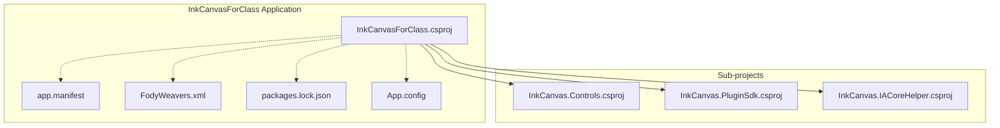
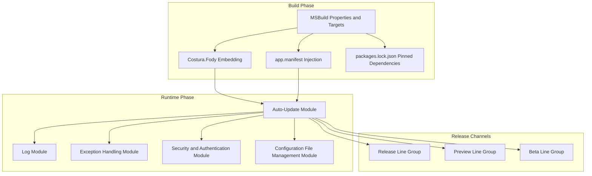
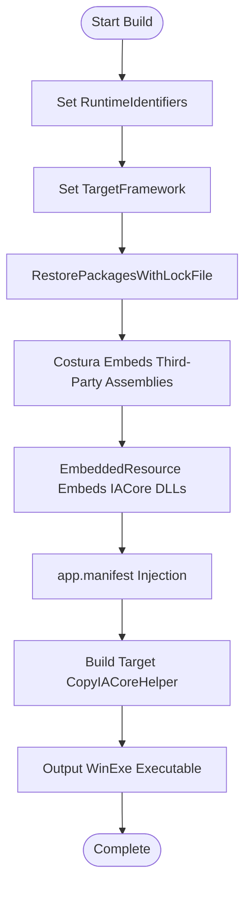
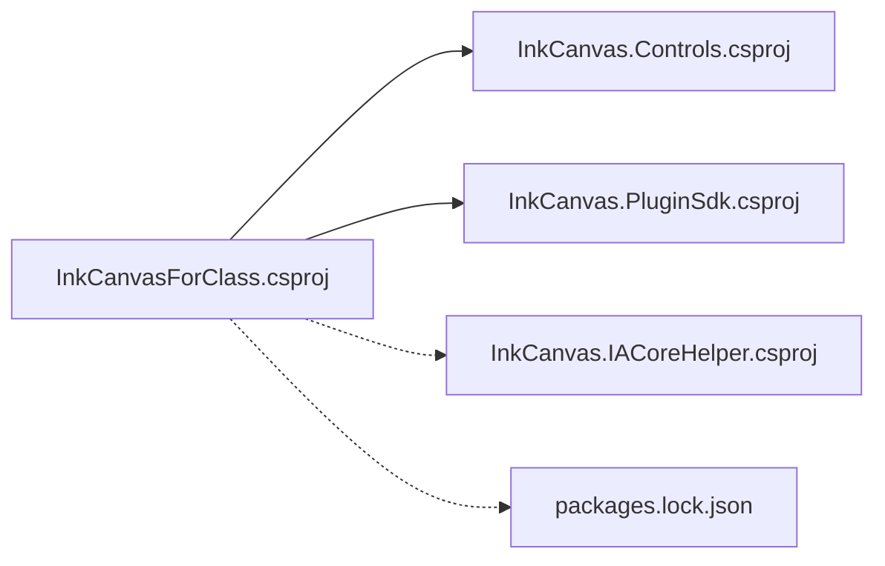

# Deployment and Maintenance

## Introduction
This document is oriented towards the deployment and maintenance teams of InkCanvasForClass. It provides a complete practical guide covering build configurations, release workflows, installer creation, dependency management, version control and release channels, auto-update mechanisms, logging and monitoring, security hardening, troubleshooting, and maintenance tools. The document is strictly based on the actual source code and configuration files in the repository to ensure that it is actionable and reproducible.

## Project Structure
InkCanvasForClass is a WPF application based on .NET 6, utilizing a multi-project combination and packaging strategy. The core project is located at `Ink Canvas/InkCanvasForClass.csproj`, and supporting resources, control libraries, and auxiliary modules are located in sub-projects such as `InkCanvas.Controls`, `InkCanvas.PluginSdk`, and `InkCanvas.IACoreHelper`. The project implements embedded packaging via Costura.Fody to reduce external dependency exposure; controls UAC and compatibility via `app.manifest`; and pins dependency versions via `packages.lock.json` to ensure reproducible builds.

## Core Components
- Build and Packaging
  - Multi-target platforms: win-x86, win-x64, win-arm64
  - Platform identifier and output type: WinExe
  - Dependency pinning: RestorePackagesWithLockFile=true
  - Packaging strategy: Costura.Fody embeds third-party assemblies, IACore series DLLs are embedded via EmbeddedResource
  - Manifest and manifest injection: app.manifest injection, CopyIACoreHelper target copies the IACoreHelper executable during the build phase
- Auto-Update
  - Multi-channel and multi-line groups: Release/Preview/Beta channels, with each channel containing multiple download lines
  - Speed testing and optimization: Concurrent HEAD request speed tests, cached for 15 minutes, prioritizing the inkeys line
  - Download and overwrite: Overwrites according to a file whitelist, supports x64 suffix concatenation
- Logs and Exceptions
  - Logs: Unified writing to Log.txt or archived by launch time, supporting size limit cleanup
  - Exceptions: Centralized processing and graded logging, distinguishing between continuation-allowed and fatal exceptions
- Security and Configuration
  - Password and TOTP: PBKDF2 derivation and constant-time comparison, TOTP 6-digit dynamic verification code
  - Configuration files: Support for multiple configuration files saving, switching, and hot reloading
- Runtime and Compatibility
  - .NET 6 target framework, Windows 10 minimum version constraint
  - UAC policy: asInvoker, disabling virtualization to improve compatibility
  - Legacy runtime compatibility: App.config enables Legacy V2 activation policy

## Architecture Overview
The diagram below shows the deployment and maintenance related architecture of the application: build phase (MSBuild + Costura + manifest injection), runtime phase (auto-update, logging, exceptions, security, and configuration management), and release channels (multi-line groups).

## Detailed Component Analysis

### Build and Release Configurations (MSBuild and Packaging)
- Multi-platform and Target Framework
  - RuntimeIdentifiers specifies win-x86/win-x64/win-arm64
  - TargetFramework is net6.0-windows10.0.19041.0
  - UseWPF/UseWindowsForms enabled
- Packaging and Embedding
  - Costura.Fody embeds third-party assemblies, excluding IACore/IALoader/IAWinFX
  - IACore series DLLs are embedded via EmbeddedResource
  - CopyIACoreHelper target copies the IACoreHelper output to the running directory during build phase
- Dependency Pinning and Versioning
  - RestorePackagesWithLockFile=true
  - packages.lock.json pins dependency versions to prevent drift
- Manifest and UAC
  - app.manifest sets requestedExecutionLevel to asInvoker, disabling virtualization
  - Common-Controls dependency declaration
- Legacy Runtime Compatibility
  - App.config enables Legacy V2 activation policy, compatible with old .NET Framework runtimes

## Dependency Analysis
- Project Dependencies
  - InkCanvasForClass.csproj depends on InkCanvas.Controls and InkCanvas.PluginSdk
  - IACoreHelper acts as an independent project, copied to the running directory after building
- Third-Party Dependencies
  - WPF/WinUI, notifications, PowerPoint interop, JSON, dependency injection, camera and video processing, WebDAV client, Sentry crash reporting, etc.
- Dependency Pinning
  - packages.lock.json pins versions to avoid build drift

## Performance Considerations
- Auto-Update Speed Test Cache: 15-minute TTL, reducing frequent speed test overhead
- Concurrent Speed Tests: Concurrent HEAD requests across multiple line groups, shortening selection time
- Embedded Packaging: Reduces external dependency lookup and loading overhead
- Log Rotation: Cleaned by size to prevent disk bloat from affecting IO
- UAC Policy: asInvoker disables virtualization, reducing privilege switching and compatibility issues

[This section is general guidance, no specific file references needed]

## Troubleshooting Guide
- Launch Failure
  - Check if the .NET 6 runtime is installed
  - If missing, install .NET 6.0 or higher
- PowerPoint Mode Switching Exception
  - Confirm that Office is activated
  - Ensure PowerPoint and the application run at the same privilege level
- Icon Display Issues (below Windows 10)
  - Install Segoe MDL2 font
- Auto-Update Failure
  - Check network connectivity and proxy settings
  - Check the log files to locate specific errors
- Configuration File Corruption
  - Use the multi-configuration feature to restore or delete and recreate the configuration

## Conclusion
The deployment and maintenance of InkCanvasForClass revolve around "reproducible builds, observable, rollback-ready, and auditable": stable packaging via MSBuild and Costura; update reliability via multi-line groups and speed test caching; observability via logging and exception handling; safety via passwords and TOTP; and maintainability via multi-configuration files and hot reloading. Combining the workflows and best practices in this document, the full lifecycle from build to release can be automated and standardized efficiently.

[This section is a summary, no specific file references needed]

## Appendix

### A. Build and Release Process (Step-by-Step)
- Preparation
  - Ensure .NET 6 SDK, MSBuild, and Git toolchains are ready
  - Verify packages.lock.json and Fody/Costura configurations
- Building
  - Restore dependencies: `dotnet restore --locked-mode`
  - Build: `dotnet build -c Release -r win-x64 --self-contained true -p:IncludeNativeLibrariesForSelfExtract=true`
  - Generate installer: Package using tools like Inno Setup or WiX (based on project requirements)
- Release
  - Upload version files and changelogs to the release channels
  - Update version detection files and download URLs
