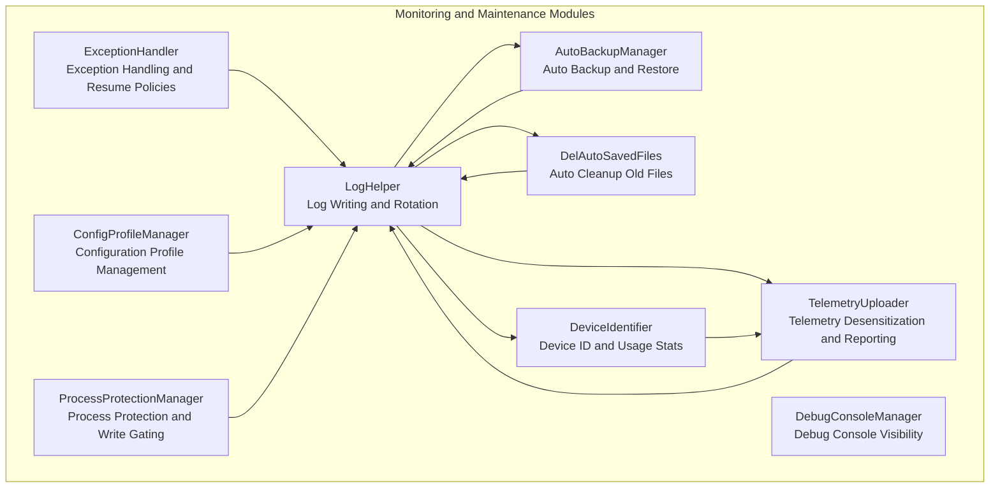
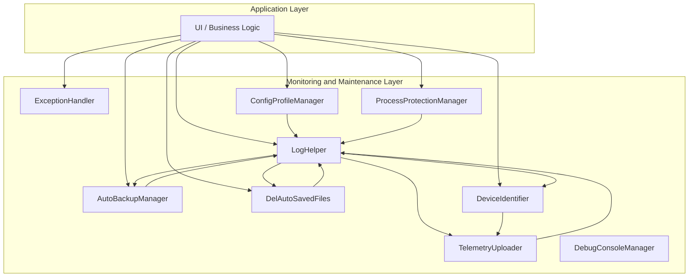
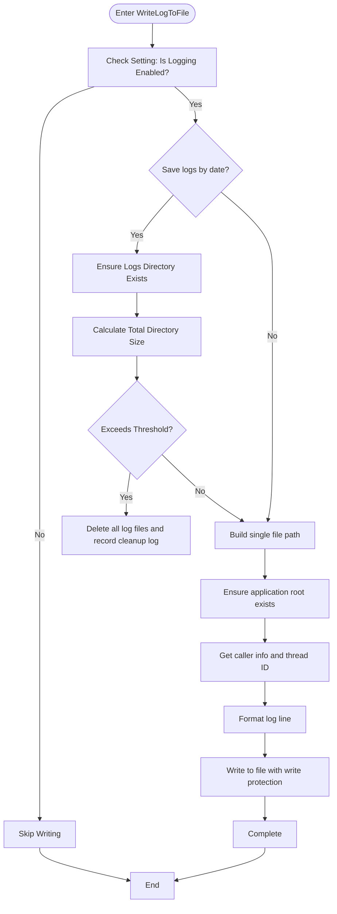
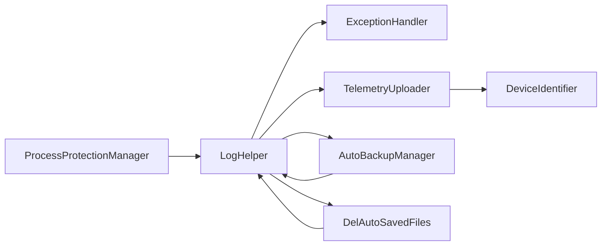

# Monitoring and Maintenance

## Introduction
This document is oriented towards the monitoring and maintenance scenarios of InkCanvasForClass. It provides systematic descriptions and practical recommendations covering logging systems, performance monitoring, telemetry collection, exceptions and alerts, maintenance tools and scripts, monitoring dashboards and key metrics, as well as maintenance plans and execution workflows. The document is strictly based on the existing implementations in the repository to help maintenance personnel quickly locate issues, formulate strategies, and continuously improve system stability and observability.

## Project Structure
The monitoring and maintenance capabilities of InkCanvasForClass are mainly concentrated in the Helpers subdirectory, covering logs, exception handling, telemetry, backups, cleanup, debug consoles, configuration profiles, device and usage statistics, and process protection modules. Together, these modules constitute the observability and maintainability foundation of the application.

## Core Components
- Logs and Rotation: Unified log entry, supporting archiving by launch time, cleanup based on size limits, thread-safe writing, caller information, and timestamp recording.
- Exception Handling: Centralized exception capturing, context recording, and policy judgment for whether to continue execution.
- Telemetry and Desensitization: Sentry-based telemetry event reporting, including device ID, version, channel, and desensitized crash/runtime log attachments.
- Auto Backup and Restore: Automatically backs up configurations periodically, supporting restoration from the latest backup, and cleaning up expired backups.
- Auto Cleanup: Cleans up specific extensions and key files based on day thresholds, recursively deleting empty directories.
- Debug Console: Show/hide controls for the debug console to avoid accidental closure leading to process exit.
- Configuration Profiles: Support for multiple configuration files saving, switching, and hot reloading.
- Device ID and Usage Statistics: Unique device identifier generation and persistence, calculating usage frequency and update priority.
- Process Protection: Locks critical directories and files, temporarily releasing and restoring them during writes, with write gating and degradation policies.

## Architecture Overview
The diagram below shows the interactions and data flows among monitoring and maintenance modules, highlighting logs as the central hub and how modules like telemetry, backup, cleanup, and statistics coordinate around logs and configurations.

## Detailed Component Analysis

### Log Collection and Analysis Mechanism
- Log Levels and Contents
  - Supports Info, Trace, Error, Event, Warning, etc. Log lines contain timestamps, thread IDs, levels, and caller information.
  - Exception logs contain type, message, stack trace, and inner exception information.
- Log File Management
  - Single File Mode: Writes to a fixed file in the application root directory.
  - Archive by Launch Time: When archiving by date is enabled, logs are written to `Logs/Log_{AppStartTime}.txt`, and cleared when the directory size exceeds the threshold.
- Log Rotation Strategy
  - Triggered by checking the total size of the Logs directory (with a fixed threshold), deleting all files and appending cleanup logs.
- Thread Safety and Recursion Protection
  - The writing process uses atomic flags to prevent recursive writes, avoiding infinite loops.
- Debug Output
  - Logs are written simultaneously to the debug console, facilitating development and diagnosis.

## Dependency Analysis
- Module Coupling
  - The log module is the hub, widely depended on by exception, telemetry, backup, cleanup, and statistics modules.
  - Telemetry depends on the device ID module and the log module.
  - Backup and cleanup depend on the log module and the process protection module.
- External Dependencies
  - Telemetry reports via Sentry SDK.
  - Process protection depends on system file handles and shared handles.
- Circular Dependencies
  - No direct circular dependencies found; logs act as a unidirectional dependency hub.

## Performance Considerations
- Log Writing
  - Utilizes thread-safe flags and write protection to avoid blocking the main thread; it is recommended to reduce log granularity in high-frequency paths.
- Telemetry Uploading
  - Executed asynchronously, logging warnings on failure; it is recommended to decrease upload frequency under weak network conditions.
- Backup and Cleanup
  - Large file copies and directory traversals may block; it is recommended to execute these in idle periods or in batches.
- Process Protection
  - Locking many files and directories increases system overhead; it is recommended to enable this only for critical paths.

## Troubleshooting Guide
- Logs Cannot Be Written
  - Check log switches and path permissions, and confirm process protection is not blocking writes.
- Logs Lost or Overwritten
  - Confirm whether archiving by date and the rotation threshold are enabled, and check the Logs directory cleanup records.
- Telemetry Not Reported
  - Check privacy consent, device ID validity, network connectivity, and Sentry configurations.
- Backup Failure
  - Check configuration file existence, backup directory permissions, and last backup time updates.
- Cleanup Did Not Take Effect
  - Check day thresholds and extension matching rules, and verify the recursive empty directory deletion logic.
- Debug Console Invisible
  - Confirm the console is visible and was not closed by accident, re-show it if necessary.
- Process Protection Conflicts
  - Check write-gate timeouts and degraded execution logs, and verify the protected directory scope.

## Conclusion
The monitoring and maintenance system of InkCanvasForClass centers on logs, supplemented by exception handling, telemetry, backups, cleanups, debug consoles, configuration profiles, device and usage statistics, and process protection, forming a relatively complete observability and maintainability loop. It is recommended to further improve performance instrumentation, establish dashboards and alert rules, and formulate standardized maintenance plans and emergency workflows to continuously enhance system stability and maintainability.

## Appendix
- Key Implementation Reference Paths
