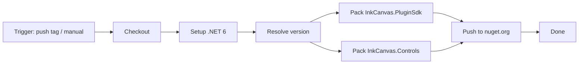

# Publishing SDK Packages to NuGet

ICC-CE publishes two SDK packages to NuGet for third-party plugin and extension projects.

## Published Packages

### InkCanvas.PluginSdk

**Purpose**: Plugin development SDK providing plugin interfaces, host service abstractions, API compatibility declarations, and `.icpx` packaging support.

**Contents**:
- `IPlugin` interface: plugin lifecycle contract (`Initialize`, `Shutdown`, `GetMainView`, `GetSettingsView`)
- `IPluginHost`: host capabilities exposed to plugins (logging, service registration, toolbar item registration, IPC bus)
- `HostApiRequirement`: API compatibility baseline (`CurrentApiVersion` / `MinSupportedHostVersion`)
- MSBuild targets: automatically package the plugin as `.icpx` when `<CreateIcpx>true</CreateIcpx>` is set

**Target framework**: `net6.0-windows10.0.19041.0`

**License**: GPL-3.0-only

### InkCanvas.Controls

**Purpose**: Shared WPF control library so plugin UI stays visually consistent with the host.

**Contents**:
- Toolbar buttons (`BoardToolbarButton`, `ToolbarImageButton`, `ColorPickerButton`, and others)
- Settings components (`LabeledSettingsCard`, `LabeledToggleSwitch`)
- Popup-related controls (`PopupShellContent`, `PopupTabItem`, `PopupTitleBar`, and others)

**Target framework**: `net6.0-windows10.0.19041.0`

**License**: GPL-3.0-only

## Consuming the SDK in a Plugin Project

Reference the SDK via `PackageReference`:

```xml
<Project Sdk="Microsoft.NET.Sdk">
  <PropertyGroup>
    <TargetFramework>net6.0-windows10.0.19041.0</TargetFramework>
    <UseWPF>true</UseWPF>
    <!-- Automatically produce an .icpx package after build -->
    <CreateIcpx>true</CreateIcpx>
  </PropertyGroup>

  <ItemGroup>
    <!-- Replace with the latest version published on nuget.org -->
    <PackageReference Include="InkCanvas.PluginSdk" Version="1.7.19.9-g15845b8064" />
    <!-- Optional: reuse host controls for a consistent look -->
    <PackageReference Include="InkCanvas.Controls" Version="1.7.19.9-g15845b8064" />
  </ItemGroup>
</Project>
```

Or via the CLI:
```bash
dotnet add package InkCanvas.PluginSdk --prerelease
dotnet add package InkCanvas.Controls --prerelease
```

::: warning Only prerelease versions exist today
At the time of writing, both packages are published on nuget.org only as **prerelease** versions carrying a
commit sha suffix (e.g. `1.7.19.9-g15845b8064`); there is no suffix-free stable release yet. Therefore:

- `--prerelease` is required when installing via the CLI, otherwise the package appears to be missing
- `PackageReference` must spell out the full prerelease version; floating ranges such as `1.7.*` do not match prereleases
- Check [InkCanvas.PluginSdk on nuget.org](https://www.nuget.org/packages/InkCanvas.PluginSdk) for the current version
:::

### Automatic `.icpx` Packaging

Referencing `InkCanvas.PluginSdk` imports MSBuild targets shipped inside the package. With `<CreateIcpx>true</CreateIcpx>`, the `CreateIcpxPackage` target runs after `Build`:

| Property | Description | Default |
|----------|-------------|---------|
| `CreateIcpx` | Whether to produce an `.icpx` after build | `false` |
| `IcpxOutputDirectory` | Output directory for the `.icpx` | `$(MSBuildProjectDirectory)\icpx` |
| `IcpxPackageName` | Package file name | `$(MSBuildProjectName).icpx` |

::: warning manifest.json is required
A `manifest.json` must exist in the output directory, otherwise the build fails with error code `ICSDK001`. Add `manifest.json` to your plugin project and set it to copy to the output directory.
:::

### API Compatibility

`HostApiRequirement` declares the compatibility baseline:

| Constant | Meaning |
|----------|---------|
| `CurrentApiVersion` | Current plugin API version (currently `1.0.0`) |
| `MinSupportedHostVersion` | Minimum host version supporting this SDK (currently `1.7.18`) |
| `HostVersion` | Host assembly version injected at compile time (NBGV source-generated) |

Plugins should check the host version on load to avoid calling APIs that do not exist on older hosts.

## Version Numbering

Both packages use **Nerdbank.GitVersioning (NBGV)** to derive versions from `version.json` and Git history, so versions are not maintained by hand.

- Normal build: NBGV appends a commit sha suffix to the `version.json` version, producing a prerelease version
  such as `1.7.19.9-g15845b8064`
- Forced version: pass `-p:NBGV_OverrideVersion=1.7.19.9` to `dotnet pack` to produce a suffix-free stable version

See [Versioning Scheme](./versioning.md) for details.

## Automated Publishing Workflow

The repository provides `.github/workflows/publish-sdk-nuget.yml` with two triggers:

### 1. Push an SDK Tag

**Format**: `sdk-v<version>`, e.g. `sdk-v1.7.19.9`

**Behavior**:
- Checks out the pushed tag
- Extracts the version from the tag name (strips the `sdk-v` prefix)
- Packs with that version forced (equivalent to `-p:NBGV_OverrideVersion=1.7.19.9`)
- Pushes to nuget.org

**Example**:
```bash
git tag sdk-v1.7.19.9
git push origin sdk-v1.7.19.9
```

### 2. Manual Dispatch (workflow_dispatch)

Run the workflow manually from the GitHub Actions page with optional inputs:

| Input | Description | Default |
|-------|-------------|---------|
| `branch` | Source branch to pack from | `net6` |
| `version` | Force a specific version (e.g. `1.7.19.9`); leave empty to use the NBGV-computed version | empty |

**Use cases**:
- Publishing a preview from a non-tag commit
- Debugging the packaging pipeline
- Ad-hoc releases while iterating on SDK interfaces

## Workflow Steps



Core commands:
```powershell
# Pack
dotnet pack InkCanvas.PluginSdk/InkCanvas.PluginSdk.csproj -c Release -o dist -p:NBGV_OverrideVersion=$version

# Push (uses repository secret NUGET_API_KEY)
dotnet nuget push dist/*.nupkg `
  --source https://api.nuget.org/v3/index.json `
  --api-key $env:NUGET_API_KEY `
  --skip-duplicate
```

## Publishing Manually from a Local Machine

Not recommended (CI gives reproducible versions), but if needed:

1. **Check the resolved version**
   ```bash
   dotnet nbgv get-version
   ```

2. **Pack**
   ```powershell
   dotnet pack InkCanvas.PluginSdk/InkCanvas.PluginSdk.csproj -c Release -o ./dist
   dotnet pack InkCanvas.Controls/InkCanvas.Controls.csproj -c Release -o ./dist
   ```

3. **Push**
   ```powershell
   # Obtain an API key from https://www.nuget.org/ first
   dotnet nuget push ./dist/*.nupkg -s https://api.nuget.org/v3/index.json -k YOUR_API_KEY
   ```

## Required Repository Secret

| Secret | Description |
|--------|-------------|
| `NUGET_API_KEY` | NuGet.org API key used to authenticate `dotnet nuget push` |

**Creating the API key**:
1. Sign in to [nuget.org](https://www.nuget.org/)
2. Go to Account Settings → API Keys
3. Create a key with glob pattern `InkCanvas.*` and the **Push** scope
4. Add the generated key to the repository secrets

## Package Metadata

NuGet metadata is preconfigured in both `.csproj` files:

```xml
<PropertyGroup>
  <PackageId>InkCanvas.PluginSdk</PackageId>
  <Authors>InkCanvasForClass</Authors>
  <PackageTags>wpf;ink;whiteboard;plugin;sdk;inkcanvas;ppt</PackageTags>
  <PackageLicenseExpression>GPL-3.0-only</PackageLicenseExpression>
  <RepositoryUrl>https://github.com/InkCanvasForClass/community</RepositoryUrl>
  <PublishRepositoryUrl>true</PublishRepositoryUrl>
</PropertyGroup>
```

- **Version**: generated by NBGV, so no `<Version>` element is needed
- **SourceLink**: `Microsoft.SourceLink.GitHub` is enabled, so packages carry source mappings for debugging

## FAQ

### Does a normal build produce a `.nupkg`?

No. `GeneratePackageOnBuild` is not enabled, so `.nupkg` files are only produced when you explicitly run `dotnet pack` or the CI workflow.

### How do I retract a published package?

NuGet.org does not allow deleting published packages (it would break dependents), but you can **unlist** one:
1. Sign in to nuget.org
2. Open the package management page
3. Select the version and click **Unlist**
4. Unlisted versions disappear from search but remain restorable for existing dependents

### Are SDK and application versions kept in sync?

**No.** They evolve independently:
- **Application version**: driven by `version.json` + Git tags (e.g. `1.7.19.9`)
- **SDK package version**: driven by `sdk-v*` tags or a manually supplied version

In practice, SDK packages are published once interfaces settle, which does not have to coincide with an application release. Publishing the SDK ahead of the application lets plugin authors adapt early.

## Possible Improvements

1. **Symbol packages**: enable `<IncludeSymbols>true</IncludeSymbols>` and `<SymbolPackageFormat>snupkg</SymbolPackageFormat>` for better debugging
2. **Multi-targeting**: consider adding `net8.0-windows` for newer .NET runtimes
3. **Preview feed**: publish alpha/beta builds to a separate feed

## References

- [Create and publish a NuGet package](https://learn.microsoft.com/en-us/nuget/quickstart/create-and-publish-a-package-using-the-dotnet-cli)
- [Nerdbank.GitVersioning CLI](https://github.com/dotnet/Nerdbank.GitVersioning/blob/main/doc/nbgv-cli.md)
- [SourceLink](https://github.com/dotnet/sourcelink)
- [GitHub Actions workflow syntax](https://docs.github.com/en/actions/using-workflows/workflow-syntax-for-github-actions)
