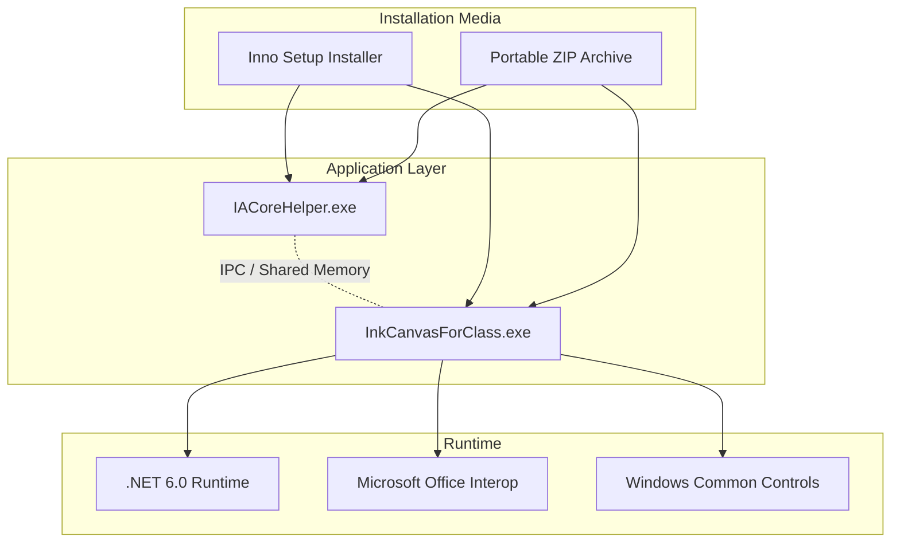
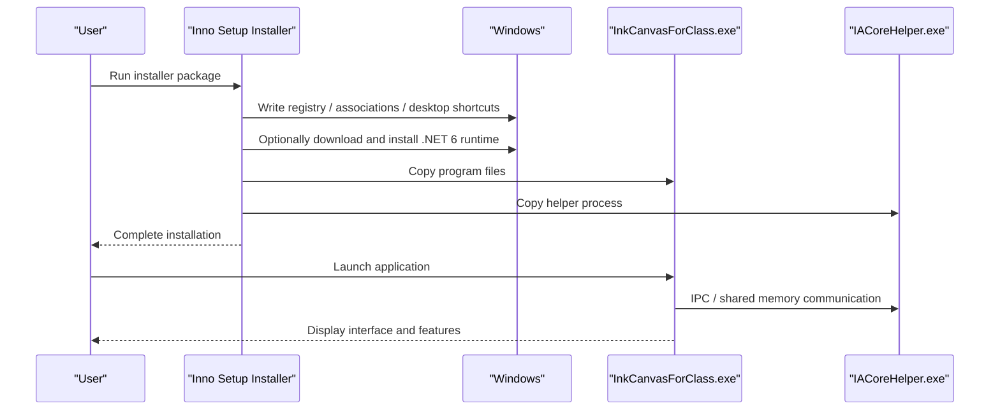
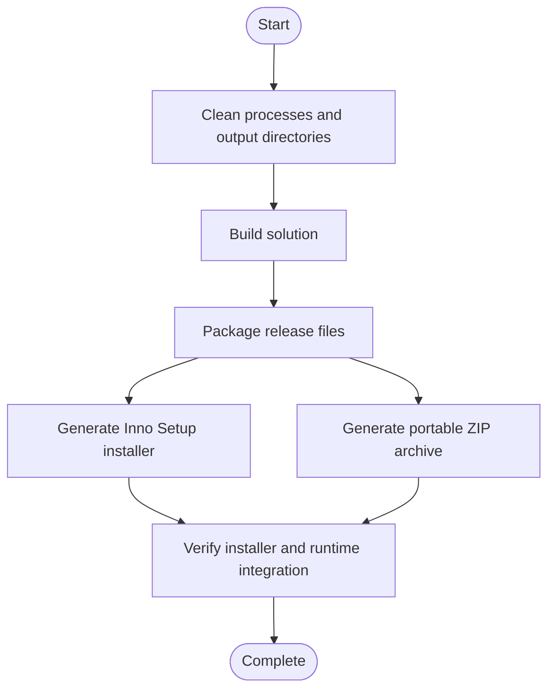
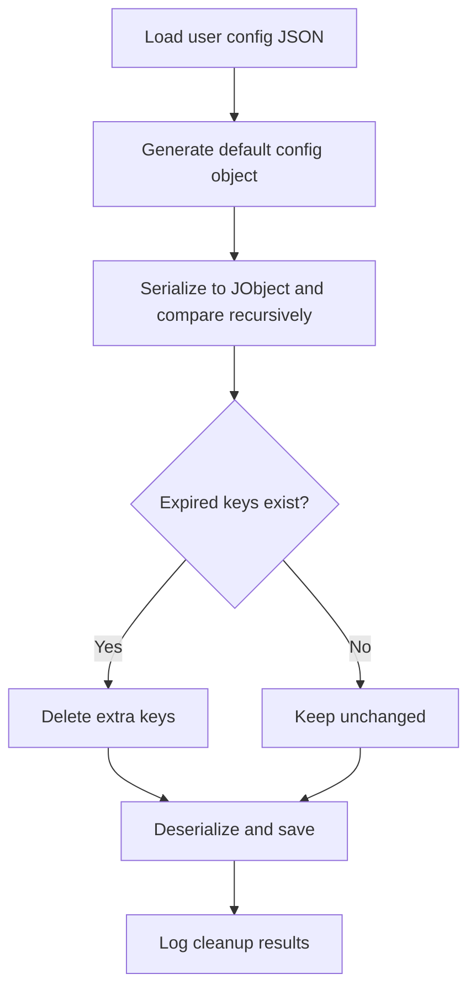
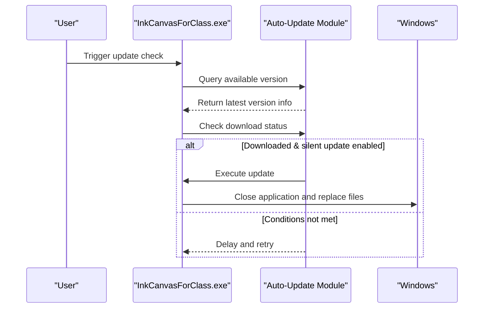
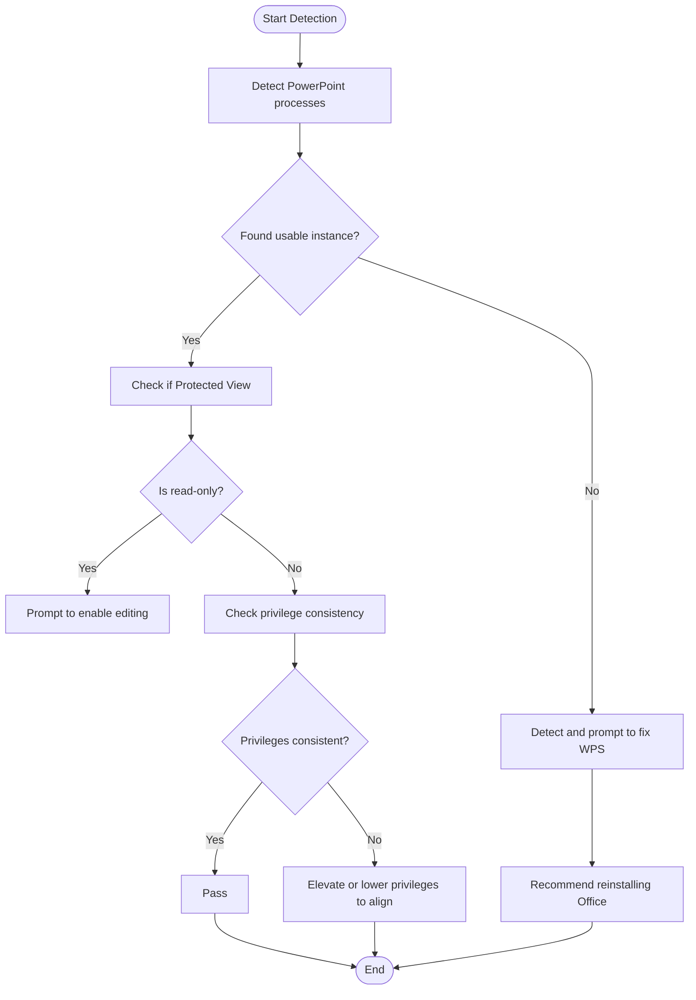
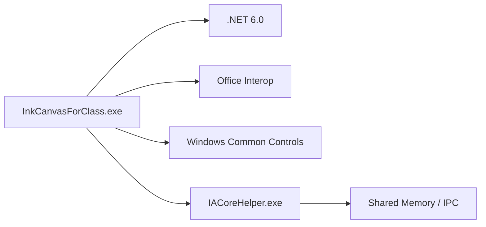

# System Deployment

## Introduction
This document is oriented towards system administrators and deployment engineers, providing a system deployment guide for InkCanvasForClass. The content covers system requirements and prerequisites, installer creation processes, configuration file management, deployment strategies (silent installation, upgrade installation, uninstallation), system compatibility checks (Office Interop component detection, PowerPoint integration verification, privilege checks), deployment script examples and batch deployment plans, as well as common issues and solutions.

## Project Structure
InkCanvasForClass is a WPF application based on .NET 6, utilizing a multi-project combination and packaging strategy:
- Main Application Project: InkCanvasForClass.csproj
- Plugin SDK: InkCanvas.PluginSdk.csproj
- Control Library: InkCanvas.Controls.csproj
- IACore Helper Process: InkCanvas.IACoreHelper.csproj
- Build and Installation: Inno Setup script `InkCanvasForClass CE.iss`
- Runtime Manifest and Configuration: app.manifest, App.config, packages.lock.json, FodyWeavers.xml

## Core Components
- Application Main Body: InkCanvasForClass.exe, responsible for the main interface, toolbar, PowerPoint integration, auto-updates, notifications, etc.
- IACore Helper Process: IACoreHelper.exe, responsible for communicating with IACore (via IPC/shared memory) to support handwriting recognition, etc.
- Office Interop: Integrates with Office via Microsoft.Office.Interop.PowerPoint to implement coordination with PowerPoint slideshow mode.
- Installation and Packaging: Generates installers using Inno Setup scripts, supporting download and silent installation of the .NET 6 runtime; also provides a portable ZIP archive.

## Architecture Overview
The application adopts a dual-process architecture of "Main Process + Helper Process". The main process is responsible for UI and business logic, while the helper process communicates with IACore. The installer automatically detects and installs the .NET 6 runtime via Inno Setup, supporting silent installation and uninstallation.

## Detailed Component Analysis

### System Requirements and Prerequisites
- Runtime Environment
  - .NET 6.0 or higher (the installer can automatically download and silently install it)
  - Windows 10/11 (Target Framework net6.0-windows10.0.19041.0)
- Office Integration
  - Microsoft Office PowerPoint (via Interop components)
  - Microsoft 365 is recommended to reduce activation and protected mode issues
- Hardware Requirements
  - General PC hardware supporting WPF and Windows Common Controls
  - Touch- and stylus-capable devices are recommended for the best experience

### Installer Creation Process
- Artifact Types
  - Installer: Setup.exe generated by Inno Setup, including tasks for automatically downloading and installing the .NET 6 runtime
  - Portable Version: ZIP archive, ready to use after extraction
- Key Steps
  - Clean old processes and output directories (following compilation standards)
  - Build the solution (MSBuild/Dotnet)
  - Package release files (Inno Setup scripts)
  - Generate the installer and portable ZIP archives
- Automation
  - GitHub Actions has been configured with a build matrix (AnyCPU/x86) to generate installers and archives for different architectures, calculate file sizes, and upload artifacts

### Configuration File Management
- Config File Locations and Naming
  - Default Config File: Located in the user's AppData directory (automatically generated upon application startup)
  - Profile Switching and Hot Reloading: Supports selecting config profiles and hot reloading on the settings page
- Config Field Details
  - Configuration files contain multiple Profiles, which can be switched or saved as new configuration files on the settings page
  - Expired Config Cleanup: Keys that exist in the user's configuration but not in the default configuration are cleaned upon startup, preventing compatibility issues after version upgrades
- Runtime Parameters and Environment Variables
  - Injected via project properties and build scripts (e.g., telemetry DSN); build behaviors can be controlled through environment variables
- Setting Definitions
  - Settings.settings defines the default Profile and empty settings collection, with actual configuration generated at runtime

### Deployment Strategies
- Silent Installation
  - The installer supports silent installation of the .NET 6 runtime (`/install /quiet /norestart`)
  - "Download and install .NET Runtime 6" can be selected via tasks
- Upgrade Installation
  - The application has an built-in auto-update mechanism that supports silent updates (when download completes and silent updates are enabled)
  - Update Flow: Detect available version → Check download status → Execute update and exit application
- Uninstallation
  - Uninstallation cleans registry associations, desktop shortcuts, and start menu items
  - User configuration files are retained after uninstallation (unless actively deleted by the user)

### System Compatibility Checks
- Office Interop Component Detection
  - Detects PowerPoint and WPS PowerPoint processes via COM ProgID to determine availability
  - If WPS is detected causing COM component corruption, it is recommended to uninstall WPS and install Microsoft Office Mondo 2016
- PowerPoint Integration Verification
  - Checks if PowerPoint is in Protected View (read-only); users must enable editing manually
  - Ensures PowerPoint and the application run at the same privilege level (both as Administrator or both as standard user)
- Privilege Checks
  - The installer installs for the current user by default (optional privilege elevation)
  - The application manifest defaults to requested asInvoker, avoiding virtualization impacts

### Deployment Script Examples and Batch Deployment
- PowerShell Build Script (Example)
  - Kills all inkcanvas processes
  - Deletes all bin/obj directories
  - Builds the solution using dotnet build
- Inno Setup Installation Script
  - Automatically downloads and silently installs the .NET 6 runtime
  - Supports desktop shortcut creation and uninstallation cleanup
- Batch Deployment Suggestions
  - Push the installer using enterprise software distribution platforms (such as SCCM/Intune)
  - Pre-install the .NET 6 runtime in domain group policies to reduce installation time
  - Configure necessary Office permissions and activation states via group policy or logon scripts

### Common Issues and Solutions
- Program Cannot Start
  - Check if .NET 6.0 or higher is installed
  - If still unable to run, install Microsoft Office
- Board Program Does Not Switch to PPT Mode after Presentation
  - PowerPoint is in Protected View (read-only) → Enable editing
  - Previous WPS installation destroyed COM components → Uninstall WPS and reinstall Microsoft Office Mondo 2016
  - PowerPoint and application privileges are inconsistent → Elevate or lower privileges to align
- Icons Displayed as Boxes
  - Download and install the Segoe MDL2 font

## Dependency Analysis
- Runtime Dependencies
  - .NET 6.0 (Target Framework net6.0-windows10.0.19041.0)
  - Windows Common Controls (Common-Controls 6.0)
  - Office Interop (PowerPoint, Office Core)
- Packaging and Embedding
  - Costura.Fody embeds or excludes IACore-related DLLs to reduce external dependencies
  - IACoreHelper is distributed with the installer as an independent executable

## Performance Considerations
- Startup Performance
  - Uses Per Monitor V2 DPI mode to reduce redraw overhead caused by scaling
  - Reduces dynamic DLL loading latency via Costura.Fody
- Runtime Performance
  - IACoreHelper communicates with the main process via shared memory, lowering cross-process call costs
  - Auto-updates use timer polling to avoid blocking the main thread

## Troubleshooting Guide
- Office-related Issues
  - Detect PowerPoint instances and privilege consistency using PPTManager and ROTPPTManager
  - If WPS is detected, prompt to uninstall it and reinstall Office
- Privileges and Virtualization
  - The installer defaults to asInvoker, avoiding file/registry virtualization
  - If system-level access is required, privilege elevation can be selected during installation
- Hardware Fingerprints and Diagnostics
  - DeviceIdentifier is used to generate hardware fingerprints, facilitating device-related diagnostics

## Conclusion
The deployment of InkCanvasForClass is centered around the Inno Setup installer, combined with automated .NET 6 runtime installation and Office Interop integration, offering comprehensive silent installation, upgrade, and uninstallation capabilities. Through strict configuration file management and compatibility checks, deployment and maintenance complexity can be effectively reduced. We recommend coordinating with software distribution platforms and group policies in enterprise environments to achieve standardized, auditable batch deployments.

## Appendix
- Installer and Portable Archive Naming Conventions
  - Installer: InkCanvasForClass.CE.{version}{architecture_suffix}.Setup.exe
  - Portable: InkCanvasForClass.CE.{version}{architecture_suffix}.zip
- Uninstallation Registry Cleanup
  - Cleans file associations, desktop shortcuts, and start menu items
- Third-party Tool Support
  - Starts third-party camera software (such as EasiCamera) via SoftwareLauncher, locating the installation path in the registry
