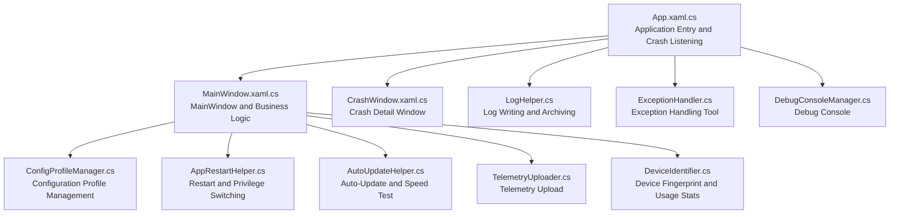
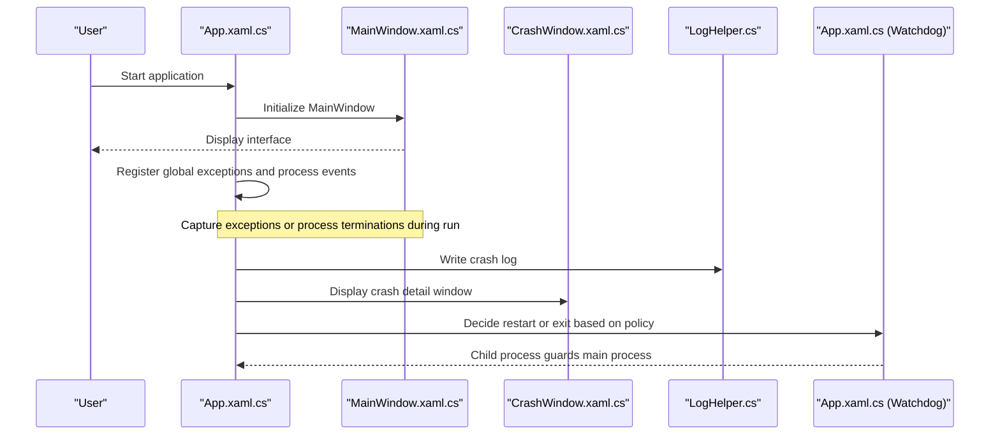
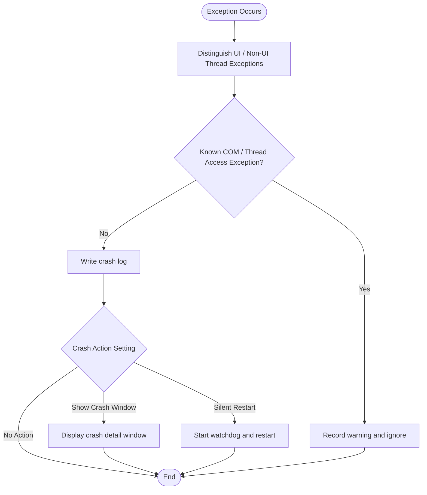
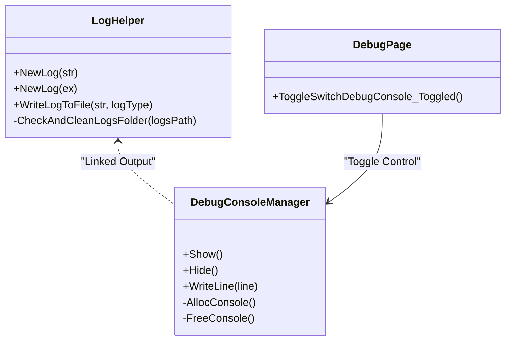
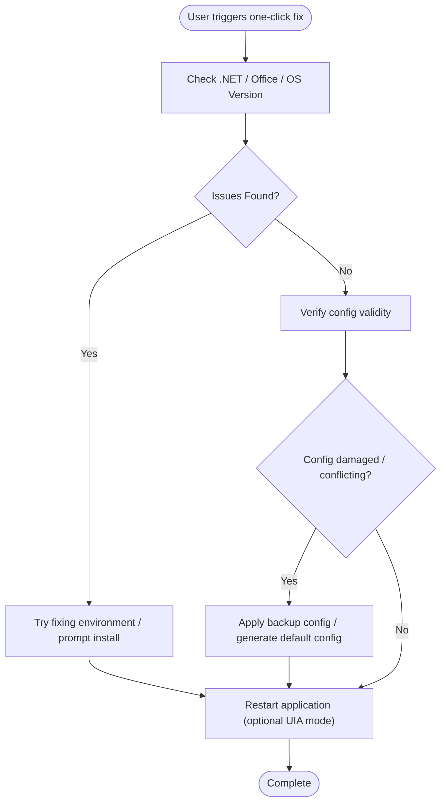
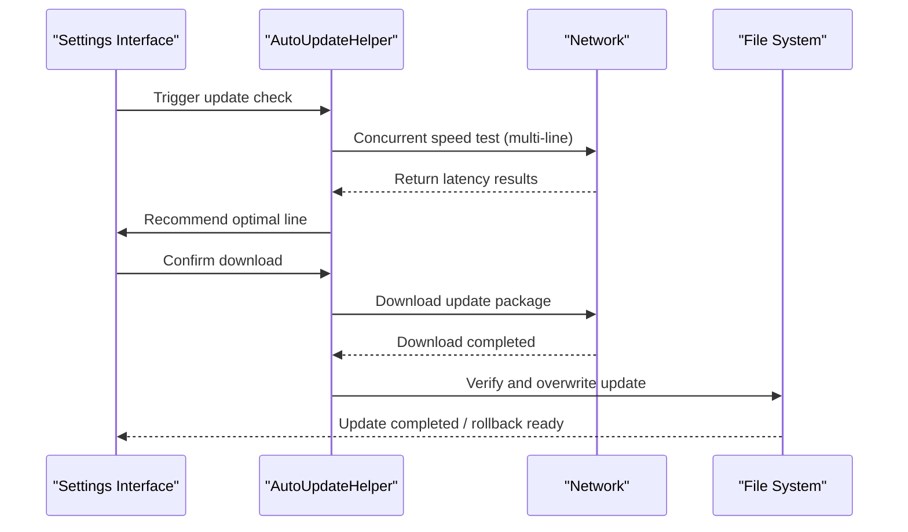
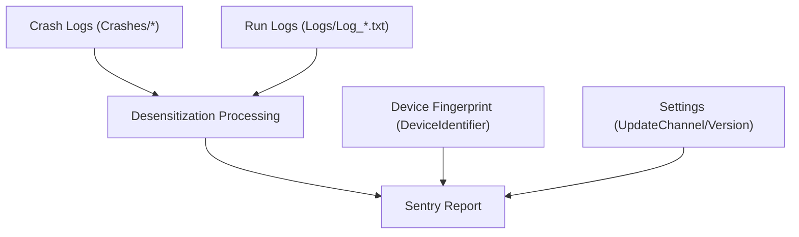
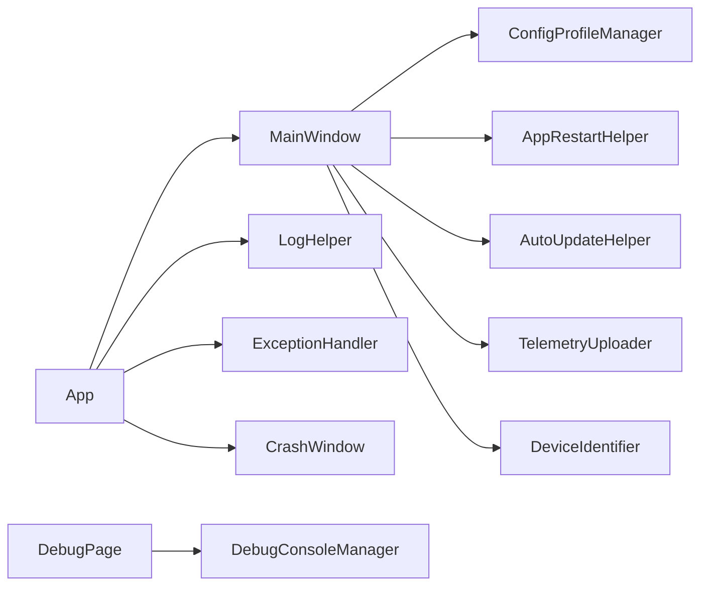

# Troubleshooting and Support

## Introduction
This document is oriented towards InkCanvasForClass users and technical support personnel, providing systematic troubleshooting and support documentation. The content covers diagnostic and repair workflows for startup failures, functional abnormalities, and performance issues; crash analysis methods (crash log interpretation, stack trace analysis, and root cause positioning); usage of debugging tools (built-in debug console, log viewer, and performance analysis approaches); user feedback collection mechanisms (issue report templates, log collection flows, and support channels); self-diagnosis and one-click fix (system environment checks, configuration verification, and auto-repair recommendations); as well as emergency response procedures (quick fix solutions, rollback strategies, and user communication guidance).

## Project Structure
InkCanvasForClass adopts a WPF application architecture. The core entry is the App class, the MainWindow is responsible for UI and business logic, and helper modules are distributed across Helpers, Windows, Controls, Properties, and other directories. Key support capabilities include:
- Exception and Crash Handling: Global unhandled exception capture, crash logging, and watchdog restart mechanisms.
- Logging System: Unified log writing, archiving by launch time, and log folder size limits and cleanup.
- Debugging Tools: Built-in debug console toggle and log output linkage.
- Configuration and Repair: Multi-profile configuration management, one-click restart and privilege toggles, and auto-updates with line speed testing.
- Telemetry and Feedback: Desensitized crash log uploads, device fingerprints, and usage statistics.

## Core Components
- Application Entry and Crash Listening: Responsible for TLS initialization, registering global exceptions and process exit events, crash log writing, and watchdog startup and restart policies.
- MainWindow: Hosts UI, event bindings, input handling, page management, OOBE flows, timers, and undo/redo states.
- Crash Detail Window: Displays crash information, copies logs, and shows on top.
- Logging System: Unified writing, thread safety, archiving by launch time, and log folder size limits and cleanup.
- Exception Handling Tool: Encapsulates exception logging and continuation-allowed policies.
- Debug Console: Optional console window used for real-time log output.
- Configuration Profile Management: Multi-profile configuration saving, switching, and hot reloading.
- Restart and Privilege Toggles: Supports restarting as Administrator or standard user, and toggling UIA top-most mode.
- Auto-Update: Multi-line speed testing, download and overwrite, download cancellation, and version selection.
- Telemetry Upload: Uploads desensitized crash logs to Sentry, carrying device fingerprints and usage statistics.
- Device Fingerprint and Usage Statistics: Unique device identifier, usage frequency, and update priority evaluation.

## Architecture Overview
The troubleshooting system of InkCanvasForClass revolves around a closed loop of "crash monitoring - logging - user feedback - auto-repair - emergency rollback". The App layer is responsible for crash listening and watchdogs; MainWindow handles business states and UI; Helpers provides logs, exceptions, configurations, updates, and telemetry; Windows provides settings and crash detail interfaces.

## Detailed Component Analysis

### Crash and Exception Handling
- Global Exception Capturing: Unhandled exceptions on both UI and non-UI threads are captured, logged to crash files, and display the crash window based on settings.
- Crash Logs: Named by launch time, containing system state information such as memory, CPU time, and runtime duration.
- Watchdog: Launches a child process to guard the main process during specific crash events, restarting or prompting based on policies when exiting abnormally.
- COM Object and Thread Access Exceptions: Safely handles known issues to avoid false alarms.

### Logging System and Debug Console
- Log Writing: Unified entry, supporting archiving by launch time, preventing over-sized log folders, and automatically cleaning files exceeding limits.
- Debug Console: Optionally displayed, fixed title, with the close menu disabled to prevent accidental process termination.
- Log Viewer: Displays the debug console via settings page switches, facilitating real-time monitoring.

### Configuration File Management and One-Click Fix
- Multi-Profile: Supports saving, listing, applying, and deleting configuration files, facilitating quick switching and hot reloading.
- One-Click Restart: Supports restarting as Administrator or standard user, toggling UIA top-most mode when necessary.
- System Environment Checks: .NET Runtime 6+, Office activation status, and Windows 7 TLS configurations.

### Auto-Update and Emergency Rollback
- Multi-line Speed Testing: Concurrently detects latencies of each download line, sorting them by latency, and prioritizing the optimal line.
- Download and Overwrite: Restricts the set of overwritable files and supports canceling downloads.
- Rollback Strategy: Preserves historical versions, falling back to the previous stable version when necessary.

### Telemetry and User Feedback
- Desensitized Crash Log Uploads: Reported via Sentry, carrying device fingerprints, update channels, application versions, OS versions, and optional crash/runtime log attachments.
- Device Fingerprint and Usage Statistics: Evaluates update priority and frequency, aiding problem isolation.

## Dependency Analysis
- App depends on MainWindow, LogHelper, ExceptionHandler, CrashWindow, and watchdog mechanisms.
- MainWindow depends on config management, restart helper, auto-update, telemetry, and device fingerprints.
- DebugConsole and DebugPage interact via SettingsManager.
- AutoUpdate depends on networks and file systems, influenced by settings.

## Performance Considerations
- Log writing uses mutual exclusion and append modes to avoid concurrency conflicts.
- Log folder size limits and automatic cleanups prevent excessive disk consumption.
- Watchdogs and auto-updates use asynchronous processing and timeout controls to minimize blocking risks.
- Windows 7 TLS configuration adaptability ensures stable network communications.

## Troubleshooting Guide

### Startup Failures
- Check if .NET Runtime meets requirements.
- Verify if Office is activated.
- Check log files and crash logs to isolate specific exceptions.
- Try restarting as Administrator or standard user.
- If UIA top-most is involved, switch to standard top-most mode and restart.

### Functional Abnormalities
- Identify if the issue is a known COM object or thread access exception, which are handled safely.
- View crash logs and run logs, matching stack traces to locate root causes.
- Inspect real-time logs using the debug console.
- Apply configuration profile backups or generate default configurations.

### Performance Issues
- Check the log folder size, cleaning up old logs if necessary.
- Disable unnecessary log levels or archiving features.
- Select better download lines using the auto-update speed testing feature.
- Monitor watchdog and restart behaviors, preventing performance jitter from frequent restarts.

### Crash Analysis
- Crash Log Interpretation: Inspect crash times, process PIDs, memory/CPU/runtime durations, and exception messages.
- Stack Trace Analysis: Combine UI and non-UI thread exceptions to isolate invocation chains.
- Root Cause Positioning: Prioritize handling known COM/thread access exceptions; check privilege consistency of third-party components (such as PowerPoint).

### Debugging Tool Usage
- Built-in Debug Console: Enabled/disabled in settings pages to output logs in real-time.
- Log Viewer: Toggle the debug console via settings.
- Crash Detail Window: Copy crash information, facilitating feedback.

### User Feedback Collection Mechanism
- Issue Report Template: Includes version number, system version, reproduction steps, log files (crash/run), and screenshots.
- Log Collection Flow: Package Crashes and Logs directories, uploading them after desensitization.
- Support Channels: Community forums, QQ groups, and Discord.

### Self-Diagnosis and One-Click Fix
- System Environment Checks: .NET Runtime, Office activation, and Windows 7 TLS.
- Configuration Verification: Inspect Settings.json and configuration folder permissions.
- Auto-Repair Recommendations: Install missing components, repair Office, adjust privileges, and switch UIA top-most mode.
- One-Click Restart: Restart with different privileges or toggle top-most modes.

### Emergency Response Flow
- Quick Fix Solutions: Disable/enable specific features, switch configuration profiles, or restart applications.
- Rollback Strategy: Leverage auto-update rollbacks or manually replace with stable versions.
- User Communication Guidance: Provide clear instructions for upgrading/rolling back and support contact info.

## Conclusion
InkCanvasForClass provides comprehensive crash monitoring, logging, debugging tools, and auto-repair capabilities. Through standardized troubleshooting workflows and user feedback mechanisms, the efficiency of problem isolation and resolution can be significantly enhanced. We recommend regular log checks, reasonable debug console configurations, and enabling auto-updates and telemetry as needed to ensure quick response and recovery when issues arise.

## Appendix
- Version Information: Refer to assembly info.
- FAQ: Refer to the project README.
