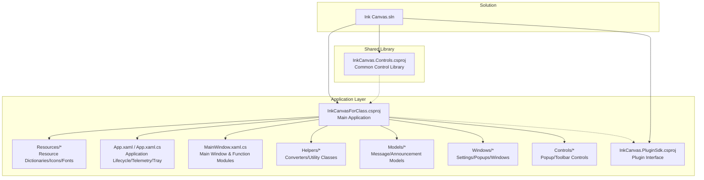
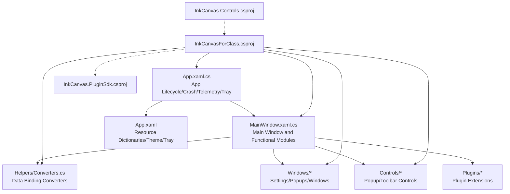
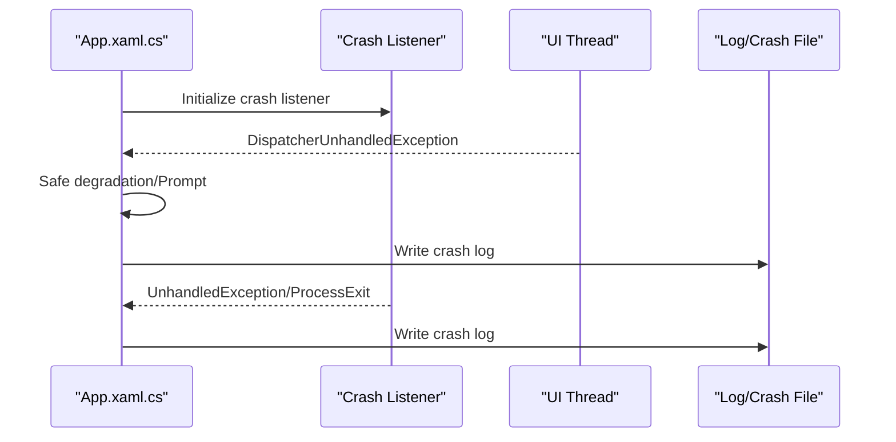
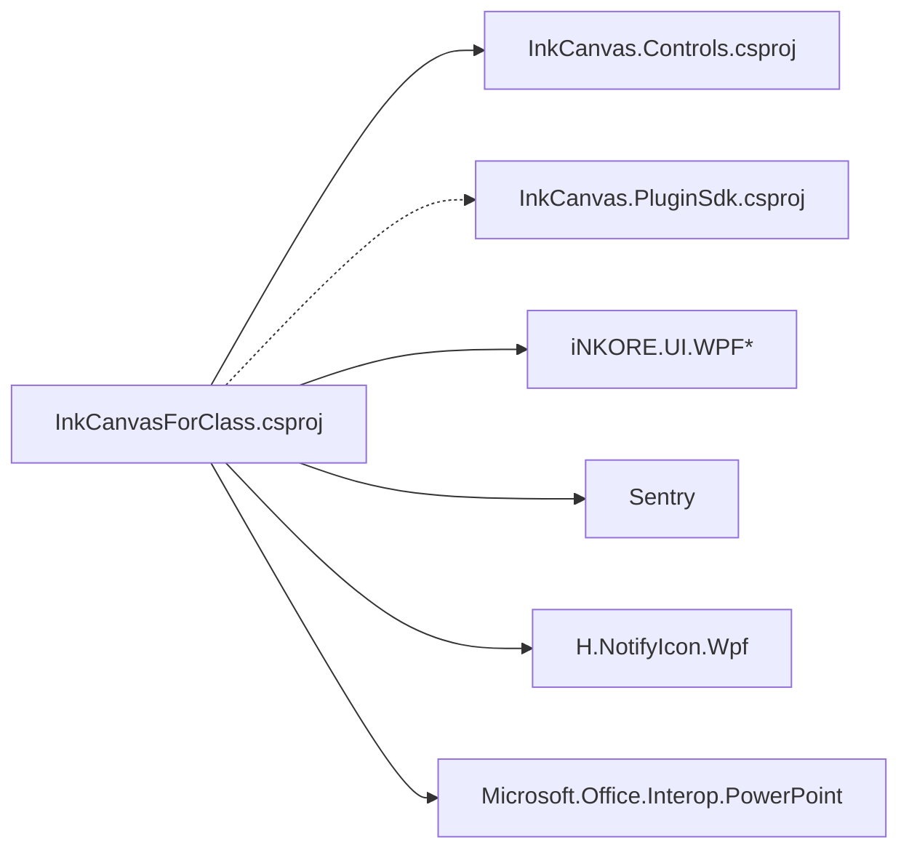

# Code Standards and Best Practices

## Introduction
This document is aimed at the developers and maintainers of the InkCanvasForClass community edition project. It systematically organizes C# coding standards, WPF/XAML best practices, project structure organization principles, code review checklists, build and release processes, testing, and refactoring guidelines to help the team achieve consistent engineering standards and improve maintainability, security, and performance.

## Project Structure
The project uses a multi-project solution, separating the core application from reusable controls and the plugin SDK. Combined with rule documents and resource dictionaries, it establishes clear responsibility boundaries and extension mechanisms.

Source of Diagram

## Core Components
- Application Entry and Lifecycle: App.xaml.cs handles application startup, crash listening, telemetry initialization, tray menus, watchdogs, and process monitoring.
- Main Window and Functional Modules: MainWindow.xaml.cs splits complex UI and business logic into multiple files based on functions (such as MW_Settings.cs, MW_Colors.cs, etc.), exposing controls to the main window via accessors.
- Resources and Styles: App.xaml centralizes the merging of theme and icon resource dictionaries to ensure a globally consistent visual style.
- Data Binding and Conversion: Helpers/Converters.cs provides common boolean/visibility/geometry converters to support XAML binding.
- Plugins and Controls: InkCanvas.PluginSdk.csproj defines plugin interfaces; InkCanvas.Controls.csproj provides a reusable control library.

## Architecture Overview
The application adopts a layered architecture of "Main Program + Control Library + Plugin SDK", combined with rule documents constraining UI and settings development specifications, ensuring consistency and extensibility.

Source of Diagram

## Component Details

### C# Coding Standards and Naming Conventions
- Naming Conventions
  - Method names: PascalCase
  - Variable names: camelCase
  - Private fields: _ prefix (e.g., _stylusDownTimestamp)
  - XAML control names: PascalCase (e.g., CardEnableInkFade)
  - XAML resource keys: PascalCase (e.g., PivotHeaderItemFontSize)
- Code Organization
  - The main window is split into multiple files by function (e.g., MW_Settings.cs, MW_Colors.cs, etc.)
  - New features should be placed in the corresponding function files or in a new file
- Internationalization
  - User-visible text must be uniformly bound through i18n resources, avoiding hardcoded Chinese or English text

### WPF and XAML Best Practices
- Control Usage Standards
  - Do not set the width for ComboBox; let it adapt to the content
  - Setting items with toggles should uniformly use controls:LabeledSettingsCard; items without toggles should use ui:SettingsCard
  - Expandable setting groups should use ui:SettingsExpander, and child items should use ui:SettingsCard
  - Mutually exclusive options should use ui:SettingsCard + ComboBox
- Data Binding and Conversion
  - Use Converters to provide boolean/visibility/geometry and other converters
  - When Slider + TextBlock displays the current value in real-time, UpdateSliderText needs to be implemented in the code-behind and the settings saved in ValueChanged
- Resource Management
  - App.xaml uniformly merges theme and icon resource dictionaries to ensure global consistency
  - Resource keys and icons use PascalCase to avoid duplication and conflicts

### MVVM Pattern Application and Data Binding Standards
- The current project is primarily code-behind, but loose coupling of data binding can be achieved through accessor properties and resource dictionaries
- It is recommended to introduce light ViewModels when adding complex views to separate UI logic from business logic
- Use DependencyProperty to expose state, facilitating binding and style control

### Project Structure Organization Principles
- Namespace Hierarchy
  - Application: Ink_Canvas
  - Control Library: Ink_Canvas.Controls
  - Plugins: Ink_Canvas.Plugins
- Folder Organization
  - Helpers: Converters/Utility classes
  - Windows: Settings/Popups/Windows
  - Controls: Popup/Toolbar controls
  - Resources: Icons/Fonts/Styles
- Module Division
  - The main program is responsible for lifecycle and system integration
  - The control library provides reusable UI components
  - The plugin SDK provides extension interfaces

### Popup Menu and Toolbar Standards
- PenPalettePopupContent uses PopupTabShellContent and PopupTabTitleBar to implement tab switching
- EraserPopupContent uses a Pivot style TabControl to implement switching between circular eraser and blackboard eraser
- Toolbar buttons are managed by ToolbarRegistry, supporting visibility/hiding and sorting

### Settings Page Development Specifications
- Complete workflow for adding/removing settings: Add properties in Resources/Settings.cs → Add controls in the page XAML → Add event handlers in the page code-behind → Read and apply in LoadSettings → Use settings in the main window
- Pen toolbar sliders require special cross-synchronization handling; use the _isUpdatingSliders flag to prevent infinite loops, and use Math.Round to handle floating-point precision

### Application Lifecycle and Exception Handling
- Initialize crash listeners, telemetry, tray menus, and watchdogs during application startup
- Handle non-UI thread and UI thread unhandled exceptions separately, with safe degradation for specific COM exceptions
- Provide crash log recording and formatted output

Source of Diagram

### Main Window and Functional Modules
- The main window splits complex logic into multiple files based on functions (e.g., MW_Settings.cs, MW_Colors.cs, etc.), exposing controls through accessors
- Event bindings are concentrated in WireUp* methods to ensure modularity and maintainability

## Dependency Analysis
The application manages dependencies through project references and NuGet packages, forming a clear layering and decoupling structure.

Source of Diagram

## Performance Considerations
- Startup and Resource Loading
  - Splash screen and progress control to avoid blocking the UI thread for a long time
  - Reasonably use resource dictionaries and icon caching to reduce redundant loading
- Binding and Rendering
  - Use converters to reduce complex logic in XAML
  - Avoid frequently triggering dependency property changes; update settings in batches
- Exceptions and Stability
  - Safely degrade for specific COM exceptions to avoid affecting overall stability
  - Record and format crash logs for easy troubleshooting

## Troubleshooting Guide
- Common Problem Location
  - Check crash log files (Crashes directory), which contain contexts like timestamps, memory/CPU/running duration, etc.
  - Check setting files (Settings.json) and application startup parameters to confirm actions after a crash
- System Integration Problems
  - Handle tray menus and system session ending events to ensure resource cleanup
  - Watchdog processes and process destruction hooks to avoid misjudgment and resource leaks

## Conclusion
This specification document summarizes the coding and architectural practices of InkCanvasForClass, covering naming conventions, XAML best practices, project structure, lifecycle and exception handling, dependencies, and performance considerations. It is highly recommended to strictly follow these in daily development and continuously improve rule documents and automated checks to ensure the long-term maintainability and stability of the project.

## Appendix

### Code Review Checklist
- Naming and Structure
  - Does it follow PascalCase/camelCase/_ prefix conventions
  - Are files split by function to avoid giant classes/windows
  - Are i18n resources used instead of hardcoded text
- XAML and Binding
  - Are standardized controls used (LabeledSettingsCard/SettingsCard/SettingsExpander/ComboBox)
  - Does the Slider implement UpdateSliderText and save settings in ValueChanged
  - Are converters centrally managed to avoid complex logic in XAML
- Lifecycle and Exceptions
  - Are crash listeners and telemetry initialized correctly
  - Is safe degradation applied to specific exceptions
  - Are crash logs recorded with necessary context
- Performance and Maintainability
  - Does it avoid blocking the UI thread
  - Are unnecessary dependency property changes minimized
  - Are project references and NuGet packages used to manage dependencies

### Build and Release Process Standards
- Target Framework and Platform
  - Target Framework: net6.0-windows10.0.19041.0
  - Platform: AnyCPU/x86/x64/ARM64
  - High DPI: PerMonitorV2
- Packages and Resources
  - Use Costura.Fody for assembly packaging
  - Embed/Include IACore dynamic libraries and icon/font resources
- Version and Metadata
  - Version numbers and product information are managed uniformly in AssemblyInfo.cs
  - Build information generation disabled (GenerateAssemblyInfo=False)

### Unit Testing and Integration Testing Standards
- Test Coverage
  - It is recommended that core converters and utility classes achieve high coverage (>80%)
- Test Data Management
  - Use resource dictionaries and localized resources to avoid hardcoding
- Test Execution
  - It is recommended to perform static analysis and key path regression testing in CI

### Code Refactoring and Optimization Guidelines
- Anti-Pattern Identification
  - Avoid giant MainWindow and mixed concerns
  - Avoid writing complex logic in XAML
  - Avoid hardcoding text and resource keys
- Refactoring Techniques
  - Extract UI logic to ViewModels (MVVM)
  - Use dependency properties and command binding
  - Reduce coupling through accessor properties and resource dictionaries

Source of Chapter
