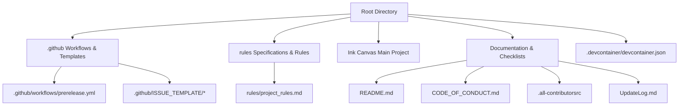
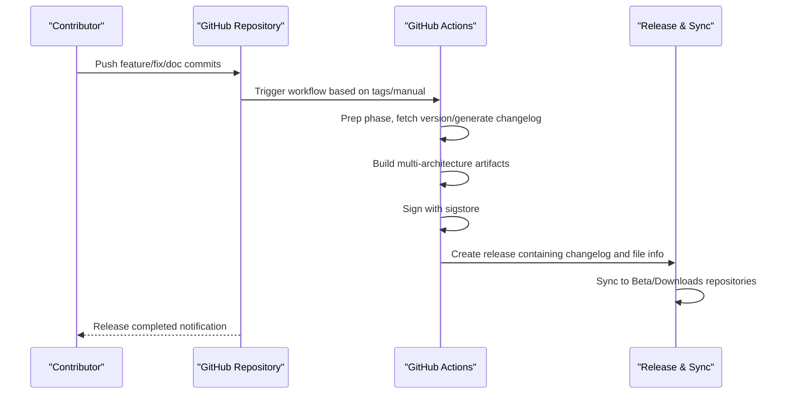
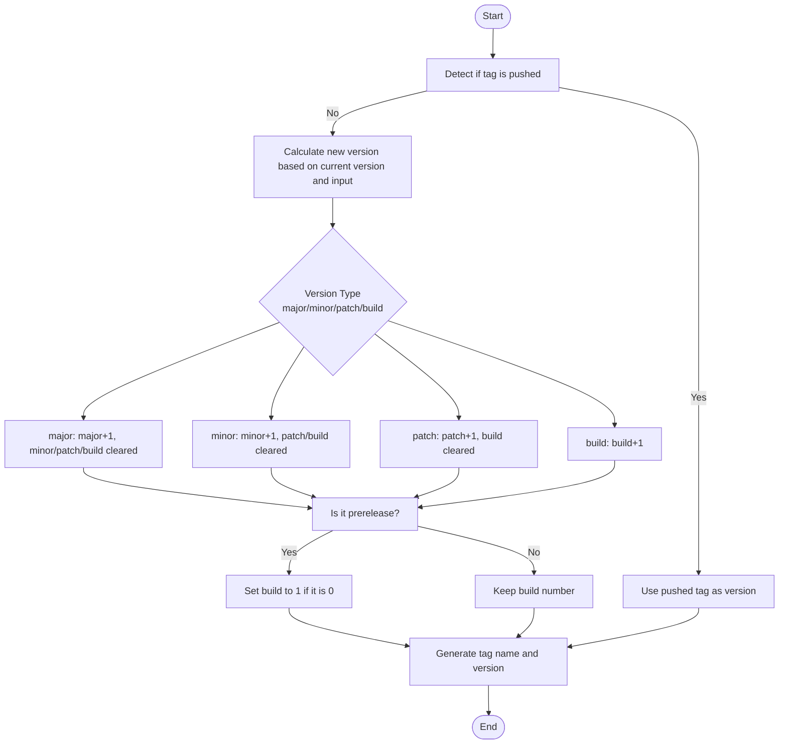
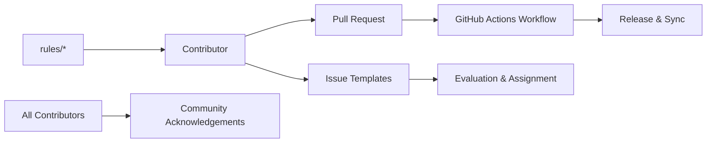

# Contribution Process

## Introduction
This guide is intended for contributors wishing to participate in the InkCanvasForClass Community Edition. It systematically explains everything from branching strategies, Pull Request reviews, commits and changelogs, issue and feature request handling, to continuous integration and releases, community codes of conduct, collaboration specifications, contributor recognition, and reward mechanisms, as well as specific contribution examples and best practices. The goal is to help both new and experienced contributors efficiently and consistently drive the project's evolution.

## Project Structure
The repository is organized in a "Root Directory + Multi-Module Project" structure, with core contribution elements distributed as follows:
- Contribution & Community: README, Code of Conduct, Contributors list
- Continuous Integration & Releases: GitHub Actions workflows
- Issue Templates: Feature requests, Bug reports
- Specifications & Rules: Development specifications index and various module rules
- Development Environment: Dev Container configuration
- Releases & Changelog: Update logs and version tags

## Core Components
- Code of Conduct & Collaboration Specifications: Defines community behavior standards, enforcement, applicability scope, violation procedures, and contact information.
- Contributor Recognition Mechanism: Documents various types of contributions and thanks contributors publicly using the All Contributors list and contribution type tagging.
- Continuous Integration & Release: Pre-release and changelog generation pipelines based on GitHub Actions, supporting multi-architecture artifact signing and synchronization.
- Issue & Feature Request Templates: Standardizes inputs for bug reports and feature requests, enhancing issue locating and requirement evaluation efficiency.
- Specifications & Rules: Development specification index divided by module to guide UI, settings pages, popups, toolbars, compilations, and general guidelines.
- Development Environment: Dev Container configuration providing a consistent .NET development environment and extensions.

## Architecture Overview
The diagram below illustrates the main process from contributor submission to release: branching and tagging strategies, PR reviews, CI builds and signatures, changelog generation, release, and synchronization.

## Detailed Component Analysis

### Branching and Tagging Management Strategy
- Branching Strategy
  - `net6` branch: Used to maintain differences from `main`, ensuring that the `net6` version is always newer than `main`.
  - `main` branch: Serves as the stable baseline; release versions are typically marked with tags.
- Tags and Versions
  - Version Format: Uses a 4-part format (`x.y.z.w`), where `w` is the build number; when `w=0`, it represents a formal release, otherwise it is a pre-release version.
  - Tag Naming: Matches the version number. Pushing a tag triggers the release process; the version type and pre-release flags can also be manually specified through the workflow.
- Pre-releases and Formal Releases
  - Pre-release: `w` is non-zero or explicitly marked as a pre-release. The release includes a pre-release prompt and file info table.
  - Formal Release: `w=0`. The release is synced to the Release and Beta repositories, and the auto-update version control files are updated.

## Dependency Analysis
- Contributors and Repository
  - Contributors participate via PRs and Issues; workflows automatically handle builds, signing, and releases.
- Specifications and Rules
  - The `rules` directory provides modular specification indices to guide development consistency.
- Contributor Recognition
  - `.all-contributorsrc` and `README` are maintained collaboratively to update the contributor list.

## Performance Considerations
- Build Performance
  - Parallel multi-architecture builds reduce overall build time; caching NuGet and dotnet dependencies helps speed up restores.
- Release Efficiency
  - Automating changelog and file info table generation reduces manual overhead; signing and synchronization occur in a single pass, minimizing the risk of missing files.

## Troubleshooting Guide
- Build Failures
  - Check dependency restoration and MSBuild arguments in build logs; verify the .NET SDK and Inno Setup environments.
- Signing Failures
  - Verify the `sigstore-python` environment and GitHub Token permissions; check if the artifact files exist.
- Releases Not Syncing
  - Check the Octo-Sts token and target repository permissions; verify that the version number aligns with the pre-release status.
- Missing Changelog
  - Verify that the `git-cliff` configuration and commit messages adhere to Conventional Commits; check the tag and unreleased segment parameters.

## Conclusion
This guide standardizes the key aspects of the contribution process: branch and tag strategies, PR reviews, commits and changelogs, CI/CD releases, issue and feature request handling, codes of conduct, and contributor recognition, forming a complete loop. Contributors are advised to check their work against the guidelines and templates before every submission to ensure high-quality delivery and efficient collaboration.

## Appendix
- Development Environment
  - Using a Dev Container lets you obtain the .NET and C# extensions with a single click, minimizing issues caused by environment discrepancies.
- Update Log
  - `UpdateLog.md` records version iterations and fix lists, making review and auditing easy.
