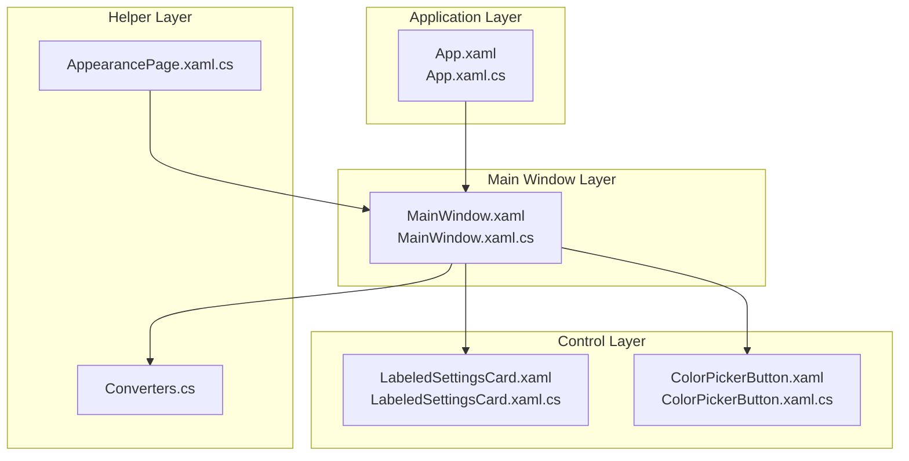
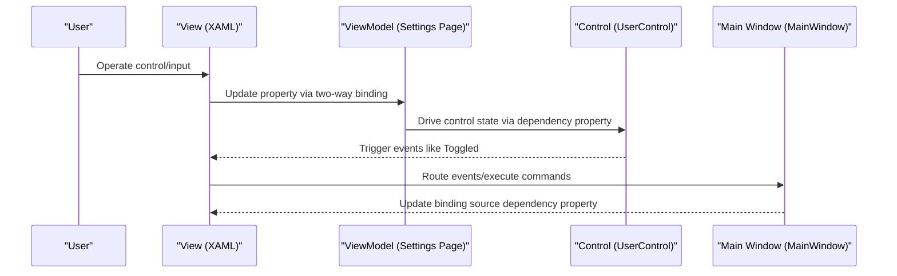
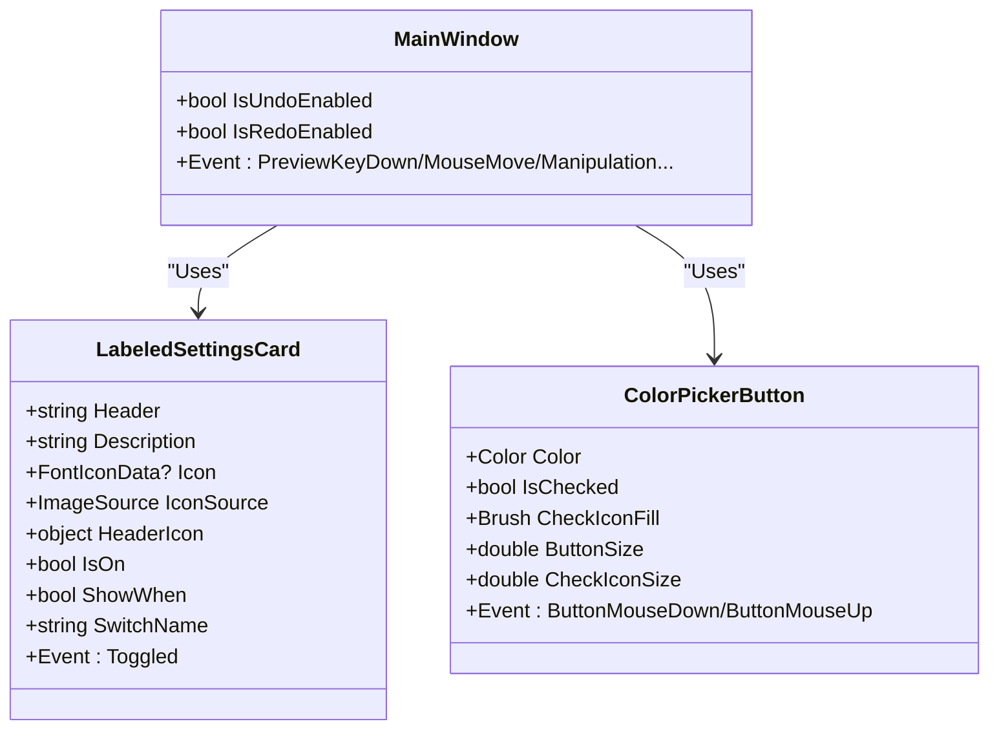
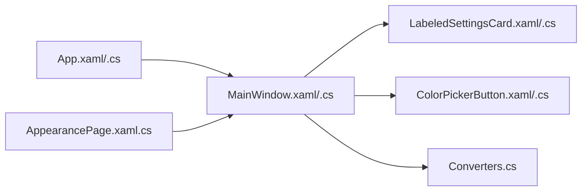

# Data Binding and Interaction

## Introduction
This document focuses on WPF data binding and user interaction mechanisms, combined with actual implementations in the repository. It systematically explains the following topics:
- Usage scenarios and practices for one-way binding, two-way binding, and one-time binding
- Advanced usage of dependency properties: property change callbacks, validation, and converters
- Application of the command pattern in controls: ICommand interface implementation and binding
- User interaction event handling: capturing and responding to mouse, keyboard, and touch gestures
- Inter-control communication: event bubbling, routed events, and custom events
- Control implementation under the MVVM pattern: ViewModel design and data context binding
- Practical cases: editable settings cards and a responsive color picker

## Project Structure
This project adopts a typical WPF layered structure:
- Application Layer: App.xaml(x) provides application-level resources and tray menus
- Main Window Layer: MainWindow.xaml(x) defines the main interface layout and interaction events
- Control Layer: InkCanvas.Controls provides reusable user controls (such as LabeledSettingsCard, ColorPickerButton)
- Helper Layer: Helpers/Converters provides value converters; Windows/SettingsViews provides settings pages and MVVM bindings

## Core Components
- Application Resources and Tray Menu: Centralized definition of menu items and icon resources in App.xaml, with logic implemented in App.xaml.cs through event handlers.
- Main Window Interaction: MainWindow.xaml defines UI elements like InkCanvas, floating bars, selection tools, etc.; MainWindow.xaml.cs registers numerous input events and dependency properties.
- Custom Controls: LabeledSettingsCard and ColorPickerButton demonstrate dependency properties, property change callbacks, and event forwarding.
- Value Converters: Converters.cs provides boolean-to-visibility conversion, string-to-geometry conversion, etc.
- Settings Pages: AppearancePage.xaml.cs demonstrates MVVM binding and two-way data flow.

## Architecture Overview
WPF data binding and interaction in this project are reflected in the collaboration of "View-ViewModel-Control":
- View (XAML): Achieves UI expression through Binding, command binding, styles, and triggers.
- ViewModel: Pages like settings pages carry data and business logic, implementing two-way binding.
- Control (UserControl): Encapsulates complex interactions and state, exposing dependency properties and events.

## Detailed Component Analysis

### Dependency Properties and Property Change Callbacks
- MainWindow defines dependency properties like IsUndoEnabled, IsRedoEnabled, etc., for state-driven UI.
- LabeledSettingsCard defines dependency properties like Header, Description, Icon, IconSource, HeaderIcon, IsOn, ShowWhen, SwitchName, etc., applying them to internal controls upon changes.
- ColorPickerButton defines dependency properties like Color, IsChecked, CheckIconFill, ButtonSize, CheckIconSize, etc., instantly updating the appearance upon changes.

## Dependency Analysis
- App.xaml and App.xaml.cs: Application-level resources and tray menu event handling.
- MainWindow.xaml and MainWindow.xaml.cs: Main interface layout, input events, and dependency properties.
- Control Layer (LabeledSettingsCard, ColorPickerButton): Dependency properties and event forwarding.
- Helper Layer (Converters): Value converters supporting binding.
- Settings Pages (AppearancePage.xaml.cs): MVVM binding and configuration persistence.

## Performance Considerations
- Splash Screen and Crash Logs: App.xaml.cs contains splash screen and crash log recording, helping diagnose performance bottlenecks.
- DPI Adaptation: MainWindow calculates the floating bar position in its constructor based on DPI to avoid layout jitter.
- Touch Sliding Optimization: MainWindow implements manual touch sliding for the left/right tab lists, reducing unnecessary layout overhead.
- Value Converters: Converters in Converters.cs should avoid expensive computations, using cache or lazy loading when necessary.

## Troubleshooting Guide
- Unhandled Exceptions: App.xaml.cs classifies and handles UI thread and non-UI thread exceptions to avoid application crashes.
- COM Object Exceptions: Special handling is provided for PowerPoint/WPS COM object exceptions.
- Thread Access Exceptions: Safely handles thread access issues for WPF InkCanvas.
- Crash Logs: Records crash details and system states to facilitate issue tracking.

## Conclusion
This project demonstrates solid engineering practices in WPF data binding and user interaction:
- Clear data flow and UI representation are achieved using dependency properties and value converters.
- Settings pages are organized with the MVVM pattern to implement two-way binding and configuration persistence.
- Complex interactions are encapsulated in custom controls to provide reusable UI components.
- Inter-control communication is implemented using routed events and event bubbling.
- Startup screens, crash logs, and exception-handling mechanisms are provided for performance and stability.

## Appendix
- Binding Type Recommendations
  - One-Way Binding: Read-only display (e.g., read-only text, icons)
  - Two-Way Binding: User-editable items (e.g., toggles, sliders, input boxes)
  - One-Time Binding: Used during initialization and does not require subsequent updates (e.g., static resources)
- Best Practices
  - Use dependency properties to carry bindable state, cooperating with property change callbacks to update the UI.
  - Place complex conversion logic in converters to keep XAML clean.
  - Implement loosely coupled control communication through event bubbling and routed events.
  - Separate views and view models in MVVM, using commands and bindings to reduce code coupling.
