# Custom Control Development

## Introduction
This guide is aimed at engineers and designers who want to develop custom controls in WPF. It systematically explains control inheritance, dependency property definitions, event handling, templates and styles, interaction behaviors (mouse/keyboard/touch), data binding (including two-way binding, converters, and commands), themes and visual states, performance optimization (virtualization/lazy loading/memory management), and testing and debugging methods. The document uses actual controls in the repository as cases, providing directly referenceable implementation paths and best practices.

## Project Structure
This project adopts an organization method of "Functional Domain + Control Library": `InkCanvas.Controls` provides common custom controls; `Ink Canvas/Resources/Styles` provides dark/light theme resources; and `MainWindow_cs` contains toolbar integration and control instantiation logic. The following diagram illustrates the core files and responsibility mapping related to control development:

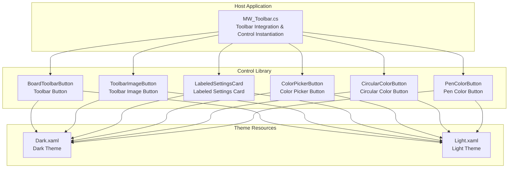

## Core Components
This section focuses on key elements of control development: inheritance hierarchies, dependency properties, events, templates and styles, interaction behaviors, data binding, themes and visual states, performance, and testing.

- Inheritance and Base Classes
  - All custom controls are based on `UserControl`, with appearance defined via XAML and logic and dependency properties implemented in C# code-behind.
  - Typical controls: `BoardToolbarButton`, `ToolbarImageButton`, `LabeledSettingsCard`, `ColorPickerButton`, `CircularColorButton`, `PenColorButton`.

- Dependency Properties and Notifications
  - Use `DependencyProperty.Register` to register properties, combined with static callbacks `OnXxxChanged` to implement UI updates or behavior triggers when properties change.
  - Examples: `BoardToolbarButton`'s `Label`, `IconGeometry`, `Position`, `IconBrush`; `LabeledSettingsCard`'s `Header`, `Description`, `Icon`, `IconSource`, `HeaderIcon`, `IsOn`, `ShowWhen`, `SwitchName`; `ColorPickerButton`'s `Color`, `IsChecked`, `CheckIconFill`, `ButtonSize`, `CheckIconSize`; `CircularColorButton`'s `Color`, `ColorOpacity`, `IsChecked`, `ButtonSize`, `BorderBrushColor`, `CheckIconSource`; `PenColorButton`'s `Color`, `BorderBrushColor`, `IsHighlighter`, `IsChecked`, `CheckIconSource`.

- Event Handling
  - Controls expose events (such as `ButtonMouseDown`, `ButtonMouseUp`, `Toggled`), which are subscribed to by the host page to respond to user actions.
  - Examples: `BoardToolbarButton`, `ToolbarImageButton`, `ColorPickerButton`, `CircularColorButton`, and `PenColorButton` forward custom events during mouse events.

- Templates and Styles
  - In XAML, layout containers like `Grid`/`Border`/`Canvas` are combined with geometric shapes, images, and text, using `{DynamicResource ...}` to bind theme resources.
  - Theme resources are located in `Dark.xaml` and `Light.xaml`, uniformly managing colors and icon resources for foreground/background/borders/icons.

- Data Binding
  - Supports one-way/two-way binding: e.g., `LabeledSettingsCard`'s `IsOn` is two-way bound to a `ToggleSwitch`.
  - Resource dictionaries and dynamic styles: dynamic runtime theme switching via `{DynamicResource ...}`.

- Interaction Behaviors
  - Mouse events: `MouseDown`/`MouseUp`/`MouseLeave`. Keyboard/touch: No explicit keyboard/touch event handling is found in the project; it is recommended to extend these in custom controls as needed.

- Themes and Visual States
  - Implement dark/light theme switching via resource dictionaries; update control visibility/opacity/visibility internally based on states like `IsEnabled` or `IsChecked`.

- Performance Optimization
  - Virtualization: List-like controls are recommended to use `VirtualizingStackPanel`; large-scale list scenarios are not present in this repository.
  - Lazy Loading: Controls apply properties in the `Loaded` event to avoid expensive operations during the construction phase.
  - Memory Management: Pay attention to unsubscribing from events and releasing image resources (no explicit release logic is shown in this repository, so cleaning up when the control is unloaded is recommended).

- Testing and Debugging
  - Unit Testing: Perform unit tests on business logic (such as color calculations and state machines); UI automation testing frameworks are recommended for UI behaviors.
  - Visual Debugging: Use Live Visual Tree / Live Property Explorer for real-time checks.

## Architecture Overview
The diagram below shows the relationships and interaction flows between controls, theme resources, and the host application:

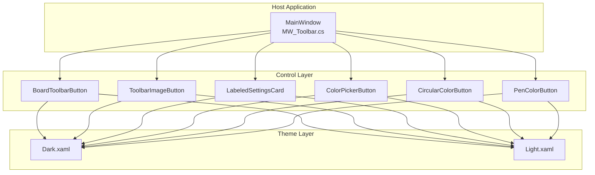

## Detailed Component Analysis

### Toolbar Button (BoardToolbarButton)
- Design Points
  - Controls display content and appearance through dependency properties `Label`, `IconGeometry`, `Position`, and `IconBrush`.
  - Exposes click behavior through `ButtonMouseDown`/`ButtonMouseUp` events.
  - Dynamically sets corner radius and border thickness according to `Position` to adapt to toolbar grouping.
- Key Implementation Path

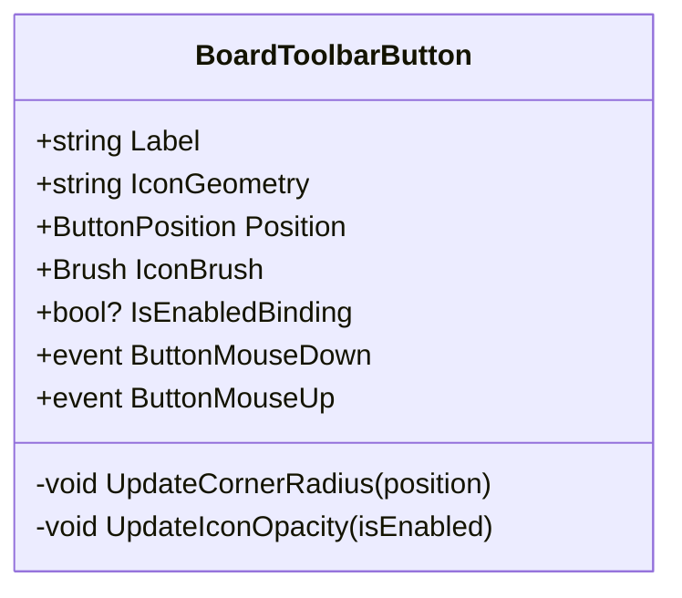

### Toolbar Image Button (ToolbarImageButton)
- Design Points
  - Dependency properties support `Label`, `IconGeometryDrawing`, `IconBrush`, `LabelBrush`, etc.
  - Controls icon and text opacity through `IsEnabledChanged`.
  - Maintains the state of the "last pressed" button to implement toolbar button selection highlighting.
- Key Implementation Path

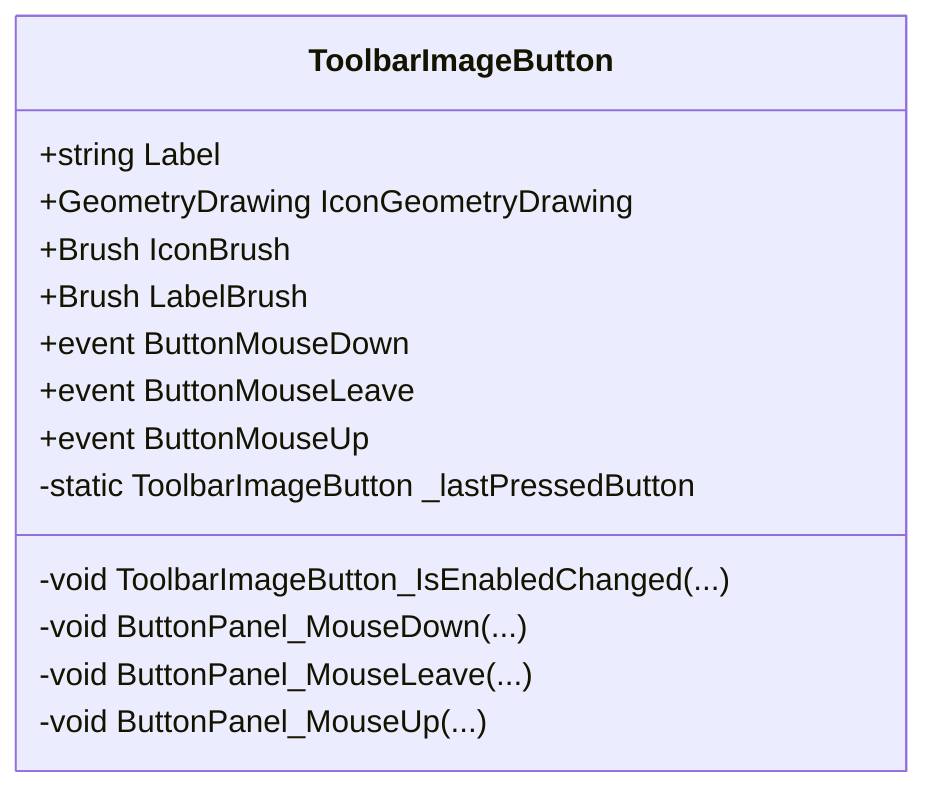

### Labeled Settings Card (LabeledSettingsCard)
- Design Points
  - `Header`/`Description` text binding; one of `Icon`/`IconSource`/`HeaderIcon` is configured for the icon.
  - `IsOn` is two-way bound to `ToggleSwitch`; `ShowWhen` controls visibility; `SwitchName` sets the control name.
  - Exposes the switch toggle via the `Toggled` event.
- Key Implementation Path

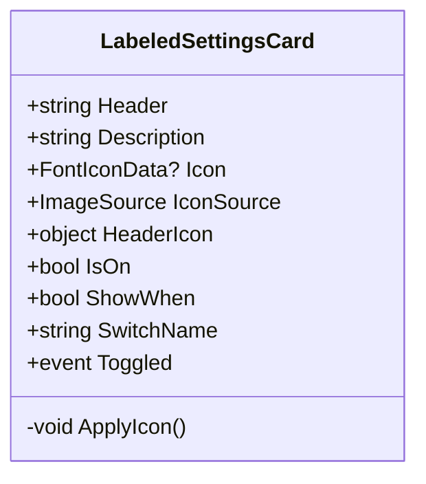

### Color Picker Button (ColorPickerButton)
- Design Points
  - `Color` controls background color; `IsChecked` controls hook icon visibility; `CheckIconFill` controls hook icon fill color.
  - `ButtonSize`/`CheckIconSize` control sizes; `MouseDown`/`Leave`/`Up` events are exposed externally.
- Key Implementation Path

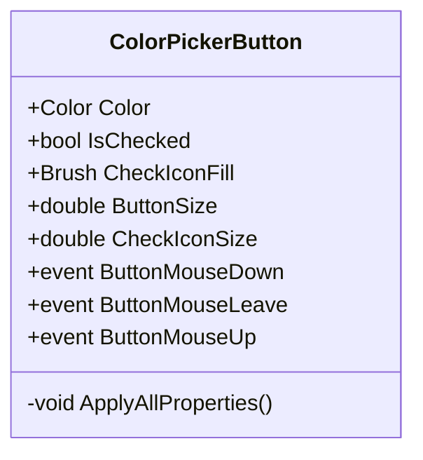

### Circular Color Button (CircularColorButton)
- Design Points
  - `Color`/`ColorOpacity` control overlay color and opacity; `IsChecked` controls hook icon visibility.
  - `ButtonSize` dynamically calculates inner element radius and size; `BorderBrushColor` controls border color.
  - `CheckIconSource` supports dynamic changing of the hook icon.
- Key Implementation Path

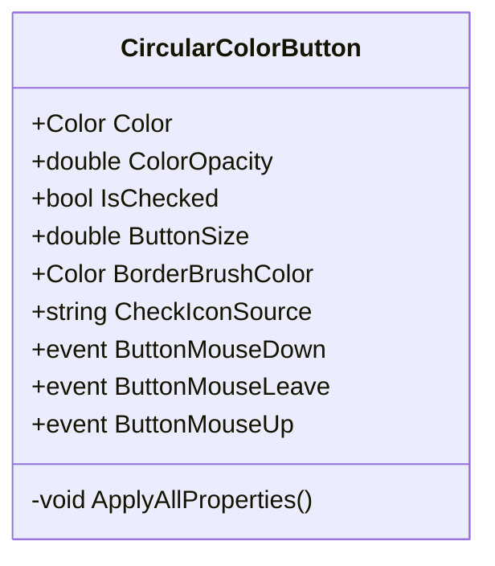

### Pen Color Button (PenColorButton)
- Design Points
  - `Color` controls color overlay; `BorderBrushColor` controls border color; `IsHighlighter` controls transparent grid and opacity.
  - `IsChecked` controls hook icon visibility; `CheckIconSource` supports dynamic changing of the hook icon.
- Key Implementation Path

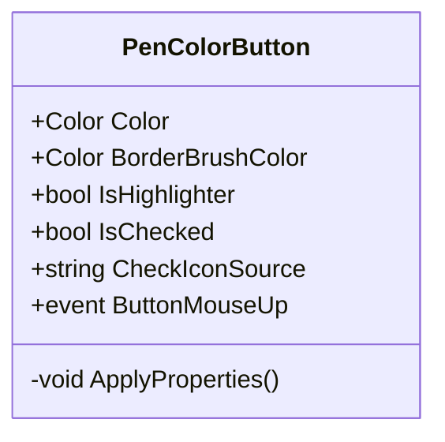

### Interaction Behavior and Event Sequence (Taking Button Click as an Example)
The following sequence diagram shows the complete process from user click to control event forwarding and finally to host application processing:

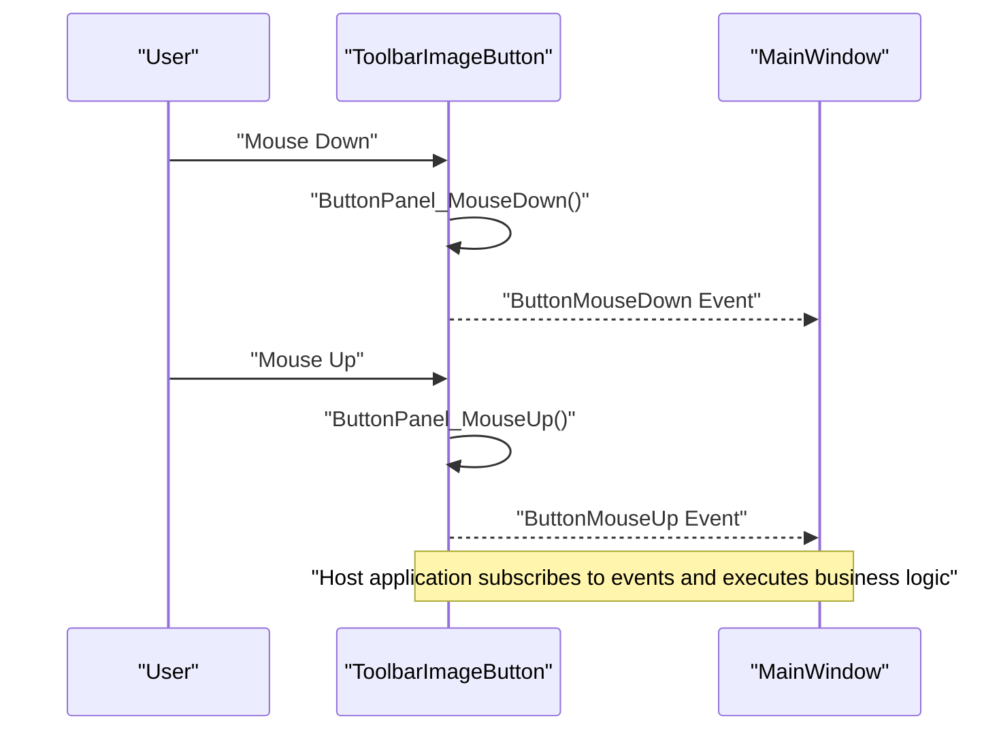

### Data Binding Flow (Taking Settings Card as an Example)
The following flowchart shows the two-way binding and event bubbling process of `LabeledSettingsCard`:

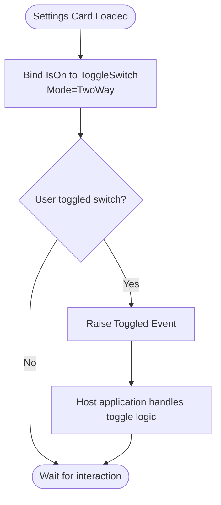

## Dependency Analysis
- Controls and Theme Resources
  - All controls reference theme resources via `{DynamicResource ...}` to achieve dark/light theme switching.
- Controls and Host Application
  - `MainWindow` injects controls into the toolbar via `ToolbarHost`/`Registry`, achieving runtime assembly and state synchronization.
- Inter-Control Coupling
  - Controls are relatively independent, decoupled through dependency properties and events; color-related controls share a unified color model and resource keys.

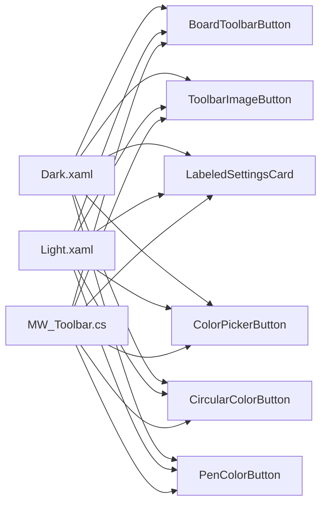

## Performance Considerations
- Virtualization
  - For long lists (such as color palettes), it is recommended to use `VirtualizingStackPanel` and `RecyclingBehavior` to reduce the number of visual objects.
- Lazy Loading
  - Controls apply properties in the `Loaded` event to avoid expensive operations during the construction phase; lazy loading strategies can be adopted for loading large icons.
- Memory Management
  - Pay attention to releasing image resources and canceling event subscriptions; clean up events and temporary objects when the control is unloaded to prevent memory leaks.
- Rendering Optimization
  - Use `RenderOptions.BitmapScalingMode="HighQuality"` only when high-quality rendering is required, avoiding unnecessary overhead.

## Troubleshooting Guide
- Dependency Properties Not Taking Effect
  - Check whether dependency properties and callbacks are registered correctly; verify that the binding path matches in XAML.
- Theme Switch Ineffective
  - Verify that the resource key exists and is defined in the corresponding theme file; make sure the control uses `{DynamicResource ...}`.
- Events Not Triggered
  - Check whether the event subscription is completed after control initialization; confirm that the event forwarding logic is not overridden.
- Image Resource Load Failure
  - Check whether the URI is correct and the resource packaging method is set to Resource; confirm path casing and slash direction.

## Conclusion
Based on the real controls in the repository, this guide summarizes the key practices of WPF custom control development: using `UserControl` as the foundation, achieving clear interfaces through dependency properties and events; utilizing XAML templates and resource dictionaries to implement themeability and reuse; and integrating with the host application's toolbar to achieve modular assembly. Following the dependency, performance, and troubleshooting recommendations in this article helps efficiently build a stable and maintainable custom control system.

## Appendix
- Example Control List
  - Toolbar Buttons: `BoardToolbarButton`, `ToolbarImageButton`
  - Settings Card: `LabeledSettingsCard`
  - Color Buttons: `ColorPickerButton`, `CircularColorButton`, `PenColorButton`
- Theme Resources
  - Dark Theme: `Dark.xaml`
  - Light Theme: `Light.xaml`
- Host Integration
  - Toolbar Initialization and Reconstruction: `MW_Toolbar.cs`
