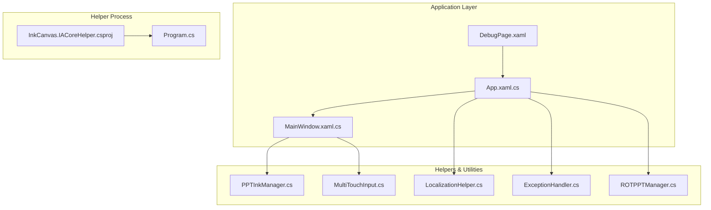
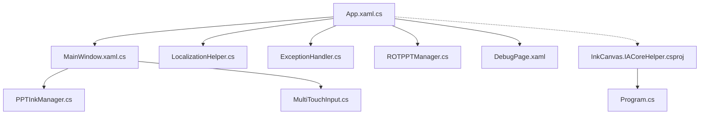
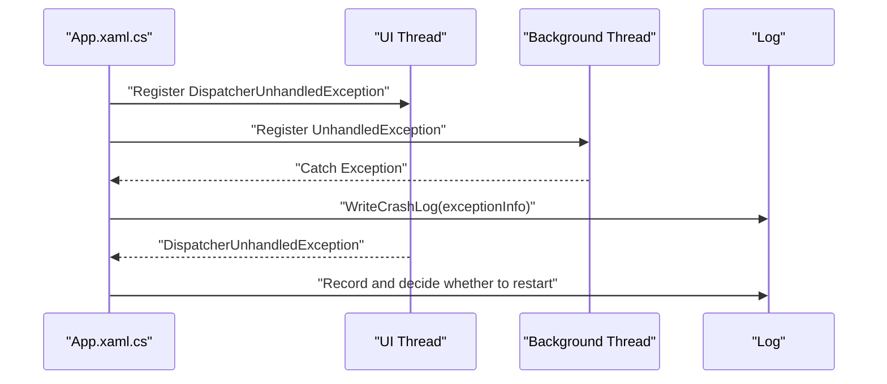
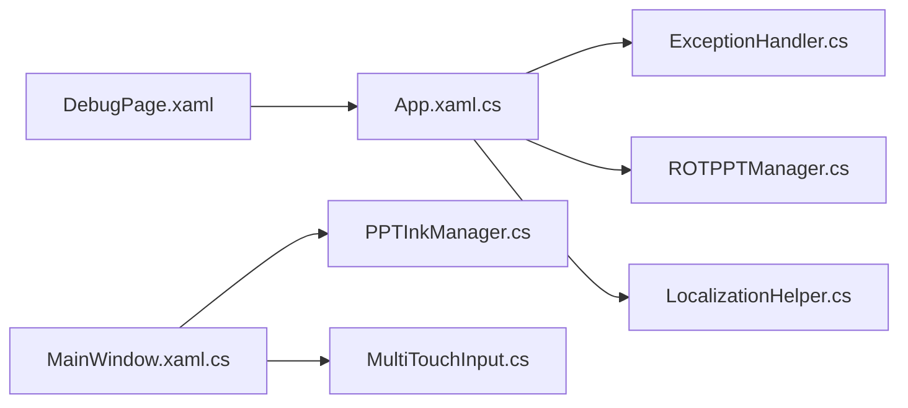

# Performance Optimization and Best Practices

## Introduction
This guide focuses on the performance optimization and best practices of WPF custom controls, combined with existing implementations in the repository. It systematically explains the following topics:
- Virtualization and Lazy Loading: Reducing startup and runtime overhead through on-demand creation, lazy loading, and memory reclamation strategies
- Rendering Optimization: Utilizing caching, bitmap scaling modes, and edge modes to reduce drawing costs
- Layout and Visual Tree Simplification: Reducing unnecessary visual nodes and complex transformations
- Resource Management: Resource dictionary caching, style reuse, and dynamic resource utilization
- Lifecycle Optimization: Initialization delay, event subscription management, and asynchronous processing
- Debugging and Performance Analysis: WPF performance counters, Visual Studio performance profiler, and third-party tools
- Performance Testing and Benchmarks: Designing and implementing testing schemes
- Practical Cases: Optimization strategies in scenarios with a large number of controls and prevention of memory leaks

## Project Structure
This project is organized in a multi-module manner, containing the main application, auxiliary tools, control libraries, and resource dictionaries. Modules closely related to performance optimization include:
- Application Entry and Lifecycle: `App.xaml.cs`
- Main Window and Control Containers: `MainWindow.xaml.cs`
- Ink and Rendering Helpers: `PPTInkManager.cs`, `MultiTouchInput.cs`
- Resources and Localization: `LocalizationHelper.cs`
- Exceptions and Resource Releases: `ExceptionHandler.cs`, `ROTPPTManager.cs`
- Debugging and Diagnosis: `DebugPage.xaml`
- Helper Process and Memory Mapping: `InkCanvas.IACoreHelper.csproj`, `Program.cs`

## Core Components
- Application Lifecycle and Crash Handling: Centered in `App.xaml.cs`, responsible for startup, exception capturing, crash logging, and resource cleanup.
- Main Window and Control Containers: `MainWindow.xaml.cs` carries a large number of controls and events, involving rendering, layout, and interaction.
- Ink and Rendering: `PPTInkManager.cs` and `MultiTouchInput.cs` are responsible for in-memory ink cleanup and drawing optimization, respectively.
- Resources and Localization: `LocalizationHelper.cs` implements caching and substitution of embedded resources, improving resource access efficiency.
- Exceptions and Resource Releases: `ExceptionHandler.cs` provides unified encapsulation for `TryExecute` and asynchronous execution; `ROTPPTManager.cs` provides safe release of COM objects.
- Debugging and Diagnosis: `DebugPage.xaml` provides debugging switches and entry points for performance-related settings.
- Helper Process: `InkCanvas.IACoreHelper.csproj` and `Program.cs` communicate via shared memory and pipes, reducing main thread pressure.

## Architecture Overview
The application adopts a "Main Application + Helper Process + Resource/Rendering Helpers" architecture. The main application handles the UI and business logic, the helper process handles high-throughput tasks through shared memory and pipes, and rendering and resource access are optimized through dedicated helper classes.

## Detailed Component Analysis

### Application Lifecycle and Crash Handling (App.xaml.cs)
- Initialization and Exception Capturing: Handles UI thread and non-UI thread exceptions centrally to prevent crashes and record logs.
- Resource Cleanup: Cleans up managed and unmanaged resources at session ending and process exit.
- Startup Monitoring: Provides splash screen and crash log collection for easy identification of performance bottlenecks.

## Dependency Analysis
- `App.xaml.cs` depends on `ExceptionHandler.cs` and `ROTPPTManager.cs` for exceptions and resource releases.
- `MainWindow.xaml.cs` depends on `PPTInkManager.cs` and `MultiTouchInput.cs` for rendering and memory management.
- `LocalizationHelper.cs` acts as the resource access layer, used indirectly by `App.xaml.cs`.
- `DebugPage.xaml` acts as the debugging entry point, connecting `App.xaml.cs` and various helper modules.

## Performance Considerations
- Virtualization and Lazy Loading
  - Use `DispatcherPriority.ApplicationIdle` and `DispatcherPriority.Loaded` to delay the initialization of key components, reducing startup blocking.
  - Create Canvas and controls on demand to avoid building a large number of visual nodes at once.
- Rendering Optimization
  - Set `BitmapCache`, `BitmapScalingMode`, and `CachingHint` for `VisualCanvas` and `DrawingVisual` to reduce redraw costs.
  - Draw ink strokes in segments to reduce frequent drawing calls.
- Layout and Visual Tree Simplification
  - Implement touch sliding manually to avoid layout computations brought by complex controls.
  - Hide/show popup panels reasonably to reduce visual tree depth.
- Resource Management
  - Cache embedded resources to avoid repeated parsing and disk I/O.
  - Use static caching and singleton patterns to reuse expensive objects.
- Lifecycle Optimization
  - Release resources uniformly at session ending and process exit to prevent leaks.
  - Wrap asynchronous operations with `TryExecute`/`TryExecuteAsync` to prevent exception propagation.
- Helper Process
  - Handle high-throughput tasks via shared memory and pipes to ease main thread pressure.

## Troubleshooting Guide
- Startup and Crashes
  - Use crash log recording in `App.xaml.cs` to locate exception context and system status.
  - Clean up resources in `SystemEvents.SessionEnding` and `CurrentDomain.ProcessExit` to avoid leaks.
- COM Object Exceptions
  - Use `SafeReleaseComObject` and `SafeFinalReleaseComObject` provided in `ROTPPTManager.cs` to avoid dangling references.
- Resource Access Exceptions
  - Wrap operations using `TryExecute`/`TryExecuteAsync` from `ExceptionHandler.cs` to ensure controlled exceptions.
- Debugging and Diagnosis
  - Enable debugging switches through `DebugPage.xaml` to observe performance-related settings and behaviors.

## Conclusion
This project provides a solid performance foundation in terms of application lifecycle, rendering optimization, resource management, and exception handling. It is recommended to further introduce the following in subsequent iterations:
- Finer-grained virtualization and lazy loading strategies
- Performance counter and profiler integration
- Definite performance testing and benchmarking schemes
- More complete memory leak detection and reporting mechanisms

## Appendix
- Performance Testing and Benchmarks
  - Design scenarios: large number of controls, high-frequency interaction, high-resolution and high-DPI environments.
  - Metrics: startup time, frame rate, memory footprint, CPU footprint, frame drop rate.
  - Tools: WPF performance counters, Visual Studio performance profiler, PerfView, ETW.
- Practical Cases
  - Scenarios with a large number of controls: adopt lazy initialization and on-demand creation, combined with caching and reuse.
  - Memory leak prevention: unify resource release interfaces, safe release of COM objects, and periodic memory checks and cleanup.
