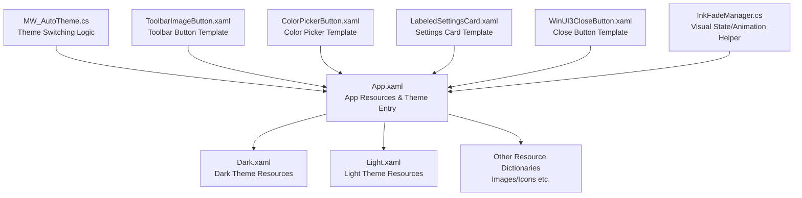
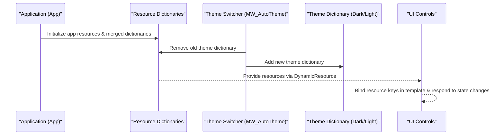
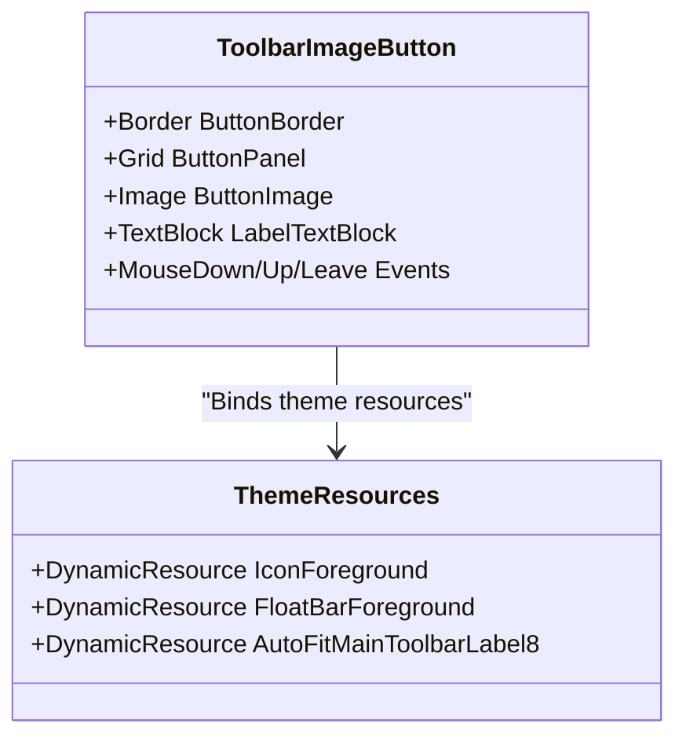
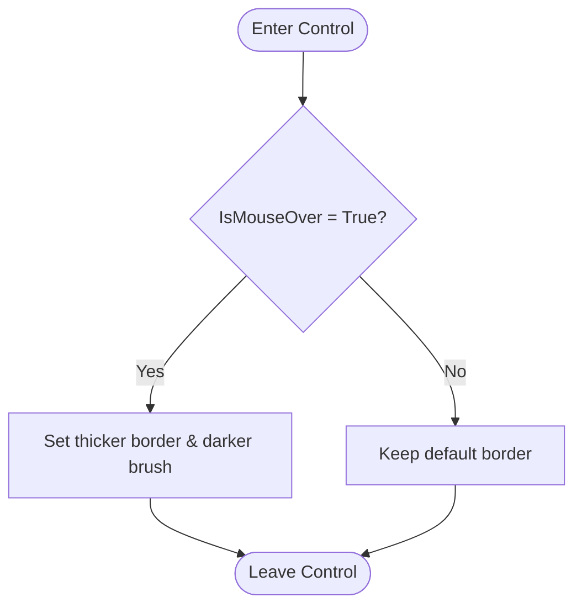
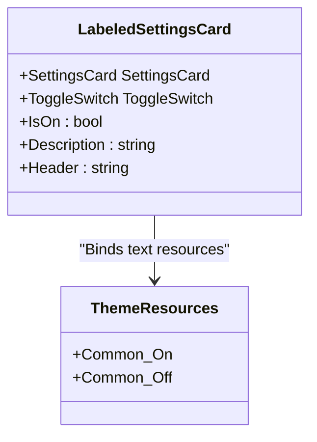
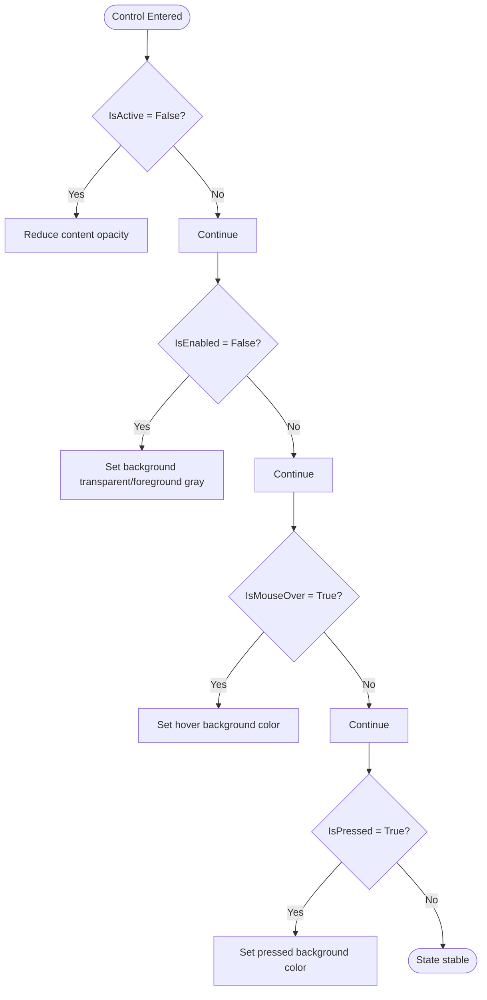
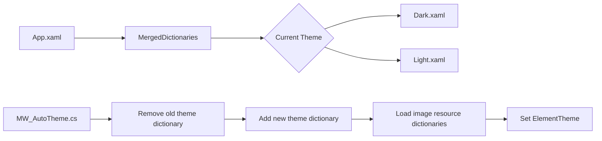
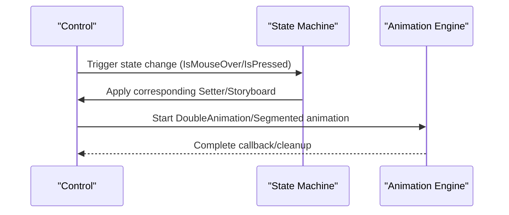
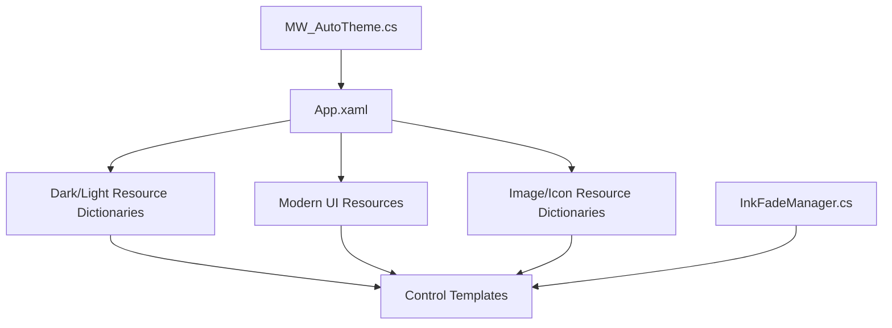

# Control Templates and Styles

## Introduction
This document systematically explains the control template and style system of this project, covering the following topics:
- Definition and usage of `ControlTemplate`: template element binding, triggers, and state groups
- Combined usage of `Style`: style inheritance, resource references, and dynamic style switching
- Usage of `VisualStateManager`: visual state management and animation effects
- Theme System: resource dictionary organization, theme switching, and custom theme creation
- Style precedence and conflict resolution: style merging and overriding rules
- Practical examples: complete implementation ideas and reference paths for settings cards, toolbar buttons, and color pickers

## Project Structure
Styles and templates in this project are mainly distributed in the following locations:
- Application-level resource and theme entry: `App.xaml`
- Dark/light theme resource dictionaries: `Resources/Styles/Dark.xaml`, `Light.xaml`
- Theme switching logic: `MainWindow_cs/MW_AutoTheme.cs`
- Typical control templates and styles: `InkCanvas.Controls/*.xaml` and `Ink Canvas/Windows/Controls/*.xaml`
- Animation and visual state helpers: `Helpers/InkFadeManager.cs`

## Core Components
- Application Resources and Theme Entry: `App.xaml` defines application-level resource dictionaries and merged dictionaries, including Modern UI resources, icon, and image resource dictionaries, and imports theme resources via `MergedDictionaries`.
- Theme Resource Dictionaries: `Dark.xaml` and `Light.xaml` provide unified resource keys for colors, brushes, icon bitmaps, etc., serving as the basis for theme switching.
- Theme Switching Logic: `MW_AutoTheme.cs` completes theme switching by removing the old theme dictionary, adding the new theme dictionary, and loading image resources, as well as setting `ElementTheme` to drive system-level appearances.
- Control Templates and Styles:
  - `ToolbarImageButton.xaml`: Uses a `Border` wrapping a `Grid` containing an `Image` and a `TextBlock`, binding to theme resources using `DynamicResource`.
  - `ColorPickerButton.xaml`: Implements interactions such as border thickness changes on mouse hover via `Style.Triggers`.
  - `LabeledSettingsCard.xaml`: A combined template based on `SettingsCard` and `ToggleSwitch`.
  - `WinUI3CloseButton.xaml`: Uses a `ControlTemplate` with multiple `Triggers` to implement appearance changes under disabled, hovered, and pressed states.
- Visual States and Animations: `InkFadeManager.cs` demonstrates segmented fading animations based on `DispatcherTimer` and `DoubleAnimation`, reflecting visual state management and animation implementation.

## Architecture Overview
During application startup, `App.xaml` loads basic resources and Modern UI resources, and then loads `Dark.xaml` or `Light.xaml` according to the current theme. `MW_AutoTheme.cs` replaces merged dictionaries when needed to switch themes, and loads relevant image resources. Control templates reference theme resource keys via `DynamicResource`, achieving a consistent appearance and behavior across themes.

## Detailed Component Analysis

### Toolbar Button Template (ToolbarImageButton.xaml)
- Structural Points
  - The outer `Border` provides rounded corners and a transparent background. The inner `Grid` has a fixed size, containing an `Image` and a `TextBlock`.
  - `Image.Source` uses `DrawingImage` and `GeometryDrawing`, with the `Brush` bound to the `DynamicResource IconForeground`.
  - The `TextBlock` binds to the `DynamicResource FloatBarForeground` and applies the `AutoFit` style.
- Template Element Binding
  - Uses `{DynamicResource ...}` to reference theme resource keys, updating automatically when the theme switches.
- Triggers and State Groups
  - This control itself does not define `ControlTemplate.Triggers`, but its `Border` sub-element can add `Style.Triggers` as needed to implement interaction states (e.g., hover, pressed).
- Applicable Scenarios
  - Floating toolbar buttons, menu item icons, and label combinations.

### Color Picker Button Template (ColorPickerButton.xaml)
- Structural Points
  - An outer `Border`, and an inner `Path` acting as a check icon, with an initial visibility of `Collapsed`.
  - Implements border thickness and color changes when `IsMouseOver` is true via `Style.Triggers`.
- Template Element Binding
  - Border brushes and text colors can be bound and extended through theme resource keys.
- Triggers and State Groups
  - Currently contains one Trigger (hover), which can be extended to support selected/disabled states.
- Applicable Scenarios
  - Single-color buttons in quick color selection panels.

### Settings Card Template (LabeledSettingsCard.xaml)
- Structural Points
  - Based on a combination of `SettingsCard` and `ToggleSwitch`, where `Header` and `Description` bind to the `UserControl`'s own properties via `RelativeSource`.
  - The `OnContent`/`OffContent` of `ToggleSwitch` bind to theme resource keys to achieve localized text.
- Template Element Binding
  - Uses `{Binding ... RelativeSource={RelativeSource AncestorType=UserControl}}` to achieve parent-child property forwarding.
- Triggers and State Groups
  - This template does not explicitly define triggers, but `Style.Triggers` can be added to the outer container to implement interaction states.
- Applicable Scenarios
  - Switch settings items in settings pages.

### Close Button Template (WinUI3CloseButton.xaml)
- Structural Points
  - Uses a `ControlTemplate` containing a `Border` and a `ContentPresenter`.
  - Implements appearance changes under states like `IsActive=False`, `IsEnabled=False`, `IsMouseOver`, and `IsPressed` via multiple Triggers.
- Template Element Binding
  - Properties like `Background`, `Foreground`, and `Opacity` are dynamically set via Setters.
- Triggers and State Groups
  - Clear state groups: `IsActive`, `IsEnabled`, `IsMouseOver`, `IsPressed`.
- Applicable Scenarios
  - Standard window title bar close button.

### Theme System and Resource Organization
- Resource Dictionary Organization
  - `App.xaml` imports Modern UI resources and multiple sets of image resource dictionaries via `MergedDictionaries`.
  - `Dark.xaml` and `Light.xaml` provide unified brush, color, and icon resource keys, facilitating cross-control sharing.
- Theme Switching
  - `MW_AutoTheme.cs` removes the existing dictionary containing Light/Dark, adds the target theme dictionary, loads image resource dictionaries with a delay, and finally sets `ElementTheme`.
- Custom Theme Creation
  - Create a new resource dictionary, define resource keys consistent with existing keys, add missing keys as needed, and merge or replace them by priority in `App.xaml`.

### Visual State Management and Animations
- Visual State Management
  - `WinUI3CloseButton.xaml` demonstrates managing different visual states (disabled, hover, pressed) via Triggers.
  - `ToolbarImageButton.xaml` can be extended into a template containing states like `PointerOver`/`Pressed`.
- Animation Implementation
  - `InkFadeManager.cs` implements segmented fading animations using `DispatcherTimer` and `DoubleAnimation`, demonstrating visual state transitions and safety cleanup (timeout cleanup).
- Relationship with VisualStateManager
  - This project commonly uses Triggers and Storyboards/Animations to implement state switching. If complex state machines are needed, `VisualStateGroup`/`VisualState` can be introduced in control templates and combined with Storyboard.

### Style Precedence and Conflict Resolution
- Resource Search Order
  - Local control resources > Context resources > Merged dictionaries (from last to first) > Application resources.
- Style Merging and Overriding
  - Resource overriding is controlled via the order of `MergedDictionaries`. During theme switching, the old dictionary is removed first and the new one is added, ensuring the new theme takes effect.
- Recommendations
  - Maintain consistency in naming common resource keys to avoid key name conflicts; define reusable styles centrally as much as possible to reduce repetition.

## Dependency Analysis
- `App.xaml` depends on Modern UI resources and multiple sets of image resource dictionaries; it depends on `MW_AutoTheme.cs` for theme switching.
- Control templates depend on resource keys in theme resource dictionaries; some controls implement theme linking via `DynamicResource`.
- `InkFadeManager.cs` has no direct dependency on UI controls, but its animation mechanism can serve as a reference implementation for visual state management.

## Performance Considerations
- Resource Loading
  - Theme switching adopts lazy loading for image resource dictionaries to avoid blocking the main thread.
- Animation Performance
  - Segmented animations control tempo via `DispatcherTimer`, combined with safety timeout cleanup to prevent resource leaks.
- UI Rendering
  - Control templates use high-resolution bitmap scaling modes and layout optimizations as much as possible to reduce unnecessary redrawing.

## Troubleshooting Guide
- Theme Switching Ineffective
  - Check whether the old theme dictionary was correctly removed and the new one added; verify that the resource key names match.
- Icons/Images Not Displayed
  - Check whether the image resource dictionary was loaded correctly; verify that the `UriSource` path is valid.
- Animation Abnormalities or Stuttering
  - Check animation duration and segment counts; make sure resources are cleaned up in the `Completed` callback; adjust easing functions if necessary.

## Conclusion
The control template and style system of this project centers around resource dictionaries, using theme resource keys to achieve a consistent appearance across controls; uses `ControlTemplate` and Triggers to implement rich interaction states; completes theme switching and resource loading via `MW_AutoTheme.cs`; and `InkFadeManager.cs` provides a practical example of visual states and animations. Adhering to unified resource key naming and merged dictionary order can effectively avoid style conflicts and improve maintenance efficiency.

## Appendix
- Actual Example Reference Path
