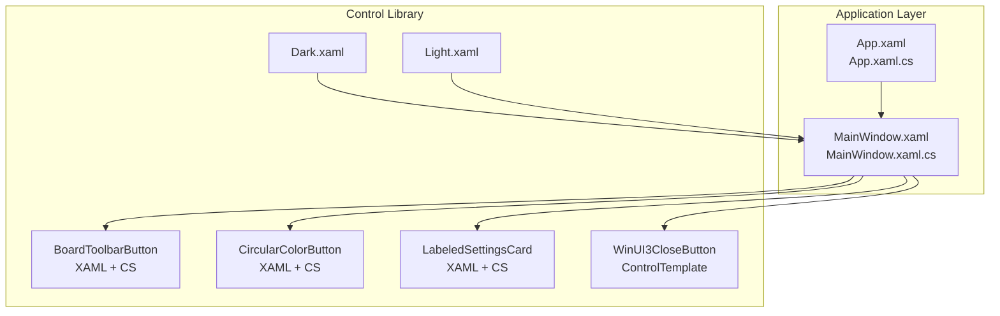
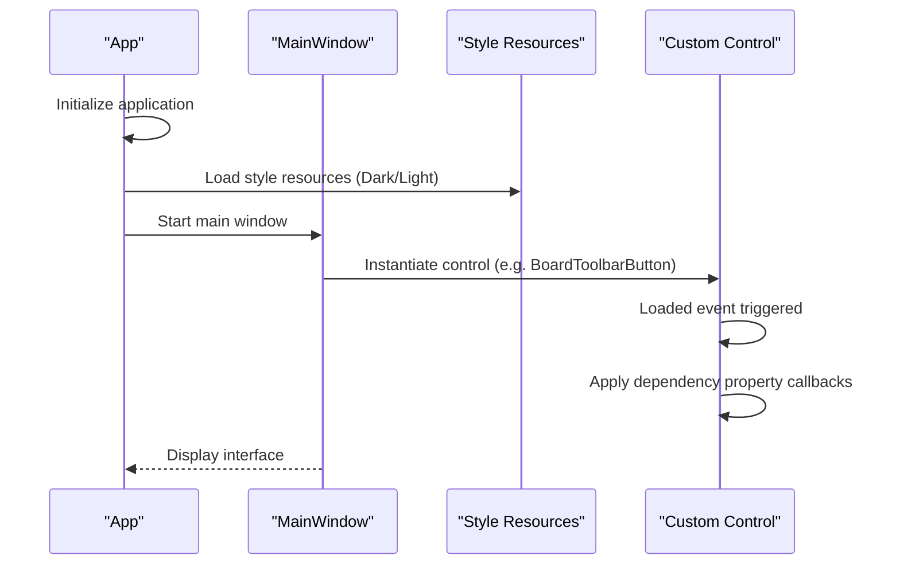
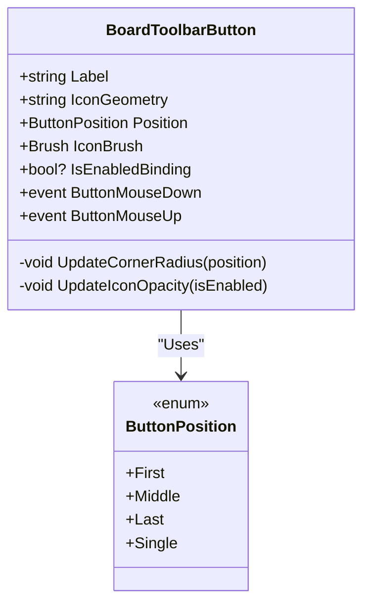
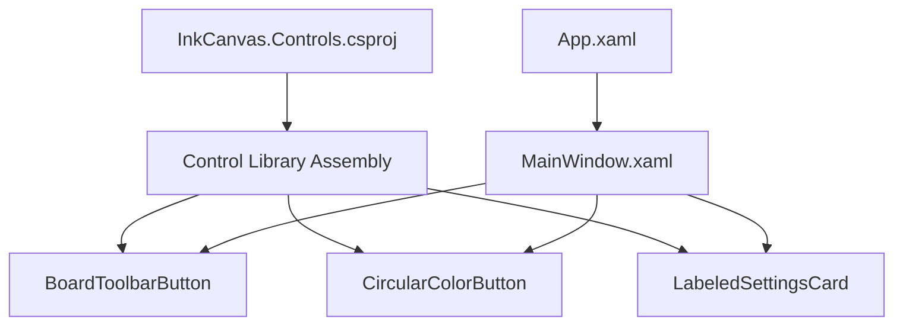

# WPF Control Basics

## Introduction
This document is intended for readers who want to systematically learn WPF control development. Combined with the actual control implementations in the repository, it explains the following topics:
- WPF Control Architecture: The differences and applicable scenarios of `FrameworkElement` and `UserControl`
- Dependency Properties: Definition, metadata, callback functions, and property change notifications
- Control Templates and Style System: Definition and application of `ControlTemplate`, `DataTemplate`, and `Style`
- Event Handling Mechanism: Routed events, command binding, and event bubbling
- Control Lifecycle: Initialization, layout, and rendering processes
- Practical Examples: Implementation paths from simple custom buttons to complex composite controls

## Project Structure
This repository contains a WPF application and a set of reusable custom control libraries. The control library is located in `InkCanvas.Controls`, and the application entry point is in `Ink Canvas`.

## Core Components
This section focuses on three typical controls that demonstrate key usages of dependency properties, event handling, templates, and styles.

- BoardToolbarButton: Multiple dependency properties drive appearance and behavior, event forwarding, and dynamic calculation of position-related corner radii and borders.
- CircularColorButton: Dependency properties like color, size, and selected state are linked to UI sub-elements, and properties are applied uniformly in the `Loaded` stage.
- LabeledSettingsCard: Combines modern controls (`SettingsCard`/`ToggleSwitch`), using dependency properties and bindings to control icons, titles, switch states, and visibility.

## Architecture Overview
The diagram below shows the relationship between application startup, resource loading, and control instantiation, as well as how the control library is assembled with the application.

## Detailed Component Analysis

### BoardToolbarButton Component Analysis
`BoardToolbarButton` is a typical `UserControl` containing internal sub-elements like `Border`, `Image`, `TextBlock`, etc., with its appearance and interactions driven by multiple dependency properties.

- Dependency Property Points
  - `Label`: String label text; updates the internal `TextBlock` text when changed.
  - `IconGeometry`: Geometric shape string; parsed and assigned to the internal `GeometryDrawing` after changes.
  - `Position`: Enum type; decides the `Border` corner radius and border thickness.
  - `IconBrush`: Icon brush; sets `GeometryDrawing.Brush` directly.
  - `IsEnabledBinding`: Three-state enabled status; affects both `IsEnabled` and icon opacity.
- Event Handling
  - Forwards the underlying `Border` mouse events upwards as custom events, allowing host windows to subscribe.
- Lifecycle
  - In `Loaded`, calculates the corner radius and border according to the initial `Position`; performs geometric parsing if an initial `IconGeometry` exists.

## Dependency Analysis
- Control Library and Application
  - The control library project file declares `UseWPF=true` and targets `net6.0-windows` to ensure compilation on the WPF platform.
  - The application references `UserControl` in the control library via XAML, forming a "Library-Application" assembly relationship.
- Control Internal Dependencies
  - `BoardToolbarButton` and `CircularColorButton` directly manipulate child elements through dependency property callbacks, embodying the "property-driven UI" design.
  - `LabeledSettingsCard` decouples "data-view-interaction" through binding and event forwarding.

## Performance Considerations
- Avoid frequently creating objects (like `Brush`, `Geometry`) in dependency property callbacks; prioritize reuse or lazy creation.
- Apply properties in batches in `Loaded` or property callbacks to reduce multiple layout/rendering passes.
- For complex geometric drawing, try to use vector resources rather than frequently parsing strings.
- Reasonably use templates and resource reuse to avoid repeatedly defining the same style.

## Troubleshooting Guide
- Dependency Properties Not Working
  - Check whether dependency properties are registered correctly and callback functions are provided.
  - Confirm that property names match the template/binding.
- Events Not Firing
  - Confirm whether the event forwarding logic is correct; routed events must use `RoutedEventArgs` or corresponding parameter types.
- Style Not Taking Effect
  - Check the merging order of resource dictionaries and key name consistency.
  - Confirm whether references to template parts in control templates are correct.

## Conclusion
Through in-depth analysis of the three typical controls in the repository, key practices of WPF control development can be summarized:
- Use dependency properties to drive UI updates, cooperating with callback functions to achieve fine-grained control.
- Combine existing controls through `UserControl` to improve usability and maintainability.
- Utilize `ControlTemplate` and style resources to achieve themeability and a consistent visual language.
- Handle control lifecycles and event flows correctly to ensure interactive experience and performance.

## Appendix
- Suggested Steps for Basic Control Development
  - Clarify control responsibilities and input/output (dependency properties).
  - Design XAML structure and `ControlTemplate`.
  - Implement dependency property callbacks and event forwarding in code-behind.
  - Uniform themes through styles and resources at the application layer.
  - Write tests or manually verify key interactions and boundary cases.
