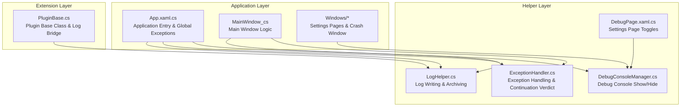
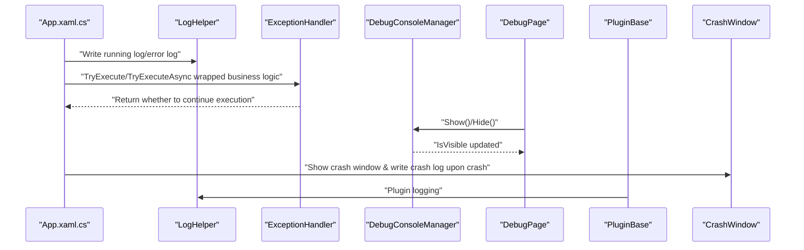
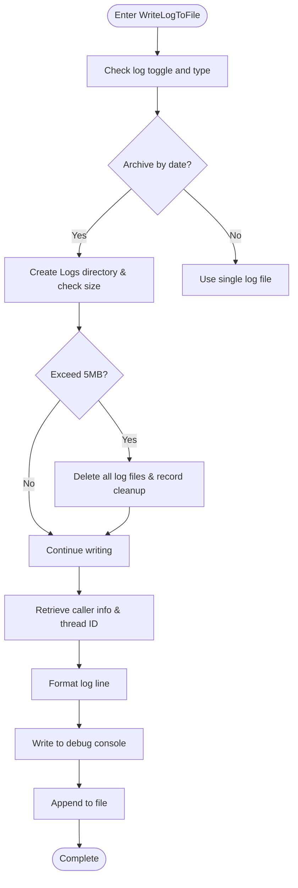
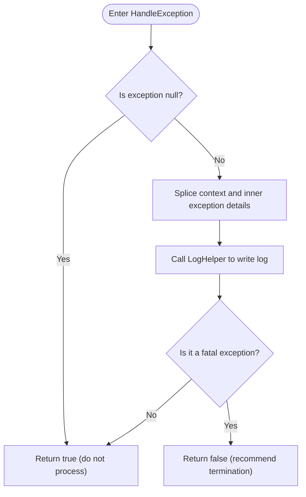
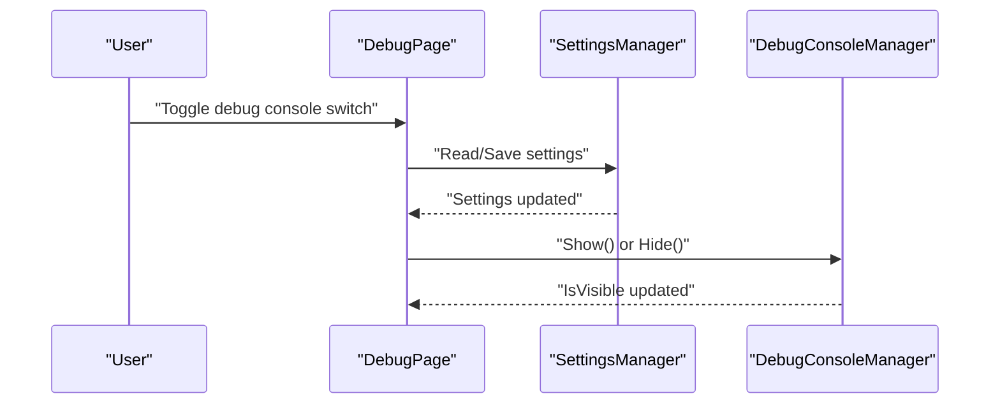
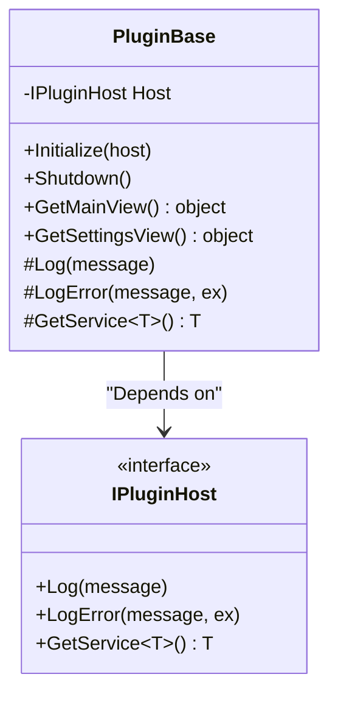
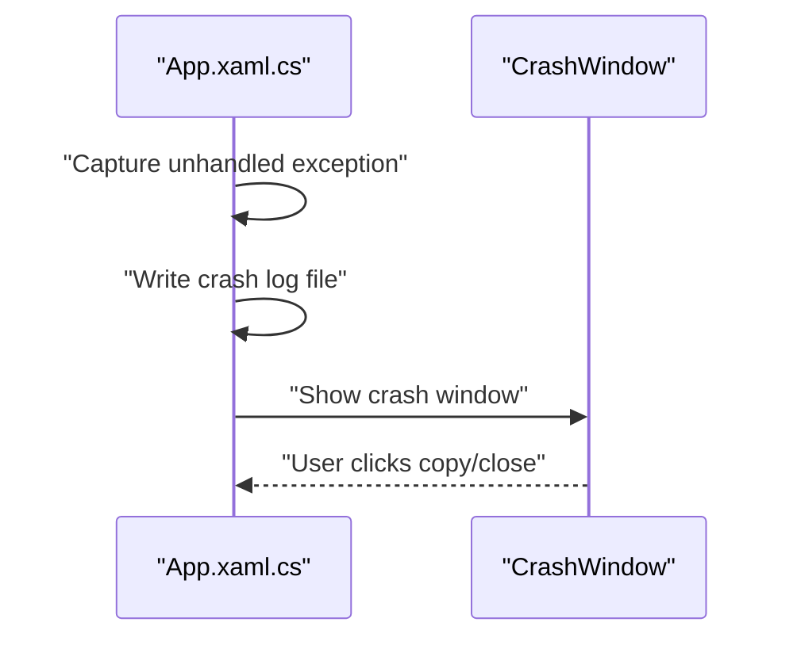
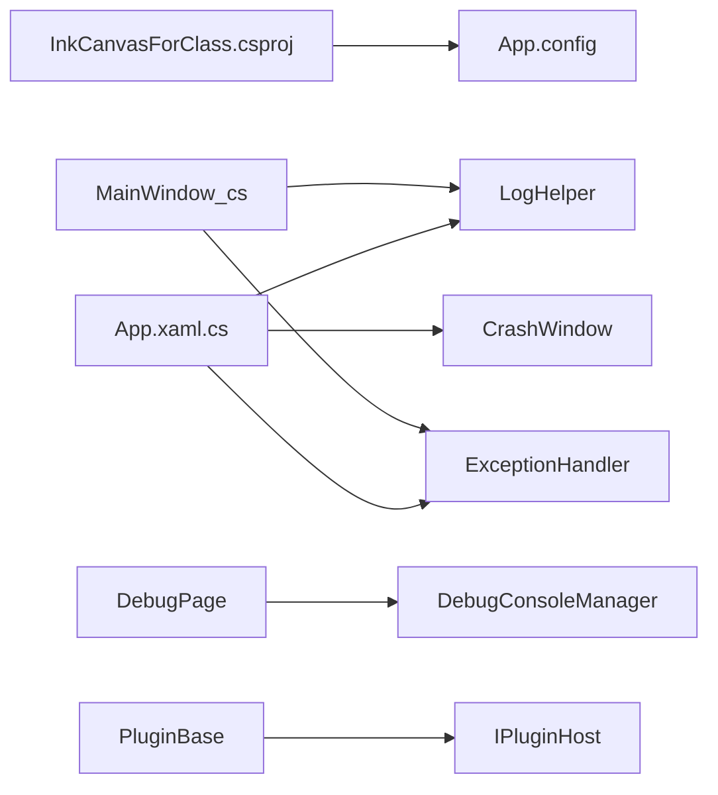

# Debugging and Testing

## Introduction
This guide is intended for developers and test engineers. It centers on the Visual Studio debugger, logging systems, performance analysis, unit and integration testing, exception and crash analysis, code coverage, and specific debugging and testing scenarios. The document combines the actual implementations in the repository (logging, exception handling, debug consoles, plugin frameworks, crash windows, etc.) to provide actionable practical advice and visual illustrations.

## Project Structure
- The application project uses a hybrid WPF/WinForms technology stack, targeting .NET 6 (Windows), and supporting multiple platform identifiers (x86/x64/ARM64).
- Key modules related to debugging and testing are distributed in the following locations:
  - Logging & Exceptions: `Helpers` directory
  - Debug Console: Windows settings page and `Helpers`
  - Plugin Framework: `InkCanvas.PluginSdk`
  - Crash Window and Crash Logs: Windows and App startup logic
  - Build & Debug Configurations: `InkCanvasForClass.csproj` and `App.config`

## Core Components
- Logging System (LogHelper)
  - Supports archiving logs by startup time, log folder size limit cleanup, thread-safe writing, caller information injection, and unified output to the debug console.
  - Log types include Info, Trace, Error, Event, and Warning.
- Exception Handling (ExceptionHandler)
  - Uniformly records exception contexts and internal exceptions; determines whether to continue execution based on exception types; provides synchronous/asynchronous execution wrappers.
- Debug Console (DebugConsoleManager + DebugPage)
  - Dynamically allocates/releases console windows, sets UTF-8 output encoding, customizes titles, and controls display/hiding using settings page toggles.
- Plugin Framework (PluginBase)
  - Plugins can log and retrieve services through host interfaces, making debugging and troubleshooting on the plugin side easier.
- Crash Logs and Windows (App.xaml.cs + CrashWindow.xaml)
  - Generates crash logs with timestamps and process status after capturing global exceptions; the crash window displays and allows copying of this information.

## Architecture Overview
The diagram below shows the overall interaction from the application entry to logs, exceptions, the debug console, and the crash window:

## Component Details

### Logging System (LogHelper)
- Key Capabilities
  - Archives logs by startup time (optional), preventing the log folder from growing too large; automatically cleans up when exceeding the threshold.
  - Thread-safe writing with recursive call protection.
  - Automatically injects timestamps, thread IDs, log types, and caller information.
  - Outputs to both the debug console and files.
- Usage Recommendations
  - Call the unified log entry point in critical business paths, distinguishing log types (Info/Trace/Error/Warning).
  - Use exception overloads in exception scenarios to ensure the complete stack trace is recorded.
  - Enable the "archive by date" function when long-term troubleshooting is required.

### Exception Handling (ExceptionHandler)
- Key Capabilities
  - Uniformly records exception contexts and the internal exception chain.
  - Recommends terminating execution for fatal exceptions (such as out-of-memory or access violations).
  - Provides synchronous and asynchronous execution wrappers, supporting "continue/throw" strategies.
- Usage Recommendations
  - Use `TryExecute`/`TryExecuteAsync` in error-prone paths like UI events, background tasks, and IPC calls.
  - Record logs and prompt users for recoverable errors; exit and report promptly for unrecoverable errors.

### Debug Console (DebugConsoleManager + DebugPage)
- Key Capabilities
  - Dynamically allocates the console window, sets the title and output encoding, and removes the close menu to prevent accidentally closing the process.
  - Provides `Show`/`Hide` interfaces and visibility state tracking.
  - Links settings page switches, reading and persisting settings.
- Usage Recommendations
  - Enable the debug console on the settings page during development to observe real-time logs.
  - Hide by default in release versions to avoid affecting user experience.

### Plugin Framework (PluginBase)
- Key Capabilities
  - Plugins record logs, record errors, and obtain services through host interfaces, facilitating unified problem location.
- Usage Recommendations
  - Record logs at key nodes like plugin initialization, UI interaction, and external calls.
  - Retrieve services provided by the host via `GetService` to avoid hardcoded coupling.

### Crash Logs and Windows (App.xaml.cs + CrashWindow.xaml)
- Key Capabilities
  - Writes to a crash log after capturing global exceptions, containing timestamps, process PIDs, and state information like memory/processor time/running duration.
  - The crash window displays the log content, supporting copying and closing.
- Usage Recommendations
  - When users report crashes, prioritize checking the crash log files, collecting and attaching them to the issue report.
  - Copy the full information from the crash window for fast reproduction and location.

## Dependency Analysis
- Project and Runtime
  - `InkCanvasForClass.csproj` defines the target framework, platform identifiers, debug symbol types, package references, and build targets.
  - `App.config` specifies the runtime version, ensuring compatibility.
- Component Coupling
  - Business logic in `App.xaml.cs` and `MainWindow_cs` widely depends on `LogHelper` and `ExceptionHandler`.
  - `DebugPage` and `DebugConsoleManager` link via settings, forming a UI console toggle.
  - `PluginBase` communicates with the host through `IPluginHost` to avoid direct dependencies on specific implementations.

## Performance Considerations
- Log Overhead Control
  - Archiving logs and size cleanups avoid disk bloat; thread-safe writing uses mutual exclusion flags to reduce contention.
- Debug Console
  - The console is enabled only during development to avoid putting an extra burden on UI responsiveness.
- Crash Logs
  - Writing critical system states (memory, CPU time, running duration) during a crash helps pinpoint performance bottlenecks.

## Troubleshooting Guide
- Breakpoints and Conditional Breakpoints
  - Set conditional breakpoints in log writing paths (e.g., `LogHelper.WriteLogToFile`) to filter specific log types or callers.
  - Set breakpoints in exception handling paths (`ExceptionHandler.TryExecute`/`TryExecuteAsync`) to observe exception propagation and continuation strategies.
- Smart Watch
  - Add common expressions in the debugger watch window: current thread ID, caller info, log toggle state.
- Log Levels and Outputs
  - Set log types to Error/Warning to quickly locate issues; temporarily elevate to Trace when needed.
- Crash Analysis
  - Collect crash log files, combining stack traces with system state fields for analysis.
  - Copy full information in the crash window and attach it to issue reports.

## Conclusion
This project provides complete logging, exception handling, and debug console mechanisms. Combined with the crash window and plugin framework, it effectively supports development, debugging, and problem location. It is recommended to make full use of log types, conditional breakpoints, and smart watches in daily development, and verify using crash logs and plugin logs in the testing phase.

## Appendix

### Unit Testing Framework Selection and Configuration
- The repository contains test-related artifacts and ignore rules for MSTest, NUnit, xUnit, Chutzpah, BenchmarkDotNet, coverage tools, etc.
- Recommendations
  - Select a framework consistent with the team (e.g., MSTest/NUnit/xUnit), and organize test cases in an independent test project.
  - Keep the repository clean by using ignore rules for test results and coverage files in `.gitignore`.
  - Write unit tests for critical modules (like logging, exception handling, and plugin base classes) to cover normal and exceptional branches.

### Integration Testing and End-to-End Testing
- Strategy Recommendations
  - Use UI automation tools (like WinAppDriver) to perform end-to-end verification for critical UI scenarios (e.g., plugin page loading, settings page switches).
  - Integrate test steps into CI, evaluating quality using crash logs and coverage reports.
  - Automate validation of plugin loading and log output to ensure plugin-side issues are discovered promptly.

### Code Coverage and Quality Metrics
- Coverage Tools
  - The repository contains artifacts and ignore rules for tools like DotCover, AxoCover, Coverlet, and VS coverage.
- Recommendations
  - Generate coverage reports locally and in CI, focusing on logging, exception handling, and plugin base class paths.
  - Incorporate coverage thresholds into quality gates to continuously improve test coverage.

### Specific Debugging Scenarios and Test Cases

- Plugin Debugging
  - Set breakpoints at plugin initialization and UI interactions, combining plugin logs (`PluginBase.Log`/`LogError`) to locate issues.
  - Use conditional breakpoints to filter specific plugins or callers.
  - Write unit tests to verify plugin service retrieval and log output.

- UI Testing
  - Verify debug console toggles and plugin list loading in the settings page (`DebugPage`) and plugin page (`PluginPage`) scenarios.
  - Observe UI responsiveness and log outputs using conditional breakpoints and smart watches.

- Performance Benchmark Testing
  - Use BenchmarkDotNet to perform benchmark tests on critical algorithms (like log writing and exception handling wrappers).
  - Compare performance differences under different platforms (x86/x64/ARM64) and configurations (Debug/Release).

Source of Chapter
