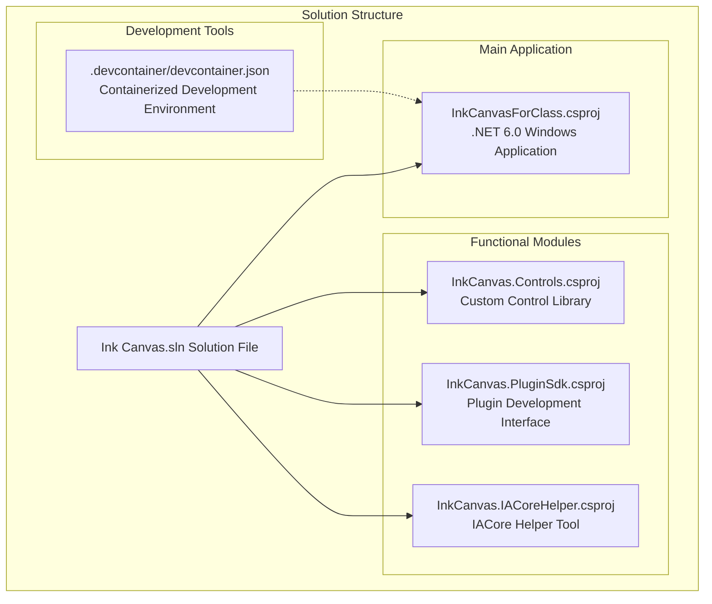
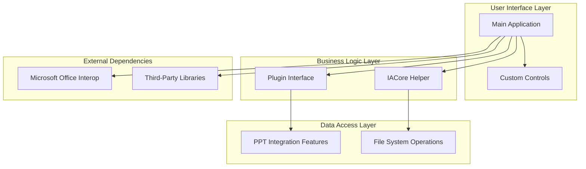
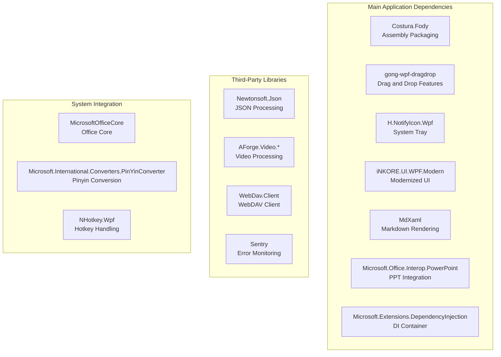

# Development Environment Setup

## Introduction

InkCanvasForClass is a desktop application based on WPF technology, specifically designed for classroom teaching. The project is developed using .NET 6.0, supports the Windows platform, and features rich teaching aids, including handwriting input, whiteboard features, PPT integration, and more.

This guide will introduce in detail how to set up the development environment, including the installation and configuration of Visual Studio 2022, installation and verification of the .NET 6.0 SDK, configuration of necessary development tools, and the complete build process of the project.

## Project Structure

The project adopts a multi-project solution architecture, containing the main application and multiple functional modules:



## Core Components

### Main Application (InkCanvasForClass)

The main application is the entry point of the entire system, built using WPF technology, and features the following characteristics:

- **Target Framework**: .NET 6.0 Windows 10.0.19041.0
- **Output Type**: WinExe (Windows Executable)
- **Platform Support**: x86, x64, ARM64
- **Language Version**: C# 10
- **WPF Support**: Enabled Windows markup

### Functional Modules

#### Custom Control Library (InkCanvas.Controls)
- Provides modern UI controls
- Supports `iNKORE.UI.WPF` and `iNKORE.UI.WPF.Modern` libraries
- Serves as the core UI component of the main application

#### Plugin Development Interface (InkCanvas.PluginSdk)
- Defines standard interfaces for plugin development
- Supports a plugin architecture for function extensions

#### IACore Helper Tool (InkCanvas.IACoreHelper)
- Based on .NET Framework 4.7.2
- Provides IACore-related helper functions
- Works collaboratively with the main application

## Architecture Overview

The project is designed with a layered architecture, with clear responsibilities for each component:



## Detailed Component Analysis

### Development Environment Configuration

#### Visual Studio 2022 Installation and Configuration

To successfully develop this project, the following components need to be installed:

**Required Workloads:**
- .NET desktop development
- Mobile development with C#
- Cross-platform development with .NET

**Required Individual Components:**
- .NET 6.0 Runtime
- .NET 6.0 SDK
- WPF Toolkit
- NuGet Package Manager
- Git Client

#### .NET 6.0 SDK Installation and Verification

**Installation Steps:**
1. Visit the [.NET 6.0 Download Page](https://dotnet.microsoft.com/en-us/download/dotnet/6.0)
2. Download the .NET 6.0 SDK for Windows
3. Run the installer and complete the installation
4. Verify the installation results

**Verification Method:**
```powershell
dotnet --info
```

**Expected Output Includes:**
- .NET SDK version 6.0.x
- .NET Runtime version 6.0.x
- Target frameworks 6.0.0 and above

#### Development Tools Configuration

**WPF Toolkit:**
- The WPF Toolkit in Visual Studio 2022 is already included in the ".NET desktop development" workload
- Supports XAML designer and live preview

**NuGet Package Manager:**
- Built into Visual Studio 2022
- Supports package restore and version management
- Automatically handles project dependency relationships

**Git Client:**
- Can be installed from Visual Studio
- Or install Git for Windows separately
- Supports version control and collaborative development

### Project Cloning and Building

#### Clone the Project

```bash
git clone https://github.com/InkCanvasForClass/community.git
cd community
```

#### Dependency Installation

The project uses package lock files to ensure dependency consistency:

**Automatic Package Restore:**
- Visual Studio 2022 automatically performs package restore
- Or use the command line: `dotnet restore`

**Manual Package Restore:**
```powershell
dotnet restore
```

#### First Compilation

**Using Visual Studio:**
1. Open the `Ink Canvas.sln` solution file
2. Select the build configuration (Debug/Release)
3. Select the target platform (Any CPU/x86/x64/ARM64)
4. Click "Build Solution"

**Using Command Line:**
```powershell
dotnet build "Ink Canvas.sln"
```

### Debugging Environment Configuration

#### Startup Project Settings

**Main Application Settings:**
- Startup Project: InkCanvasForClass
- Start Action: Start external program
- External program path: `bin\Debug\net6.0-windows10.0.19041.0\InkCanvasForClass.exe`

**Debugger Parameters:**
- Working directory: `bin\Debug\net6.0-windows10.0.19041.0`
- Environment variables: Configure as needed

#### Debugging Configuration

**Breakpoint Settings:**
- Set breakpoints in the main window load events
- Set breakpoints in PPT integration features
- Set breakpoints in plugin loading processes

**Debugging Tips:**
- Use the Immediate Window to monitor variables
- Use the Call Stack to view the execution flow
- Use the Output Window to view log information

### Containerized Development Environment

#### Devcontainer Configuration

The project provides a complete containerized development environment configuration:

```json
{
  "image": "mcr.microsoft.com/devcontainers/dotnet",
  "postCreateCommand": "dotnet restore",
  "customizations": {
    "vscode": {
      "extensions": [
        "ms-dotnettools.csdevkit",
        "ms-dotnettools.csharp"
      ]
    }
  }
}
```

**Container Environment Features:**
- Based on the official .NET development container image
- Pre-installed C# development tools
- Automatic package restore execution
- Supports VS Code remote development

**Usage Steps:**
1. Install VS Code and the "Remote - Containers" extension
2. Open the project folder
3. Use the command palette to select "Remote-Containers: Open Folder in Container..."
4. Wait for the container build to complete

## Dependency Analysis

### NuGet Package Dependencies

The project uses package lock files to ensure consistency and repeatability of dependencies:



## Performance Considerations

### Compilation Optimization

**Build Configurations:**
- Debug configuration uses embedded debugging symbols
- Release configuration optimizes code size and performance
- Supports multi-target platform compilation

**Dependency Optimization:**
- Uses package lock files to ensure dependency consistency
- Enables assembly merging to reduce the number of deployment files
- Optimizes resource file handling

### Runtime Performance

**Memory Management:**
- Reasonably use the garbage collection mechanism
- Release unmanaged resources in a timely manner
- Optimize large object allocations

**UI Responsiveness:**
- Process time-consuming operations asynchronously
- Use background threads to handle complex calculations
- Avoid blocking the UI thread

## Troubleshooting Guide

### Common Environment Issues

#### NuGet Package Restore Failed

**Symptoms:**
- The build prompts that packages cannot be found
- The package restore process reports an error

**Solutions:**
1. Clear the NuGet cache:
```powershell
dotnet nuget locals all --clear
```

2. Delete the `packages.lock.json` file
3. Re-run package restore:
```powershell
dotnet restore
```

4. Check network connection and proxy settings

#### SDK Version Mismatch

**Symptoms:**
- Compilation prompts that the SDK version does not match
- Visual Studio displays SDK errors

**Solutions:**
1. Verify the .NET SDK version:
```powershell
dotnet --list-sdks
```

2. Install the correct SDK version
3. Update Visual Studio 2022
4. Restart the development environment

#### PPT Integration Issues

**Symptoms:**
- PPT integration functions show abnormalities at startup
- PowerPoint fails to start normally

**Solutions:**
1. Ensure Microsoft Office 365 is installed
2. Check PowerPoint's compatibility settings
3. Run the application and PowerPoint under the same permission privilege level
4. Refer to PPT-related instructions in `README.md`

#### Icon Display Issues

**Symptoms:**
- Icons display as boxes on versions below Windows 10

**Solutions:**
1. Download and install SegoeFonts
2. Install the `SegMDL2.ttf` font file
3. Restart the system for changes to take effect

#### Compilation Conflicts

**Symptoms:**
- Compilation reports an error indicating that a process is holding a file

**Solutions:**
1. Clean the project according to building specifications
2. Kill all `inkcanvas` processes
3. Delete all `bin` and `obj` directories
4. Re-compile

## Conclusion

The InkCanvasForClass project provides a complete development environment setup guide, covering various aspects from basic environment configuration to advanced debugging tips. By following this guide, developers can quickly establish a stable development environment and successfully build and debug the project.

**Summary of Key Points:**
- Ensure Visual Studio 2022 and .NET 6.0 SDK are installed
- Configure necessary development tools and components
- Understand project architecture and dependencies
- Master the usage of containerized development environments
- Keep troubleshooting solutions prepared

The project uses modern development practices, including containerized development, package lock management, and multi-target platform support, providing a flexible and reliable development experience. With proper environment configuration and best practices, developers can efficiently perform feature development and maintenance work.
