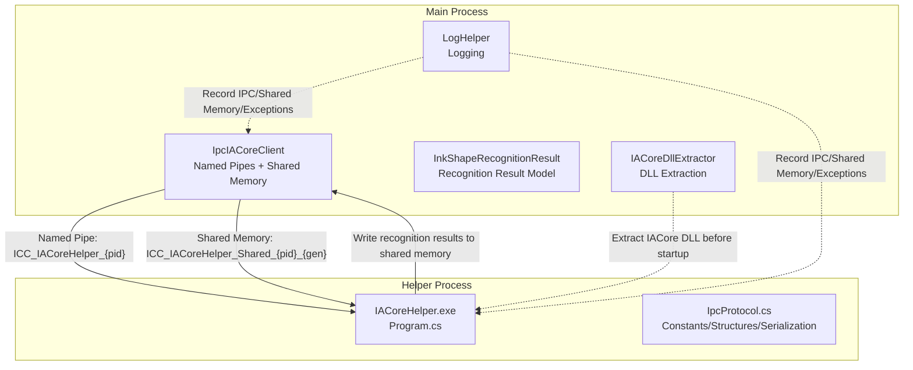
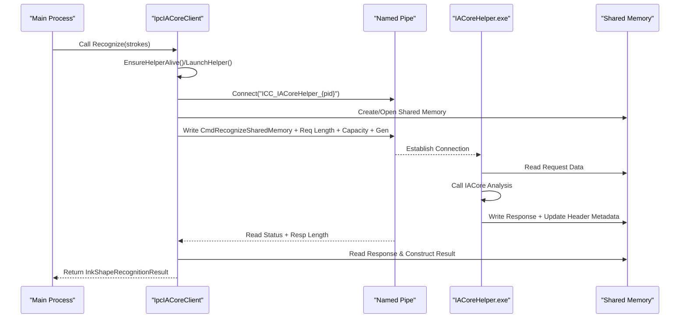
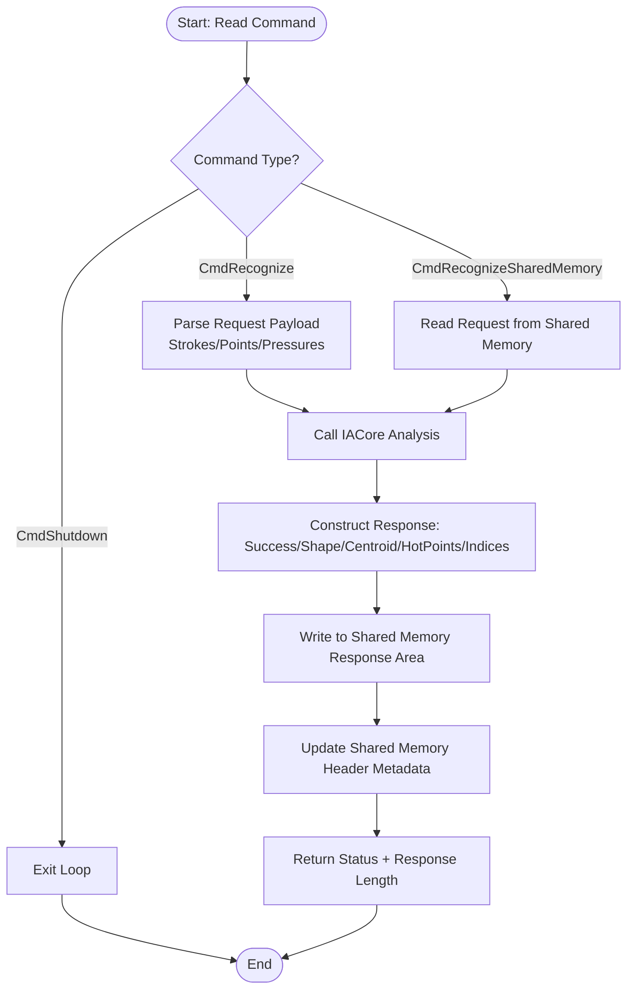
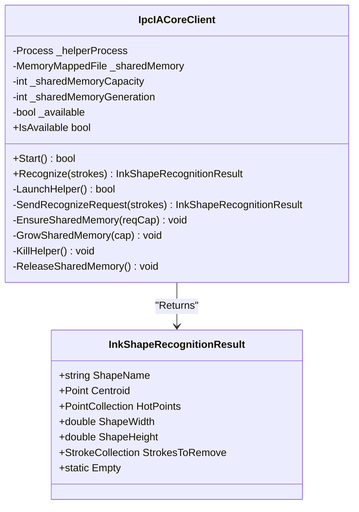
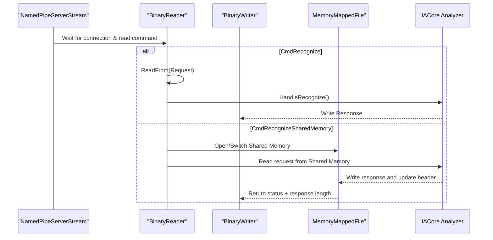
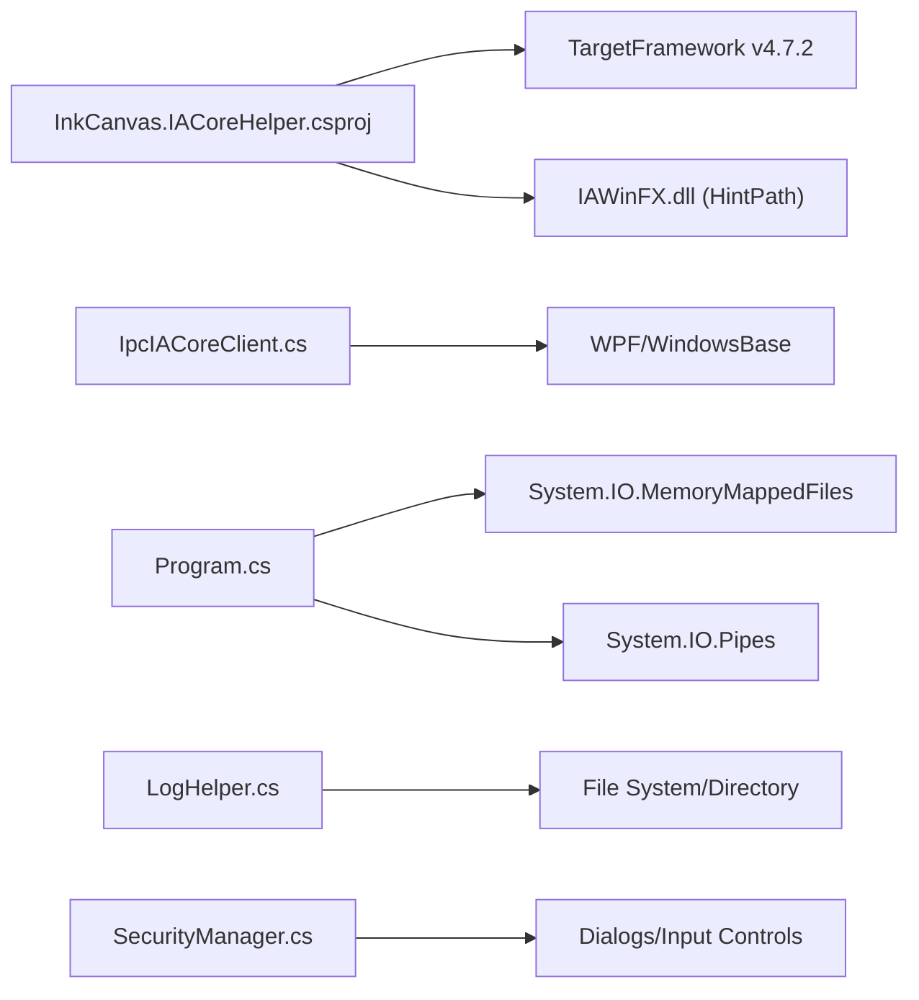

# IACore Helper Program Development

## Introduction
This guide is intended for developers who need to integrate the shape recognition capabilities of IACore. It systematically explains the IPC communication protocol design and implementation, message formatting and serialization, and error handling strategies of the IACore helper program. It covers inter-process communication security considerations (identity binding, minimal privilege, shared memory boundaries); provides a complete integration workflow (process startup, connection establishment, session management); explains helper program lifecycle management (startup parameters, running status monitoring, exception recovery); introduces data transmission optimization (shared memory reuse, adaptive capacity, header verification); and suggests usage for debugging and monitoring tools as well as troubleshooting methods for common issues.

## Project Structure
The IACore helper program consists of two parts:
- Client Side (Main Process): Responsible for starting the helper process, sending requests via named pipes, and sending/receiving data via shared memory.
- Server Side (Helper Process): Listens to named pipes, parses requests, calls IACore for recognition, writes results back to shared memory, and notifies the client via header metadata.

## Core Components
- Named Pipes and Shared Memory Protocol
  - Pipe Name Format: `ICC_IACoreHelper_{ParentProcessPID}`
  - Shared Memory Naming Format: `ICC_IACoreHelper_Shared_{ParentProcessPID}_{Generation}`
  - Protocol Version: `v2`
  - Request Timeout: `5000ms`
  - Shared Memory Header Size: `24 bytes`
  - Default/Max Shared Memory Capacity: `4MiB ~ 32MiB`
- Serialization and Message Formats
  - Request: Recognition command + stroke segment (number of strokes, points per stroke, point coordinates and pressure)
  - Response: Boolean success flag + shape name + centroid + bounding box dimensions + hot point coordinates + involved stroke indices
- Client and Server Responsibilities
  - Client: Starts/maintains helper processes, handles named pipe communication, reads/writes shared memory, performs adaptive capacity sizing, and handles exception recovery.
  - Server: Receives commands, parses requests, invokes IACore for analysis, writes responses to shared memory, and updates header metadata.

## Architecture Overview
The diagram below shows the interaction sequence between the main process and the helper process, covering startup, handshakes, request-responses, and shared memory reads/writes.

## Component Details

### IPC Protocol and Message Formats
- Command Set
  - Recognition Request: `CmdRecognize` (byte value `0x01`)
  - Shared Memory Recognition: `CmdRecognizeSharedMemory` (byte value `0x02`)
  - Shutdown Instruction: `CmdShutdown` (byte value `0xFF`)
- Request Payload (Shared Memory Mode)
  - Header: request length, response offset, response length, status
  - Data Area: number of strokes, points per stroke, point coordinates (X, Y, Pressure)
- Response Payload
  - Success flag, shape name, centroid, bounding box width/height, hot point coordinate pairs, involved stroke indices
- Error Codes
  - Normal: `StatusOk`
  - Error: `StatusError`
  - Response Too Large: `StatusResponseTooLarge`

### Client Implementation (IpcIACoreClient)
- Startup and Availability
  - Checks if the helper process executable exists.
  - Starts the helper process and passes the current process PID.
  - Detects named pipe readiness through polling.
- Shared Memory Management
  - Adaptive Capacity: Doubles the capacity when the request is too large, switching generations and recreating the shared memory if necessary.
  - Header Verification: Verifies magic number, version, status, and length consistency checks.
- Request-Response
  - Writes the request to shared memory and sends the shared memory recognition command via named pipes.
  - Reads the response and constructs a unified result model.
- Exception Recovery
  - Cleans up shared memory and restarts the helper process when pipe exceptions occur or the helper process exits.

### Server Implementation (IACoreHelper.exe)
- Process Entry and Parameters
  - Receives the parent process PID, constructing named pipes and shared memory names.
- Named Pipe Loop
  - Waits for connections, reads commands, and dispatches processing.
  - Supports `CmdRecognize` (direct pipe payload read) and `CmdRecognizeSharedMemory` (shared memory read).
- Shared Memory Recognition
  - Parses requests, invokes IACore for analysis, writes responses, and updates header metadata.
  - Feeds back status for "Response Too Large," triggering a capacity expansion and retry on the client side.
- Exception Handling
  - Maps missing files, I/O exceptions, and unsupported exceptions into error codes.

### Security and Permissions
- Process Boundaries and Identity Binding
  - Named pipes and shared memory names contain the parent process PID, ensuring that only parent-child processes can communicate.
- Minimal Privilege Principle
  - Starts the helper process with a hidden window to avoid UI interference.
  - Creates shared memory only when necessary, releasing it promptly.
- Data Integrity
  - The shared memory header contains magic numbers, version, and status fields, verified by the client before reading.
- No Plaintext Sensitive Data
  - This module does not involve exchange of sensitive data like passwords or tokens; security strategies are handled by other modules (such as `SecurityManager`).

### Lifecycle Management
- Startup Parameters
  - Passes the parent process PID, used to name the named pipe and shared memory.
- Running Status Monitoring
  - The client polls to detect named pipe reachability.
  - Listens to helper process `Exited` events to automatically reclaim resources.
- Exception Recovery
  - Destroys and recreates helper processes and shared memory during pipe exceptions or when responses are too large.
  - Timeouts or error codes trigger a fallback to an empty result.

### Data Transmission Optimization
- Shared Memory Reuse and Adaptive Capacity
  - The client estimates capacity based on request size, doubling the capacity and switching generations if insufficient.
  - The server updates header metadata after writing the response area, avoiding extra roundtrips.
- Header Verification and Boundary Protection
  - Magic numbers, version, status, offset, and length fields ensure data consistency.
- Compact Serialization
  - Writes floats and integers continuously to reduce marshalling overhead.

### Integration Process (From Zero to One)
- Preparation Phase
  - Ensure the IACore DLL is extracted to the application directory (`IACoreDllExtractor`).
  - Verify that the helper process executable exists before startup.
- Startup Phase
  - The client starts the helper process and passes the current PID.
  - The client polls and waits for the named pipe to be ready.
- Session Phase
  - The client writes requests to shared memory and sends the shared memory recognition command via named pipes.
  - The server parses requests, invokes IACore for analysis, writes responses, and updates headers.
  - The client reads responses and constructs a unified result object.
- Termination Phase
  - The client can explicitly send the shutdown command or exit directly.
  - The client is responsible for releasing shared memory and process handles.

## Dependency Analysis
- Project Dependencies
  - `IACoreHelper.csproj` specifies `.NET Framework 4.7.2` with a target platform of `x86`.
  - References `IAWinFX.dll` (located in the resources directory), non-privately copied, and must be distributed with the package.
- Runtime Dependencies
  - The main process `IpcIACoreClient` depends on `WPF`/`WindowsBase`/`PresentationCore`.
  - The helper process `Program` depends on `System.IO.MemoryMappedFiles`/`System.IO.Pipes`.
- Logs and Security
  - `LogHelper` provides unified log output and archiving.
  - `SecurityManager` provides security capabilities like passwords/TOTP (complementary to IPC).

## Performance Considerations
- Transmission Paths
  - The shared memory mode avoids cross-process copying of large objects, significantly reducing marshalling costs.
  - Named pipes only pass metadata (status, length, generation), reducing I/O roundtrips.
- Capacity Strategy
  - Default capacity of `4MiB`, doubled on demand up to `32MiB` to avoid frequent reconstruction.
- Serialization
  - Continuous writing of floats/integers reduces marshalling and boxing overhead.
- Concurrency and Stability
  - The client holds pipe locks to avoid concurrent writing contention.
  - The server processes in a single-connection loop, simplifying synchronization logic.

## Troubleshooting Guide
- Connection Failures
  - Symptoms: `WaitForPipe` timeouts or the helper process exits immediately.
  - Troubleshooting: Verify that the executable exists, the working directory is correct, and the parent process PID is valid.
- Data Loss/Parsing Errors
  - Symptoms: Response is empty or fields are missing.
  - Troubleshooting: Check shared memory header magic numbers/version/status; verify that response offset and length are valid.
- Response Too Large
  - Symptoms: The server returns "Response Too Large," triggering a client capacity expansion and retry.
  - Troubleshooting: Verify default and maximum capacity limits; increase request granularity or reduce stroke count if necessary.
- Performance Bottlenecks
  - Symptoms: Recognition takes too long or CPU usage is high.
  - Troubleshooting: Reduce the number of strokes per request, merge multi-frame inputs, and avoid frequently reconstructing shared memory.
- Logs and Diagnosis
  - Use `LogHelper` to output critical node logs, locating where anomalies occur.

## Conclusion
The IACore helper program implements an efficient and stable cross-process recognition channel through the combination of "Named Pipes + Shared Memory." The client is responsible for lifecycle management and fault tolerance recovery, while the server focuses on recognition calculations and writing data back. Cooperating with strict header verification and adaptive capacity strategies, it can maintain stability and high performance in complex scenarios. It is recommended to continuously observe performance and stability in production environments using logs and monitoring tools.

## Appendix

### Common IPC Examples
- Request-Response (Shared Memory Mode)
  - Client writes to shared memory and sends the command.
  - Server parses requests and writes responses.
- Event Subscription Mechanism
  - This repository does not provide an event subscription interface; if event pushing is needed, you can extend the "event queue" and "notification signals" on top of the existing shared memory.
  - Refer to header fields and shared memory read/write flows.

Source of Chapter
