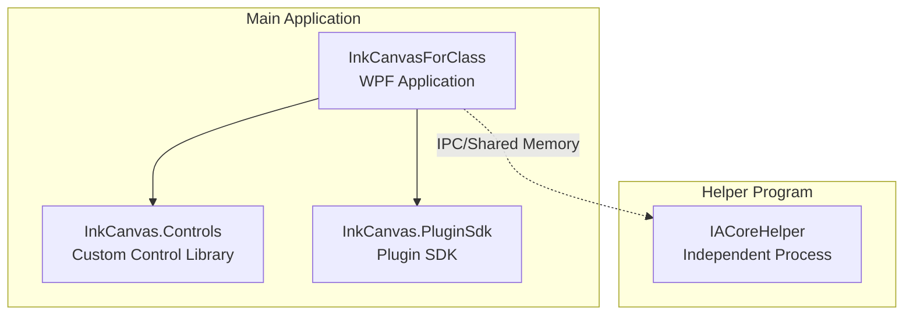
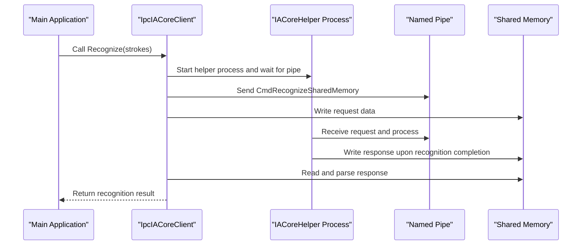
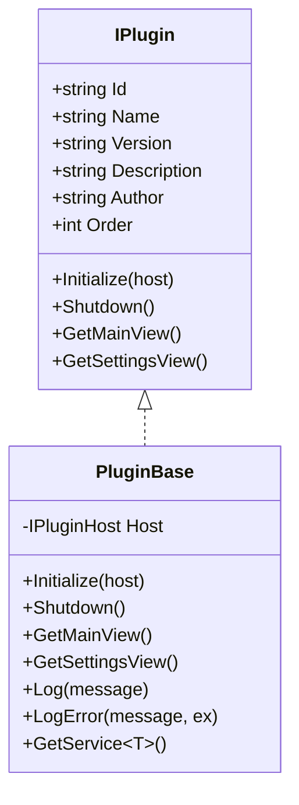
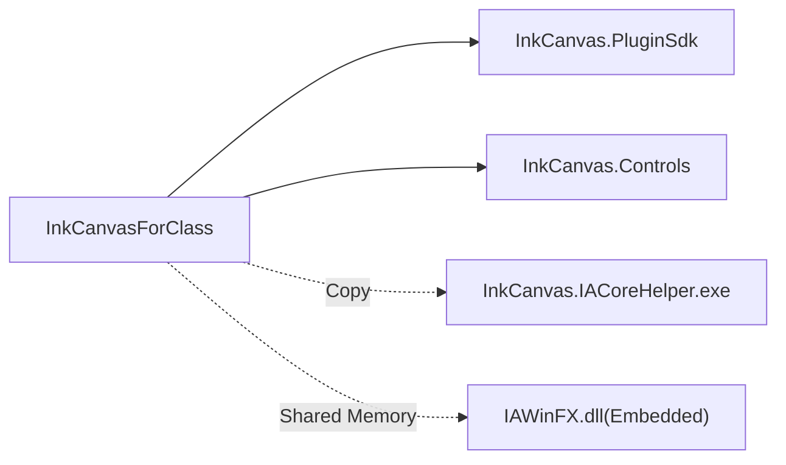
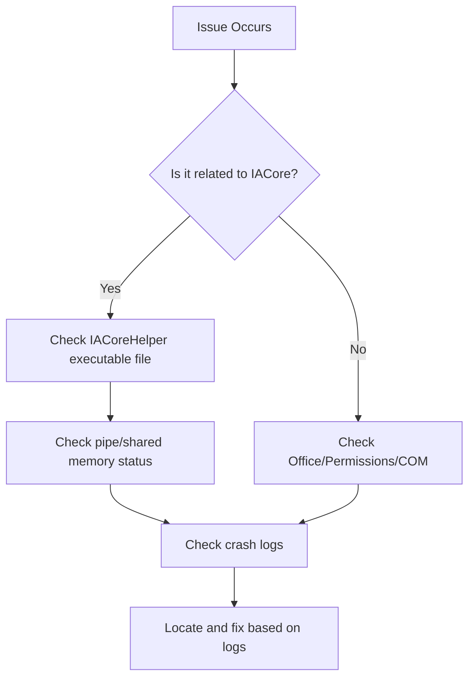

# Developer Guide

## Introduction
This guide is intended for developers of InkCanvasForClass, covering development environment setup, coding standards, plugin development workflows, custom control development, IACore helper program development and integration, debugging and performance analysis, memory leak detection, code contribution processes, Pull Request specifications, and common issues and solutions. The goal is to help you quickly understand and efficiently participate in project development.

## Project Structure
The repository adopts a multi-project solution, built around the `InkCanvasForClass` main application, plugin SDK, custom control library, IACore helper program, and other modules. Core projects and their responsibilities overview:
- `InkCanvasForClass`: WPF main application, carrying UI, business logic, and plugin loading.
- `InkCanvas.PluginSdk`: Plugin interface and base class definitions, unifying plugin lifecycle and service injection.
- `InkCanvas.Controls`: Collection of custom WPF controls, providing reusable UI components.
- `InkCanvas.IACoreHelper`: Independent process helper program, responsible for IPC communication and recognition tasks with IACore.
- `Ink Canvas`: Main application project directory, containing controls, windows, helpers, models, plugins, etc.
- `rules`: Development specifications and rule document index.
- `.devcontainer`: Containerized development environment configuration.

## Core Components
- Plugin Interface and Base Classes: `IPlugin`, `PluginBase`, providing plugin metadata, lifecycle callbacks, and service injection capabilities.
- IACore Helper Program: `IpcIACoreClient` (client), `IpcProtocol` (protocol constants and DTOs), `Program` (server process).
- Main Application: `App.xaml.cs` responsible for application-level exception handling, telemetry, watchdogs, splash screens, etc.

## Architecture Overview
InkCanvasForClass implements high-performance handwritten shape recognition via the independent process `IACoreHelper`. The main process and the helper process communicate via IPC using named pipes and shared memory. The plugin system provides a unified extension point through `PluginSdk`.

## Detailed Component Analysis

### Plugin Development Component Analysis
- `IPlugin`: Defines plugin identification, metadata, and lifecycle callbacks.
- `PluginBase`: Provides default implementations, service injections, and logging wrappers.
- Main Application Plugin Loading: References `InkCanvas.PluginSdk` and scans to load plugins at runtime.

## Dependency Analysis
- The main application depends on the plugin SDK and the custom control library, and copies the `IACoreHelper` executable during the build phase.
- `IACoreHelper` depends on `IAWinFX` DLL and is embedded in the main application resources, communicating with the main process via shared memory.

## Performance Considerations
- IPC Communication: Uses shared memory to carry large payloads of requests/responses, reducing serialization overhead; automatically expands shared memory capacity when responses are too large.
- Process Isolation: The independent `IACoreHelper` process avoids blocking the UI thread, improving stability.
- Startup Optimization: Splash screen and asynchronous initialization strategies lower first-frame latency.
- Resource Management: The main application handles exceptions and crash logs centrally, and the helper program releases resources promptly.

## Troubleshooting Guide
- Startup Failure: Check if .NET 6 runtime is installed and if Office is activated.
- PowerPoint Mode Switch Exception: Check permission privilege level consistency and COM component state.
- IACore Recognition Exception: Verify that the `IACoreHelper` executable exists, the pipe name matches, and the shared memory capacity is sufficient.
- Crashes and Logs: The main application logs crash files, locating exception types and stacks.

## Conclusion
Through clear module division, stable IPC communication, and a robust plugin system, InkCanvasForClass provides excellent extensibility and maintainability. Following the development specifications and processes in this document will enable you to efficiently develop plugins and custom controls, and ensure stable integration with IACore.

## Appendix

### Development Environment Setup
- System Requirements: Windows (supporting WPF), .NET 6.0 SDK.
- IDE: Visual Studio (recommended) or VS Code (Dev Container).
- Dev Container: Use the provided `devcontainer.json` to automatically pull up the .NET environment and install C# extensions.
