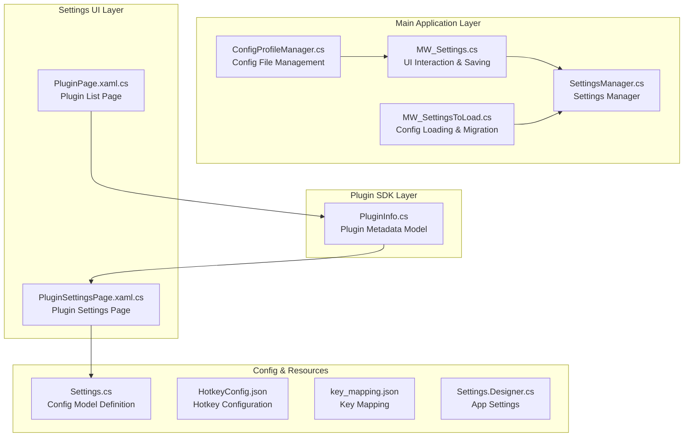
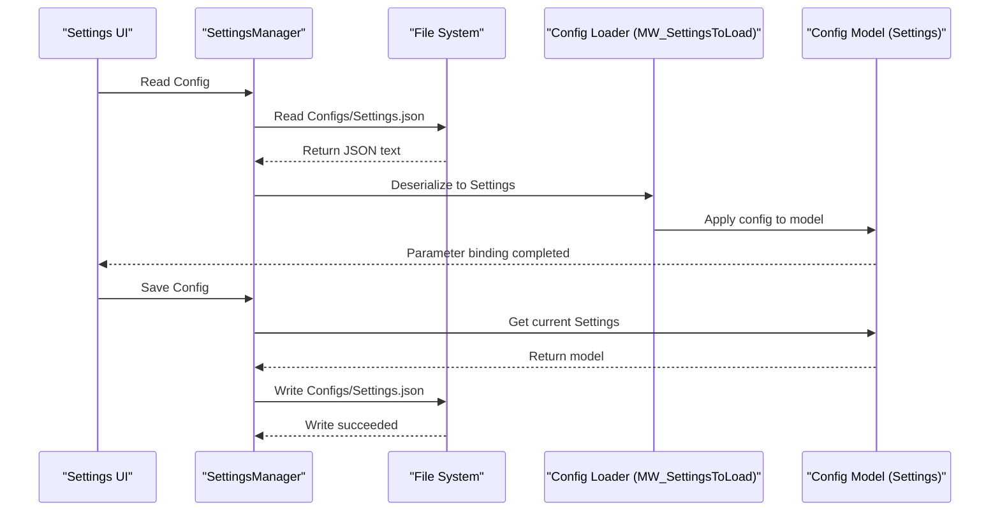
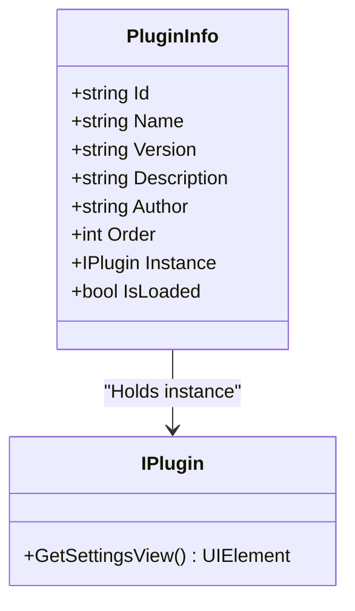
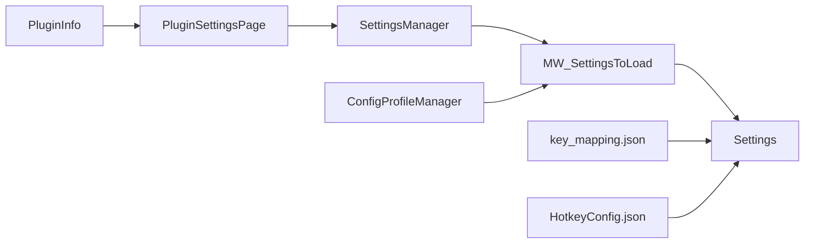

# Plugin Configuration System

## Introduction
This document systematically reviews the Ink Canvas plugin configuration system, focusing on the following goals:
- Explaining the configuration model of the `PluginInfo` class and its role in the plugin lifecycle
- Describing the format and structure of configuration files (mainly JSON), along with parsing and persistence mechanisms
- Listing verification rules for configuration parameters (required fields, data types, and range limits)
- Explaining configuration persistence strategies (differences between user configurations and global configurations, storage locations)
- Providing implementation guidelines for the configuration interface (settings page creation, parameter binding, real-time preview)
- Describing configuration migration and version compatibility (obsolete cleanup, hot reloading, backup and recovery)
- Providing usage examples from simple parameters to complex settings
- Summarizing configuration security considerations (protection of sensitive information, permission controls)

## Project Structure
The plugin configuration system involves multiple layers:
- Plugin SDK Layer: Defines the plugin metadata model
- Main Program Layer: Handles config file loading, parsing, persistence, hot reloading, and migration
- Settings UI Layer: Provides dynamic loading and binding of plugin settings pages
- Helper Tools Layer: Config file management, backup and recovery, process protection

## Core Components
- `PluginInfo`: Plugin metadata model containing fields like plugin identification, name, version, description, author, order, instance, and load status, used to carry plugin registration and runtime status.
- `Settings`: The root class of the configuration model, which manages application configurations centrally through sub-modules like `Startup`, `Appearance`, `Canvas`, `Gesture`, `PowerPointSettings`, `Automation`, `RandSettings`, `ModeSettings`, `InkToShape`, `Advanced`, `Upload`, `Security`, `Notification`, `Toolbar`, etc.
- `ConfigProfileManager`: Provides the ability to save, switch, apply, and delete configuration files, supporting multiple configuration files and hot reloading.
- `SettingsManager`: Provides convenient interfaces for reading and saving configurations, supporting fast access in the settings UI layer.
- `PluginSettingsPage`: Dynamically loads the settings view provided by the plugin, achieving UI integration of plugin configurations.

## Architecture Overview
The configuration system adopts a "Model-Driven + File Persistence + UI Binding" architecture:
- Model Layer: Defines the configuration structure through `Settings` and its sub-modules.
- File Layer: Stores configurations in JSON format, located at `Configs/Settings.json`.
- UI Layer: Implements parameter binding and hot reloading through the load/save logic in `SettingsManager` and `MainWindow`.
- Plugin Layer: Dynamically injects plugin settings views through `PluginInfo` and `PluginSettingsPage`.

## Detailed Component Analysis

### PluginInfo Class Analysis
- Responsibility: Carries plugin metadata and runtime status, facilitating plugin registration, sorting, and instantiation.
- Key Fields:
  - `Id`, `Name`, `Version`, `Description`, `Author`: Plugin metadata
  - `Order`: Plugin sorting
  - `Instance`: Plugin instance (implementing the `IPlugin` interface)
  - `IsLoaded`: Plugin load status
- Dependencies: Cooperates with the plugin manager to retrieve the settings view via `IPlugin` and inject it into the settings page.

## Dependency Analysis
- The plugin layer depends on the `Settings` model and the `IPlugin` interface.
- The settings UI depends on the loading/saving logic of `SettingsManager` and `MainWindow`.
- Configuration file management depends on `ConfigProfileManager` and the file system.
- Key mapping and hotkey configurations are independent of the main configuration, but follow a similar JSON structure.

## Performance Considerations
- JSON Parsing and Serialization: Recommended to execute on background threads to avoid blocking the UI.
- Hot Reloading: `ReloadSettingsFromFile` skips auto-update checks, reducing unnecessary network requests.
- File Writing: Wraps write operations using `ProcessProtectionManager` to reduce failure rates caused by permission issues.

## Troubleshooting Guide
- Configuration File Corrupted: Attempts to recover from a backup when loading fails, falling back to default configurations if it still fails.
- Configuration Items Obsolete: `CleanupObsoleteSettings` automatically cleans up redundant keys and saves the changes.
- Write Failures: Verify directory permissions and disk space, ensuring that the `Configs` directory is writable.

## Conclusion
This plugin configuration system centers around the `Settings` model, combining `ConfigProfileManager` and `SettingsManager` to achieve flexible configuration management, persistence, and hot reloading capabilities. Through `PluginInfo` and `PluginSettingsPage`, the system realizes dynamic injection and UI integration of plugin configurations. Cooperating with obsolete settings cleanup and backup recovery mechanisms, the system maintains high compatibility and stability across version evolutions.

## Appendix
- Key Mapping & Hotkey Configurations: `key_mapping.json` and `HotkeyConfig.json` provide reference structures for key mapping and hotkey definitions.
- App Settings Base Class: `Settings.Designer.cs` provides the basic framework for WPF application settings.
