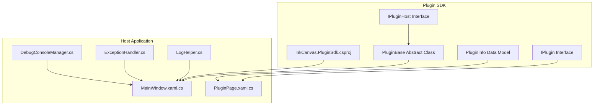
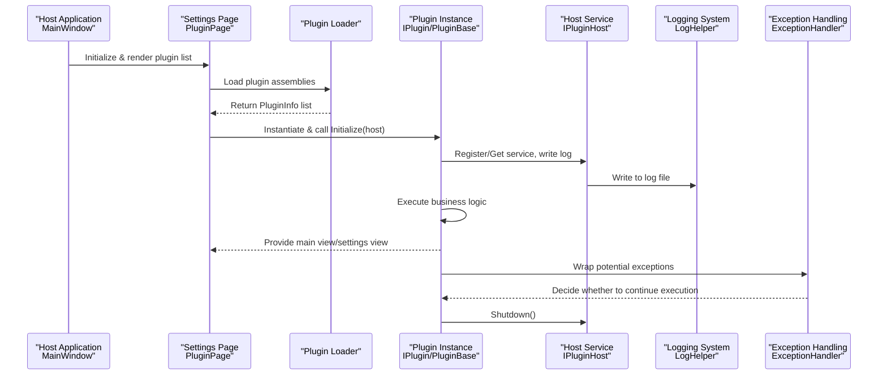
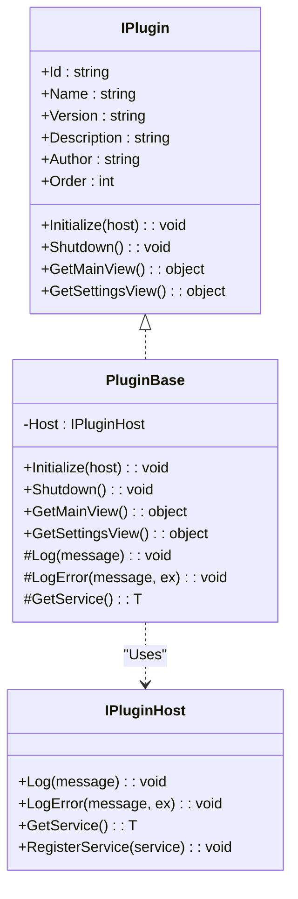
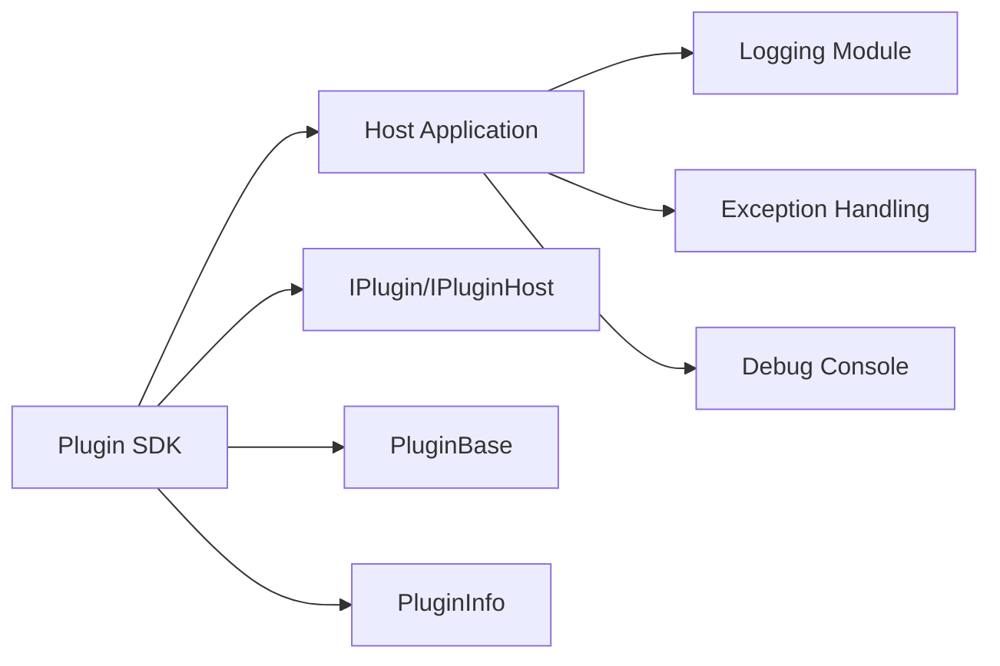

# Plugin Debugging and Testing

## Introduction
This guide is intended for plugin developers and test engineers. It provides a systematic debugging and testing methodology centered around the InkCanvas plugin architecture, covering:
- Debugging Techniques: breakpoint settings, variable monitoring, and call stack analysis
- Unit Testing: test case design, mock objects, and assertion validation
- Integration Testing: plugin-host interactions and end-to-end function validation
- Performance Testing: memory usage, CPU usage, and response times
- Logging: debug output, error tracing, and performance metric collection
- Plugin Isolation Testing: sandboxes and security boundaries
- Common Problem Diagnosis: load failures, runtime errors, and compatibility issues
- Complete Test Examples: from basic functions to complex scenarios

## Project Structure
InkCanvas adopts a multi-project layered organization, where the plugin SDK resides in an independent project and the host application is responsible for loading and managing the plugin lifecycle.

## Core Components
- Plugin Interface `IPlugin`: Defines plugin metadata and lifecycle methods (initialize, shutdown, main view, settings view).
- Plugin Host Interface `IPluginHost`: Provides logging, exception recording, service registration, and retrieval capabilities.
- Plugin Base Class `PluginBase`: Encapsulates common logic for host interactions, logging, and service access.
- Plugin Info Model `PluginInfo`: Carries runtime information like plugin instances and load status.
- Logging & Exception Handling: Unified logging format, recursive protection, exception grading, and recovery strategies.
- Debug Console: Optional Win32 console output for convenient real-time observation.

## Architecture Overview
The diagram below shows the key interaction link of the plugin from loading to running, as well as the roles of logging and exception handling in the process.

## Detailed Component Analysis

### Plugin Interface and Base Class
- `IPlugin`: Declares plugin metadata and lifecycle methods, serving as the contract for plugin-host interactions.
- `PluginBase`: Provides default implementations and common capabilities (logging, service access), so subclasses only need to focus on business implementation.
- `IPluginHost`: Provides a unified entry point for logging, exception recording, and service registration/retrieval for plugins.

## Dependency Analysis
- Decoupling of Plugin SDK and Host Application: Communication occurs through interface contracts to reduce coupling.
- Logging and Exception Handling Module Cohesion: Centralized logging and exception strategies facilitate unified governance.
- Optional Debug Console Access: Does not affect the production environment; enabled only when needed.

## Performance Considerations
- Log Writing Protection: Uses atomic flags to prevent recursive writes, avoiding deadlocks and performance jitters.
- Log Archiving and Cleanup: Archives logs by startup time and limits directory sizes to avoid disk expansion.
- Exception Handling Strategy: Distinguishes between fatal exceptions (such as out-of-memory or access violations) and recoverable exceptions, reducing crash risks.
- Debug Console: Enabled only when needed to avoid extra I/O overhead.

## Troubleshooting Guide
- Load Failures
  - Symptoms: Settings page shows load errors.
  - Troubleshooting: Check log files and exception records to confirm that the plugin assembly version matches the target framework.
- Runtime Errors
  - Symptoms: Exceptions are thrown during plugin initialization or execution.
  - Troubleshooting: Check that the exception handler records the context and internal exceptions, and combine with logs to locate the caller.
- Compatibility Issues
  - Symptoms: Plugin behavior is inconsistent under different systems or WPF versions.
  - Troubleshooting: Check SDK target frameworks and host application configurations to ensure consistent WinForms/WPF component versions.
- Debug Console Not Visible
  - Symptoms: Cannot see console output.
  - Troubleshooting: Confirm that the console is allocated and not accidentally closed; check permissions and system menu disabling logic.

## Conclusion
Through interface contracts, unified logging and exception handling, and an optional debug console, the InkCanvas plugin system provides clear debugging and testing support. Developers are advised to make full use of the logging and exception handling mechanisms during the development phase, and gradually improve unit and integration test coverage by combining settings page loading flows and end-to-end scenarios during the testing phase to ensure plugin stability and performance in the host environment.

## Appendix: Test Example Checklist
The following is a list of test examples that can be directly mapped to the source code to facilitate rapid deployment:
- Unit Test: Plugin base class logging and service access
  - Focus: Whether `Log`/`LogError` calls the host; whether `GetService` returns the expected service.
- Unit Test: Exception handling strategy
  - Focus: Continuation execution conditions and exception bubbling.
- Integration Test: Plugin loading and rendering
  - Focus: Load success/failure branches, UI card generation.
- End-to-End: Plugin lifecycle
  - Focus: Initialization order, resource releases, view provision.
- Performance Test: Log writing and cleanup
  - Focus: Concurrent writing protection, size thresholds, cleanup triggering.
- Debugging Aid: Console output
  - Focus: Window visibility, output encoding, close menu disabling.
