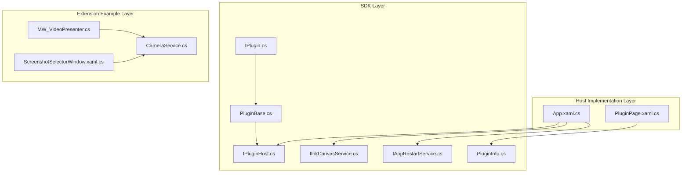
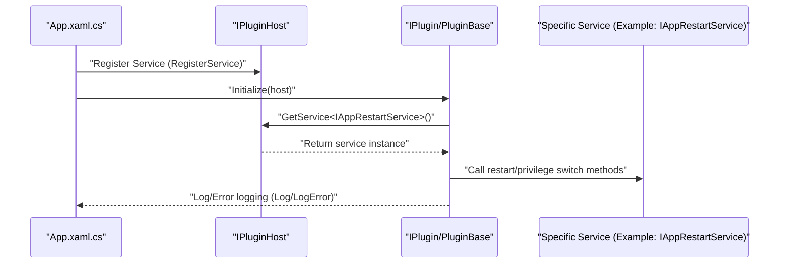
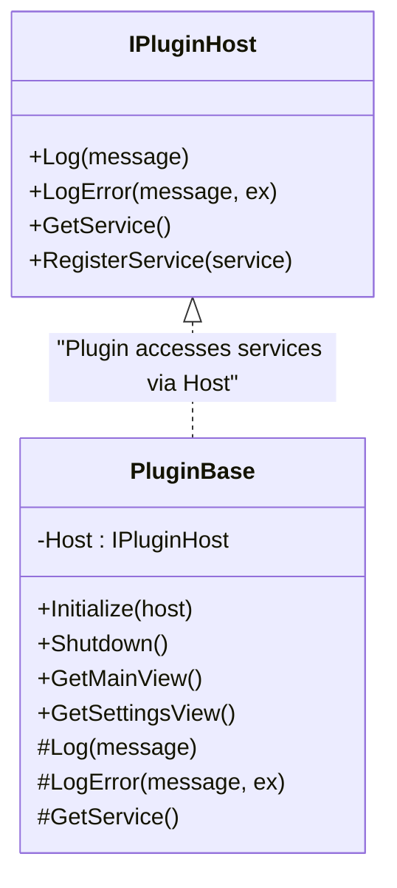
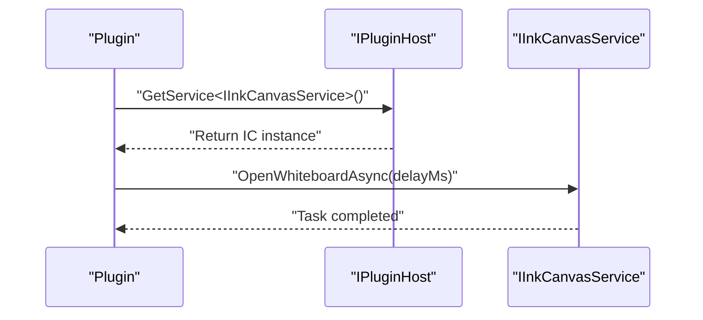
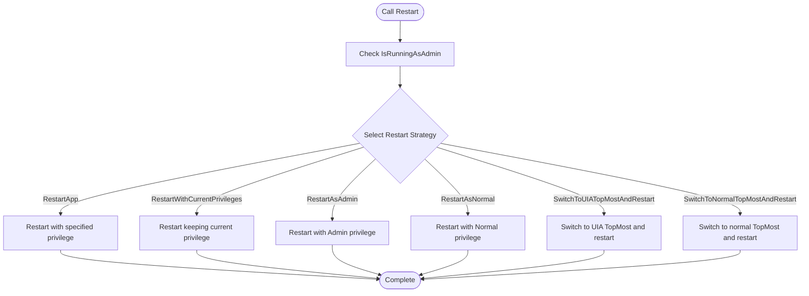
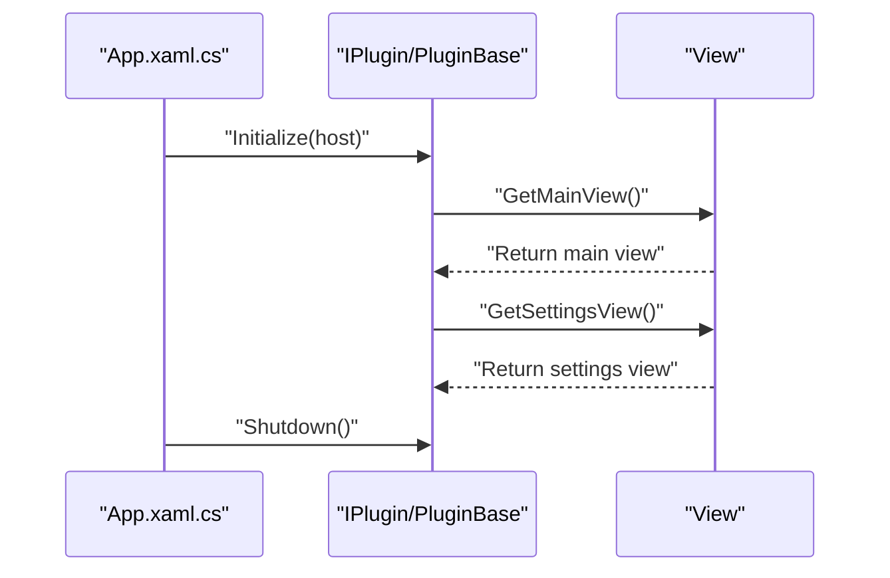
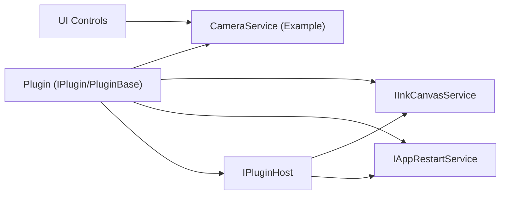

# Plugin Host Service

## Introduction
This document is intended for plugin developers and maintainers. It systematically explains the design and implementation of the plugin host service, focusing on:
- Core Capabilities provided by the `IPluginHost` interface: logging, error recording, and service registration/discovery
- `IInkCanvasService` whiteboard service: open/close whiteboard, async delayed opening
- `IAppRestartService` app restart service: privilege switching and graceful restart strategies
- Plugin Lifecycle and View Extensions: main view, settings view, initialization, and shutdown
- Service Registration and Discovery Mechanism: service container conventions based on generic interfaces
- Best Practices: async calling, error handling, and resource management
- Extension Guide: how to add custom service interfaces for plugins to be managed uniformly by the host

## Project Structure
Key directories and files around plugin host services are:
- SDK Layer (External Contracts): `IPluginHost`, `IInkCanvasService`, `IAppRestartService`, `IPlugin`, `PluginBase`, `PluginInfo`
- Host Implementation Layer (App Entry & Service Registration): `App.xaml.cs` (app lifecycle and watchdog), `PluginPage.xaml.cs` (plugin management UI)
- Example Extension Layer (Demoing how to use services): `MW_VideoPresenter.cs` (linking with camera services), `CameraService.cs` (specific service implementation), `ScreenshotSelectorWindow.xaml.cs` (UI controls and service interactions)

## Core Components
- `IPluginHost`: The bridge between plugins and the host, providing logging, error recording, and service registration/discovery.
- `IInkCanvasService`: Whiteboard service interface, responsible for opening/closing whiteboards and async delayed opening.
- `IAppRestartService`: App restart service interface, supporting restarts at different privilege levels and UIA TopMost mode switching.
- `IPlugin` & `PluginBase`: Plugin contracts and base classes, providing plugin metadata, lifecycle callbacks, and convenient service access methods.
- `PluginInfo`: Plugin information carrier, carrying plugin metadata and instance states.

## Architecture Overview
The plugin host service adopts a design of "Interface Contract + Generic Service Container":
- Plugins obtain required services via `IPluginHost.GetService<T>()`.
- The host registers services like `IAppRestartService` and `IInkCanvasService` during the App startup phase.
- Plugins obtain the host reference via `IPlugin.Initialize(host)` and can subsequently retrieve services as needed.
- Plugins can provide custom UI via `IPlugin.GetMainView()`/`GetSettingsView()`.

## Detailed Component Analysis

### IPluginHost Interface and Service Registration/Discovery
- Capability Overview
  - Logging & Error Recording: Facilitates output of diagnostic information by plugins.
  - Service Registration: The host registers service instances into the container.
  - Service Discovery: Plugins retrieve services via generic methods.
- Design Points
  - Uses the generic constraint `T : class` to ensure type safety.
  - Service registration and discovery follow the convention of "register first, use later."
  - The plugin base class `PluginBase` wraps access to `Host`, simplifying plugin development.

### IInkCanvasService Whiteboard Service
- Capability Overview
  - Open/Close Whiteboard: Synchronous interface.
  - Async Delayed Opening: Asynchronous interface with a delay parameter.
- Usage Scenarios
  - Plugins need to call the whiteboard for annotation or demonstration at specific moments.
  - Triggered in combination with UI controls (such as toolbar buttons).
- Implementation Recommendations
  - Use async delayed opening to avoid UI freezes.
  - Check the whiteboard state before opening to avoid redundant open operations.

### IAppRestartService App Restart Service
- Capability Overview
  - Privilege Level Query: `IsRunningAsAdmin`
  - Restart Strategies:
    - `RestartApp(asAdmin)`
    - `RestartWithCurrentPrivileges()`
    - `RestartAsAdmin()`
    - `RestartAsNormal()`
    - `SwitchToUIATopMostAndRestart()`
    - `SwitchToNormalTopMostAndRestart()`
- Usage Scenarios
  - Plugins need to restart the application after settings changes to take effect.
  - Requires restarting with administrator privileges or normal privileges.
  - Requires switching between UIA TopMost mode and normal mode and restarting.

### Plugin Lifecycle and View Extensions
- Lifecycle
  - `Initialize(host)`: Initializes the plugin, obtaining the host reference.
  - `Shutdown()`: Closes the plugin, releasing resources.
- View Extensions
  - `GetMainView()`: Returns the plugin main view (can be used for custom tool panels).
  - `GetSettingsView()`: Returns the plugin settings view (for configuration items).
- Metadata
  - `PluginInfo`: Carries plugin ID, name, version, author, order, etc.

### Best Practices for Service Usage
- Async Calling
  - Use asynchronous interfaces for operations that may block or are related to UI (such as `IInkCanvasService.OpenWhiteboardAsync`).
  - Avoid blocking the UI thread; use `Task.Delay` or `Dispatcher` reasonably.
- Error Handling
  - Use `IPluginHost.LogError` to output exception details.
  - Catch and record exceptions inside the plugin to prevent them from propagating to the host.
- Resource Management
  - Release managed and unmanaged resources in `Shutdown`.
  - Unbind events when subscribing to external services (such as cameras) to prevent memory leaks.
- Service Access
  - Retrieve services via `PluginBase.GetService<T>()` to avoid direct dependencies on specific implementations.
  - Register services centrally in the host; plugins are only responsible for consumption.

### How Plugins Utilize Host Services to Extend Functions
- Adding Custom Tools
  - Return custom controls via `GetMainView` and integrate them into the toolbar or sidebar.
  - Use `IInkCanvasService` to open the whiteboard for annotations.
- Modifying UI Layouts
  - Expose layout options in the settings view, combined with the host's settings page for persistence.
- Integrating External Data Sources
  - Retrieve data service interfaces via `IPluginHost.GetService<T>()` to achieve data pulling and caching.
  - Example: Link with camera services to achieve video presenter features (see extension examples).

### Actual Examples of Service Calls
- Opening the whiteboard (async delayed)
- App restart (privilege switching)
- Camera service linking (UI control)

### Service Extension Guide (How to Create Custom Service Interfaces)
- Steps
  1) Define the service interface in the SDK layer (keeping the namespace consistent with existing ones).
  2) Implement the service class in the host App, registering it via `IPluginHost.RegisterService<T>(instance)`.
  3) Retrieve the service instance in the plugin via `IPluginHost.GetService<T>()`.
  4) Wrap service access methods in the plugin base class `PluginBase` to improve ease of use.
- Notes
  - Service interfaces should minimize UI dependencies to facilitate cross-module reuse.
  - Exposed interfaces should have clear responsibility boundaries to avoid over-coupling.
  - For services that require UI, it is recommended to separate them via view interfaces (such as `GetMainView`/`GetSettingsView`).

## Dependency Analysis
- Plugin and Host
  - Plugins depend on `IPluginHost` for logging and service access.
  - The host registers services centrally during the startup phase, and plugins discover them via generic interfaces.
- Service and Implementation
  - `IAppRestartService`/`IInkCanvasService` are implemented and registered by the host.
  - Plugins retrieve service instances via `PluginBase.GetService<T>()`.
- UI and Service
  - UI controls call services via events (such as camera services), and plugins can reuse these services.

## Performance Considerations
- Async First: Prioritize using async interfaces for operations that may block (such as network requests, file I/O, and whiteboard opening).
- Resource Release: Release unmanaged resources promptly in `Shutdown` to avoid memory leaks.
- UI Thread: Avoid executing long-running tasks in the UI thread; use background threads and progress feedback when necessary.
- Service Reuse: Reduce repeated creation via service registration and discovery to improve startup efficiency.

## Troubleshooting Guide
- Plugin Load Failure
  - Check plugin info and instance status (`PluginInfo.IsLoaded`).
  - Check error prompts and logs in the settings page.
- Service Unavailable
  - Confirm that the host has registered the corresponding service during the startup phase.
  - Check whether the plugin calls `GetService<T>()` correctly.
- App Restart Issues
  - Choose the appropriate restart strategy based on privilege requirements.
  - Pay attention to whether switching to UIA TopMost mode succeeds.
- Watchdog and Silent Restart
  - Silent restarts can be triggered during the application startup phase and when the main thread is unresponsive.
  - If continuous restarts exceed the threshold, a prompt dialog will be displayed, and the app will exit.

## Conclusion
This document systematically explains the core interfaces and implementation conventions of plugin host services, clarifying the service registration and discovery mechanism, best practices, and extension guides. Through interfaces like `IPluginHost`, `IInkCanvasService`, and `IAppRestartService`, plugins can safely access host capabilities and extend functions. It is recommended to follow best practices in async calling, error handling, and resource management in actual development to ensure plugin stability and maintainability.

## Appendix
- Plugin Management Interface (plugin cards and error prompts)
- Camera Service & UI Control Linking
