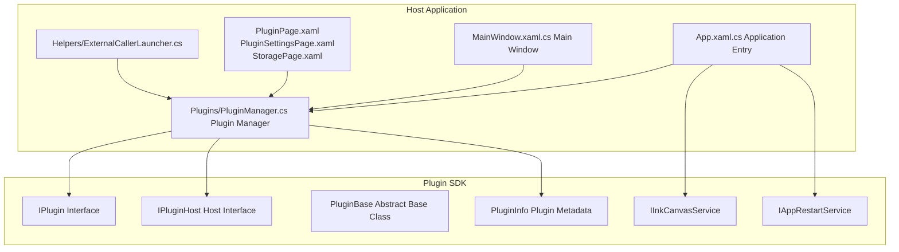
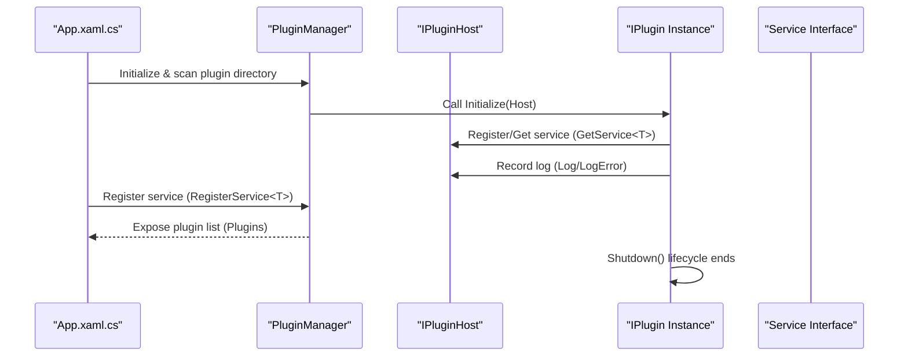
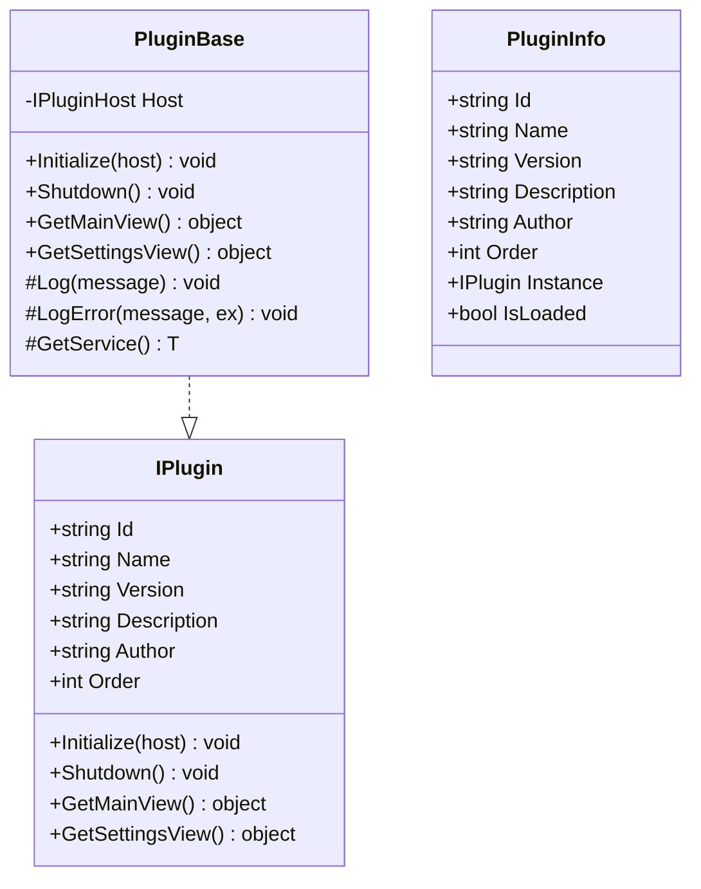
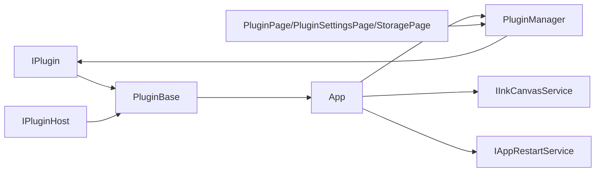

# Plugin Development Guide

## Introduction
This guide is intended for developers who want to develop plugins based on the Ink Canvas platform. It systematically explains plugin interface design and implementation, usage of host services, plugin lifecycle management, view interfaces, configuration systems, debugging and testing, packaging and distribution, security precautions, and practical recommendations for common plugin scenarios. The content is based on the actual SDK and host implementations in the repository to help you quickly get started and build stable and reliable plugins.

## Project Structure
The Ink Canvas plugin architecture consists of two parts: the "Plugin SDK" and the "Host Application":
- The Plugin SDK provides the `IPlugin` interface, the host interface `IPluginHost`, the base class `PluginBase`, service interfaces (such as `IInkCanvasService` and `IAppRestartService`), and the plugin metadata model `PluginInfo`.
- The Host Application is responsible for loading plugins, registering services, exposing UI and settings entries, and managing the plugin collection uniformly via `PluginManager`.

## Core Components
- `IPlugin`: Defines plugin identifiers, metadata, lifecycle, and view interfaces.
- `IPluginHost`: Provides logging, exception recording, and service registration/retrieval capabilities.
- `PluginBase`: Provides default empty implementations and convenient access to host services.
- `PluginInfo`: Carries plugin instances, load status, and metadata.
- Service Interfaces: `IInkCanvasService` and `IAppRestartService`, used to interact with the host.

## Architecture Overview
The plugin system adopts the mode of "Interface-Driven + Host-Managed":
- Plugins expose metadata and lifecycle hooks via `IPlugin`.
- The host registers services (such as `IInkCanvasService` and `IAppRestartService`) during the startup phase, and loads plugins via `PluginManager`.
- Plugins retrieve services, record logs, and provide views via `IPluginHost`.
- The host UI (settings page) displays the plugin list and settings views.

## Component Details

### IPlugin Interface and Lifecycle
- Identification & Metadata: `Id`, `Name`, `Version`, `Description`, `Author`, `Order`.
- Lifecycle: `Initialize(host)`, `Shutdown()`.
- View Interfaces: `GetMainView()`, `GetSettingsView()`, used by the host to inject UI.

### IPluginHost and Service Registration
- Logs: `Log(message)`, `LogError(message, ex)`.
- Services: `RegisterService<T>(service)`, `GetService<T>()`.

The host registers services during application startup for plugins to use.

### Plugin Base Class PluginBase
- Default Empty Implementations: `Initialize`/`Shutdown`/`GetMainView`/`GetSettingsView`.
- Convenient Methods: `Log`, `LogError`, `GetService<T>`, which delegate internally to the host.

### Plugin Management and Loading (Host Side)
- `PluginManager`: Maintains the plugin directory, loads plugins, and exposes the `Plugins` list.
- Plugin Directory: Located in the `Plugins` folder under the application base directory.

### Host Service Examples
- `IInkCanvasService`: Open/close whiteboard, async whiteboard opening.
- `IAppRestartService`: Restart the application with different privilege levels, restart after switching topmost mode.

### Plugin UI and Settings Entries
- Plugin List and Settings Page: `PluginPage.xaml`, `PluginSettingsPage.xaml`.
- Storage page displays plugin space usage and prompts.

### External Calls and Plugin Interaction
- `ExternalCallerLauncher`: Provides the `classisland://` plugin call URI, allowing external clients to trigger plugin actions.

## Dependency Analysis
- Plugins depend on `IPlugin` and `IPluginHost`; they can be implemented quickly via `PluginBase`.
- The host depends on `PluginManager` to manage plugins; it registers services like `IInkCanvasService` and `IAppRestartService` at the same time.
- The UI layer displays plugin status and settings views through settings pages.

## Performance Considerations
- Plugin Lifecycle: Perform one-time initialization in `Initialize` as much as possible; release resources in `Shutdown` to avoid memory leaks.
- View Interfaces: Objects returned by `GetMainView`/`GetSettingsView` should be lightweight and reusable; avoid performing time-consuming operations in the UI thread.
- Service Calling: Retrieve services via `IPluginHost.GetService<T>()` to reduce direct dependencies on hardcoded types.
- Logs: Use `Host.Log`/`LogError` to output critical information, facilitating the location of performance bottlenecks.

## Troubleshooting Guide
- Plugin Not Loaded: Check the plugin directory and `PluginManager` initialization logic; check host log outputs.
- Service Unavailable: Confirm that the host has called `RegisterService<T>` in the startup phase; retrieve via `GetService<T>()` on the plugin side.
- UI Not Displayed: Confirm that `GetMainView`/`GetSettingsView` returns valid objects; check settings page bindings.
- External Call Failed: Verify the URI format in `ExternalCallerLauncher` and the target plugin implementation.

## Conclusion
Through the `IPlugin` interface and the `IPluginHost` host interface, combined with the quick implementation of `PluginBase` and the unified management of `PluginManager`, the Ink Canvas plugin system realizes a clear separation of responsibilities and excellent extensibility. Together with service registration, UI settings entries, and external calling mechanisms, developers can efficiently build plugin scenarios such as tool extensions, UI customization, and data processing.

## Appendix

### Plugin Project Template and Structure Recommendations
- It is recommended to use `IPlugin` in the SDK as the contract, inheriting `PluginBase` for fast implementation.
- Refer to the existing plugin directory `Plugins` for project structure, organizing plugin DLLs and resources as needed.
- Ensure that `PluginManager` can scan and load the plugin directory correctly during the host startup phase.

### Plugin Host Service Checklist
- Register Service: Call `RegisterService<T>` during application startup, passing the specific service instance.
- Retrieve Service: Get required services via `GetService<T>()` in the plugin's `Initialize`.
- Common Services: `IInkCanvasService`, `IAppRestartService`.

### Plugin Configuration System
- Config File Location: Typically located at `Configs/Settings.json` in the application root directory.
- Parameter Verification: Read and verify necessary configuration items in the plugin's `Initialize`, setting default values.
- Default Values: Use reasonable default values and log warnings when configurations are missing.

### Plugin Debugging and Testing
- Unit Testing: Write unit tests for pure logic classes (without UI), mocking `IPluginHost` behavior.
- Integration Testing: Load plugins in the host application, validating `Initialize`/`Shutdown` and view interfaces.
- Logs: Output critical paths and exception details using `Host.Log`/`LogError`.

### Plugin Packaging and Distribution
- Version Management: Adhere to the `IPlugin.Version` field specification, unifying the version number format.
- Dependency Declaration: Ensure that plugin DLLs and dependencies are in the same directory; avoid failures in resolving assemblies at runtime.
- Installer: Put plugin DLLs into the host's `Plugins` directory; provide uninstall scripts to clean up resources.

### Plugin Security Considerations
- Permission Control: Leverage the privilege switching capabilities of `IAppRestartService` to elevate permissions cautiously.
- Sandbox Mechanism: Avoid direct access to sensitive system resources; collaborate with the host through service interfaces.
- Malicious Code Protection: Strictly validate external inputs and URI parameters; minimize the plugin's permission scope.

### Examples of Common Plugin Scenarios
- Tool Extensions: Open/close whiteboards via `IInkCanvasService`, or interact with other tools.
- UI Customization: Implement `GetMainView`/`GetSettingsView`, providing custom controls and settings pages.
- Data Processing: Subscribe to events or read configurations in `Initialize`, processing and persisting data.

Source of Chapter
