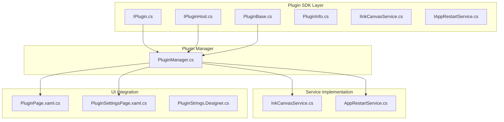
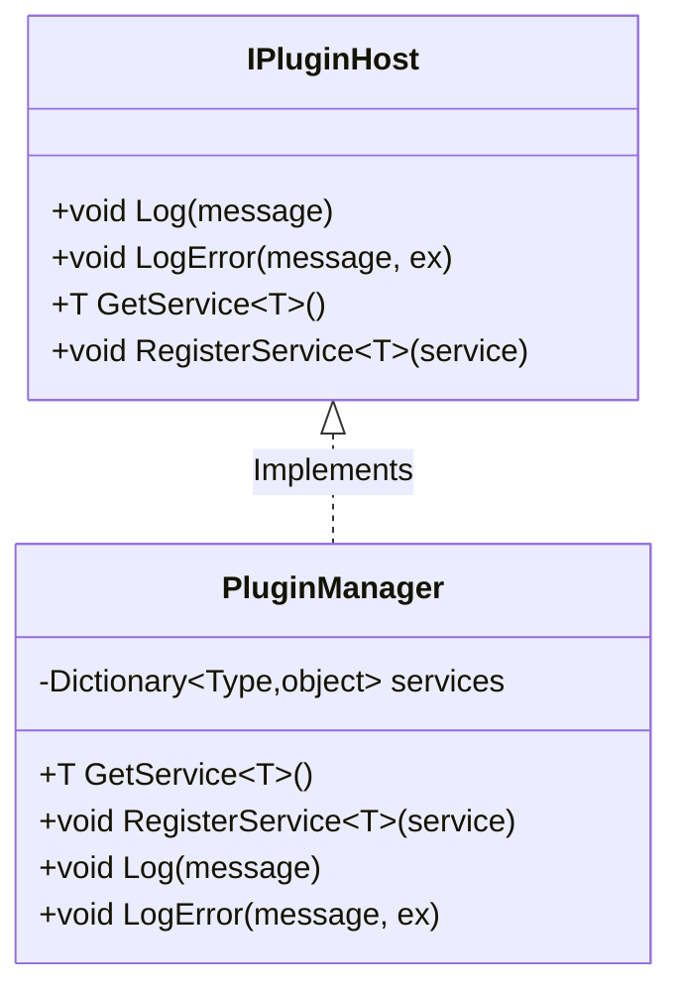
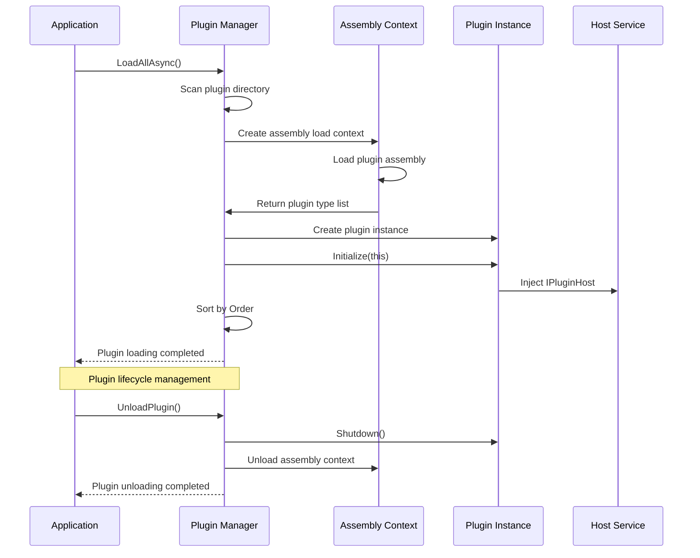
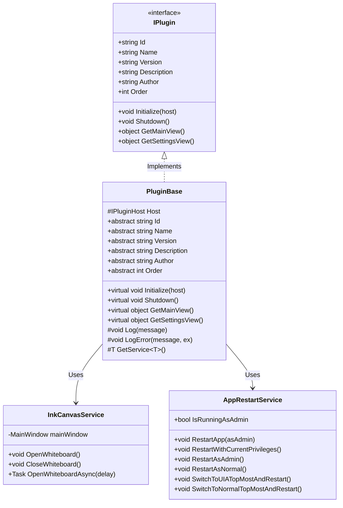
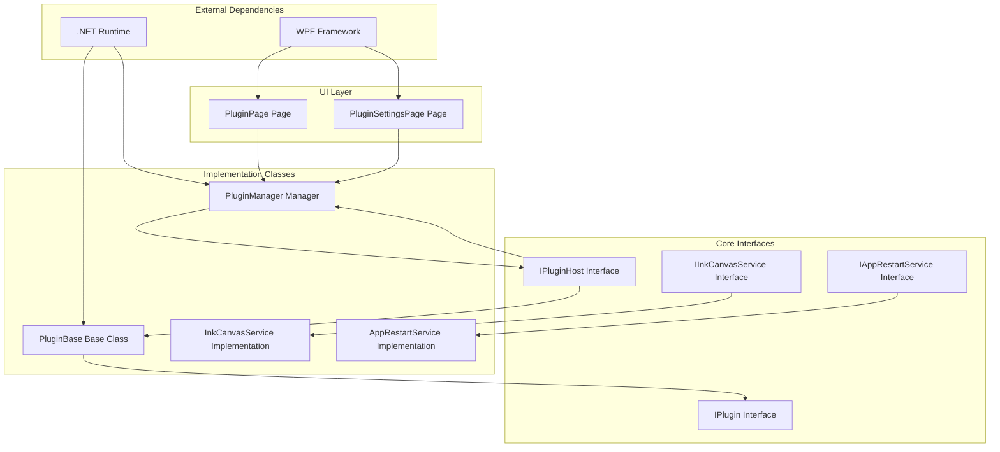
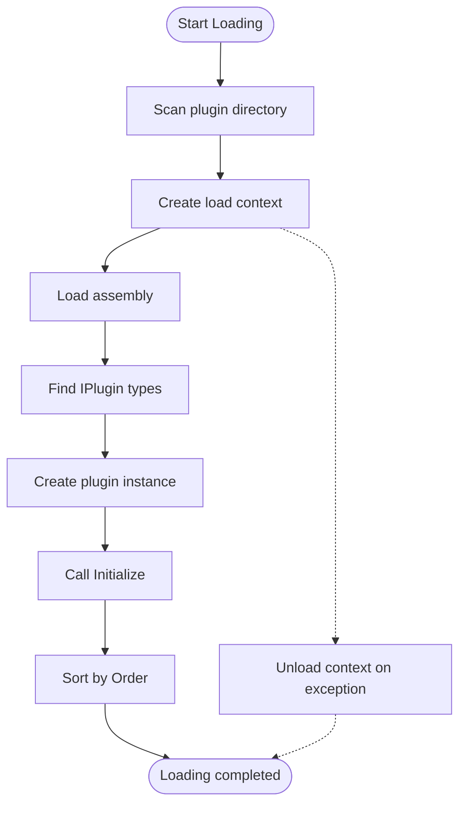
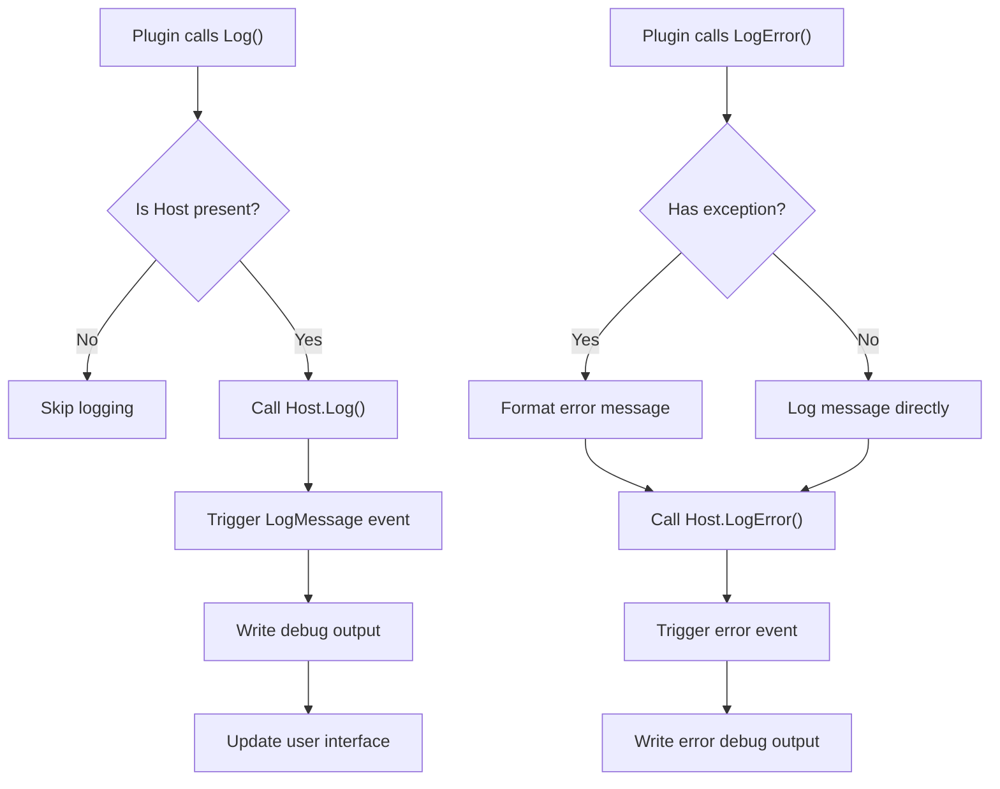

# Plugin Interface Design

## Introduction

This document details the interface design and implementation specifications of the Ink Canvas plugin system. The plugin system adopts an interface-based extension architecture, defining plugin behavior contracts through the standardized `IPlugin` interface, providing host service injection mechanisms through `IPluginHost`, and simplifying the plugin development process through the `PluginBase` abstract base class. The system supports dynamically loading and unloading plugins, and provides infrastructure functions like logging and service registration.

## Project Structure

The plugin system is mainly distributed in the following directories:

## Core Components

### IPlugin Interface Definition

The `IPlugin` interface is the core contract of the plugin system, defining the basic capabilities that plugins must implement:

| Property/Method | Type | Required | Description |
|-----------------|------|----------|-------------|
| Id | string | Yes | Unique identifier of the plugin, used to distinguish different plugin instances |
| Name | string | Yes | Display name of the plugin, used in the user interface |
| Version | string | Yes | Version number of the plugin, following Semantic Versioning |
| Description | string | No | Functional description of the plugin |
| Author | string | No | Author information of the plugin |
| Order | int | Yes | Load order of the plugin, where smaller values represent higher priority |
| Initialize | Method | Yes | Plugin initialization method, receiving the `IPluginHost` parameter |
| Shutdown | Method | Yes | Plugin cleanup method, responsible for resource release |
| GetMainView | Method | No | Returns the main interface view object of the plugin |
| GetSettingsView | Method | No | Returns the settings interface view object of the plugin |

### IPluginHost Interface Features

Serving as the host service container, `IPluginHost` provides plugins with runtime-essential services:

## Architecture Overview

The plugin system is designed with a layered architecture, implementing a loosely coupled plugin management mechanism:

## Detailed Component Analysis

### PluginBase Abstract Base Class

`PluginBase` provides the basic framework for plugin development, simplifying the implementation of common features:

## Dependency Analysis

The internal dependencies of the plugin system are as follows:

## Performance Considerations

### Assembly Load Optimization

The plugin system uses an independent assembly loading context, where each plugin has a separate `AssemblyLoadContext`. This provides:

- **Memory Isolation**: Plugin assemblies can be unloaded independently.
- **Dependency Resolution**: Uses `AssemblyDependencyResolver` to resolve dependencies precisely.
- **Garbage Collection**: Supports memory reclamation after plugins are unloaded.

### Async Loading Mechanism

## Troubleshooting Guide

### Common Issues and Solutions

| Problem Type | Symptom | Solution |
|--------------|---------|----------|
| Plugin cannot be loaded | Assembly not found or type mismatch | Check plugin DLL file integrity and verify that it implements the `IPlugin` interface |
| Initialization failed | `Initialize` throws an exception | Check host service reachability and review log outputs |
| UI display abnormal | Settings interface does not show or has layout errors | Make sure `GetSettingsView` returns a valid `UIElement` |
| Memory leak | Application memory grows continuously | Check whether the `Shutdown` method correctly releases resources |

### Logging Mechanism

The plugin system provides two-level logging:

## Conclusion

The Ink Canvas plugin system provides powerful extension capabilities for the application through clear interface design and complete lifecycle management. The `IPlugin` interface defines the core behavior of plugins, `IPluginHost` provides a flexible service injection mechanism, and the `PluginBase` base class simplifies the development process. The system supports modern plugin management features like dynamic loading and unloading, memory isolation, and asynchronous processing, providing a robust extension platform for developers.

## Appendix

### Plugin Development Best Practices

1. **Interface Implementation**: Ensure complete implementation of all required members of the `IPlugin` interface.
2. **Resource Management**: Correctly release all resources in `Shutdown`.
3. **Error Handling**: Avoid throwing unhandled exceptions in `Initialize`.
4. **Thread Safety**: Pay attention to status synchronization in multi-threaded environments.
5. **Version Compatibility**: Adhere to semantic versioning strategies.

### Example Code Path
