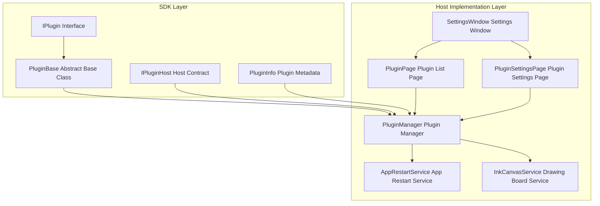
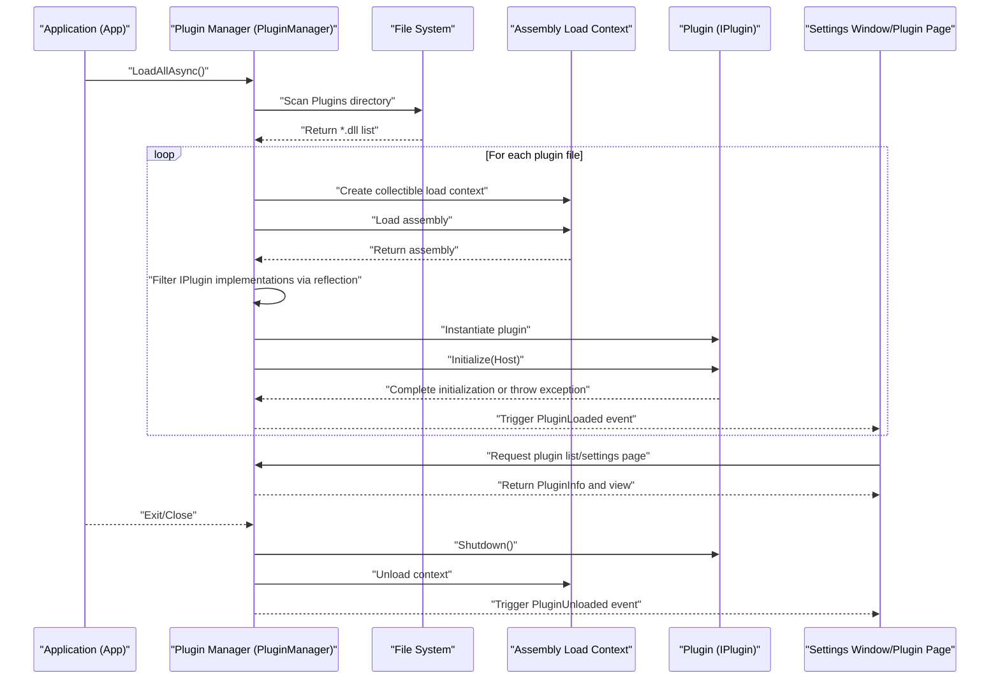
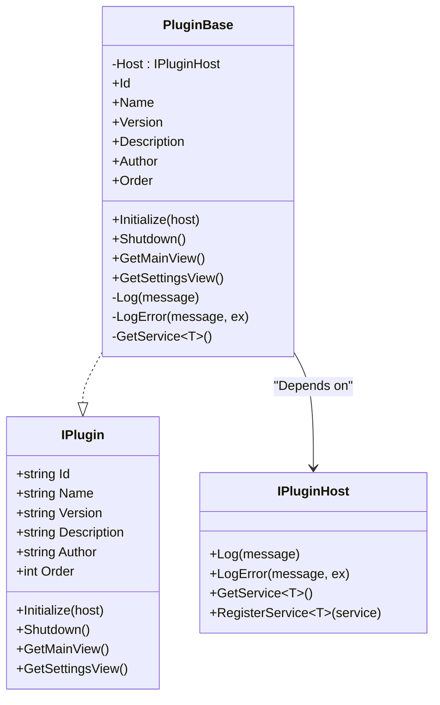
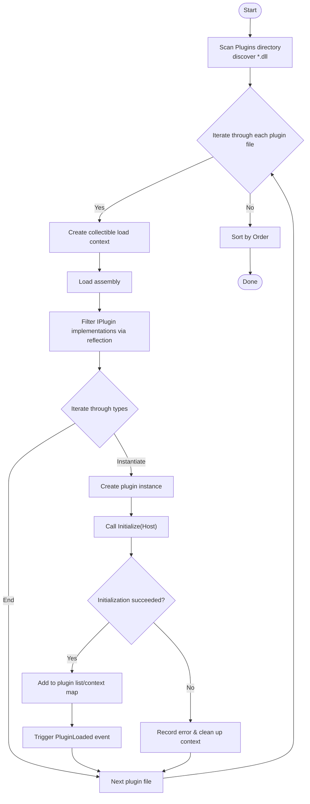
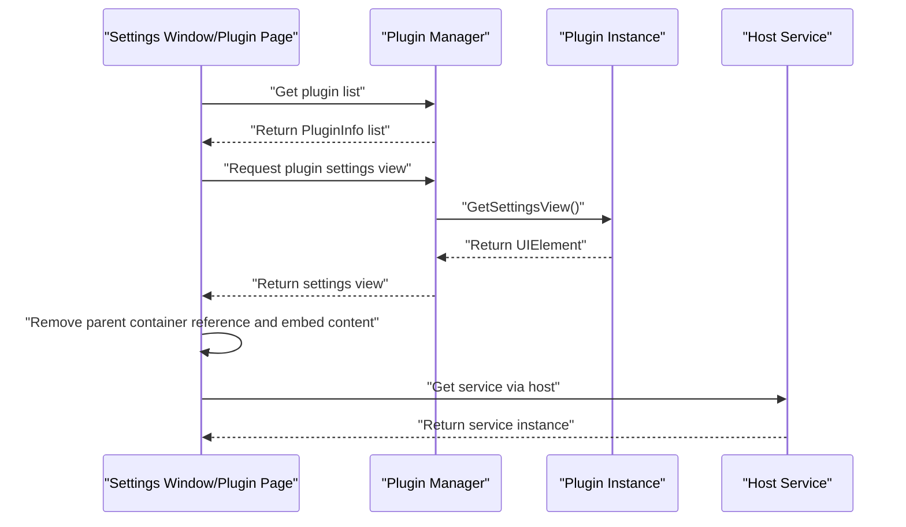
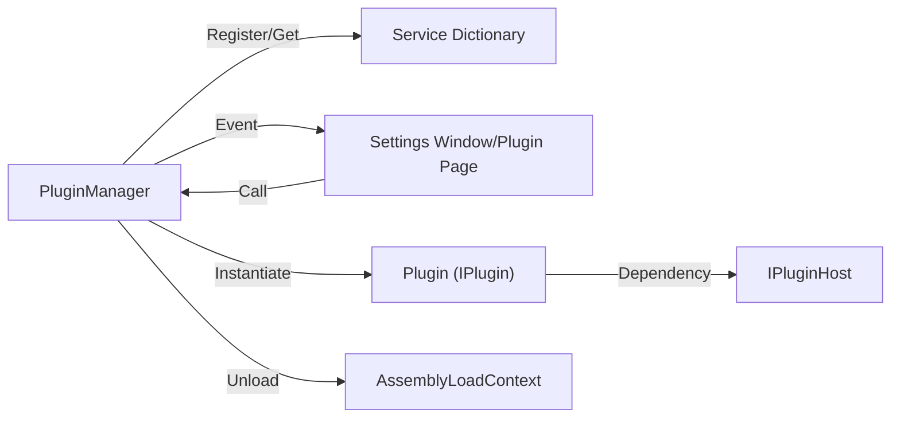

# Plugin Lifecycle Management

## Introduction
This document systematically explains the plugin lifecycle management scheme in the codebase, covering the complete process from plugin discovery, loading, initialization, running-phase event handling, service registration, and dependency injection, to unloading and hot-plugging support. It also provides recommendations for event broadcasting, message passing, and data sharing strategies, as well as guidelines for lifecycle hooks, exception handling, and performance optimization practices, illustrated with progressive examples to help developers implement them quickly.

## Project Structure
The plugin system consists of the "SDK Interface Layer" and the "Host Implementation Layer":
- The SDK Layer defines plugin interfaces, base classes, and host contracts, ensuring decoupling between plugins and the host.
- The Host Implementation Layer is responsible for scanning the plugin directory, dynamically loading assemblies, instantiating plugins, registering services, triggering lifecycle hooks, and providing UI integration to display plugin information and settings pages.

## Core Components
- Plugin Interface & Base Class
  - `IPlugin`: Defines plugin identification, metadata, lifecycle hooks (`Initialize`, `Shutdown`), and view exports (`GetMainView`, `GetSettingsView`).
  - `PluginBase`: Provides common capabilities like logging, error recording, and service retrieval, with default empty implementations for easy inheritance.
- Host Contract
  - `IPluginHost`: Provides logging, error recording, service registration, and retrieval capabilities for plugins; passed in as a plugin initialization parameter.
- Plugin Info Model
  - `PluginInfo`: Carries plugin metadata and instance states, used for UI display and management.
- Plugin Manager
  - Responsible for scanning the plugin directory, loading assemblies in order, discovering `IPlugin` implementations via reflection, instantiating and calling `Initialize`, maintaining plugin collections and unloading contexts, publishing loading/unloading events, and unifying log outputs.
- Service Examples
  - `AppRestartService`: Encapsulates app restart strategies.
  - `InkCanvasService`: Encapsulates switching operations of the main window's drawing board mode, demonstrating how to interact with the UI thread via host services.

## Architecture Overview
The diagram below shows the overall process from application startup to plugin loading, initialization, running, and unloading, as well as how the UI interacts with the plugin manager.

## Detailed Component Analysis

### Plugin Interface and Base Class
- `IPlugin`: Defines plugin identification, metadata, and lifecycle hooks, requiring plugin implementers to provide stable `Id`, `Name`, `Version`, `Description`, `Author`, and `Order`, and accept the host in `Initialize` and release resources in `Shutdown`.
- `PluginBase`: Provides logging and error recording (via host), service retrieval (`GetService<T>`), with default empty implementations for minimal access.

### Plugin Manager (PluginManager)
- Responsibilities
  - Scans the `Plugins` directory, recursively discovering `*.dll` files.
  - Dynamically loads plugin assemblies using a collectible `AssemblyLoadContext`, avoiding memory leaks caused by strong references.
  - Filters `IPlugin` implementations via reflection, instantiating them and calling `Initialize`, registering them into the manager.
  - Maintains plugin lists sorted by `Order`, publishing `PluginLoaded`/`PluginUnloaded` events.
  - Provides service registration and retrieval (dictionary storage), unifying log outputs.
  - Supports `UnloadPlugin` and `UnloadAll`, triggering `Shutdown` and unloading corresponding contexts.
- Key Points
  - Exception Isolation: A loading failure of a single plugin will not block the overall loading process.
  - Context Isolation: Each plugin has an independent loading context, supporting unloading.
  - Lifecycle Hooks: `Initialize`/`Shutdown` are called directly by the manager to ensure consistency.

### Host Service and UI Integration
- Settings Window and Plugin Page
  - `SettingsWindow` maintains page mappings and plugin page caching, pre-fetching plugin settings pages and injecting them into the UI during loading.
  - `PluginPage` displays loaded plugin lists, and `PluginSettingsPage` embeds the settings view returned by the plugin into a container.
- Service Examples
  - `InkCanvasService`: Executes main window operations on the UI thread via `Dispatcher`, demonstrating thread safety and async delayed opening.
  - `AppRestartService`: Encapsulates multiple restart strategies, allowing plugins to trigger app restarts when needed.

## Dependency Analysis
- Component Cohesion and Coupling
  - Plugins and the host are decoupled through `IPlugin`/`IPluginHost`. Plugins only depend on SDK interfaces and do not perceive host implementation details.
  - `PluginManager` holds a service dictionary and plugin collections internally, exposing events and query interfaces to reduce external coupling.
- External Dependencies
  - Uses `System.Reflection` and `System.Runtime.Loader`'s `AssemblyLoadContext` for dynamic loading and unloading.
  - The UI layer depends on WPF controls and navigation frameworks, uniformly carrying plugin pages through `SettingsWindow`.
- Circular Dependencies
  - No signs of circular dependencies; plugins have a one-way dependency on the host, and the manager applies inversion of control to plugins.

## Performance Considerations
- Assembly Loading and Unloading
  - Use a collectible `AssemblyLoadContext` to avoid memory leaks; call `Shutdown` to release managed and unmanaged resources before unloading.
- I/O and Scanning
  - Adopt async loading strategies when scanning the plugin directory, attempting to load each file individually so that failures do not affect other plugins.
- UI Thread and Async
  - Avoid blocking the UI thread by opening the drawing board via `Dispatcher.Invoke` or async delayed actions.
- Event Storms
  - Subscribe to plugin loading/unloading events cautiously to avoid excessive callbacks in high-frequency scenarios.

## Troubleshooting Guide
- Load Failures
  - Verify that the plugin directory exists, permissions are sufficient, and dependent assemblies are complete.
  - Review log outputs (`PluginManager.Log`/`LogError`) to locate specific files and exception stack traces.
- Initialization Exceptions
  - An exception thrown in the plugin's `Initialize` will cause the plugin to be removed and its context unloaded. Verify the reachability of host services and correct dependency injection.
- Unloading Issues
  - Ensure that the plugin releases all resources in `Shutdown`; if memory footprint still occurs, check for static references or unterminated background threads.
- UI Rendering Anomalies
  - The plugin settings view must be removed from its parent container before embedding to avoid exceptions caused by duplicate tree structures.

## Conclusion
The plugin system realizes stable, extensible, and hot-pluggable plugin management capabilities through clear interfaces and host contracts, collectible assembly loading contexts, and comprehensive lifecycle hooks and event mechanisms. Combined with UI integration and service registration, developers can quickly build a plugin ecosystem ranging from simple to complex.

## Appendix: Lifecycle Management Best Practices and Examples

### Lifecycle Hook Usage Guidelines
- Pre-startup Verification
  - Validate host service availability and necessary configurations in `Initialize`; log errors and return early upon failure.
- Runtime Monitoring
  - Register observable services via `IPluginHost.RegisterService`, and regularly report status inside the plugin.
- Exception Handling
  - Capture and log exceptions in `Shutdown` to ensure resource release and context unloading.

### Inter-Plugin Communication Strategies
- Event Broadcasting
  - Register event buses or message centers via `IPluginHost.RegisterService`, allowing plugins to publish/subscribe to respective domain events.
- Message Passing
  - Use lightweight Data Transfer Objects (DTOs) to pass data between plugins, avoiding direct coupling.
- Data Sharing
  - Encapsulate shared data into services and retrieve them via `GetService<T>()`; avoid global static variables.

### Hot-plugging Support Implementation Key Points
- Dynamic Loading
  - Load plugin assemblies using a collectible `AssemblyLoadContext`; call `Unload` immediately upon failure.
- Unloading
  - Call `Shutdown` first, then remove plugin records and unload the context.
- Reloading
  - Realized by calling `LoadPluginAsync` again; pay attention to avoiding duplicate ID conflicts.

### Complete Lifecycle Example (Step-by-Step)
- Step 1: Application Startup
  - Call `PluginManager.Instance.LoadAllAsync()` during the application initialization phase.
- Step 2: Plugin Discovery and Loading
  - The manager scans the `Plugins` directory, loads assemblies, and instantiates `IPlugin` implementations.
- Step 3: Initialization and Dependency Injection
  - Call `Initialize(Host)`, and plugins retrieve required services via `GetService<T>()`.
- Step 4: Running Phase Events and State Management
  - Plugins register UI events, application events, and state change notifications, logging running states via the host log.
- Step 5: Unloading and Hot-plugging
  - Call `UnloadPlugin` or `UnloadAll`; plugins execute `Shutdown`, the manager unloads contexts and triggers events.
- Step 6: UI Integration
  - The settings window loads the plugin list and settings pages, and the settings view returned by the plugin is embedded via `PluginSettingsPage`.
