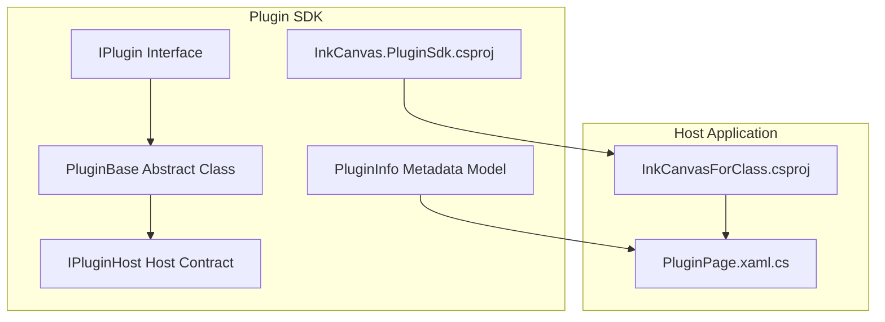
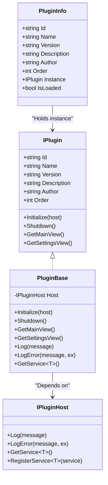
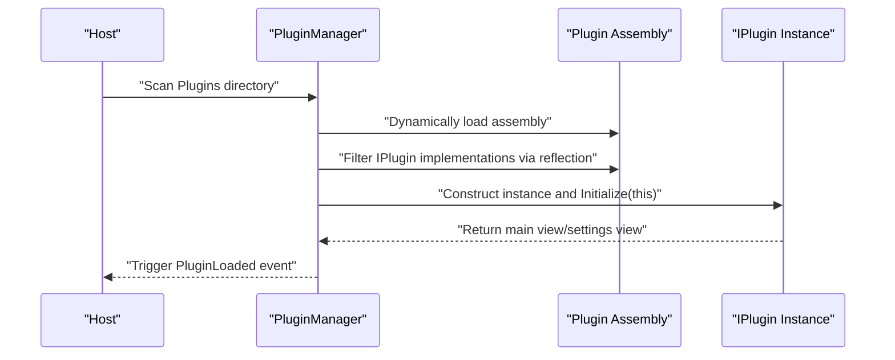
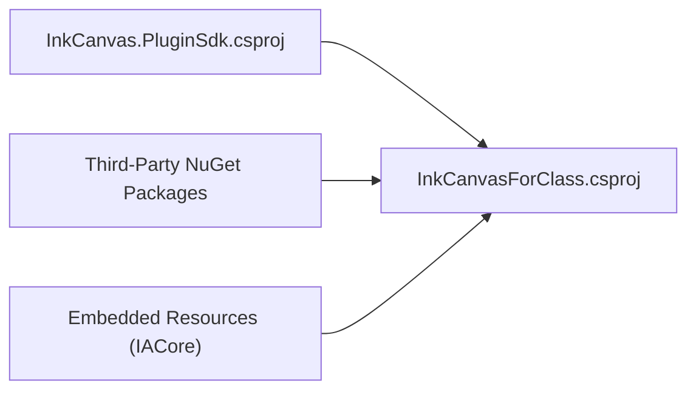

# Plugin Packaging and Distribution

## Introduction
This document is intended for developers who wish to develop, package, and distribute plugins in the InkCanvasForClass ecosystem. It systematically explains the plugin package structure, version management, dependency management, packaging and installation, distribution channels, signature and verification, as well as complete workflow examples from development completion to release, and maintenance strategies. The content is refined and expanded based on the plugin SDK, host projects, and related documents in the repository to help even non-professional packagers smoothly complete plugin delivery.

## Project Structure
- The plugin SDK is located in `InkCanvas.PluginSdk`, defining plugin interfaces, base classes, host contracts, and plugin metadata models. It is the specification all plugins must follow.
- The main program `InkCanvasForClass.csproj` is the host application, responsible for scanning, loading, and managing plugins, and providing UI displays and interactions.
- The plugin page `PluginPage.xaml.cs` displays the list of loaded plugins, reflecting plugin lifecycles and states.
- The document `.qoder/.../Plugin API.md` defines the responsibilities and behaviors of `PluginManager` on the host side, serving as a key to understanding the plugin loading mechanism.

## Core Components
- Plugin Interface `IPlugin`: Defines plugin identification, name, version, description, author, loading order, and conventions for initialization, shutdown, main views, and settings views.
- Plugin Base Class `PluginBase`: Provides general lifecycle hooks, logging and error recording, and service retrieval capabilities, injected through the host to achieve loose coupling.
- Host Contract `IPluginHost`: Provides logging, error logging, and service registration/retrieval capabilities, serving as the bridge for plugin-host communication.
- Plugin Metadata `PluginInfo`: Carries plugin ID, name, version, description, author, loading order, instance, and load status, used for UI display and management.
- Host Project `InkCanvasForClass.csproj`: Defines target frameworks, runtime identifiers, packaging and deployment properties, as well as resource embedding and third-party dependencies.
- Plugin Page `PluginPage.xaml.cs`: Displays the count and list of loaded plugins, reflecting plugin loading and exception handling processes.

## Architecture Overview
The plugin architecture adopts the design of "Interface + Abstract Base Class + Host Contract." By implementing `IPlugin` and inheriting `PluginBase`, plugins acquire uniform lifecycle and service access capabilities. The host scans the `Plugins` directory via `PluginManager` (see document), dynamically loads assemblies, filters `IPlugin` implementations via reflection, sorts them by `Order`, and triggers events, supporting single and batch unloading.

## Detailed Component Analysis

### Plugin Interface and Base Class
- `IPlugin` specifies the basic metadata and lifecycle methods of plugins, ensuring that the host can manage different plugins uniformly.
- `PluginBase` provides default implementations and host interaction capabilities, reducing duplicate code and facilitating extension.
- `IPluginHost` provides logging, error recording, and service registration/retrieval for plugins, forming a stable extension point.

## Dependency Analysis
- Dependencies between the Plugin SDK and host projects: Host projects reference the Plugin SDK to ensure compile-time type safety and runtime loading consistency.
- Third-Party Dependencies: The host project imports multiple NuGet packages covering UI, interop, notifications, logging, etc. Plugins should avoid high-version dependencies that conflict with the host.
- Resources & Embedding: Binary resources like IACore participate in host building via embedding, and plugins should not generate naming conflicts with them.

## Performance Considerations
- Dynamic Loading & Unloading: Plugins are loaded using a collectible `AssemblyLoadContext` to avoid memory leaks and resource occupancy. It is recommended that plugins release unmanaged resources in `Shutdown`.
- UI Rendering: The plugin page renders plugin cards on demand, and exception capturing and empty list prompts reduce UI response times.
- Dependency Minimization: Plugins should reuse services provided by the host as much as possible, reducing extra dependencies to avoid version conflicts with host dependencies.

## Troubleshooting Guide
- Plugin Not Displayed: Check whether the host has scanned the `Plugins` directory correctly, whether the plugin implements `IPlugin`, and whether it is injected into the host via `Initialize`.
- Plugin Load Failure: Review host logs and error records to confirm dependency versions, resource paths, and permissions.
- UI Anomalies: Verify the consistency of the plugin main view/settings view return values with UI thread calls in the host.

## Conclusion
Through standardized plugin interfaces, uniform base classes, and host contracts, combined with the host project's resource and dependency management, developers can quickly build plugins that comply with ecological specifications. Adhering to the packaging and distribution processes in this document ensures that plugins run stably on different platforms and are delivered smoothly.

## Appendix

### Plugin Package Structure and Composition
- Required Files
  - Plugin Assembly: Contains classes implementing `IPlugin` and resources.
  - Plugin Metadata: Information like version, name, author, and description read by the host (usually from the plugin's own properties or manifest).
- Optional Resources
  - Icons, localized resources, fonts, styles, etc.
- Metadata Files
  - Plugin Manifest (recommended): Contains ID, version, dependencies, compatibility statements, etc., facilitating recognition by host and distribution systems.

### Version Management Strategy
- Version Numbering Rules
  - Semantic versioning (Major.Minor.Patch) is recommended, e.g., 1.2.3.
  - Plugin versions are decoupled from host versions, but must declare the minimum host version requirement.
- Semantic Versioning
  - Major Version Change: Breaking updates, requiring manual upgrades by users.
  - Minor Version Change: New features, maintaining backward compatibility.
  - Patch Version: Issue fixes, maintaining complete compatibility.
- Version Compatibility Statement
  - Declare the supported range of host versions in the plugin manifest to avoid loading on incompatible versions.

### Dependency Management Mechanism
- Runtime Dependency Check
  - Plugins should avoid directly depending on third-party library versions that conflict with the host.
  - Share capabilities between plugins by registering services via the host `IPluginHost.RegisterService`.
- Third-Party Library Referencing
  - Prioritize using capabilities already provided by the host to reduce redundant dependencies.
  - If referencing is necessary, ensure that versions are locked consistently with the host to avoid runtime conflicts.
- Conflict Resolution
  - When dependency conflicts occur, prioritize upgrading or downgrading plugin dependencies to versions consistent with the host.
  - Locate conflict sources using logs and error records provided by the host.

### Packaging Tools and Automation Process
- Command Line Tools
  - Use the dotnet CLI to build and package, generating plugin assemblies and resources.
- Build Scripts
  - Define build matrices (x86/x64/arm64) in CI/CD to execute restore/build/publish.
- Automation Process
  - Automatically compress to a zip package after building, containing plugin assemblies and necessary resources.
  - Generate checksums (such as SHA256) and version metadata files, facilitating distribution and verification.

### Installer Creation
- Installation Package Generation
  - Package the plugin zip package and installation scripts into MSI/EXE installers.
- Registry Configuration
  - Write plugin installation paths and version information during installation, facilitating identification by the host.
- Uninstaller Creation
  - Provide uninstall logic to clean up registry entries and files, restoring the initial state.

### Distribution Channel Selection
- Official Plugin Market
  - Publish on the official community platform, providing version history and download statistics.
- Third-Party Platforms
  - GitHub Releases, NuGet (if applicable), technical community resource sites.
- Self-built Distribution System
  - Set up internal or public download and update channels, cooperating with signature verification and version pushes.

### Signature and Verification Mechanism
- Digital Signature
  - Digitally sign plugin packages and installers to improve trustworthiness.
- Integrity Check
  - Generate and verify SHA256 checksums to prevent tampering.
- Source Verification
  - Verify signatures and sources in the host, only allowing plugins from trusted channels to load.

### Complete Packaging Example (From Development to Release)
- Development Phase
  - Implement `IPlugin` and inherit `PluginBase`, perfecting main views and settings views.
- Build Phase
  - Use `dotnet build` to generate plugin assemblies, copying them to the host `Plugins` directory for joint debugging.
- Packaging Phase
  - Package plugin assemblies and resources into a zip file, generating version metadata and checksums.
- Release Phase
  - Upload to the official plugin market or self-built distribution system, attaching changelogs and installation instructions.
- User Installation
  - Download the installation package, execute the installation, and the host automatically scans and loads the plugin.

### Post-Release Maintenance Strategy
- Update Push
  - Publish new versions through official channels, providing upgrade prompts and auto-updates (if feasible).
- User Feedback Handling
  - Establish feedback collection and classification mechanisms, locating issues in combination with host logs.
- Issue Fixing Process
  - Fast fix and release of hotfix patches, ensuring compatibility with host versions.
