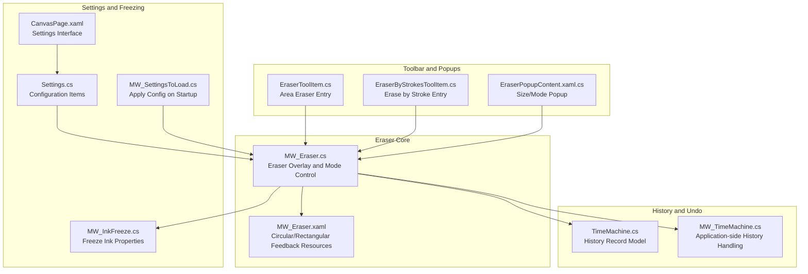
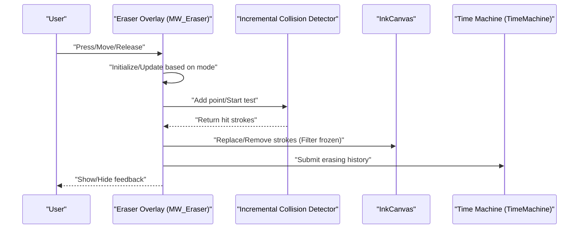
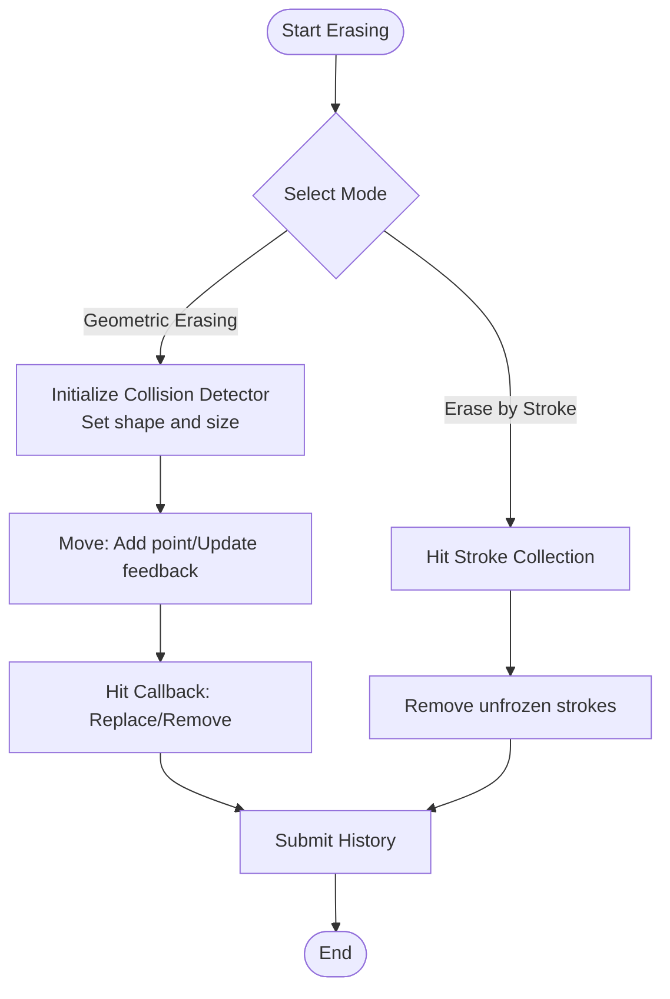
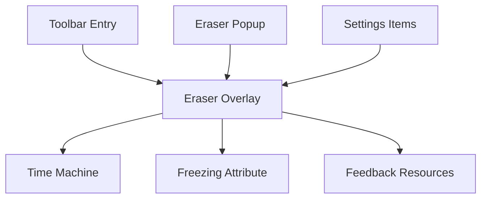

# Eraser System

## Introduction
This document systematically outlines the eraser system of InkCanvasForClass, covering the following topics:
- Eraser Modes and Implementations: Pixel-level erasing (geometric erasing), stroke-level erasing, and area erasing.
- Tool Configuration: Eraser size, shape (circular/rectangular), mode switching, auto-switch back, etc.
- History Management and Undo: Eraser operation records, undo/redo flows.
- Performance Optimization: Canvas handling, real-time erasing assurance strategies.
- User Experience and Accessibility: Interaction feedback, visual prompts, accessibility.
- Applicable Scenarios and Best Practices: Usage recommendations for different modes.

## Project Structure
The key files surrounding the eraser functionality are distributed as follows:

## Core Components
- Eraser Overlay and Mode Control: Responsible for listening to pointer/touch events, initializing the collision detector for geometric erasing, maintaining eraser feedback (circular/rectangular), submitting history upon pen-up, and handling auto-switch back.
- Eraser Feedback Resources: Provides circular and rectangular feedback bitmap resources, dynamically adjusting display size and shape.
- Toolbar Entries: Two entries: Area Erase (geometric erase) and Erase by Stroke, corresponding to different interactions and performance characteristics.
- History and Undo: Records eraser operations through the Time Machine, supporting undo/redo, while protecting frozen pages.
- Settings and Configuration: Eraser size, shape, auto-switch back settings, and apply logic on startup.

## Architecture Overview
The eraser functionality is composed of the chain: "Input Event -> Mode Determination -> Geometric/Stroke Processing -> History Recording -> Feedback Rendering". Geometric erasing uses an incremental collision detector to replace or remove strokes as needed; stroke erasing removes unfrozen strokes directly from the collection; both are protected by freezing attributes.

## Detailed Component Analysis

### Eraser Modes and Implementation
- Geometric Erasing (Pixel-level/Area Erasing)
  - Uses an incremental collision detector. Based on the current eraser shape (circular/rectangular) and size, points are added one by one to trigger hit callbacks, and strokes are replaced or removed according to the hit results.
  - Supports real-time feedback: Displays a circular/rectangular feedback cursor during movement, positioned at the pointer location via transformation.
  - Ends testing and submits history upon release, and can then automatically switch back to the original tool.
- Stroke Erasing (Erase by Stroke)
  - Directly removes strokes from the hit stroke collection during movement, also filtering out frozen attributes.
  - Does not require a collision detector; interaction is more direct but does not support fine "pixel-level" erasing.
- Freezing Protection
  - Skips strokes with specific freezing attributes to prevent accidental deletion.

## Dependency Analysis
- Input Event Chain: Toolbar entries -> Overlay events -> Mode processing -> History submission.
- Resource Dependency: Feedback bitmap resources are coupled with size/shape settings.
- History Dependency: Erase submission relies on the Time Machine; frozen page protection relies on freezing attributes.
- Settings Dependency: Settings like size, shape, and auto-switch back run through startup loading and runtime.

## Performance Considerations
- Incremental Collision Detection
  - Uses incremental hit testing, continuously adding points only during movement, lowering the overhead of scanning the entire canvas.
- Real-time Feedback Minimization
  - Displays feedback only during the geometric erasing movement phase, reducing unnecessary rendering.
- Size and Shape Adaptation
  - Circular/rectangular feedback bitmaps match the actual erasing size, avoiding extra cost from over-scaling.
- Large Canvas Handling
  - Hit testing and replacement/removal happen on the hit collection, minimizing the impact on unhit strokes.
- Frozen Page Protection
  - Filtering by attributes avoids invalid operations on frozen strokes, improving overall throughput.

## Troubleshooting Guide
- Erasing Ineffective
  - Check if on a frozen page; if a stroke has freezing attributes, it will be skipped.
  - Verify if the current mode is correct (geometric/stroke).
- Feedback Cursor Not Showing
  - Confirm if the overlay is enabled and visible; feedback cursor is only shown during the geometric erasing movement phase.
- History Cannot Be Undone/Redone
  - Check if the Time Machine history has been cleared; verify if the current page is frozen, causing submission to fail.
- Auto-Switch Back Abnormalities
  - Check if the "Auto-switch back after erasing" setting is enabled and if the delay configuration is reasonable.

## Conclusion
This eraser system features coexisting "geometric erasing" and "stroke erasing" modes, and combined with incremental collision detection and feedback resources, delivers an efficient and intuitive erasing experience. Through the Time Machine and frozen page protection, the system balances functional completeness and safety; settings and popups further enhance configurability and ease of use. It is recommended to prioritize geometric erasing in large canvas scenarios, and combine it with auto-switch back and appropriate size/shape for the best experience.

## Appendix

### Applicable Scenarios and Best Practices for Different Eraser Modes
- Geometric Erasing (Area Erase)
  - Applicable: When precise erasing of an area is required, with smooth edges, and fitting handwritten strokes well.
  - Best Practice: Maintain a steady speed during movement, avoiding frequent starts and stops; larger sizes are suitable for large-area erasing, while smaller sizes are for detail cleanup.
- Erase by Stroke
  - Applicable: Quickly deleting entire strokes, bulk cleanup.
  - Best Practice: Suitable for unfrozen strokes; pay attention to coordinating with frozen page protection.
- Auto-Switch Back
  - Applicable: High-frequency writing-erasing-writing scenarios.
  - Best Practice: Set a reasonable delay based on usage habits to avoid accidental switching.
