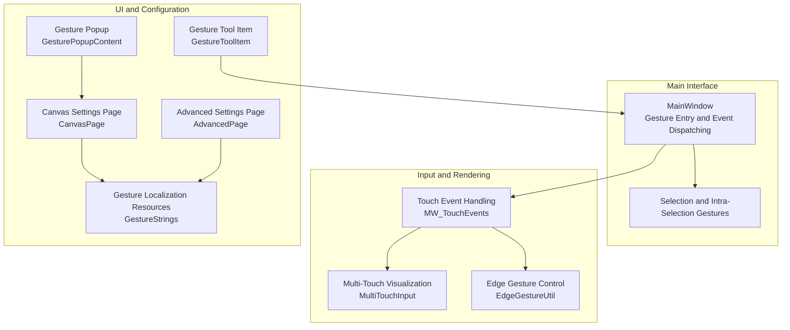
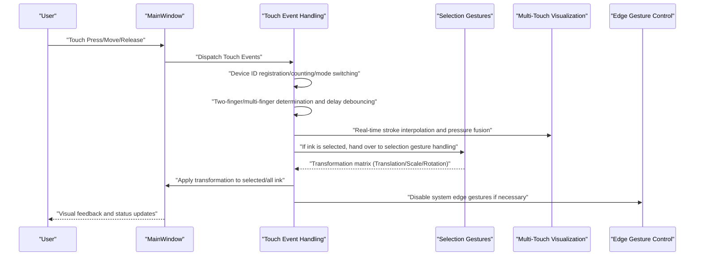
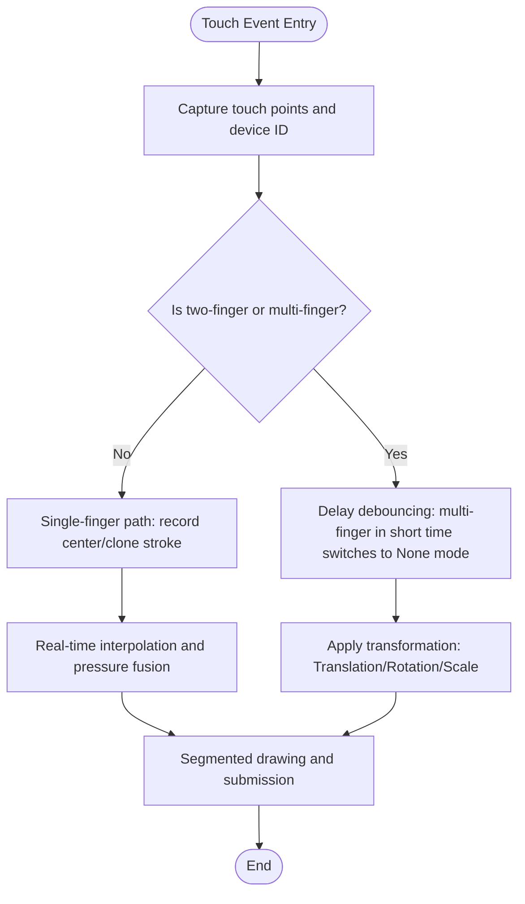
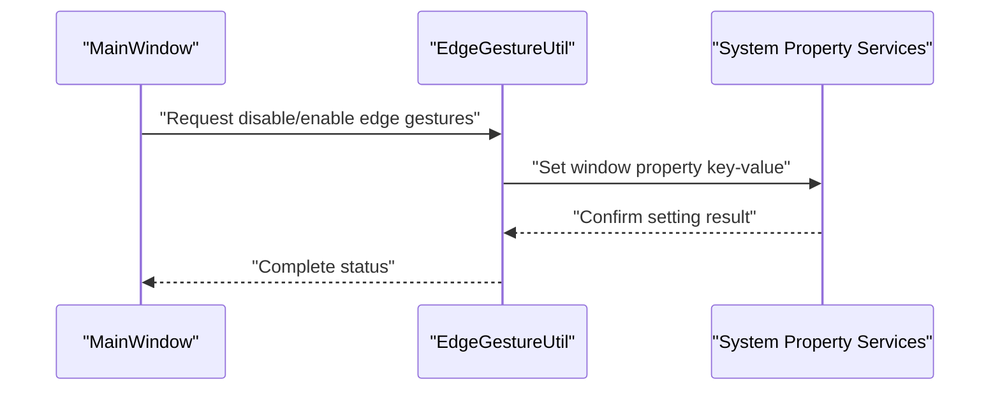
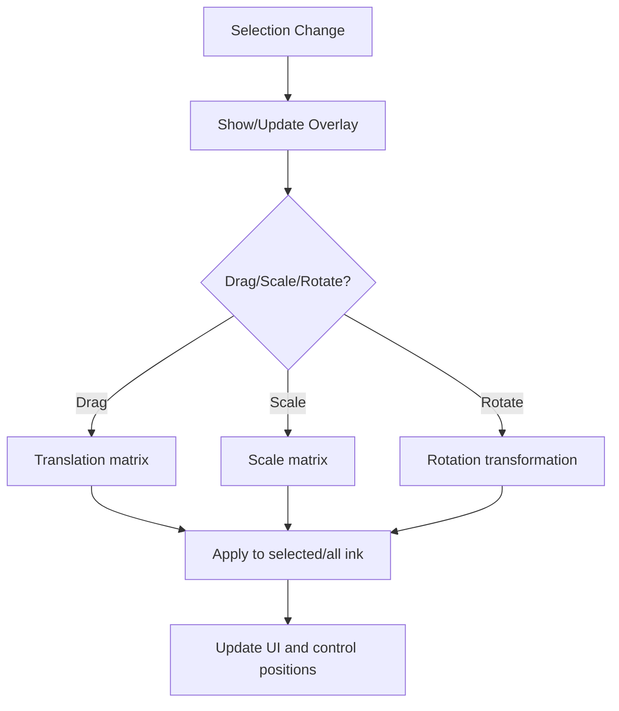
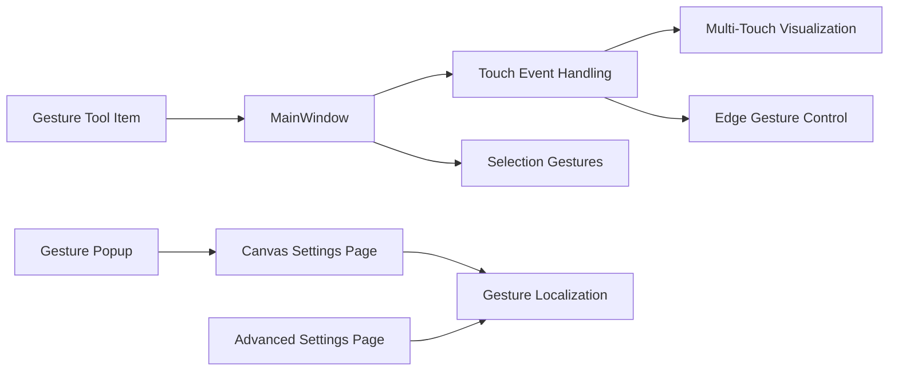

# Gesture Recognition and Interaction

## Introduction
This document systematically describes the gesture recognition and interaction capabilities of InkCanvasForClass, focusing on:
- Capture, parsing, and response workflows for multi-touch inputs.
- Implementation principles of edge gestures and palm erase (palm rejection).
- Gesture configuration options (sensitivity, custom mapping, conflict handling).
- Coordination mechanisms between gestures and traditional mouse/keyboard inputs.
- User experience optimization and accessibility support.
- Adaptation recommendations and performance optimizations for different device types.

## Project Structure
The core modules related to gesture interaction are distributed as follows:
- Main window events and gesture handling: MainWindow_cs/MW_TouchEvents.cs
- Selection and intra-selection gestures: MainWindow_cs/MW_SelectionGestures.cs
- Edge gesture disabling utility: Helpers/EdgeGestureUtil.cs
- Real-time stroke visualization and interpolation: Helpers/MultiTouchInput.cs
- Gesture popups and tool items: Controls/Popups/GesturePopupContent.xaml.cs, Controls/Toolbar/Items/GestureToolItem.cs
- Settings page and localization: Windows/SettingsViews/Pages/CanvasPage.xaml.cs, Windows/SettingsViews/Pages/AdvancedPage.xaml.cs, Properties/GestureStrings.Designer.cs

## Core Components
- Touch Events and Multi-Touch Processing: Responsible for capturing touch, managing device IDs, determining two-finger/multi-finger gestures, real-time stroke interpolation, and pressure perception integration.
- Selection Gestures and Transformations: Provides gesture support such as dragging, scaling, and rotating when ink is selected, linking with main canvas transformations.
- Edge Gesture Disabling: Disables system edge gestures through the system properties interface to avoid conflicts with in-app gestures.
- Real-time Stroke Visualization: Utilizes DrawingVisual and StrokeVisual to provide high-quality, low-latency stroke rendering and redrawing.
- Gesture Popups and Tool Items: Provides gesture switches and status indicators, connecting to the main window gesture entry.
- Settings and Localization: Provides configuration items for gesture sensitivity, palm erase, two-finger rotation, as well as internationalized descriptions.

## Architecture Overview
The overall interaction flow starts from touch events, goes through device state management, gesture determination, and conflict resolution, proceeds to rendering and transformation application, and finally reflects on the UI and settings.

## Detailed Component Analysis

### Multi-Touch Input Processing and Real-time Strokes
- Device State Management: Maintains device ID lists, center points, last edit mode, multi-finger delay, and palm rejection states.
- Two-Finger/Multi-Finger Determination: Decides whether to enter multi-finger gesture mode or delay debouncing based on the number of devices, setting switches, and current edit mode.
- Real-time Stroke Interpolation: Performs linear or Bezier interpolation on touch points, combined with direction vectors and distance, to generate smooth trajectories.
- Pressure and Velocity Fusion: Dynamically calculates stroke width and pressure based on sample rates, speed, and hardware pressure factors, reducing jitter and improving visual appeal.
- Visualization and Redrawing: Segmented drawing via StrokeVisual and DrawingVisual, submitted according to thresholds to avoid frequent redrawing.

### Edge Gestures and System Integration
- System Edge Gesture Disabling: Sets specific window properties through the system properties interface to disable system edge gestures, preventing conflicts with in-app gestures.
- Applicable Scenarios: Ensures user gestures are not interrupted by system edge gestures in presentation mode or full-screen whiteboard mode.

### Selection Gestures and Transformations
- Selection Overlay: Displays an overlay when ink is selected, supporting operations like dragging, scaling, rotating, and flipping.
- Transformation Matrix: Uniformly uses Matrix for translation, scaling, and rotation, applied to selected ink or all ink.
- Linking with Main Canvas: Applies transformations to images and media elements as well, maintaining consistency.

### Gesture Configuration and Localization
- Gesture Switches: Multi-finger mode, two-finger translation/scaling/rotation, selection rotation/scaling, palm erase, etc.
- Sensitivity and Thresholds: Palm erase sensitivity, special screen thresholds, touch multipliers, etc.
- Localization: Gesture titles, tips, and sensitivity texts are provided in multiple languages via resource files.

### Gesture Popups and Tool Items
- Gesture Popups: Provides switches for multi-finger mode and two-finger gestures, as well as a status indicator panel.
- Tool Items: Binds gesture buttons to the main window gesture entry for quick switching.

## Dependency Analysis
- MainWindow acts as the hub, depending on the touch event handling module, selection gesture module, and edge gesture control module.
- The touch event handling module depends on the multi-touch visualization module for real-time rendering.
- Settings pages and localization resources provide configurability and internationalization support for gesture functions.
- Tool items and popups serve as user entries, connecting to the main window gesture entry.

## Performance Considerations
- Real-time Stroke Interpolation and Pressure Fusion: Balances fluency and stability through single-element filtering and midpoint chain debouncing.
- Segmented Drawing and Threshold Submission: Reduces redrawing frequency to improve rendering efficiency.
- Hardware Acceleration and Caching: Enables hardware acceleration and cache hints to lower CPU/GPU overhead.
- Multi-Finger Delay Debouncing: Avoids accidental triggers and reduces unnecessary mode switching.
- Simultaneous Transformation of Images and Media: Applies matrices uniformly, avoiding repeated traversals.

## Troubleshooting Guide
- Gestures Not Responding
  - Check if in presentation mode and two-finger gestures are disabled.
  - Verify multi-finger mode and two-finger translation/scaling/rotation switches.
  - Check if edge gestures are intercepted by the system.
- Palm Erase Accidental Triggers
  - Adjust palm erase sensitivity and thresholds.
  - Calibrate touch multiplier on special screens.
- Stroke Jitter or Discontinuity
  - Check pressure and velocity fusion parameters.
  - Verify if hardware pressure is disabled.
- Abnormal Selection Transformation
  - Verify selected ink quantity and boundaries.
  - Check if rotation/scaling inside selection is enabled.

## Conclusion
The gesture system of InkCanvasForClass centers around multi-touch, combined with edge gesture disabling, selection transformation, and real-time stroke rendering, forming a complete input-processing-feedback loop. With rich configuration options and localization support, it meets both professional scenario demands and ease-of-use/accessibility goals. It is recommended to tune sensitivity and performance parameters as needed on different device types to ensure the best user experience.

## Appendix
- Device Adaptation Suggestions
  - Touchpad: Moderately increase two-finger translation thresholds, enable pressure fusion.
  - Touchscreen: Enable edge gesture disabling, calibrate touch multiplier.
  - Stylus: Retain pressure and velocity fusion, turn off palm erase.
- Accessibility Support
  - Provide gesture switches and status prompts.
  - Support keyboard alternative actions (such as select all, delete, copy).
  - Provide high-contrast themes and large font options.
