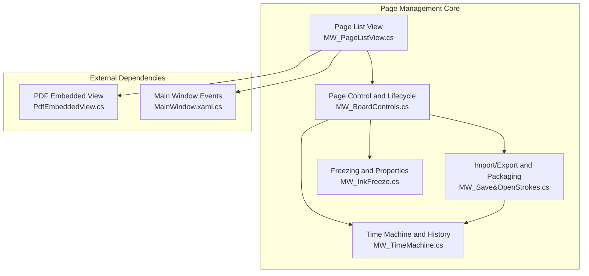
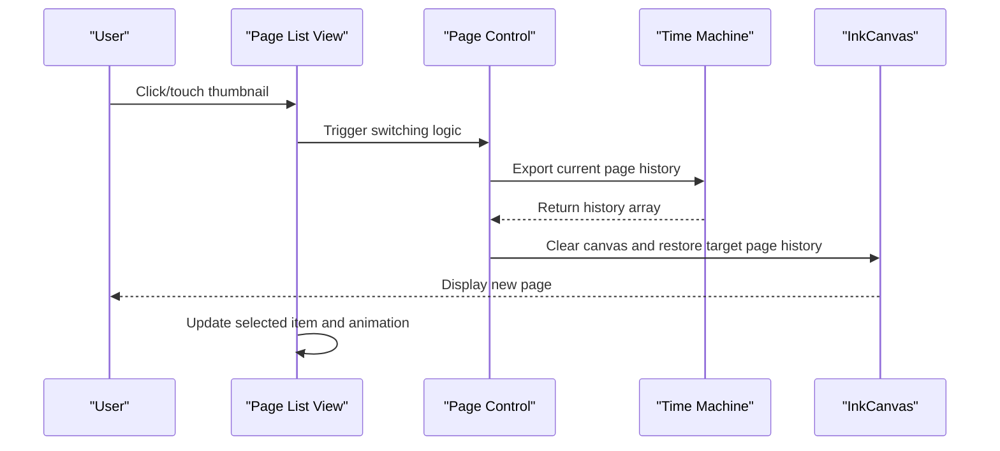
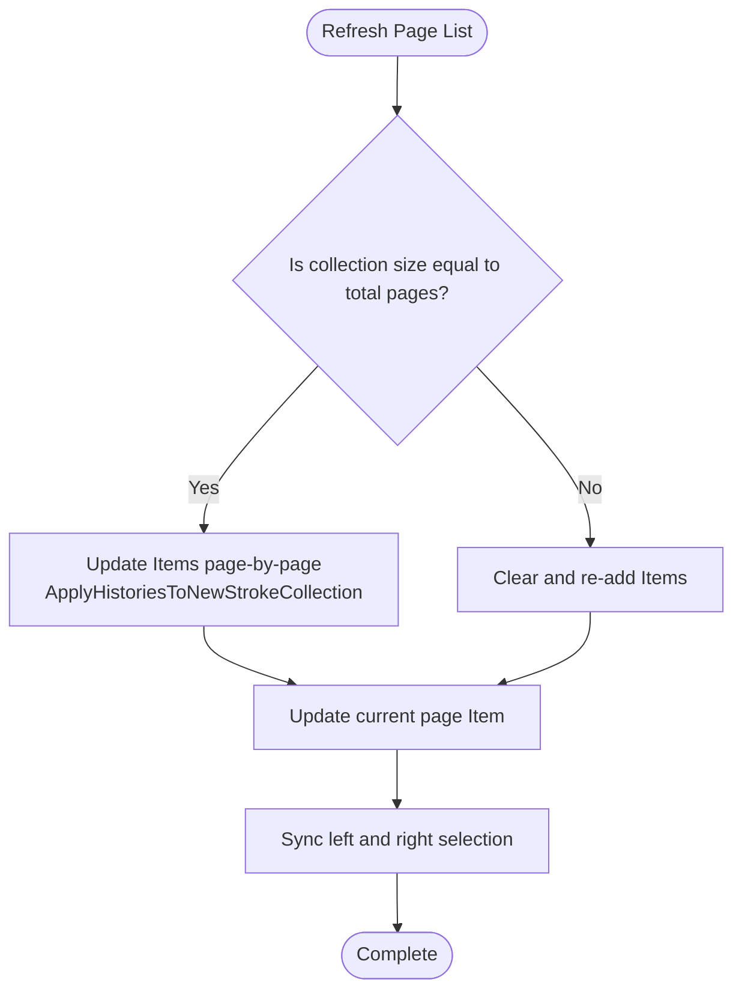
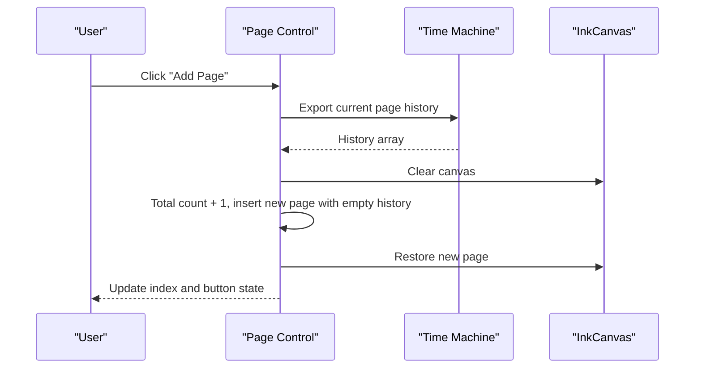
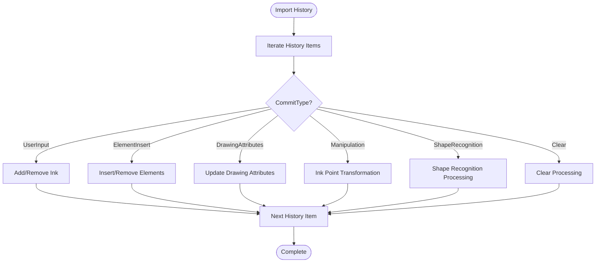
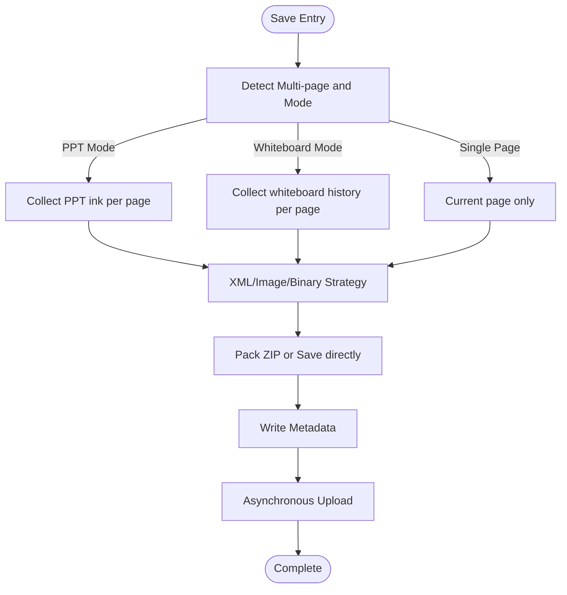
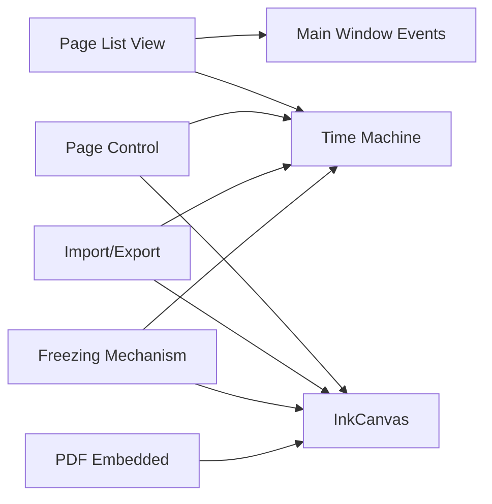

# Page Management Functionality

## Introduction
This document focuses on the page management functionality of InkCanvasForClass, systematically explaining the implementation principles and engineering practices of multi-page support, covering the following key topics:
- Creation, management, and destruction mechanisms of Canvas objects.
- Generation, switching, and interaction of the page list view (thumbnails).
- Adding, deleting, renaming, and sorting of pages.
- Persistence of page state (serialization and deserialization).
- Implementation concepts for page template systems and custom styles.
- Technical implementation and performance optimization strategies for page import and export.

## Project Structure
The page management functionality is primarily distributed across multiple parts of MainWindow:
- Page list view and interaction: MW_PageListView.cs
- Page lifecycle and state management: MW_BoardControls.cs
- History and state persistence: MW_TimeMachine.cs
- Import/Export and multi-page packaging: MW_Save&OpenStrokes.cs
- Freezing protection and page properties: MW_InkFreeze.cs
- PDF page embedding and paging: PdfEmbeddedView.cs
- Main window events and touch interaction: MainWindow.xaml.cs

## Core Components
- Page List View and Thumbnail Generation: Responsible for building ink snapshots for each page, generating thumbnails, and supporting click/touch switching.
- Page Lifecycle Management: Responsible for adding, deleting, and moving pages, maintaining the current page index and total pages.
- History and State Persistence: Records ink, inserted elements, property changes, etc., via the Time Machine, supporting flattening to optimize performance.
- Import/Export and Packaging: Supports XML/ICSTK/image packaging of multi-page ink, along with element metadata saving.
- Freezing and Page Properties: Provides page freezing protection, status tagging, and security verification.

## Architecture Overview
Page management revolves around a three-tier structure: "History Records + Canvas State + Thumbnails":
- History Records: An array of TimeMachineHistory, recording ink, inserted elements, property changes, etc., for each page.
- Canvas State: The ink and child element collection of the current InkCanvas, coordinating with clear/restore workflows.
- Thumbnails: Replayed on a temporary canvas based on history records, generating an ink snapshot of each page as a thumbnail.

## Detailed Component Analysis

### Page List View and Thumbnail Generation
- Data Model: PageListViewItem contains page index and ink collection.
- List Refresh: Traverses all pages, generates ink snapshots based on ApplyHistoriesToNewStrokeCollection, clips them to the canvas boundary, and updates the ObservableCollection.
- Interaction Logic: Supports mouse/touch hit testing, locating the ListViewItem, triggering saving the current page, clearing the canvas, switching indexes, restoring the target page, and updating the index display and selection state.
- Animation and Scrolling: Hides borders after switching and scrolls to the top of the current page container, ensuring the list aligns with the canvas state.

### Page Lifecycle and State Management
- Add Page: Saves current page history, clears the canvas, increments total count by 1, inserts a new page (with empty history), restores the new page, and updates button states and index displays.
- Delete Page: Checks the freezing status; if not the current page, shifts subsequent pages forward. When deleting the current page, flattens subsequent page history to optimize performance; updates total count and indexes.
- Switch Page: Saves the current page, clears the canvas, switches the index, restores the target page, and updates the index display and button states.
- Multi-Finger Mode State: Saves/restores multi-finger writing mode states per page, improving cross-page consistency.

### History and State Persistence
- History Record Types: User input, shape recognition, ink operations, drawing attributes, clear, element insertion, etc.
- Applying History: Respectively processes ink addition/removal, element insertion/removal, attribute changes, etc., according to type.
- Flattening Optimization: Replays history to a temporary canvas before deleting a page, exporting "final state only" to reduce lag caused by lengthy histories.
- Element Processing: Uniformly processes positions and events after batch adding elements, reducing layout jitter.

### Import/Export and Multi-Page Packaging
- Multi-Page Detection: Decides whether to save as multi-page based on mode (PPT/Whiteboard) and page count.
- Saving Strategies:
  - XML Mode: Single page saved as XML, multiple pages saved as a ZIP containing multiple XML files and metadata.
  - Image Mode: All pages saved as an image ZIP pack, including per-page images and metadata.
  - Binary Mode: Single page saved as .icstk, multiple pages saved as multiple .icstk files and metadata.
- Metadata: Saves element types, positions, dimensions, PDF current page and total pages, etc.
- Asynchronous Upload: Asynchronously uploads files after saving is completed to avoid blocking the UI.

### Freezing and Page Properties
- Freezing Mechanism: Prevents modification under non-cursor tools by attaching freezing attribute tags to ink; synchronizes to current page ink when switching freezing states.
- Security Verification: Unfreezing requires secondary verification (password/TOTP) to prevent accidental operations.
- Property Tagging: Records the latest user ink modification time for each page, facilitating auditing and tracking in course/classroom scenarios.

### PDF Page Embedding and Paging
- Initialization: Initializes based on PDF path and pages, supporting compression of large images and current page switching.
- Paging Control: Provides previous/next page usability determination and label text updates.

## Dependency Analysis
- The page list view relies on history records to generate thumbnails and relies on main window touch/mouse event handling.
- Page control relies on the Time Machine to export/import history and relies on the InkCanvas clear/restore workflow.
- Import/export relies on the Time Machine to generate multi-page ink snapshots and relies on element metadata collection.
- Freezing mechanisms rely on the Time Machine's ink property tagging and tool mode switching.

## Performance Considerations
- History Flattening: Replays history on a temporary canvas before deleting pages, exporting "final state only," significantly reducing page-flipping lag.
- Batch Element Processing: Binds positions and events uniformly after page restoration, lowering layout jitter and multiple layout updates.
- Asynchronous Upload: Asynchronously uploads files after saving, avoiding blocking the UI thread.
- Thumbnail Generation: Applies only ink history and does not include element insertion, avoiding increases in thumbnail rendering complexity.
- Multi-finger Mode State Caching: Saves multi-finger mode states per page, reducing repetitive checks during switching.

## Troubleshooting Guide
- Page Switching Ineffective: Check if the current page is frozen, as modification is forbidden under frozen states; verify if history records are correctly imported/exported.
- Thumbnails Not Updating: Confirm if RefreshBlackBoardSidePageListView is called and if ApplyHistoriesToNewStrokeCollection correctly generates ink snapshots.
- Deleting Page Throws Error: Verify that total pages is greater than 1 and not in a frozen state; check if the flattening process succeeds.
- Export Failed: Check save path permissions, ZIP compression library availability, and network upload status; check log outputs.
- PDF Paging Unavailable: Verify that the PDF path and pages are valid, and the current page index is not out of bounds.

## Conclusion
Page management functions implement stable and efficient multi-page support through the cooperative design of "History Records + Canvas State + Thumbnails." Strategies such as history flattening, batch element processing, and asynchronous upload effectively improve performance and user experience. The import/export module supports multiple formats and modes, meeting the diverse demands of teaching and presentation scenarios. The freezing mechanism and security verification further enhance control and safety in classroom settings.

## Appendix
- Page Template System and Custom Style Suggestions:
  - Templates: Export based on the "final state" of history records to serve as a template baseline; layouts of ink and elements can refer to templates when new pages are created.
  - Styles: Uniformly manage styles such as colors, widths, and highlighting through drawing attribute history and element insertion history; protect template pages using the freezing mechanism.
- Page Sorting and Renaming:
  - Sorting: Implemented by moving page indexes; pay attention to maintaining synchronization between the history array and multi-finger mode states.
  - Renaming: Edit entries can be provided in the UI layer, keeping consistency through history flattening and state persistence.
