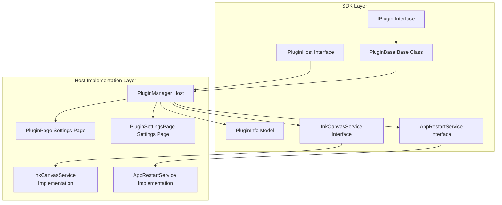
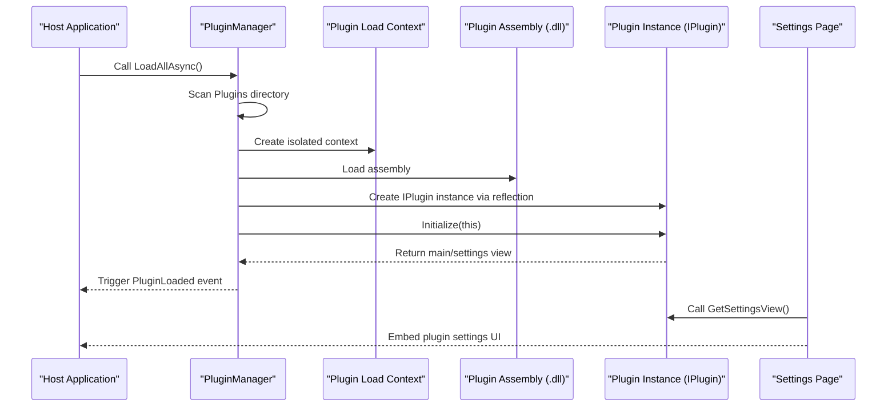
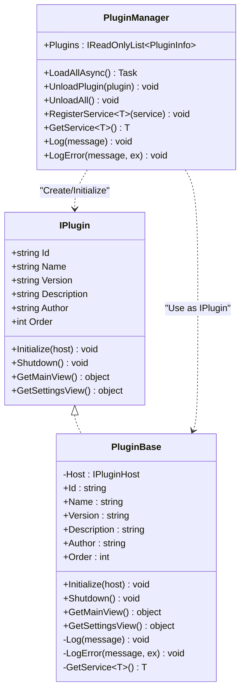
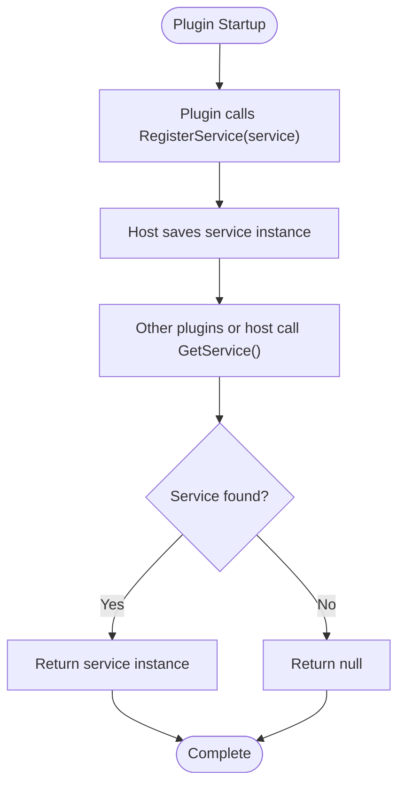
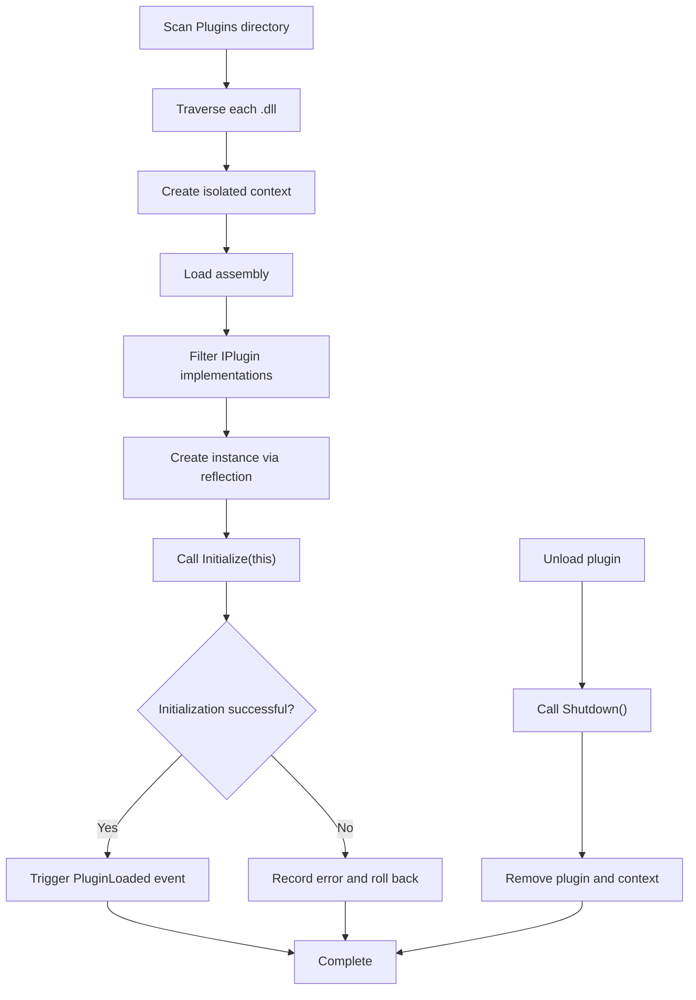
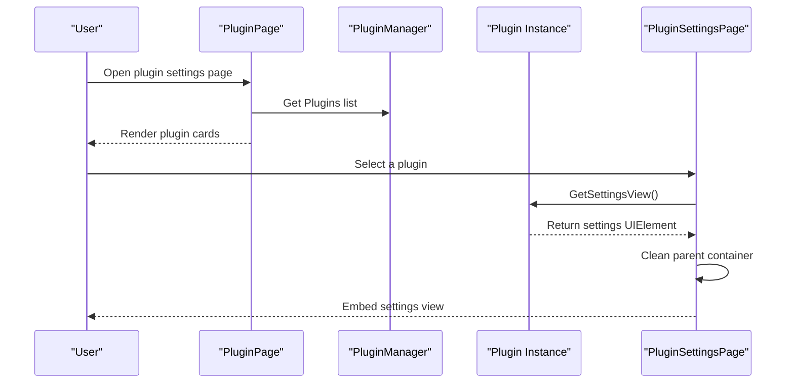
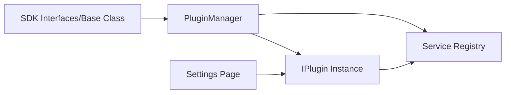

# Plugin System Architecture

## Introduction
This document systematically outlines the design concept and implementation principles of the InkCanvasForClass plugin system, covering plugin interface standards, host service responsibilities, lifecycle management, dynamic loading mechanisms, service registration and dependency management, error isolation and logging, UI integration, cross-plugin communication paths, and security and privilege control strategies. The goal is to help developers quickly understand and build high-quality extended functionalities.

## Project Structure
The plugin system is composed of the "SDK Layer" and the "Host Implementation Layer":
- SDK Layer (InkCanvas.PluginSdk): Defines the IPlugin interface, host interface IPluginHost, base class PluginBase, plugin information model PluginInfo, and several service interfaces (such as IInkCanvasService, IAppRestartService).
- Host Implementation Layer (Ink Canvas/Plugins): Implements the plugin manager PluginManager, which is responsible for scanning, loading, initializing, and unloading plugins; provides concrete service implementations InkCanvasService and AppRestartService, and integrates plugin UIs in settings pages.

## Core Components
- IPlugin: Standard interface for plugins, defining identity, metadata, lifecycle methods, and UI retrieval methods.
- IPluginHost: The service interface exposed by the host to plugins, providing logging, exception recording, service registration, and retrieval.
- PluginBase: Base class for plugins, providing default empty implementations and convenient access to the host.
- PluginInfo: Plugin runtime information, carrying plugin instances, loading states, and sorting fields.
- PluginManager: Plugin manager, responsible for plugin discovery, assembly, initialization, unloading, event publishing, and logging.
- Concrete Services:
  - IInkCanvasService: UI control such as opening/closing the whiteboard.
  - IAppRestartService: Application restarting and permission switching.
- Settings Pages: PluginPage and PluginSettingsPage provide integration for the plugin list and settings views.

## Architecture Overview
The plugin system uses an "Interface-driven + Dynamic loading + Isolated context" design:
- Plugins participate in the system by implementing the IPlugin interface.
- The host scans *.dll files in the Plugins directory using PluginManager, loading and unloading them based on custom AssemblyLoadContext to ensure isolation and collectability between plugins.
- Plugins register services, retrieve services, and record logs via IPluginHost, achieving loosely coupled interaction with the host.
- Settings pages integrate plugin UIs into the application interface by calling GetMainView/GetSettingsView of the plugins.

## Detailed Component Analysis

### IPlugin Interface and PluginBase Base Class
- IPlugin defines identity, metadata, lifecycle methods, and methods for obtaining the main view and settings view.
- PluginBase provides default empty implementations to facilitate quick inheritance for plugins, while wrapping access to IPluginHost to unify logging and service retrieval entries.

### IPluginHost and Service Registration
- IPluginHost provides capabilities for logging, exception recording, generic service registration, and retrieval.
- PluginManager implements IPluginHost, maintaining a service dictionary internally, supporting plugins to register services with the host, and allowing plugins to obtain required capabilities via GetService.

### Dynamic Loading and Unloading Mechanism
- PluginManager scans the Plugins directory when the application starts, supporting *.dll files in the top-level and subdirectories.
- Custom AssemblyLoadContext is used to load plugins, ensuring dependency resolution and collectability.
- The PluginLoaded event is triggered after successful initialization; the plugin's Shutdown is called and the context is released during unloading.

### Plugin UI Integration and Settings Pages
- PluginPage lists the basic information of loaded plugins.
- PluginSettingsPage obtains the settings view by calling the plugin's GetSettingsView and embeds it into the settings window, handling parent container cleanup to avoid duplicate embedding.

### Concrete Service Implementation
- InkCanvasService: Wraps UI operations on the main window, providing capabilities to open/close the whiteboard and perform asynchronous delayed opening.
- AppRestartService: Wraps application restarting and permission switching logic, available for plugins to call when needed.

## Dependency Analysis
- Plugin dependencies on the host are decoupled through IPluginHost; plugins only depend on SDK interfaces, not directly on host implementation details.
- Host dependencies on plugins are implemented through reflection and interface contracts, avoiding strong bindings at compile time.
- Service dependencies are uniformly managed through IPluginHost.RegisterService/GetService, forming a loosely coupled service bus.

## Performance Considerations
- Dynamic Loading and Unloading: Using isolated contexts allows plugin assemblies to be garbage collected, reducing memory usage and the risk of version conflicts.
- Asynchronous Loading: LoadAllAsync supports concurrent scanning and initialization, but the current implementation loads assemblies sequentially. It is recommended to consider batch or parallelized optimizations when there are many plugins.
- UI Access: Calls to the WPF Dispatcher should be cautious to avoid blocking the UI thread; InkCanvasService is already wrapped with Dispatcher.Invoke, and plugins should follow the same pattern.
- Logging and Exceptions: Centralized logging and exception recording help locate issues, but excessive output affects performance. It is recommended to filter by levels.

## Troubleshooting Guide
- Plugin Not Loaded: Check if the Plugins directory exists, whether *.dll files implement the IPlugin interface, and if initialization threw exceptions.
- Unloading Failed: Verify if Shutdown correctly releases resources and if the context has been unloaded.
- UI Embedding Exception: Check if the UIElement returned by GetSettingsView is already held by a parent container; if necessary, clean the parent container before embedding.
- Log Locating: Use host log events and Debug outputs to locate issues, focusing on error stacks and messages.

## Conclusion
The plugin system centers on clear interface abstractions, strict lifecycle management, and dynamic loading mechanisms. Combined with service registration and UI integration, it delivers excellent extensibility. Through isolated contexts and event-driven loading/unloading flows, the system excels in stability and maintainability. It is recommended to further improve parallel loading, configuration persistence, and permission control strategies in subsequent versions to enhance usability and security in large-scale scenarios.

## Appendix: Plugin Development Guide and Best Practices

### Development Environment Setup
- Develop using SDK interfaces and base classes, ensuring the plugin implements IPlugin or inherits from PluginBase.
- Place plugin assemblies in the local Plugins directory, ensuring all necessary dependencies are included.

### Lifecycle and Initialization
- Complete service registration, event subscriptions, and resource initialization in Initialize; avoid time-consuming operations in the constructor.
- Release resources, unsubscribe from events, and clear states in Shutdown; ensure the plugin can be repeatedly loaded and unloaded.

### Service Registration and Cross-Plugin Communication
- Register services with the host via IPluginHost.RegisterService&lt;T&gt; for use by other plugins or the host.
- Obtain required services via IPluginHost.GetService&lt;T&gt; to achieve loosely coupled communication.

### User Interface Integration
- Return UIElement via GetMainView/GetSettingsView, and the settings page will automatically embed it.
- Take care in handling the parent container of the UIElement to avoid exceptions caused by duplicate embedding.

### Security Mechanisms and Permission Control
- Plugins run in isolated contexts, reducing direct coupling with the host.
- For operations requiring high permissions (such as restarting), it is recommended to provide controlled entries via IAppRestartService and prompt users for confirmation in the UI.
- It is recommended to declare minimum permission requirements in plugin metadata to help users make informed decisions.

### Configuration Management and Persistence
- Plugins can access configuration storage (e.g., the application-provided configuration manager) through host-registered services, avoiding direct file system access.
- It is recommended to provide configuration export/import functions in settings pages to improve user experience.

### Packaging and Release
- Compile the plugin into a standalone .dll and place it along with necessary dependencies in the Plugins directory.
- Specify Id, Name, Version, Author, Description, and Order clearly in plugin metadata to ensure correct display and sorting.
- Perform compatibility tests before release to verify loading, initialization, settings page embedding, and unloading flows.
