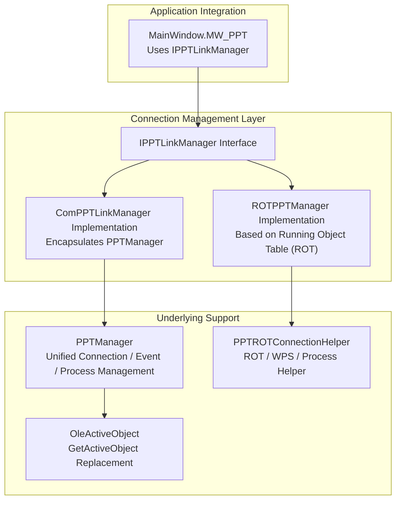
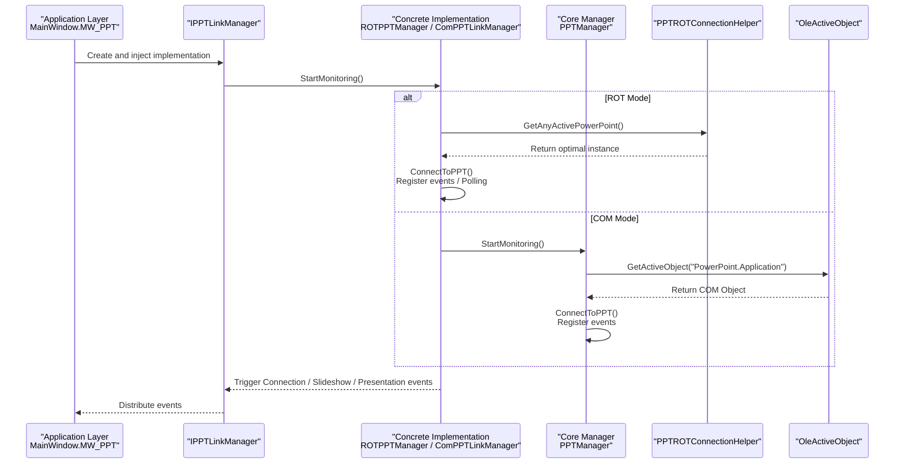
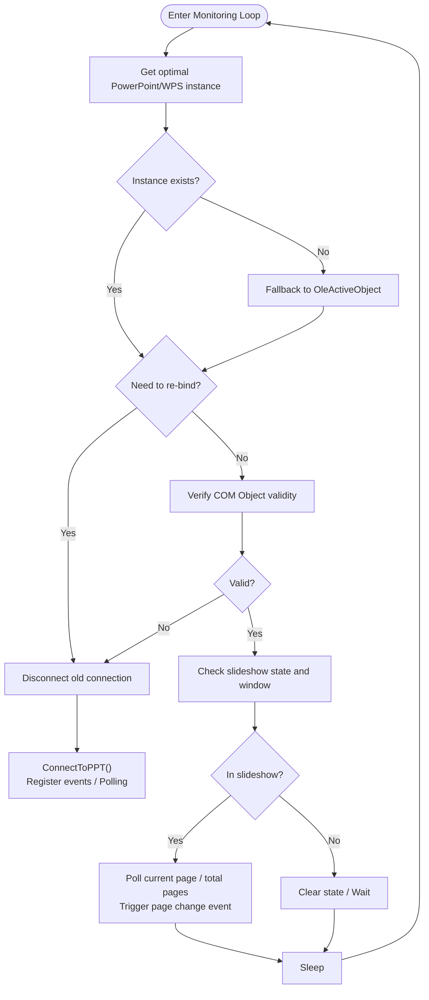
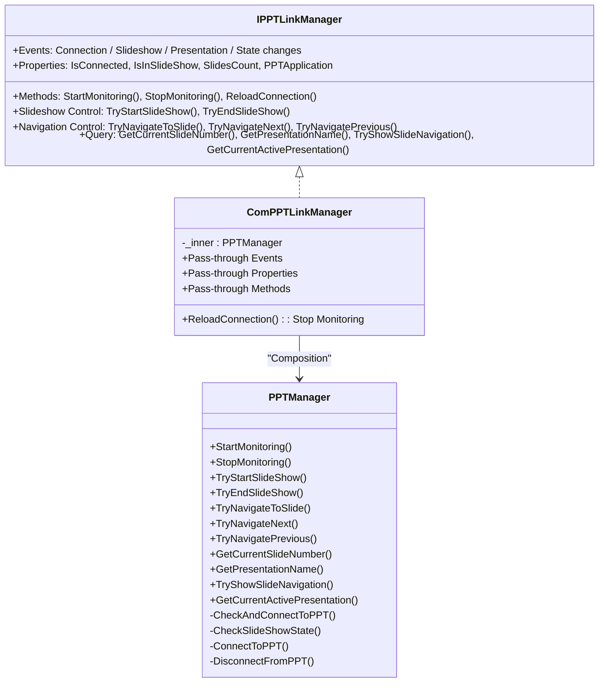
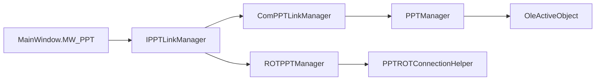

# Connection Management Mechanism

## Introduction
This document systematically outlines the PowerPoint connection management mechanism, focusing on interface design, two connection modes (ROT and COM), the connection establishment process, status monitoring and event handling, disconnection reconnection strategies, and common troubleshooting. The goal is to help developers and maintainers quickly understand and efficiently locate and resolve connection-related issues.

## Project Structure
Code directly related to connection management is mainly concentrated in the interfaces and implementation classes under the Helpers directory, as well as the integrated use of the connection manager in the main window. The overall design adopts a layered approach of "interface abstraction + two implementations", making it easy to select the optimal strategy in different scenarios.

## Core Components
- IPPTLinkManager: Defines the unified contract of the connection manager, including events, properties, lifecycle management, slideshow control, navigation control, and query capabilities.
- ROTPPTManager: Scans PowerPoint/WPS instances based on the Running Object Table (ROT), dynamically binding COM objects. It is event-driven with a polling fallback, and features reconnection and backoff strategies.
- ComPPTLinkManager: A lightweight wrapper that exposes the capabilities of PPTManager as IPPTLinkManager, facilitating unified integration.
- PPTManager: A unified PowerPoint/WPS connection and event manager. It is a timer-driven state machine responsible for connections, slideshow states, event registration/unregistration, resource release, and module unloading.
- PPTROTConnectionHelper: A ROT/WPS/process helper tool, providing instance priority determination, window foreground determination, and safe release of COM objects.
- OleActiveObject: An equivalent replacement for GetActiveObject in .NET Core/5+, used to directly obtain active PowerPoint/WPS objects.
- MainWindow.MW_PPT: The application-layer integration point, holding an IPPTLinkManager instance, subscribing to its events, and driving UI logic.

## Architecture Overview
Differences and selection between the two connection modes:
- ROT Mode (ROTPPTManager)
  - Enumerates the ROT via PPTROTConnectionHelper, prioritizing windows that are in slideshow mode and in the foreground, and dynamically binds COM objects.
  - Primarily event-driven, with a polling fallback enabled when necessary, featuring disconnection detection and reconnection backoff.
- COM Mode (ComPPTLinkManager + PPTManager)
  - Direct access to active PowerPoint or WPS objects via OleActiveObject. Events are registered in the UI thread Dispatcher to ensure the correct thread context for COM callbacks.
  - A unified timer-driven state machine that controls the frequencies of connection checks, slideshow checks, and WPS process checks.

## Detailed Component Analysis

### IPPTLinkManager Interface Design
- Event System: Connection changes, slideshow start/end/page changes, presentation open/close, and slideshow state changes.
- Properties: Connection state, slideshow state, WPS support toggle, navigation animation skip toggle, total slide count, and PPT application object.
- Lifecycle: StartMonitoring, StopMonitoring, ReloadConnection.
- Functions: Slideshow control (start/end), navigation control (jump/next/previous), and queries (current page number, presentation name, display navigation, current presentation).

### ROTPPTManager (ROT-based Stable Mode)
- Connection Establishment
  - Selects the highest priority PowerPoint/WPS instance from the ROT using PPTROTConnectionHelper.GetAnyActivePowerPoint.
  - If no instance is found, falls back to OleActiveObject to retrieve it directly.
  - Once binding succeeds, registers COM events and determines whether to enable a polling fallback based on availability.
- Status Monitoring
  - Background thread loop: Detects COM object validity, ActivePresentation changes, SlideShowWindows count, and foreground windows.
  - Triggers events on slideshow state changes. In polling mode, periodically retrieves the current page and total page count, triggering page change events when the page index changes.
- Disconnection and Reconnection
  - Proactively disconnects and waits for reconnection when InvalidComObject/COM exceptions occur.
  - Employs an exponential backoff strategy to control reconnection frequency, preventing frequent jitter.
- WPS Support
  - Determines association with WPS/WPP processes based on the PID of the foreground window, logging and managing WPS processes.

### ComPPTLinkManager (Direct COM Mode)
- Design Concept
  - Acts as a wrapper to expose the capabilities of PPTManager via IPPTLinkManager, simplifying upper-layer integration.
  - ReloadConnection directly calls StopMonitoring to implement the semantics of "force disconnect and reconnect".
- Relationship with PPTManager
  - Pass-through Events: PresentationOpen/Close, SlideShowBegin/NextSlide/End, PPTConnectionChanged, SlideShowStateChanged.
  - Pass-through Properties and Methods: IsConnected, IsInSlideShow, SlidesCount, PPTApplication, TryStartSlideShow/TryEndSlideShow, navigation and query, etc.

### PPTROTConnectionHelper (ROT/WPS/Process Helper)
- ROT Scanning and Priority
  - Enumerates entries from IRunningObjectTable, identifying PowerPoint/WPS application and presentation objects, and calculating priorities (active presentation exists > slideshow exists > foreground slideshow exists).
- Foreground Window Determination
  - Uses GetForegroundWindow + GetWindowThreadProcessId to determine if the slideshow window is in the foreground, compatible with process name differences of WPS/WPP.
- Safe Release and Object Equality
  - SafeReleaseComObject provides exception fallback. AreComObjectsEqual uses GetIUnknownForObject to compare COM object handles, preventing reference misjudgments.

### OleActiveObject (.NET Core/5+ GetActiveObject)
- Invokes CLSIDFromProgID and GetActiveObject via P/Invoke to implement behaviors equivalent to Marshal.GetActiveObject under .NET Framework, used to directly retrieve active PowerPoint/WPS objects.

### MainWindow.MW_PPT (Application Integration Point)
- Holds an IPPTLinkManager instance, subscribing to its events to drive UI and interaction logic.
- Provides timers and state variables for enhanced experiences, such as delayed exit from PPT mode upon disconnection, and slideshow visibility detection.

## Dependency Analysis
- Interface and Implementation Decoupling: IPPTLinkManager abstracts the contract of the connection manager, with ROTPPTManager and ComPPTLinkManager satisfying different scenario requirements.
- COM Interoperability: Both implementations depend on Microsoft.Office.Interop.PowerPoint, involving COM object lifecycle management and thread context requirements.
- Thread Model: ROTPPTManager uses a background thread loop. PPTManager registers COM events in the UI thread Dispatcher to avoid cross-thread callback issues.
- External Dependencies: Win32 API (ROT/WIN32) and OleActiveObject, used for process and object table detection and retrieval.

## Performance Considerations
- Combining Polling and Events: ROTPPTManager prioritizes event-driven operations when events are available, falling back to polling otherwise, balancing real-time responsiveness with stability.
- Backoff Reconnection: Exponential backoff reduces system load caused by frequent reconnection attempts.
- Timer Throttling: PPTManager sets different checking intervals for connection, slideshow, and WPS process checks, lowering CPU utilization.
- COM Object Disposal: Unifies SafeReleaseComObject and FinalReleaseComObject to prevent handle leaks and exceptions caused by RCW detachment.

## Troubleshooting Guide
- Common COM Exceptions and Handling
  - 0x8001010A/0x80010001/0x80004005: Indicates that the COM object is busy or invalid, triggering disconnection and reconnection.
  - 0x80048240: No active presentation, requiring a wait or checking ActivePresentation.
  - Invalid COM Object: Captures InvalidComObjectException, immediately disconnecting and waiting for reconnection.
- Process Communication Troubleshooting
  - ROT Scan Failure: Confirm whether PowerPoint/WPS is registered in the ROT, and verify foreground window PID and process name matching.
  - WPS Support: When IsSupportWPS is enabled, verify if KWPP.Application can be retrieved by OleActiveObject.
- Logs and Observability
  - Critical paths are logged (connections, event triggers, exceptions, reconnections). We recommend locating issues via logs.
- Reconnection and Backoff
  - ROT mode features an built-in backoff strategy to avoid frequent retries. To force recovery, call ReloadConnection or wait for the backoff to end.

## Conclusion
This connection management mechanism, through interface abstraction and dual implementations, satisfies both ROT-based stable connections (ROTPPTManager) and direct COM binding (ComPPTLinkManager + PPTManager). The two models have different focuses regarding event-driven workflows, polling fallbacks, disconnection reconnections, WPS support, and thread models. Complemented by robust logging and exception handling, they adequately address complex scenarios and failures in actual usage.
