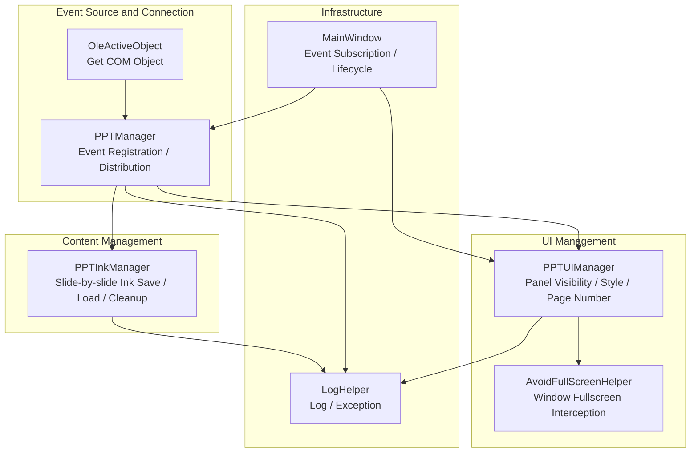
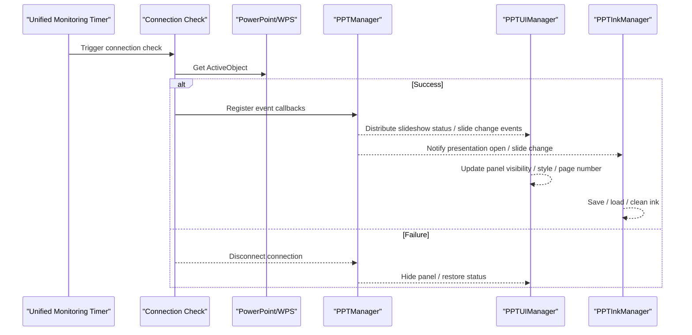
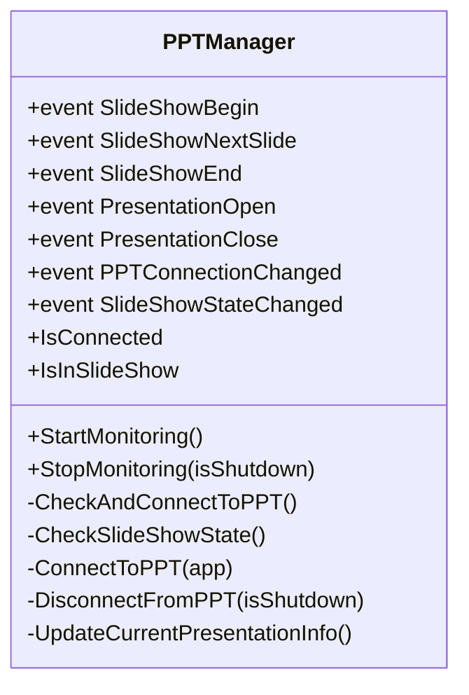
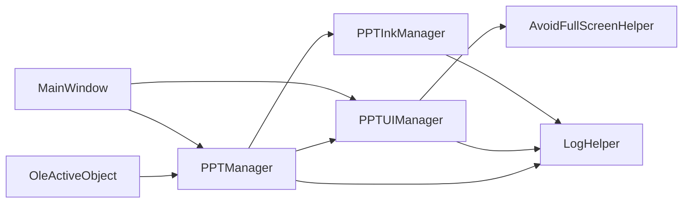

# Event Handling System

## Introduction
This document is oriented towards the PowerPoint Event Handling System, systematically outlining event classification and handling mechanisms, covering slide show events (start, end, page changes), presentation events (open, close), and user interaction event workflows. It explains the registration and unregistration mechanisms for event listeners, subscription safety, and lifecycle management; details thread safety and exception handling strategies in asynchronous mode; explains the responsibilities of PPTUIManager along with dynamic creation, position management, and state synchronization of user interface elements; and provides best practices and common diagnostic solutions for performance optimization, memory management, and user experience assurance.

## Project Structure
The key files surrounding PowerPoint event handling are organized as follows:
- Event Source and Connection Management: PPTManager (responsible for COM connections, event registration, and distribution)
- UI State and Panel Management: PPTUIManager (responsible for UI display, panel visibility, and styles in slideshow mode)
- Ink Persistence and Memory Management: PPTInkManager (responsible for slide-by-slide saving/loading of ink, auto-save, and memory reclamation)
- COM Object Acquisition: OleActiveObject (acquires active objects cross-platform)
- Fullscreen Helper: AvoidFullScreenHelper (controls window behaviors in slideshow mode)
- Logs and Exceptions: LogHelper (unified logging and recursion protection)
- Main Window Integration: MainWindow (event subscription, lifecycle management)

## Core Components
- PPTManager: Uniformly manages PowerPoint/WPS connections, event registration and distribution, slideshow state checks, presentation open/close, and slide change events.
- PPTUIManager: Dynamically updates the UI in slideshow mode, including navigation panel visibility, button styles, page number synchronization, fullscreen helper coordination, and opacity settings.
- PPTInkManager: Saves and loads ink slide-by-slide, providing auto-save, memory limit controls, and rapid-switching protection to ensure stability during slideshows.
- OleActiveObject: Achieves equivalent COM ActiveObject retrieval under the .NET Core/5+ environments.
- AvoidFullScreenHelper: Prevents the main window from entering fullscreen maximization in non-board modes, ensuring presentation experiences.
- LogHelper: Unified log outputs and recursion protection, facilitating problem isolation.
- MainWindow: Coordinates components as the event subscription entry and lifecycle management hub.

## Architecture Overview
The system employs a four-layer coordination of "Connection-Event-UI-Content":
- Connection Layer: Timer-driven connection checks, registering COM events on the UI thread upon success.
- Event Layer: Distributes slideshow events (open/close/start/end/slide change) and connection state changes.
- UI Layer: Dynamically updates panel visibility, styles, and page numbers based on slideshow status and configurations.
- Content Layer: Manages ink slide-by-slide, providing auto-save and memory reclamation to guarantee smooth experiences.

## Detailed Component Analysis

### PPTManager: Event Source and Connection Management
- Event Definitions: Slideshow events (start, end, slide change), presentation events (open, close), and connection/slideshow state changes.
- Connection Policy: Timer-based periodic checks, separating frequencies for connection checks, slideshow status checks, and WPS process checks; supports both PowerPoint and WPS dual stacks.
- Event Registration: Registers COM events on the UI thread to ensure thread affinity; unregisters on the UI thread when disconnecting, compatible with various COM exceptions.
- Status Caching: Caches connection and slideshow states to avoid frequent COM queries; degrades and disconnects promptly on exceptions.
- Lifecycle: Coordinates StartMonitoring/StopMonitoring/Dispose, safely releasing COM objects and triggering reloading logic when disconnecting.

## Dependency Analysis
- PPTManager depends on OleActiveObject to obtain COM objects, and LogHelper to record events and exceptions.
- PPTUIManager depends on MainWindow UI elements and settings, and AvoidFullScreenHelper to coordinate fullscreen.
- PPTInkManager depends on LogHelper to log memory cleanups and save failures.
- MainWindow acts as the hub coordinating event subscriptions and lifecycles of PPTManager and PPTUIManager.

## Performance Considerations
- Timer Throttling: Connection checks, slideshow checks, and WPS checks employ different tick cycles, lowering overhead.
- Thread Affinity: COM events are registered and handled on the UI thread to avoid cross-thread access risks.
- Memory Control: PPTInkManager sets memory limits and periodic cleanup policies to avoid memory bloat during long presentations.
- UI Asynchrony: PPTUIManager uses InvokeAsync/BeginInvoke to avoid blocking the UI thread.
- COM Release: Fully releases the RCW and calls FinalRelease when disconnecting, reducing handle leak risks.

[This section contains general performance advice, not directly analyzing specific files]

## Troubleshooting Guide
- Connection Failure
  - Symptom: Unable to obtain PowerPoint/WPS ActiveObject or abnormal connection status.
  - Verification: Verify if PowerPoint/WPS is running; check COM exception HR values; check connection check and disconnection logs.
- Events Not Triggered or Triggered Repetitively
  - Symptom: Slideshow start/end/slide change events missing or triggered multiple times.
  - Verification: Verify if UI thread registration is successful; check unregistration logic on disconnection; verify slideshow state cache consistency.
- UI Not Updating or Flickering
  - Symptom: Panels do not show, page numbers are out of sync, or styles are abnormal.
  - Verification: Verify Dispatcher call paths; check display options and slideshow status; verify AvoidFullScreenHelper mode toggles.
- Ink Lost or Stuttering
  - Symptom: Ink not loaded when switching slides or high memory usage.
  - Verification: Check rapid-switching protection and write locks; view memory cleanup logs; check auto-save paths and permissions.

## Conclusion
This event handling system provides a stable COM event source via PPTManager, combined with UI synchronization in PPTUIManager and content management in PPTInkManager, achieving high reliability and performance in slideshow scenarios. Clear designs exist across connection policies, thread safety, exception handling, and resource release. Complemented by logs and fullscreen helpers, they effectively enhance user experiences and system stability.

[This section contains summary content, not directly analyzing specific files]

## Appendix
- Best Practices List
  - Event registration and unregistration must occur in pairs, and unregistration must take place on the UI thread when disconnecting.
  - Use Dispatcher.InvokeAsync/BeginInvoke to update the UI, avoiding blocking.
  - Set timer tick periods reasonably to balance responsiveness and performance.
  - Control ink memory strictly, setting limits and cleaning up periodically.
  - Record critical events and exceptions, leveraging logs to locate issues.
  - Use fullscreen modes cautiously in slideshow mode, enabling AvoidFullScreenHelper when necessary.

[This section contains general suggestions, not directly analyzing specific files]
