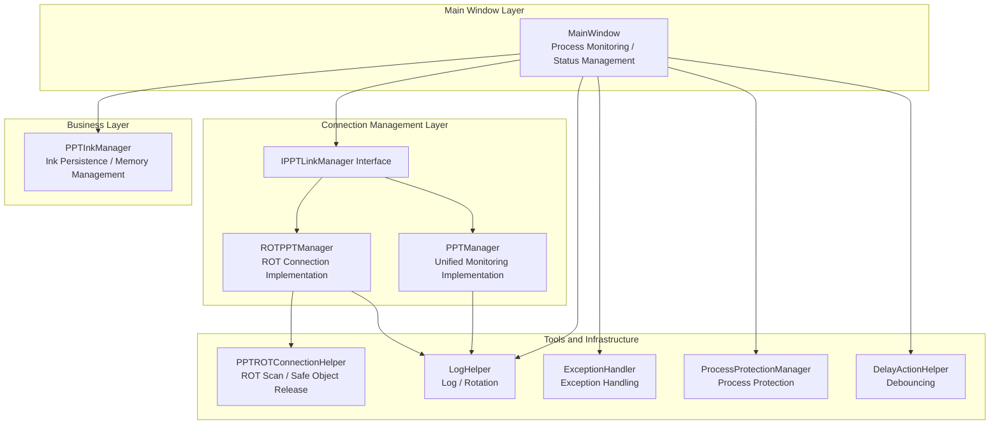
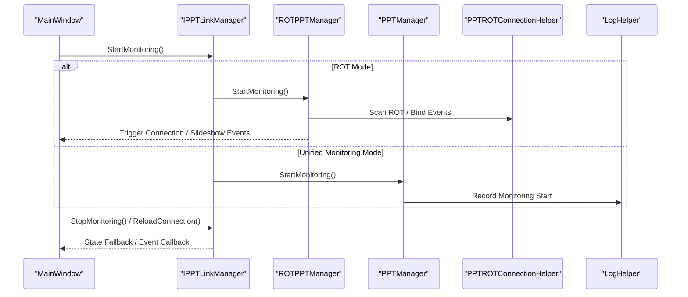
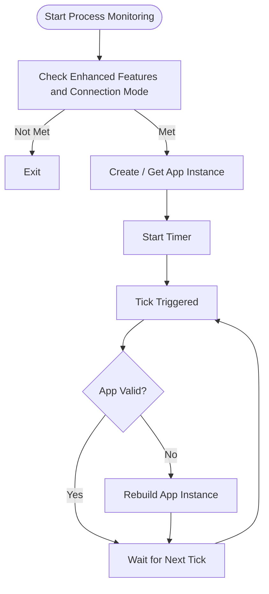
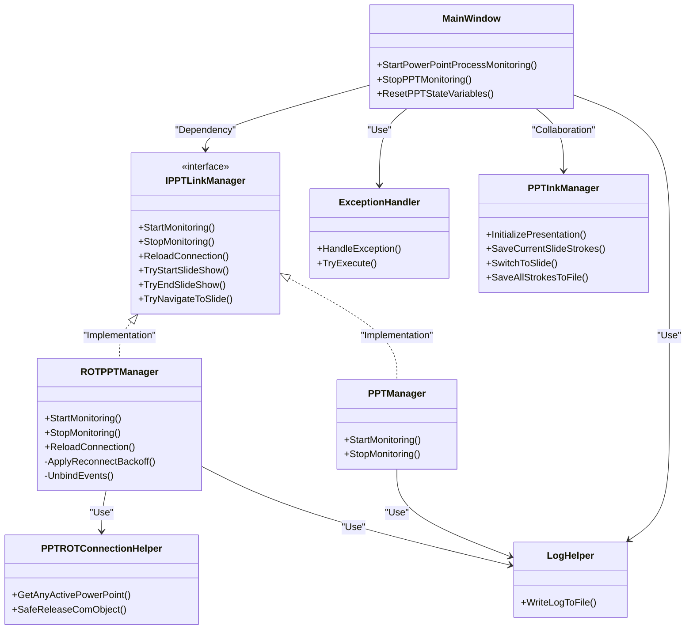
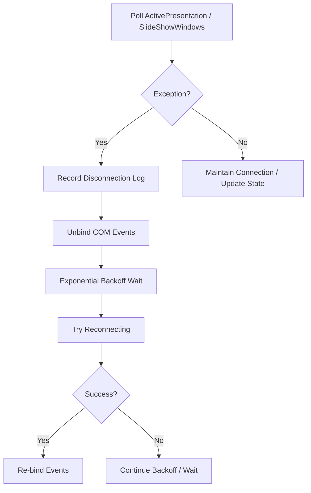

# Fault Handling and Recovery

## Introduction
This document is oriented towards PowerPoint integration scenarios, systematically outlining fault handling and recovery mechanisms, covering process monitoring, connection disconnection handling, COM object invalidation response, slideshow mode stability assurance, fault diagnosis and log analysis, as well as system-level prevention and emergency plans. The content is summarized based on the implementations in MainWindow, Helpers, and Windows layers in the repository to help developers and maintenance personnel quickly locate and resolve issues.

## Project Structure
The key modules and responsibilities surrounding PowerPoint integration are as follows:
- Main Window and State Management: Responsible for PowerPoint process daemon, delayed exit upon disconnection, slideshow mode state maintenance, etc.
- Link Manager Interface and Implementations: Abstracts the connection lifecycle, events, and navigation capabilities, supporting both ROT link and standard link modes.
- Connection Helpers and Tools: Provides common capabilities such as ROT scanning, safe COM object release, exception and log handling, process protection, and debouncing.
- Ink Management: Responsible for presentation-level ink persistence, memory management, and switching protection, ensuring stability during slideshows.

## Core Components
- Process Monitoring and Daemon
  - The main window periodically checks the PowerPoint process via a timer, rebuilding the instance if the application is found to be invalid, ensuring the availability of enhanced features.
- Link Manager
  - Uniformly abstracts the connection lifecycle and events, supporting two modes:
    - ROT Link: Scans the ROT table in a background thread, binds COM events, and features disconnection backoff and event unbinding/re-binding logic.
    - Unified Monitoring: Timer-driven connection checks and state polling.
- COM Object Safety
  - Provides object validity detection, final release, and exception filtering, avoiding crashes caused by RPC/object disconnections.
- Logs and Exceptions
  - Structured logging, log rotation, and process protection. Exception handling policies distinguish between fatal and non-fatal errors.
- Ink Stability
  - Presentation-level ink persistence, memory limits and cleanup, write locks, and rapid-switching protection, minimizing the risk of data loss during slideshows.

## Architecture Overview
PowerPoint integration adopts a layered design of "MainWindow coordination + Link Manager abstraction + Tool layer support". The main window handles high-level states and UI coordination, the Link Manager handles connections and events with PowerPoint, and the Tool layer provides cross-cutting capabilities such as logging, exceptions, COM safety, and process protection.

## Detailed Component Analysis

### Process Monitoring and Auto-Restart
- Monitoring Entry and Conditions
  - The daemon is started only when enhanced features are enabled and the ROT link is not in use.
  - Upon startup, it creates a PowerPoint application instance and starts the timer.
- Detection and Rebuilding
  - The timer Tick checks the application's validity, rebuilding it if invalid.
  - Clearing delayed exit timers and preview caches when stopping monitoring.
- User Experience
  - Delayed exit from PPT mode upon disconnection to prevent accidental clicks.

## Dependency Analysis
- The main window depends on the link manager interface, with interchangeable concrete implementations (ROT/Unified Monitoring).
- The link manager depends on connection helpers and logging tools. ROTPPTManager also depends on COM event binding.
- The ink manager is independent of the link layer, but collaborates with the main window to perform data protection during slideshows.
- Exceptions and logging span all layers, while process protection provides extra reliability on write paths.

## Performance Considerations
- Polling and Backoff
  - ROT manager applies exponential backoff to disconnection reconnections, avoiding CPU spikes from frequent retries.
- Memory and I/O
  - The ink manager defines memory limits and cleanup cycles, automatically deleting useless files to balance memory and disk I/O.
- Threads and Synchronization
  - The main window uses DispatcherTimer, and the link layer uses background threads to avoid blocking the UI. COM callbacks and UI updates are processed via synchronization contexts.
- Logs and Writes
  - Log writes employ mutual exclusion and process protection to prevent file lock contention from high-concurrency writes.

## Troubleshooting Guide

### Common Errors and Positioning
- Process Monitoring Not Taking Effect
  - Check if enhanced features are enabled and ROT link is not in use; verify the timer is started.
  - Look for events like "PowerPoint application daemon started/failed" in logs.
- Frequent Disconnections
  - Check if disconnection backoff takes effect; verify if the HResult belongs to disconnection categories (RPC/Object Disconnection/Server Death).
  - Verify if event unbinding and re-binding processes are normal.
- COM Object Exceptions
  - Look for "COM Exception when releasing COM object" logs; verify if they are ignorable disconnection exceptions.
  - Insert object validity checks before UI calls.
- Crash or Stutter during Slideshow
  - Check if memory cleanup is timely; confirm if write locks and rapid-switching protection are triggered.
  - Review degradation records for specific HResults in the global exception handler.

## Conclusion
This integration solution implements high availability and stability for PowerPoint integration through five-dimensional coordination of "process daemon + connection monitoring + COM safety + ink protection + logs and exceptions". In slideshow mode, mechanisms such as disconnection backoff, event unbinding/re-binding, delayed exit, and memory cleanup jointly safeguard user experiences and data safety. We recommend enabling process protection and log rotation in production environments, and utilizing the troubleshooting methods in this document to quickly isolate and resolve issues.

## Appendix

### Key Flowchart: Disconnection Detection and Recovery

