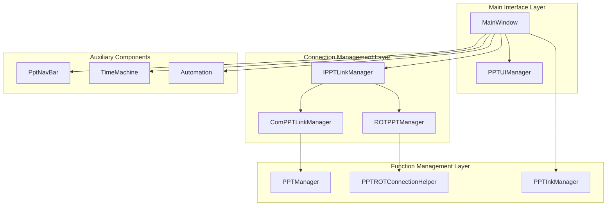
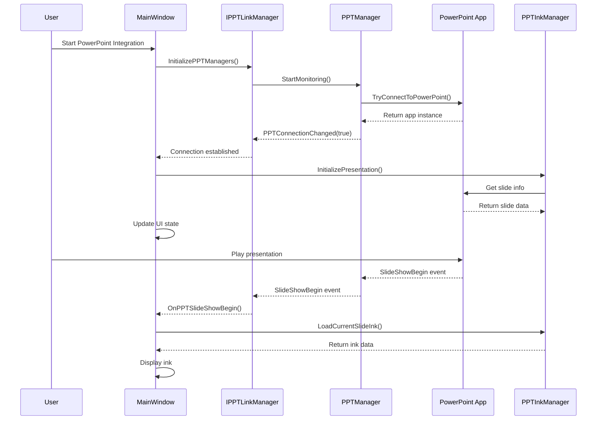
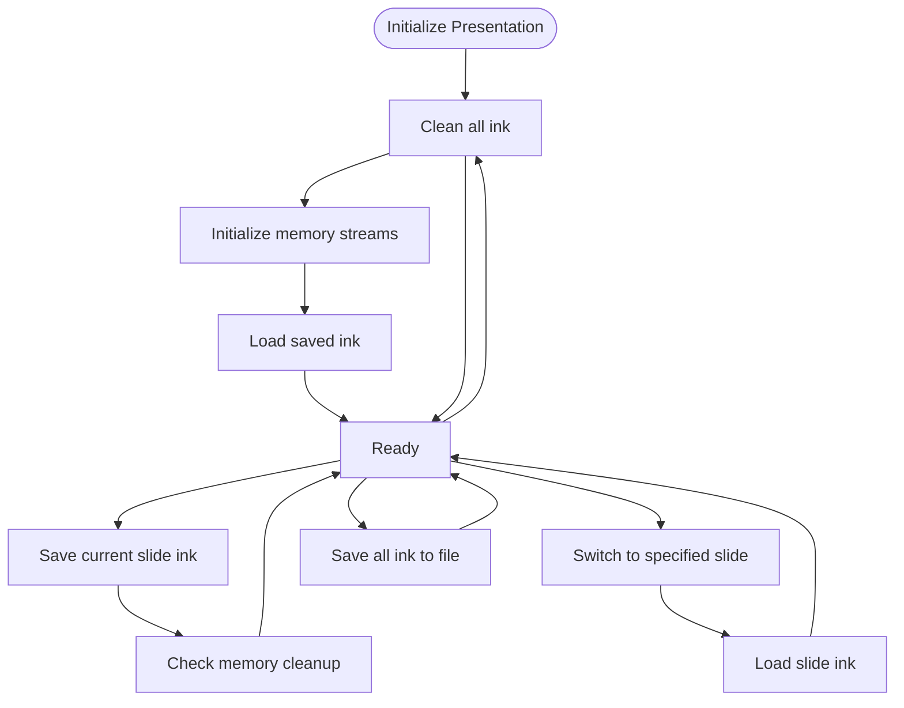
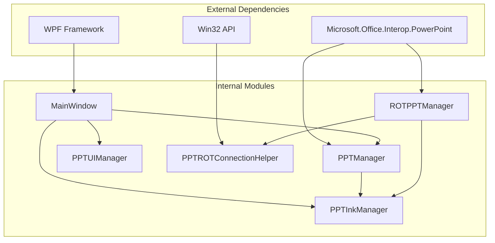
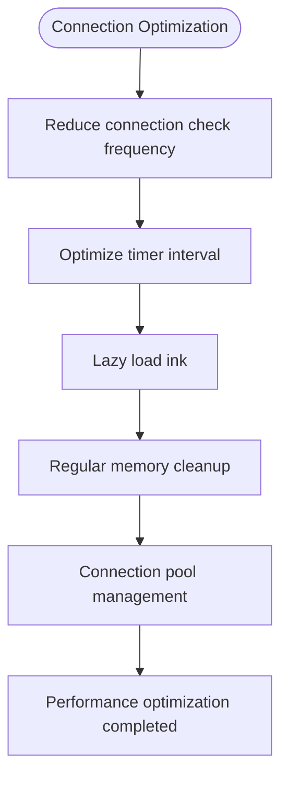

# PowerPoint Integration Feature

## Introduction

The PowerPoint integration feature of InkCanvasForClass is a complete presentation mode solution, providing deep integration with Microsoft PowerPoint and WPS Presentation. This feature achieves real-time ink synchronization, slide navigation synchronization, multi-monitor support, and stable connection management mechanisms.

The system adopts a dual-architecture design, supporting traditional connections based on COM objects and modern connections based on the Running Object Table (ROT), ensuring compatibility with different versions of Office applications.

## Project Structure

The PowerPoint integration feature is mainly distributed across the following modules:

## Core Components

### PPTInkManager - Ink Manager

PPTInkManager is the core component of the PowerPoint integration feature, responsible for managing ink data in presentations. Its main features include:

- **Memory Management**: Intelligent memory stream array management, supporting dynamic scaling and garbage collection.
- **Auto-Save**: Ink persistence mechanism based on the file system.
- **Concurrency Control**: Thread safety ensured via locking mechanisms.
- **Memory Cleanup**: Automatically monitors memory usage and cleans up ink from inactive pages.

### PPTManager - Connection Manager

PPTManager provides a stable connection to PowerPoint applications, supporting the following features:

- **Process Detection**: Automatically detects PowerPoint and WPS processes.
- **Event Listening**: Listens in real time to presentation opening, closing, and slideshow state changes.
- **State Synchronization**: Maintains state synchronization with PowerPoint applications.
- **COM Object Management**: Safely manages the COM object lifecycle.

### PPTUIManager - UI Manager

PPTUIManager is responsible for user interface management in PowerPoint mode:

- **State Display**: Updates connection and slideshow status in real time.
- **Navigation Control**: Manages the showing and hiding of the navigation panel.
- **Style Settings**: Adjusts interface appearance based on settings.
- **Fullscreen Processing**: Supports special handling for fullscreen slideshow modes.

## Architecture Overview

The PowerPoint integration feature adopts a layered architectural design, ensuring low coupling and high cohesion between modules:

## Detailed Component Analysis

### PPTInkManager Workflow

PPTInkManager implements complete ink lifecycle management:

## Dependency Analysis

The dependencies of the PowerPoint integration feature are as follows:

## Performance Considerations

### Memory Management Optimization

The system employs multiple memory management strategies to ensure performance:

1. **Intelligent Memory Stream Management**: Uses fixed-size memory stream arrays supporting dynamic scaling.
2. **Automated Memory Cleanup**: Monitors memory usage and automatically cleans up inactive pages when exceeding the threshold.
3. **Memory Usage Limit**: Sets a maximum memory limit (default 100MB).
4. **Garbage Collection Optimization**: Timely releases memory streams no longer in use.

### Connection Performance Optimization

## Troubleshooting Guide

### Common Issues and Solutions

#### Connection Issues

| Issue Type | Symptom | Solution |
|---------|------|----------|
| PowerPoint not started | Connection status shows disconnected | Start the PowerPoint application |
| COM object invalidated | Throws InvalidComObjectException | Reconnect or restart the application |
| WPS compatibility issues | WPS does not work normally | Disable WPS support or update to the latest version |
| Out of memory | Application responds slowly | Free memory or increase system memory |

#### Ink Synchronization Issues

| Issue Type | Symptom | Solution |
|---------|------|----------|
| Ink lost | Ink disappears after switching slides | Check auto-save settings |
| Ink latency | Ink display delayed after operations | Adjust network settings or reduce ink complexity |
| Out of memory | Application crashes | Free memory or reduce the number of simultaneously opened presentations |

#### UI Display Issues

| Issue Type | Symptom | Solution |
|---------|------|----------|
| Navigation bar not displaying | Navigation buttons invisible | Check display settings and permissions |
| Fullscreen mode abnormality | Fullscreen displays incorrectly | Reset fullscreen settings or update graphics driver |
| Buttons unresponsive | Clicking buttons does not respond | Restart the application or check input devices |

## Conclusion

The PowerPoint integration feature of InkCanvasForClass provides a complete, stable, and high-performance presentation mode solution. By adopting a layered architectural design, intelligent memory management, and multiple connection strategies, the system can reliably support various usage scenarios.

The main advantages of this feature include:

1. **High Compatibility**: Supports both PowerPoint and WPS, compatible with multiple Office versions.
2. **High Performance**: Optimized memory management and asynchronous processing mechanisms.
3. **Stability**: Robust error handling and fault recovery mechanisms.
4. **Ease of Use**: Intuitive user interface and automated features.
5. **Extensibility**: Modular architectural design facilitating functional extension.

Through continuous performance optimization and functional improvement, this PowerPoint integration feature will continue to provide users with a high-quality presentation experience.
