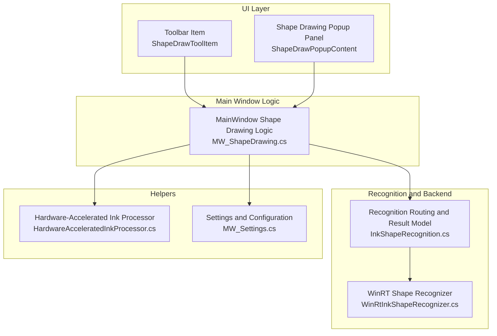
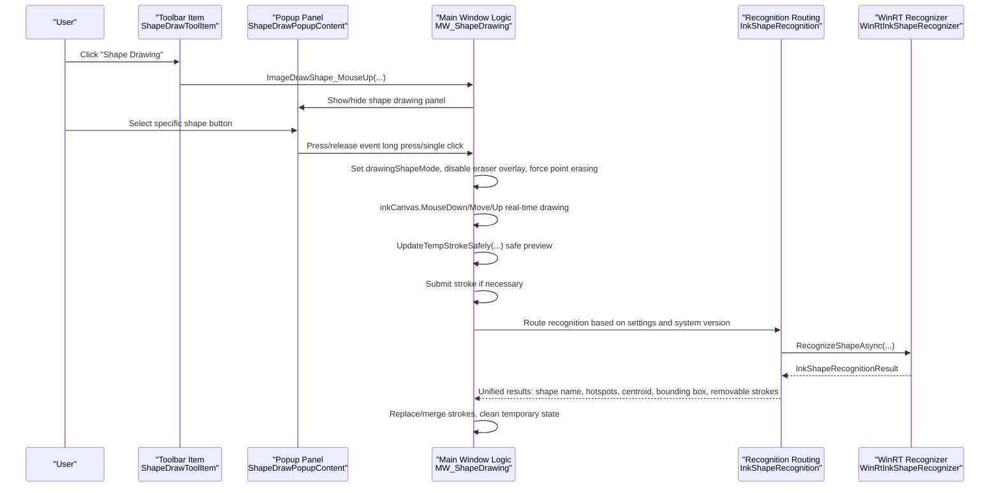
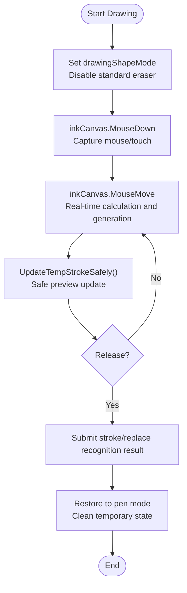
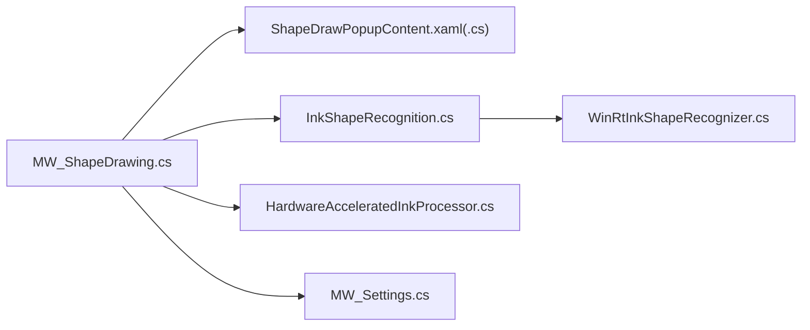

# Shape Drawing Functionality

## Introduction
This document focuses on the "shape drawing" functionality of InkCanvasForClass, systematically explaining the implementation principles of geometric drawing, the working mechanism of shape recognition technology, the integration and configuration of the WinRT shape recognizer, interaction experience design (real-time preview, constrained drawing, alignment assistants), custom shape extensions and graphic library management, as well as performance optimization and memory management strategies. Readers can understand the overall workflow without diving deep into the underlying codebase.

## Project Structure
The key code surrounding shape drawing is distributed across the following modules:
- Main window interaction and drawing logic: Shape drawing-related methods of MainWindow
- Shape recognition routing and result model: Recognition engine mode selection and unified result wrapping
- WinRT shape recognizer: Recognition implementation based on Windows.UI.Input.Inking.Analysis
- UI popup panel and toolbar items: Shape drawing buttons, popup panels, toolbar integration
- Hardware-accelerated ink processing: GPU-accelerated smoothing and rendering optimization
- Settings and configuration: Recognition engine mode, coordinate unit labeling, etc.

## Core Components
- Shape Drawing Mode and Interaction Control: Triggered by button events and long press, switching to "no edit mode," disabling the standard eraser overlay, and forcing "point erase" to implement shape drawing occlusion and preview.
- Geometric Drawing Algorithms: Parametrically generates point series or segmented stroke collections for different shapes (lines, arrows, rectangles, ellipses, circles, parallel lines, coordinate systems, cuboids, etc.), combined with real-time previews and safe update mechanisms to reduce flickering.
- Shape Recognition Routing: Automatically selects the WinRT or IACore backend based on system version and user settings, outputting a unified recognition result model for subsequent correction and replacement.
- WinRT Shape Recognizer: Wraps InkAnalyzer, converting WPF Strokes to WinRT InkStrokes, executing analysis to extract the main drawing area, hotspot point set, centroid, and bounding box, and returning removable stroke collections.
- Hardware Acceleration: Utilizes RenderTargetBitmap and DrawingVisual for GPU-accelerated curve smoothing and rendering, improving real-time drawing and preview performance.
- Settings and Configuration: Global settings such as recognition engine modes, coordinate unit markings, and multi-touch modes that affect drawing behaviors.

## Architecture Overview
The end-to-end flow of shape drawing, from UI trigger to recognition and submission, is as follows:

## Detailed Component Analysis

### Geometric Drawing Algorithms and Interaction Experience
- Mode Switching and Long Press Trigger: Marks "long press select" via a 500ms long press, setting drawingShapeMode and forcing point erase mode to avoid accidental erasing; a single click immediately enters the corresponding shape mode.
- Real-time Preview and Safe Updates: Uses throttling (approx. 60fps) and UI thread scheduling, adding the new temporary stroke before deleting the old one to reduce flickering; supports updates for both single temporary strokes and temporary stroke collections.
- Constrained Drawing and Alignment Assistants:
  - Lines/Arrows/Parallel Lines: Constrains by angle thresholds (e.g., horizontal/vertical), and generates multiple parallel line segments.
  - Rectangles/Squares/Parallelograms: Generates four segments based on diagonals, supporting centered rectangles and centered ellipses.
  - Ellipses/Circles: Parametrically generates point series, supporting drawing upper/lower half ellipses separately; dashed ellipses are split into multiple short segments.
  - Coordinate Systems: Generates unit tick marks along axes, supporting 3D Z-axes.
  - Cuboids: Two-phase drawing (front rectangle first, then depth and side lines, with dashed lines representing perspective).
- Submit and Restore: Restores to "pen mode" upon completion of drawing, clearing temporary states and restoring multi-touch and related settings.

## Dependency Analysis
- The main window relies on UI events and popup panels, handling state machines and drawing algorithms.
- Recognition routing relies on system version determination and user settings to decide backend selection.
- The WinRT recognizer relies on WinRT APIs, which must be available in Windows 10+ environments.
- The hardware-accelerated processor is independent of the recognition link and can run in parallel with the drawing flow.

## Performance Considerations
- Real-time Preview Throttling: Updates temporary strokes approximately every 16ms, lowering UI thread pressure and reducing flickering.
- Safe Updates: Adds before deleting to avoid UI flickering; cleans up states as a fallback during exceptions to ensure stability.
- Hardware Acceleration: GPU rendering and curve smoothing significantly improve fluency and visual quality.
- Recognition Warm-up: Asynchronously warms up the WinRT analyzer on the UI thread to reduce first-time recognition latency.
- Memory Management: The recognizer internally maps WPF Strokes to WinRT IDs via dictionaries, clearing and resetting before analysis to avoid residuals; returns early when results are empty to reduce invalid overhead.

## Troubleshooting Guide
- WinRT Recognition Unavailable: Verify that the system version is Windows 10+ or switch to IACore mode.
- Empty Recognition Result: Check if the input stroke collection is empty, the hotspot point set is valid, and the shape name is "Drawing".
- Preview Flickering or Stuttering: Check if throttling and safe update logic are working; verify that the recognition callback is not synchronously blocking the main thread.
- Multi-touch Conflicts: Multi-touch mode is automatically disabled during shape drawing and restored afterward; check status flags and restore logic in case of anomalies.
- Coordinate Unit Markings Not Showing: Check the "Show Coordinate Unit Markings" switch in settings.

## Conclusion
The shape drawing functionality of InkCanvasForClass delivers an intuitive drawing experience from basic geometry to complex 3D shapes through clear UI interactions, robust drawing algorithms, and flexible recognition routing. Leveraging WinRT shape recognizers and hardware-accelerated rendering, the system strikes a good balance between accuracy and performance. Through modular extension points and a comprehensive configuration system, developers can easily add custom shapes and graphics libraries, and choose the optimal recognition backend based on the environment.

## Appendix
- Shape Recognition Engine Modes
  - Auto: Uses WinRT on Windows 10+, otherwise uses IACore.
  - WinRT: Forces the use of WinRT.
  - IACore: Forces the use of IACore.
- Common Shape Modes (drawingShapeMode)
  - 1: Line; 2: Arrow; 3: Rectangle; 4: Ellipse; 5: Circle; 8: Dashed line; 11-17: Coordinate system series; 15: Parallel lines; 18: Dotted line; 19: Centered rectangle; 20-22: Parabola series; 23: Centered ellipse with focus; 24-25: Hyperbola series; 9: Cuboid.
- Key APIs and Paths
