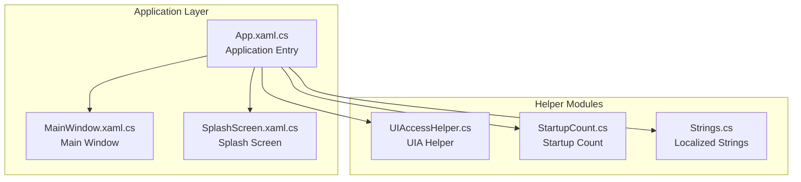
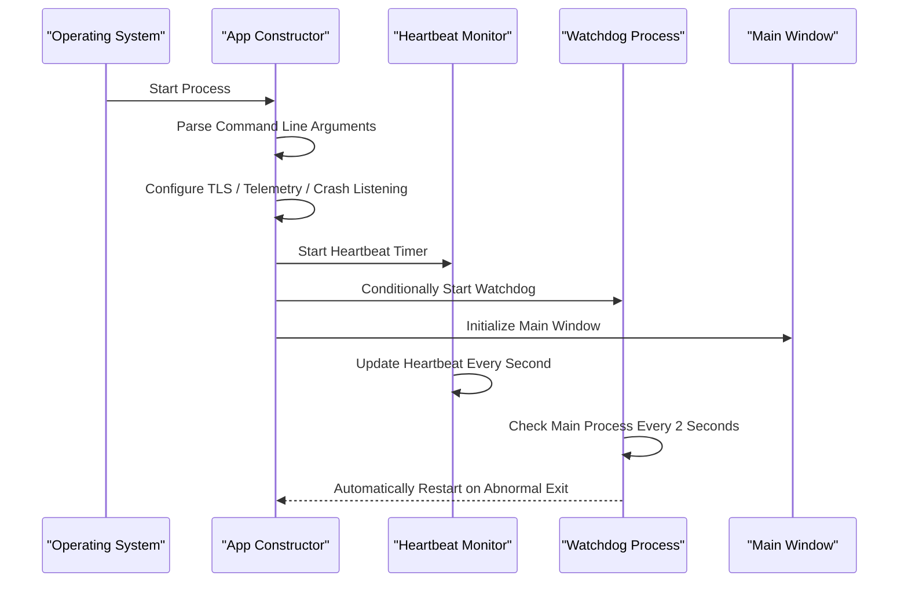
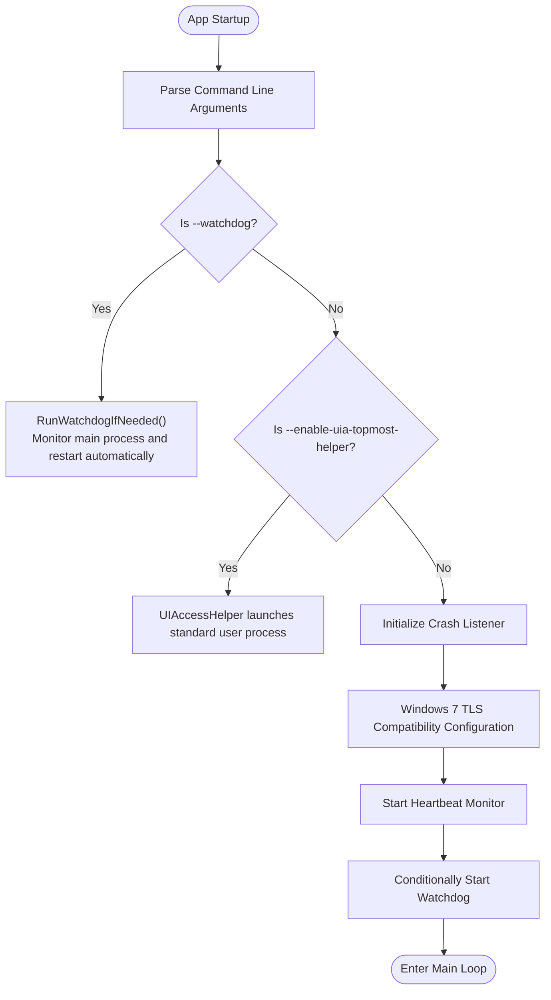
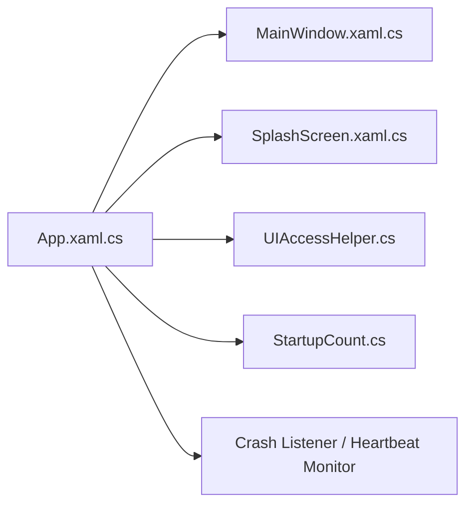

# Application Entry Point

## Introduction
This document focuses on the application entry point architecture, deeply analyzing the application startup flow in App.xaml.cs. It covers the following key topics:
- Application initialization and command line argument processing
- Process mutex management and single-instance control
- Watchdog process startup and monitoring mechanisms
- Application lifecycle management (startup resource loading, configuration synchronization, exception listener initialization)
- Watchdog monitoring system (process monitoring, heartbeat detection, auto-restart policy, crash recovery)
- Splash Screen system architectural design and resource optimization
- Entry point extension points and custom options (startup arguments, environmental detection, compatibility handling)

## Project Structure
The entry point is located in App.xaml.cs of the Ink Canvas project, responsible for:
- Initialization and argument parsing in the application constructor
- Crash listening and heartbeat monitoring during the startup phase
- Watchdog process execution and monitoring
- Splash Screen display and progress updates
- Resource cleanup and watchdog coordination during the exit phase

## Core Components
- Application Class App: Responsible for the startup process, crash listening, heartbeat monitoring, watchdog management, Splash Screen control, command line argument parsing, and environment compatibility handling.
- Main Window MainWindow: Carries the application UI, handles OOBE presentation, resource loading, and window lifecycle management.
- Splash Screen SplashScreen: Provides progress bar and message updates, supporting multiple styles and custom images.
- UIA Helper UIAccessHelper: Supports launching with elevated permissions to resolve window-topmost and high DPI scenarios.
- Startup Counter StartupCount: Records consecutive restart counts to prevent infinite loop restarts.

## Architecture Overview
The application entry point utilizes a three-tier architecture: "Constructor Initialization + Startup Phase Monitoring + Watchdog Process":
- Constructor Initialization: Parses command line arguments, configures TLS, initializes the crash listener, starts heartbeat monitoring, and conditionally runs the watchdog.
- Startup Phase Monitoring: Detects startup freezing or main thread unresponsiveness via heartbeat and watchdog timers, performing silent restarts when necessary.
- Watchdog Process: An independent subprocess monitors the main process's lifecycle, automatically restarting or exiting according to configuration upon abnormal termination.

## Detailed Component Analysis

### Application Startup and Command Line Argument Processing
- Command Line Argument Parsing:
  - --watchdog: Watchdog subprocess entry, receiving the main process PID and exit signal file path to perform monitoring and auto-restarting.
  - --enable-uia-topmost-helper: Launches the main process with elevated permissions via the UIA helper tool.
  - --update-mode / --final-app: Disables the watchdog in update mode or final application mode to avoid interfering with the update process.
- Process Mutex Management:
  - Creates a mutex during application startup to ensure a single instance is running; releases the mutex during restarts to prevent blocking.
- Environmental Compatibility:
  - Enables TLS 1.1/1.2 on Windows 7 and optimizes ServicePointManager parameters to ensure stable network communication.

## Dependency Analysis
- App Dependency on MainWindow: Through main window initialization and OOBE presentation, which indirectly affects splash screens and resource loading.
- App Dependency on SplashScreen: Controls splash screen display and progress updates via static methods.
- App Dependency on UIAccessHelper: Launches elevated processes under specific arguments.
- App Dependency on StartupCount: Tracks consecutive restart counts to prevent infinite restarts.
- App Dependency on Crash Listener and Heartbeat Monitor: Ensures stability during startup and runtime.

## Performance Considerations
- Heartbeat and Watchdog Timers:
  - The heartbeat timer updates every second, and the watchdog timer checks every 3 seconds, incurring minimal overhead.
  - Startup timeout threshold (≥ 2 minutes) and main thread unresponsiveness threshold (> 10 seconds) strike a balance between stability and performance.
- Splash Screen Animations:
  - Progress bar width animations and easing functions optimize the user experience and prevent frequent redrawing.
  - Watchdog polling interval of 2 seconds balances timeliness and system load.

[This section is a general performance discussion and does not require analyzing specific files]

## Troubleshooting Guide
- Startup Freezing and Auto-Restart:
  - Symptom: Startup takes more than 2 minutes to complete, or the main thread is unresponsive for a long time.
  - Mitigation: Execute a silent restart based on CrashAction; display an alert and exit if the restart count exceeds the threshold.
- User-Initiated Exit:
  - Symptom: Watchdog mistakenly triggers an auto-restart on user exit.
  - Mitigation: Write an exit signal file and terminate the watchdog to prevent incorrect restarts.
- Crash Listener Initialization Failure:
  - Symptom: Exceptions are not caught or logs are not written.
  - Mitigation: Check initialization logs and exception stack traces to ensure successful event registrations and monitoring hooks.
- Windows 7 Compatibility Issues:
  - Symptom: TLS connection failure or abnormal network requests.
  - Mitigation: Enable TLS 1.1/1.2 and optimize ServicePointManager parameters.

## Conclusion
The application entry point guarantees robust startup and runtime reliability through "Constructor Initialization + Startup Phase Monitoring + Watchdog Process". The parsing of command line arguments, process mutex management, crash listening, and heartbeat monitoring form a solid lifecycle management system. The watchdog delivers process-level monitoring and auto-restart capabilities, while the splash screen system balances user experience with resource optimization. Through extension points and custom options, developers can dynamically configure startup behaviors and compatibility strategies for different environments.
