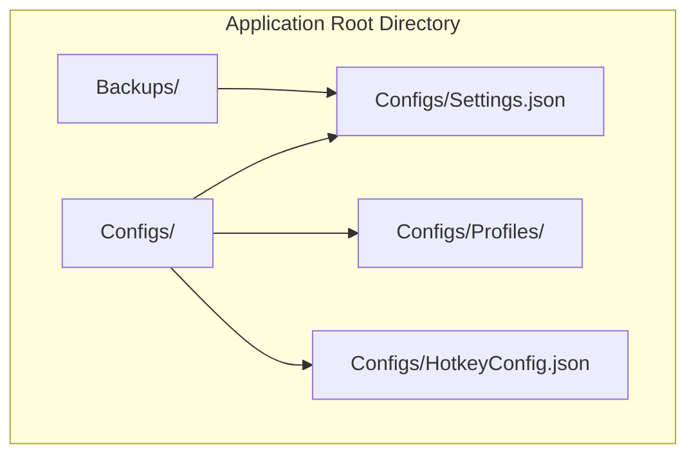
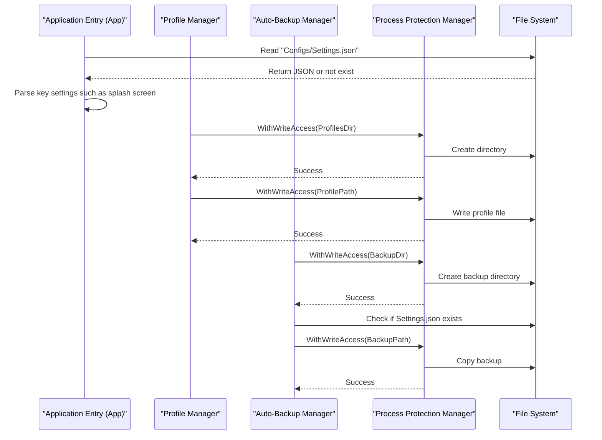
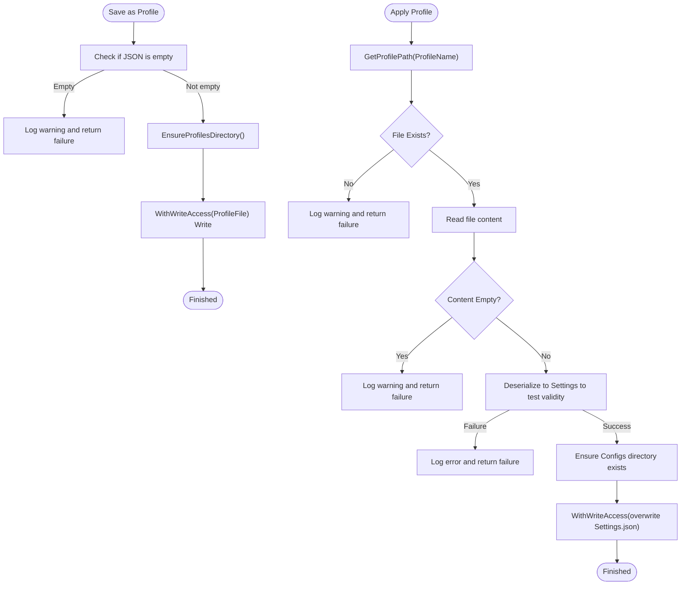
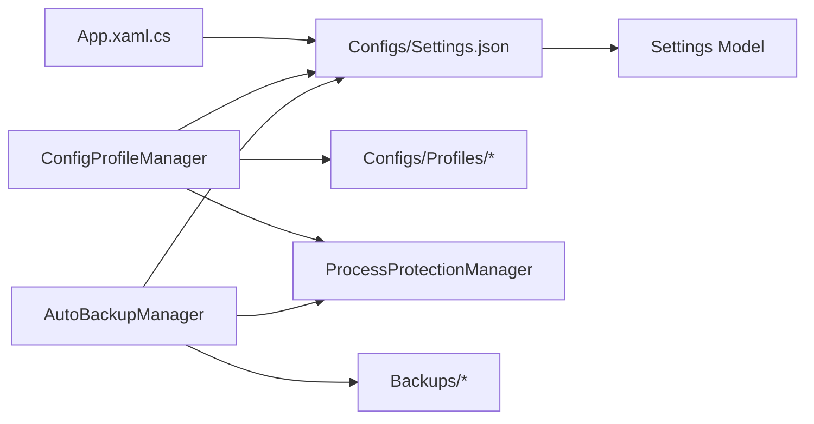

# Configuration File Management

## Introduction
This document focuses on the configuration file management system of InkCanvasForClass, concentrating on the following topics:
- Configuration file structural design and storage locations
- File formats and naming conventions
- Loading workflows (existence checks, JSON parsing, exception handling)
- Backup policies (trigger conditions, backup formats, recovery workflows)
- Version control and migration (including backward compatibility and upgrade policies)
- Manual editing guide (valid configuration entries, data type validation, recovery methods)
- Security and integrity protection

## Project Structure
InkCanvasForClass's configuration system centers around "Main Configuration File + Multiple Profile Schemes + Automatic Backups":
- Main Configuration File: Configs/Settings.json (currently active configuration)
- Profile Schemes: Configs/Profiles/*.json (multiple sets of schemes, hot-swappable)
- Automatic Backups: Backups/ (backup files named by timestamps)
- Hotkey Configuration: Configs/HotkeyConfig.json (standalone hotkey configuration file)

## Core Components
- Profile Scheme Manager: Responsible for scheme directory creation, scheme listing, saving as a scheme, applying a scheme, and deleting a scheme.
- Automatic Backup Manager: Responsible for evaluating auto-backup triggers, executing backups, recovering from backups, and cleaning up expired backups.
- Settings Model: Defines the structure of Settings and each submodule, used for serialization/deserialization.
- Process Protection Manager: Provides a protected context when writing configuration files to avoid concurrency conflicts and external interference.
- Application Entry Point: Responsible for reading the main configuration file and parsing critical settings during the startup phase.

## Architecture Overview
Key interactions for configuration file management are as follows:
- Both the Profile Scheme Manager and the Automatic Backup Manager depend on the fixed path "Application Root Path + Configs/Settings.json".
- The Process Protection Manager provides lock and handle protection before and after write operations to reduce concurrency risks.
- The Application Entry Point performs a lightweight read of Settings.json at startup to determine certain behaviors (like the splash screen).

## Detailed Component Analysis

### Profile Scheme Manager (ConfigProfileManager)
Responsibilities and Behaviors:
- Ensure the profile scheme directory exists (creates it automatically).
- List saved scheme names (sorted alphabetically).
- Serialize settings in memory to JSON and save as a new scheme.
- Apply a specified scheme to the active configuration (overwriting Settings.json).
- Delete a specified scheme.

Key Implementation Points:
- Scheme Directory: ApplicationRootPath/Configs/Profiles
- Scheme File Naming: Scheme name processed to be a "safe filename" and appended with `.json`.
- Validates JSON legitimacy (deserialization test) when applying a scheme.
- Wrap write operations with the Process Protection Manager to ensure concurrent safety.

## Dependency Analysis
- Profile Scheme Manager Dependencies:
  - Application Root Path (used to concatenate Configs/Profiles and Settings.json)
  - Process Protection Manager (safe writing)
  - Logging (exceptions and warnings)
- Automatic Backup Manager Dependencies:
  - Settings model (used for backup file validation)
  - Process Protection Manager (safe writing)
  - Application Root Path (Backups directory)
- Application Entry Point Dependencies:
  - Main configuration file (Settings.json) existence and content parsing

## Performance Considerations
- Safe Writing: Uses the Process Protection Manager's "write latch + degraded lock release" mechanism to avoid long blocks and reduce concurrent writing risks.
- Directory Scanning: Auto-backup cleanup scans only auto-backup files with the correct prefix, avoiding useless processing of other files.
- Minimal Parsing: The application entry point's parsing of Settings.json is a lightweight read, extracting only necessary fields to minimize overhead.

[This section contains general suggestions and does not list specific file sources]

## Troubleshooting Guide
Common issues and recommended handling:
- Configuration file cannot be saved/overwritten
  - Check whether process protection is enabled, and confirm if the write latch has timed out.
  - Verify if the target path exists and has write permissions.
- Applying scheme fails
  - Confirm the scheme file exists and is not empty.
  - Verify that the scheme file can be successfully deserialized into Settings.
- Automatic backup not executed
  - Check settings: check if enabled, last backup time, and backup interval.
  - Confirm Settings.json exists.
- Restoring from backup fails
  - Check if the backup directory exists and the number of backup files.
  - Verify that the backup file can be successfully deserialized into Settings.
  - If a current configuration exists, it will be saved separately as a "damaged backup".
- Splash screen not showing as expected
  - Check the appearance.enableSplashScreen field in Settings.json.

## Conclusion
InkCanvasForClass's configuration file management centers on "Main Configuration + Multiple Schemes + Automatic Backups", utilizing process protection mechanisms to safeguard writing safety and integrity. Through explicit storage locations, file formats, and naming conventions, as well as robust loading, backup, and restore workflows, the system achieves excellent maintainability and robustness. It is recommended to follow data type and structural constraints when manually editing configurations, and to perform regular backups to mitigate risks.

[This section is summary content and does not list specific file sources]

## Appendix

### Configuration File Structure and Naming Conventions
- Main Configuration File: Configs/Settings.json (JSON)
- Profile Schemes: Configs/Profiles/*.json (JSON, filename converted to "safe filename")
- Automatic Backup: Backups/Settings_AutoBackup_YYYYMMDD_HHmmss.json (JSON)
- Hotkey Configuration: Configs/HotkeyConfig.json (JSON)
