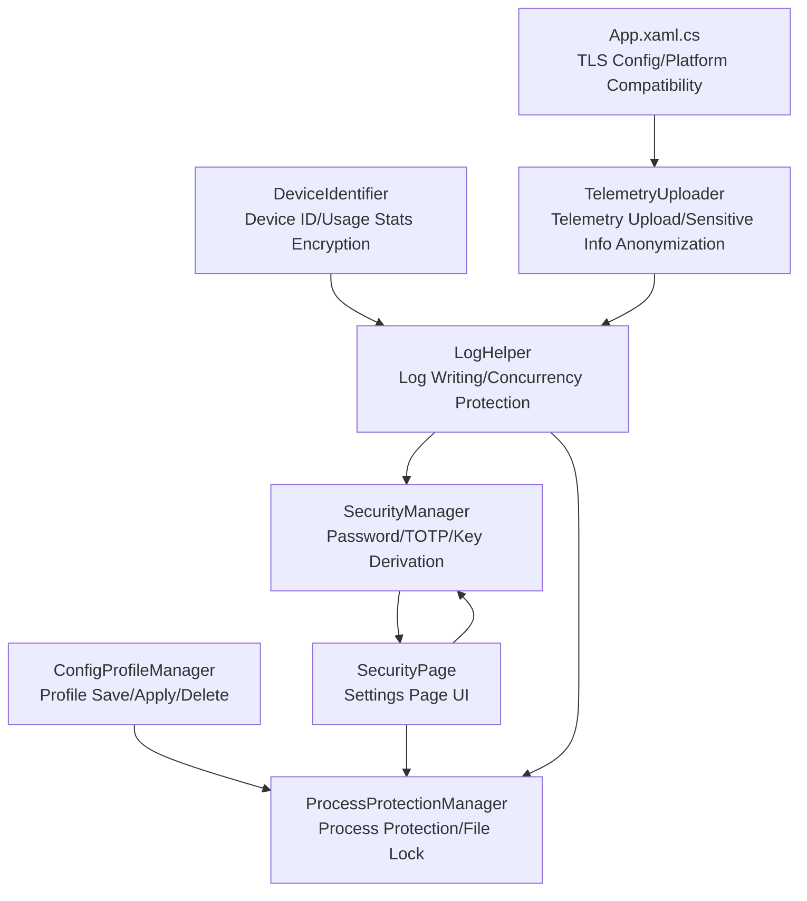
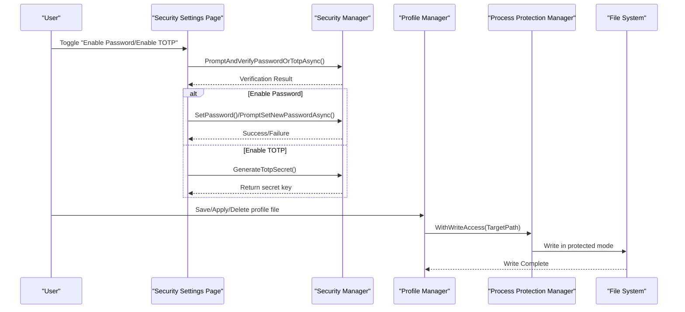
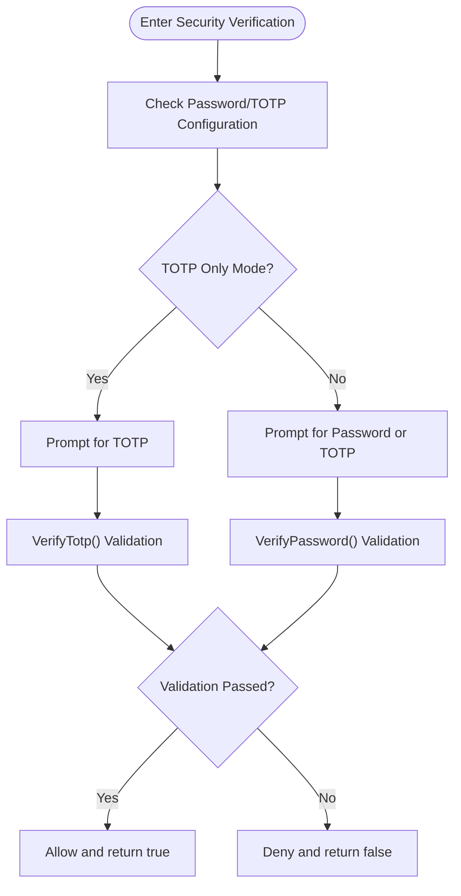
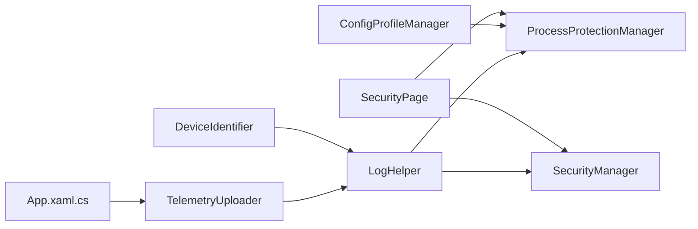

# Configuration Security and Permissions

## Introduction
This document focuses on the security and permission management of the InkCanvasForClass configuration system, structured around the following topics:
- Sensitive configuration entry protection mechanisms and access control
- Configuration file permission management (file system permissions, user group access control, process isolation)
- Configuration data encryption and key management (including decryption workflows)
- Auditing and monitoring (access logs, anomaly detection, security event response)
- Protection measures (anti-tamper detection, integrity validation, malicious configuration prevention)
- Best practices (safe configuration suggestions, risk assessment methods, security hardening)

## Project Structure
Key modules related to configuration security are distributed as follows:
- Security Manager: Responsible for password/TOTP verification, key derivation, constant-time comparison, and TOTP generation/validation.
- Process Protection Manager: Implements file and directory locking and isolation between processes.
- Profile Manager: Provides profile file saving, applying, deleting, and legitimacy validation.
- Security Settings Page: Provides UI toggles and interactions, linking the Security Manager and Process Protection Manager.
- Logging & Telemetry: Unifies log writing and anonymizes sensitive information for auditing and monitoring.
- Device Identifier & Encryption: Handles device ID generation, usage statistics file encryption/decryption, and integrity checks.

## Core Components
- Security Manager (SecurityManager)
  - Evaluates if passwords are enabled, check for password configuration presence, configure TOTP, and check for TOTP-only mode.
  - Password validation (PBKDF2 derivation + constant-time comparison) and TOTP generation/validation (time-step based).
  - Sets/changes passwords, clears passwords, and generates TOTP secret keys.
- Process Protection Manager (ProcessProtectionManager)
  - Enables/disables process protection, recursively locking key files and directories under the application root directory.
  - Write latch mechanism and degraded release strategy to prevent deadlocks and prolonged blocking.
  - White-listed directories excluded from locking (e.g., Logs, Configs, Saves, Backups, AutoUpdate).
- Profile Manager (ConfigProfileManager)
  - Enforces directory existence, lists, saves, applies, and deletes configuration profiles.
  - Validates JSON legitimacy before applying a profile, combining with process protection for safe writing.
- Security Settings Page (SecurityPage)
  - UI toggles and interactions: enable/disable password, enable/reset TOTP, and enforce verification prompts for various scenarios.
  - Invokes the Security Manager for verification and changes, interfacing with process protection controls.
- Logging & Telemetry (LogHelper, TelemetryUploader)
  - Unifies log writing with concurrent protection and date partitioning.
  - Regular-expression-based anonymization of sensitive information before telemetry upload.
- Device Identifier & Encryption (DeviceIdentifier)
  - Generates device IDs based on hardware fingerprints.
  - Encrypts usage statistics files using SHA256-derived keys and XOR operations, with integrity checksum validation.

## Architecture Overview
The overall architecture of configuration security and permissions is built around four dimensions: "Authentication & Authorization", "Process Isolation & File Protection", "Data Encryption & Integrity Validation", and "Auditing & Monitoring".

## Detailed Component Analysis

### Security Manager (Password & TOTP)
- Password Protection
  - PBKDF2-RFC2898 derived keys, configurable iterations, salt, and hash length.
  - Constant-time comparison to prevent timing side-channel attacks.
  - Set/change/clear password interfaces interacting with the UI.
- TOTP Protection
  - 6-digit dynamic codes based on time steps (30 seconds).
  - Base32 encoded secrets, supporting a step tolerance of ±1.
  - UI prompts and logical branching for TOTP-only and hybrid password/TOTP modes.
- Access Control
  - Mandatory verification for multiple scenarios: application exit, entering settings, resetting configuration, and modifying or clearing name lists.
  - Interlocks with the settings page to dynamically enable/disable UI toggles based on feature statuses.

## Dependency Analysis
- The Security Settings Page depends on the Security Manager and the Process Protection Manager.
- The Profile Manager depends on the Process Protection Manager for safe writing.
- Logging and Telemetry depend on the Process Protection Manager and the Security Manager (for sensitive data processing).
- The Device Identifier module is standalone but coordinates with logging/telemetry to form an auditing and monitoring loop.

## Performance Considerations
- PBKDF2 iteration count is high (approx. 120,000 iterations), causing CPU overhead during validation and derivation. It is recommended to execute these operations on background threads.
- Write latches and degraded lock release strategies in process protection prevent long blocks, enhancing concurrent writing stability.
- Log writing uses concurrent protection and date partitioning, reducing IO contention and preventing single files from becoming too large.
- TOTP verification includes a ±1 step tolerance to balance user experience and security.

[This section is general guidance and does not analyze specific files]

## Troubleshooting Guide
- Password/Verification Code Validation Fails
  - Check whether the system is in TOTP-only or hybrid password/TOTP mode.
  - Verify input length and format (TOTP is a 6-digit number).
- Profile Saving/Applying Fails
  - Check the log for records such as "Failed to save profile", "Failed to apply profile", or "Invalid profile format".
  - Confirm if the target path exists and whether it is locked by process protection.
- Process Protection Triggers Write Timeout
  - Check the log for warning messages: "Write latch timeout. Degrading to release target path lock before writing."
  - Check if any processes are holding file handles for a prolonged duration.
- Telemetry Upload Anomaly
  - Verify if anonymization rules cover the target sensitive fields.
  - Confirm network connectivity and Sentry service availability.

## Conclusion
InkCanvasForClass's configuration security system forms a closed loop via "Strong Authentication (Password/TOTP) + Process Isolation (File Locking) + Data Encryption (PBKDF2/SHA256/XOR) + Auditing & Monitoring (Logs/Anonymization/Telemetry)". In combination with reasonable access controls and protection policies, it effectively minimizes the risks of configuration tampering, leaks, and abuse.

[This section is a summary and does not analyze specific files]

## Appendix

### Configuration Security Best Practices
- Password & TOTP
  - Enable at least password or TOTP; enabling both and turning on "TOTP Only Mode" is recommended to simplify user input.
  - Enforce secondary verification for high-risk operations: exiting the app, entering settings, resetting configuration, and modifying or clearing name lists.
- File System & Process Isolation
  - Keep process protection enabled; regularly check logs for write latch timeout warnings.
  - Plan the directory structure logically, avoiding placing sensitive configurations in white-listed directories.
- Data Encryption & Integrity
  - Use SHA256-derived keys and checksum mechanisms for sensitive files like usage statistics.
  - Validate JSON legitimacy before applying configuration profiles.
- Auditing & Monitoring
  - Enable logging with date partitioning; configure alerts for anomalous writes and verification failures.
  - Anonymize telemetry data strictly before uploading to prevent sensitive information leaks.
- TLS & Platform Compatibility
  - Dynamically relax TLS protocols in older Windows environments to guarantee communication while monitoring security baselines.

[This section is general guidance and does not analyze specific files]
