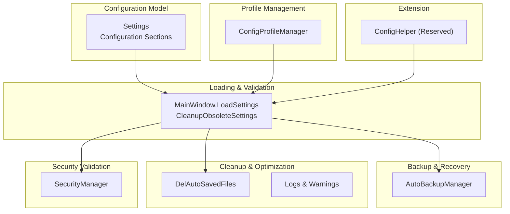
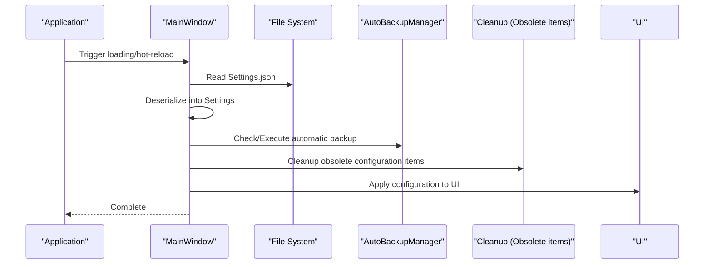
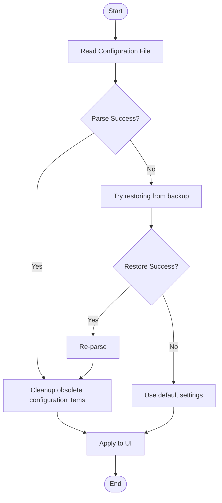
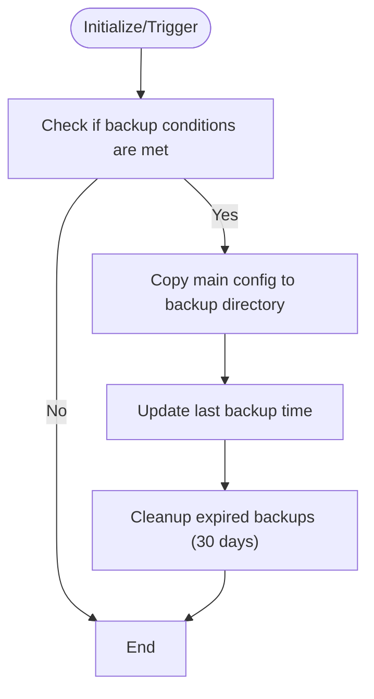
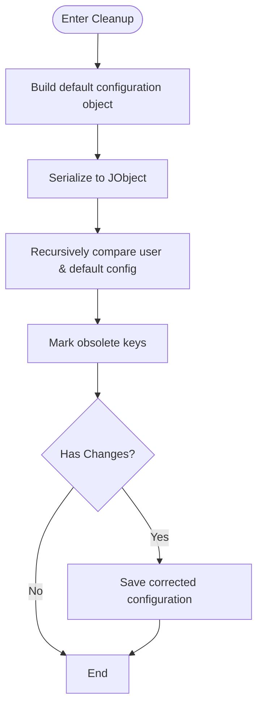
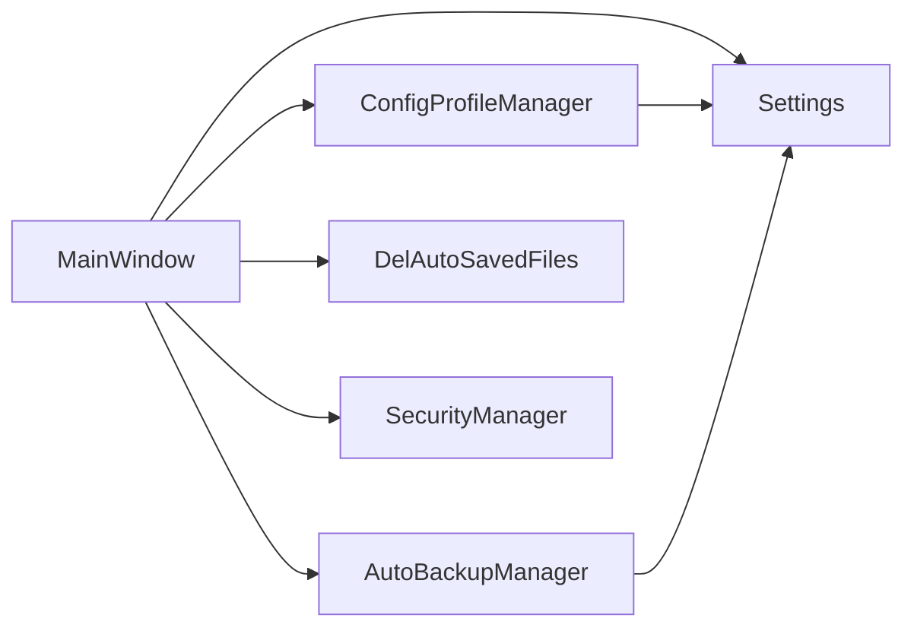

# Configuration Validation and Migration

## Introduction
This document systematically reviews the "Configuration Validation and Migration" mechanism in InkCanvasForClass, structured around the following goals:
- Configuration Validation: Legitimacy checks, data type validation, business rule validation
- Configuration Migration: Version compatibility, configuration item addition/deletion/modification policies, backward compatibility
- Configuration Cleanup: Obsolete configuration identification, redundant data cleanup, configuration optimization
- Error Handling: Validation failure responses, error notifications, automatic recovery
- Version Management: Version tracking, migration script management, rollback mechanisms
- Extension Guide: Custom validators, migration strategies, configuration templates

## Project Structure
Configuration-related capabilities are mainly distributed across the following modules:
- Configuration Model & Default Values: Settings class and its configuration sections
- Configuration Loading & Validation: MainWindow loading workflows and cleanup logic
- Automatic Backup & Recovery: AutoBackupManager
- Configuration File Archiving & Swapping: ConfigProfileManager
- Auxiliary Cleanup: DelAutoSavedFiles
- Security-related Configuration Checks: SecurityManager
- Reserved Extension: ConfigHelper

## Core Components
- Configuration Model Settings: Centrally defines the default values, field annotations, and groupings of all configuration items, serving as the "authoritative schema" for validation and migration.
- Loading & Cleanup: MainWindow.LoadSettings handles loading, validation, rollbacks, and recovery; CleanupObsoleteSettings recursively cleans up obsolete keys.
- Automatic Backup: AutoBackupManager provides backup, recovery, expired backup cleanup, and initialization.
- Configuration File Management: ConfigProfileManager supports saving, switching, and applying multiple configuration profiles.
- Security Validation: SecurityManager handles evaluations of security settings like passwords/TOTP.
- Auxiliary Cleanup: DelAutoSavedFiles cleans up historical auto-saved files.
- Reserved Extension: ConfigHelper is reserved for future configuration utility extensions.

## Architecture Overview
Key stages in the configuration lifecycle:
- Startup/Hot-Reload: MainWindow reads configuration -> Deserializes to Settings -> Validates and rolls back -> Applies to UI -> Cleans up obsolete items.
- Backup & Recovery: AutoBackupManager performs backups at appropriate times -> Restores from backups on errors -> Cleans up expired backups.
- Configuration Switching: ConfigProfileManager saves/applies/deletes configuration profiles -> Triggers MainWindow hot-reload.
- Security & Cleanup: SecurityManager evaluates security configurations -> DelAutoSavedFiles cleans up historical files.

## Detailed Component Analysis

### Configuration Validation & Cleanup (MainWindow Load Chain)
- Parsing & Rollback: Prioritizes parsing configuration; attempts restoration from backups on failure; uses default settings if both fail.
- Obsolete Item Cleanup: Treats the default Settings as the authoritative schema, recursively comparing user configuration, deleting redundant keys, and saving the corrected configuration when necessary.
- Range & Type Constraints: Enforces range and type limitations for certain configurations during the application phase (e.g., zoom ranges, thresholds, etc.).

### Configuration Model & Default Values (Settings)
- Hierarchical Structure: Settings contains sections like Advanced, Appearance, Automation, Canvas, Gesture, InkToShape, Startup, RandSettings, ModeSettings, Camera, Dlass, Upload, Security, Notification, Toolbar, etc.
- Default Values: Each configuration section provides reasonable default values upon construction, acting as the authoritative schema for validation and cleanup.
- Annotations: JsonProperty/JsonIgnore are used for serialization control and compatibility.

### Automatic Backup & Recovery (AutoBackupManager)
- Conditions Check: Determines whether to execute backup based on settings (toggle status, last backup time, backup interval).
- Execute Backup: Copies the main configuration to the backup directory and updates the last backup timestamp.
- Recovery Strategy: Locates the latest backup, validates its legitimacy, backs up the current corrupted configuration, and overwrites the main configuration.
- Expired Backup Cleanup: Automatically deletes backup files older than 30 days.

### Configuration File Archiving & Swapping (ConfigProfileManager)
- Multi-Configuration: Saves multiple configuration files under Configs/Profiles, with Configs/Settings.json remaining as the active configuration.
- Functions: Save as a profile, apply profile (overwrite Settings.json), delete profile, and list profiles.
- Validation: Performs a JSON legitimacy check on Settings before applying configurations.

### Security Configuration Validation (SecurityManager)
- Password/TOTP Configuration Status: HasPasswordConfigured, HasTotpConfigured, IsTotpOnlyMode, IsSecurityFeatureEnabled, IsSecurityConfigured.
- Purpose: Used for security policy evaluations during configuration loading/application.

### Historical File Cleanup (DelAutoSavedFiles)
- Goal: Cleans up auto-saved historical files (.icstk/.png etc.) and empty directories.
- Policy: Deletes files based on creation time and file extension thresholds.

### Configuration Cleanup Algorithm (Recursive Comparison & Deletion)
- Algorithm Idea: Uses the default Settings as the authoritative schema, recursively comparing user configurations against default configurations, and deleting keys in user configurations that do not exist in the default schema.
- Array Handling: For arrays of objects, compares the property structure of the first element and cleans up item-by-item.
- Change Flags: Saves and logs only when keys are actually deleted.

## Dependency Analysis
- MainWindow depends on Settings for schemas; depends on AutoBackupManager for backup/recovery; depends on ConfigProfileManager for profile switching.
- ConfigProfileManager depends on Settings for legitimacy checks.
- DelAutoSavedFiles works in coordination with the auto-save paths defined in Settings.
- SecurityManager works with Settings.Security to evaluate security policies.

## Performance Considerations
- Deserialization & Serialization: Cleanup and backup operations involve multiple JObject manipulations. It is recommended to perform a single consolidated save after batch changes to reduce IO counts.
- Backup Frequency: Controls backup frequency via days-interval checks to avoid frequent IO.
- Cleanup Scope: Saves only when changes are detected, eliminating unnecessary writes.
- UI Application: Completes range and type constraints during the application phase, preventing redundant run-time checks later on.

## Troubleshooting Guide
- Configuration Parsing Fails
  - Symptom: Log displays parsing failure, triggering restoration from backups.
  - Inspection: Verify if the backup directory exists and whether backup files can be deserialized.
  - Mitigation: Fall back to default settings if restoration fails.
- Backup Fails
  - Symptom: Backup directory does not exist or copying fails.
  - Inspection: Verify access permissions and disk space.
  - Mitigation: Fix permissions and retry.
- Obsolete Configuration Cleanup Ineffective
  - Symptom: Obsolete keys are not deleted.
  - Inspection: Verify if the cleanup logic is executed and check for change flags.
  - Mitigation: Check if the default schema contains ignored null keys.

## Conclusion
This project implements robust configuration validation and migration capabilities through the combination of "Authoritative Schema + Load-time Validation + Automatic Backup + Obsolete Cleanup". Settings serves as the single source of truth, ensuring validation and cleanup consistency. AutoBackupManager provides reliable fallback protection, while ConfigProfileManager supports multi-profile management and switching. The overall design balances backward compatibility, ease of maintenance, and user experience.

## Appendix

### Configuration Validation Checklist (Key Implementations)
- Legitimacy Check: Evaluates null status after deserialization, falling back on failure.
- Data Type Validation: Employs strongly typed models and range constraints.
- Business Rule Validation: Handles ranges and mutually exclusive rules during the application phase.
- Auto Recovery: Cleans up obsolete keys and saves the corrected configuration.

### Configuration Migration & Version Compatibility
- Design Philosophy: Uses Settings as the authoritative schema. Default values for new fields guarantee backward compatibility, while deleted fields are pruned via cleanup logic.
- Add/Delete/Modify Policies: New fields do not break older configurations; deleted fields are pruned; modified fields ensure compatibility via defaults and range constraints.
- Backward Compatibility: Cleanup logic ensures user configurations align with the current schema.

### Configuration Cleanup Mechanism
- Obsolete Configuration Identification: Recursively compares user configurations against default settings.
- Redundant Data Cleanup: Deletes redundant keys, saving corrected configurations when needed.
- Configuration Optimization: Populates default values and restricts ranges.

### Error Handling & Auto-Recovery
- Validation Failure Response: Parse failure -> Attempt backup recovery -> Use default settings on failure.
- Error Warnings: Logs detailed error messages.
- Auto Recovery: Prunes obsolete keys and saves the settings.

### Version Management & Rollback
- Version Tracking: Current implementations do not explicitly feature a version field. It is recommended to introduce a version field in Settings.
- Migration Script Management: Can execute migration scripts during loading via the upgrade process (reserved point).
- Rollback Mechanism: Relies on AutoBackupManager backup and recovery.

### Extension Guide
- Developing Custom Validators: Insert custom verification logic (e.g., ranges, mutual exclusions, dependencies) into the loading flow.
- Customizing Migration Strategies: Add migration scripts to the upgrade flow, executing in combination with version fields.
- Managing Configuration Templates: Manage multiple templates via ConfigProfileManager, validating and applying them against the default schema.
