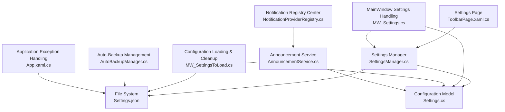
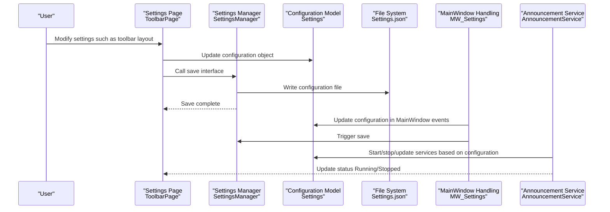
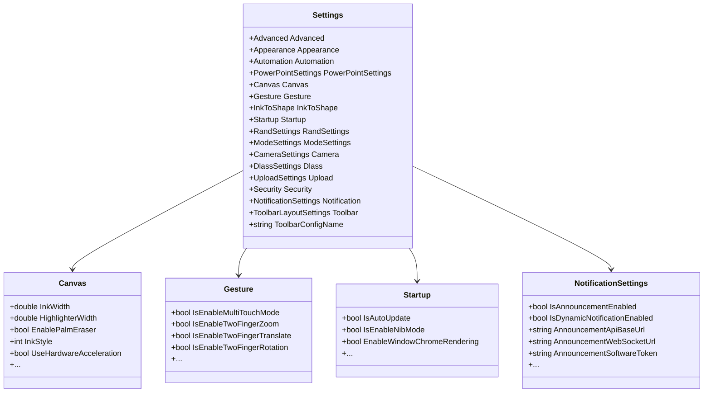
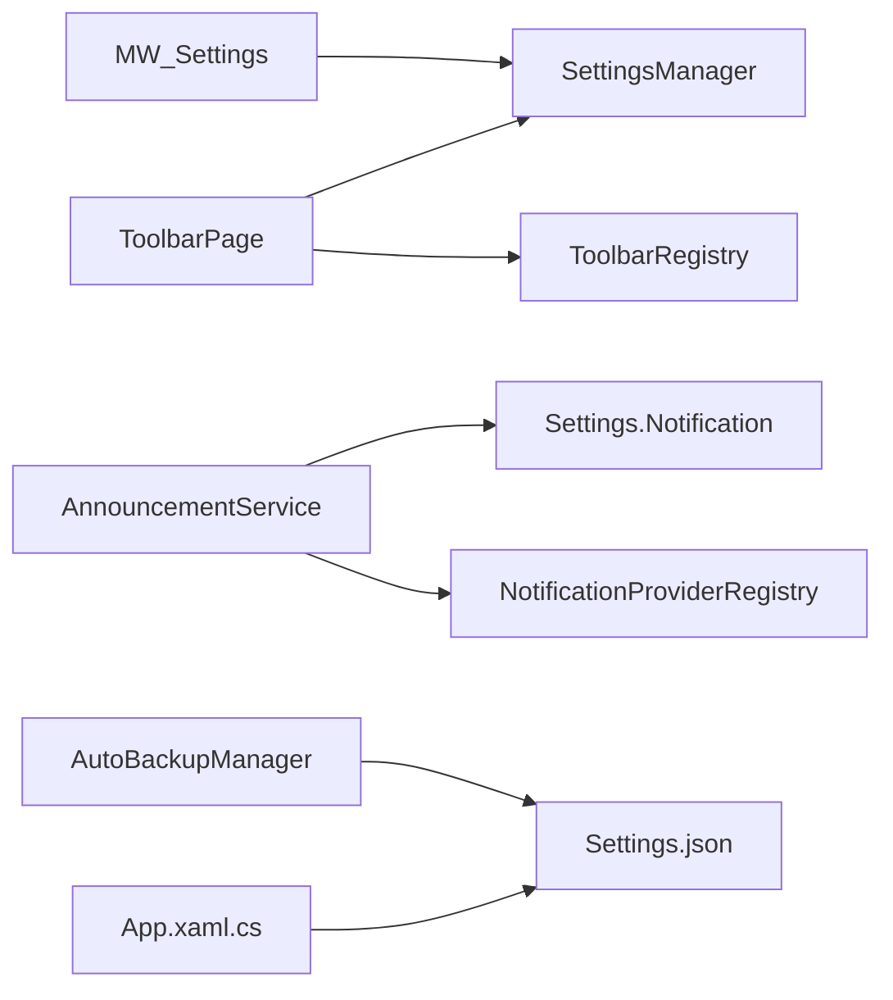

# Dynamic Configuration Updates

## Introduction
This document systematically describes the "Dynamic Configuration Updates" mechanism in InkCanvasForClass, focusing on the following aspects:
- Configuration Change Detection: How configuration changes are perceived due to user interface actions, external configuration file changes, and internal application state adjustments.
- Hot-Reloading Mechanism: How configuration updates take effect at runtime without requiring restarts or losing application state.
- State Synchronization Strategy: Guarantees synchronization and consistency of configuration states between the UI layer, settings manager, and persistence layer.
- Trigger Methods: Trigger paths for three scenarios: user interaction, external file modifications, and internal state changes.
- Propagation Mechanism: Event notifications, dependency resolution, and consistency guarantees.
- Performance Optimization: Incremental updates, batch processing, and memory management strategies.
- Rollback Mechanism: Transactional updates, error recovery, and state undoing.
- Debugging & Monitoring: Configuration update logs, update progress tracking, and conflict resolution policies.

## Project Structure
Key directories and files related to configuration updates are:
- Configuration Model & Grouping: `Ink Canvas\Resources\Settings.cs` provides structural definitions for Settings and its submodules (`Canvas`, `Gesture`, `Startup`, `Notification`, etc.).
- Main Window Settings Handling: `Ink Canvas\MainWindow_cs\MW_Settings.cs` contains numerous UI event handlers that map user interactions to Settings and persist them.
- Configuration Loading & Cleanup: `Ink Canvas\MainWindow_cs\MW_SettingsToLoad.cs` provides configuration cleanup logic to ensure deprecated fields are pruned and configuration structures remain stable.
- Settings Manager: `Ink Canvas\Windows\SettingsViews\Helpers\SettingsManager.cs` handles JSON serialization, deserialization, and disk persistence of Settings.
- Toolbar Settings Page: `Ink Canvas\Windows\SettingsViews\Pages\ToolbarPage.xaml.cs` demonstrates the creation, deletion, modification, and application workflows of configuration files.
- Hotkey Configuration: `Ink Canvas\HotkeyConfig.json` provides a hotkey configuration sample, representing the influence of external configurations on behavior.
- Notification & Registration: `Ink Canvas\Helpers\NotificationProviderRegistry.cs` and AnnouncementService.cs demonstrate dynamic service starting/stopping and state updates based on configuration.
- Auto-Backup & Rollback: `Ink Canvas\Helpers\AutoBackupManager.cs` provides recovery capabilities when configuration files are corrupted.
- App-Level Exception Handling: `Ink Canvas\App.xaml.cs` provides global exception handling and crash logging to help locate configuration update failures.

## Core Components
- Configuration Model (Settings): Uses strongly-typed objects to hold all configuration items, grouped by functional domains: Advanced, Appearance, Automation, PowerPointSettings, Canvas, Gesture, InkToShape, Startup, RandSettings, ModeSettings, Camera, Dlass, Upload, Security, Notification, Toolbar, etc.
- Settings Manager (SettingsManager): Provides configuration reading, serialization, persistence, and fast reading interfaces for specific fields (such as window rendering switches).
- Main Window Settings Handling (MW_Settings): Converts UI events into configuration updates and invokes persistence interfaces.
- Configuration Loading & Cleanup (MW_SettingsToLoad): Cleans up deprecated fields during the loading phase to ensure configuration structures match default schemas.
- Toolbar Settings Page (ToolbarPage): Demonstrates the configuration profiles' CRUD operations and application workflows, realizing "hot-reloading" in practice.
- Notification Registry & Announcement Service: Dynamically starts/stops services based on configuration, embodying configuration-driven service lifecycles.
- Auto-Backup & Rollback (AutoBackupManager): Recovers configuration on corruption, providing rollback capabilities.
- App-Level Exception Handling (App.xaml.cs): Captures exceptions globally to help diagnose configuration update errors.

## Architecture Overview
The dynamic configuration update process consists of "Trigger - Detection - Application - Synchronization - Persistence - Rollback/Monitoring". The following diagram demonstrates interactions between critical components:

## Detailed Component Analysis

### Configuration Model and Grouping (Settings)
- Hierarchical Structure: Settings contains multiple submodules, each mapping to a category of configuration (such as Canvas, Gesture, Startup, Notification, etc.), facilitating targeted updates and isolating impact scopes.
- Field Annotations: Properties like JsonProperty/JsonIgnore control serialization behavior to ensure consistency between configuration files and in-memory objects.
- Default Values: Most fields provide reasonable default values, minimizing configuration-missing risks during initial load.

## Dependency Analysis
- Component Coupling:
  - MW_Settings depends on SettingsManager for persistence.
  - ToolbarPage depends on ToolbarRegistry and SettingsManager to perform profile CRUD operations and applications.
  - AnnouncementService depends on Settings.Notification and NotificationProviderRegistry.
  - AutoBackupManager depends on Settings file paths and backup directories.
- External Dependencies:
  - JSON serialization (Newtonsoft.Json) for reading and writing configuration.
  - File system writes are wrapped by the ProcessProtectionManager to safeguard permissions and concurrent safety.
- Circular Dependencies:
  - No direct circular dependencies are present; each module has distinct responsibilities, bridged via SettingsManager.

## Performance Considerations
- Incremental Updates:
  - UI event handlers save immediately after updating Settings, avoiding latency accumulation from batch writes.
  - For high-frequency slider events (such as pen width, opacity), internal flag checks prevent redundant updates and UI flashing.
- Batch Processing:
  - The toolbar settings page synchronizes UI states before saving, minimizing multiple writes.
- Memory Management:
  - SettingsManager utilizes fast reading when retrieving specific fields, avoiding memory overhead from full-scale deserialization.
  - Notification services release resources when stopped, preventing long-term memory occupation.

## Troubleshooting Guide
- Configuration Change Logs:
  - Identify write failures or permission issues using SettingsManager save/load logs.
  - The notification service records execution statuses through the registry center, facilitating verification of service start/stop behaviors.
- Update Progress Tracking:
  - The toolbar settings page logs entries during loading/saving to trace configuration application progress.
- Conflict Resolution Policies:
  - Prunes deprecated fields automatically using the cleanup logic in MW_SettingsToLoad to avoid compatibility issues after version upgrades.
  - AutoBackupManager recovers configuration automatically on corruption, minimizing manual intervention.
- Exception Troubleshooting:
  - Global exception capture in App.xaml.cs assists in locating exception nodes during configuration updates.

## Conclusion
InkCanvasForClass's dynamic configuration update mechanism centers on Settings, integrating persistence capabilities in SettingsManager and instant application policies in MW_Settings to complete a closed loop of "User Interaction - Configuration Update - Persistence - Service Response". Through configuration cleanup, notification service registration, automatic backups, and global exception handling, the system offers robust fault tolerance and observability while ensuring state consistency. It is recommended to introduce throttling/debouncing and batch writing policies in high-frequency update scenarios to further enhance performance and stability.

## Appendix
- External Configuration Sample: HotkeyConfig.json demonstrates the structure of hotkey configurations, illustrating how external configurations influence application behavior.
- Configuration File Location: Settings.json is located by default under the Configs subdirectory in the application root path.
