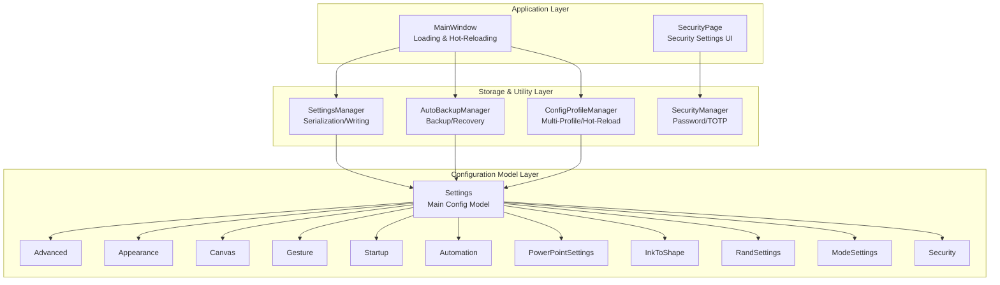
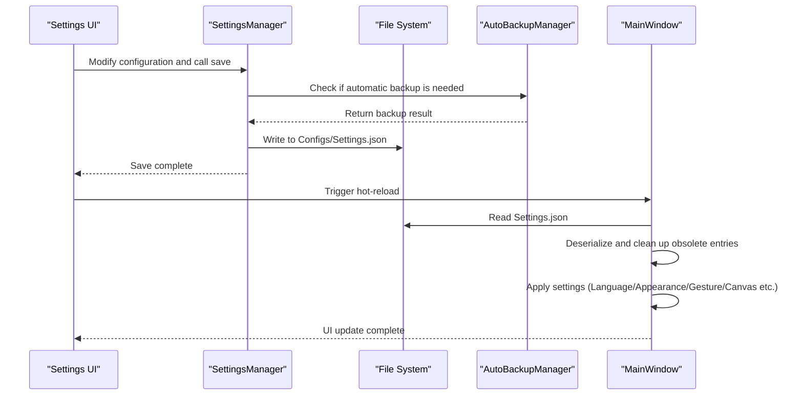
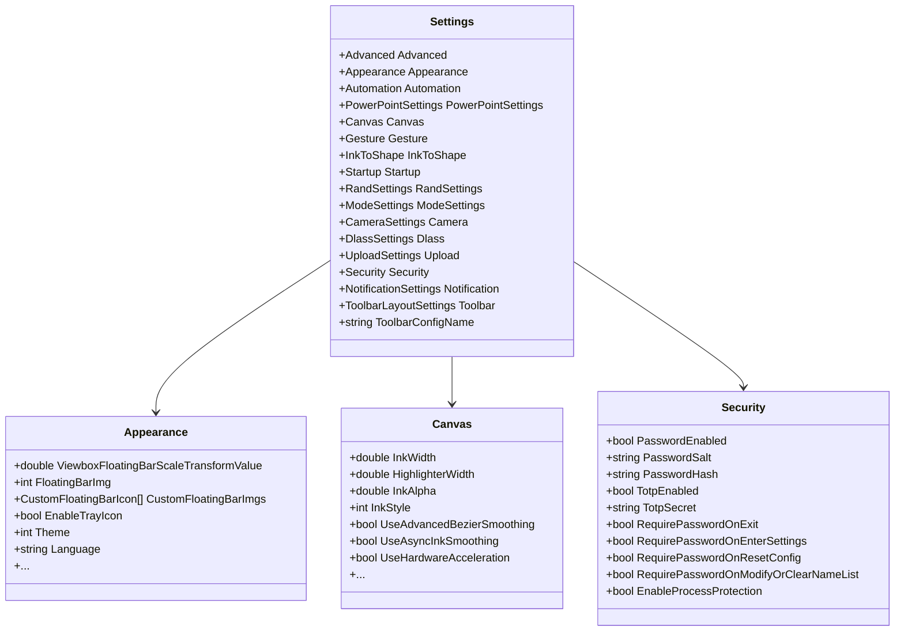
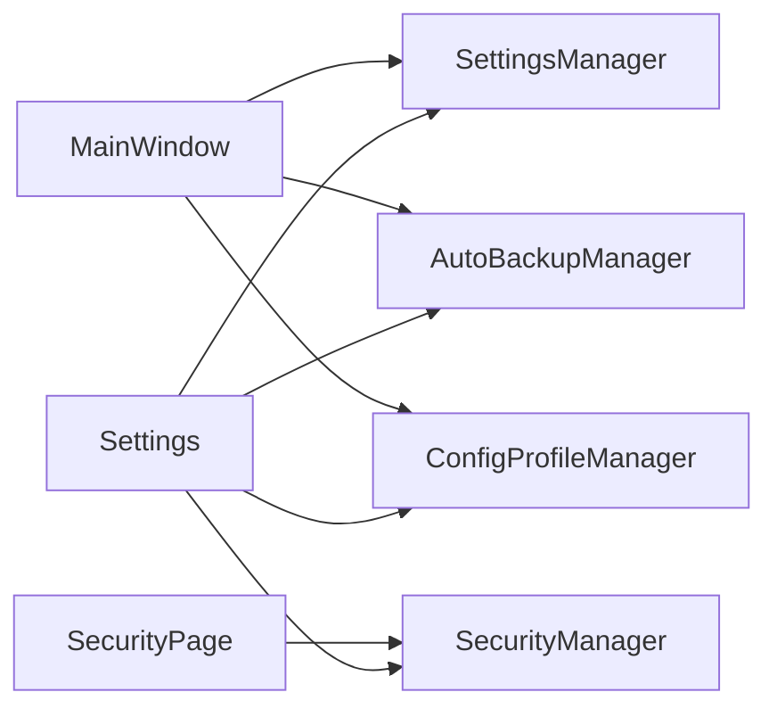

# Configuration Management System

## Introduction
This document focuses on the configuration management system of the InkCanvasForClass project, systematically reviewing the configuration file structure, hierarchy, and loading mechanisms. It explains JSON parsing, default values, and migration strategies, details the listening, hot-reloading, and consistency guarantees of dynamic configuration updates, describes security designs (sensitive data encryption, access controls, backups, and restores), explains version management and compatibility (upgrades, downgrades, and rollbacks), and provides extension guides and troubleshooting tips.

## Project Structure
The configuration system centers around the Settings main model and uses a layered design:
- Data Model Layer: Settings and its submodules (Advanced, Appearance, Canvas, Gesture, Startup, Automation, etc.)
- Storage & Loading Layer: SettingsManager is responsible for serialization/deserialization and file writing; AutoBackupManager handles backup and recovery.
- Application & Hot-Reload Layer: Loading and hot-reloading logic in MainWindow; ConfigProfileManager supports multiple profiles and hot-reloads.
- Security Layer: SecurityManager provides password and TOTP validation, working with SecurityPage to implement permission controls.

## Core Components
- Settings Main Model: Centrally defines configuration groups (Advanced, Appearance, Canvas, Gesture, Startup, Automation, PowerPointSettings, InkToShape, RandSettings, ModeSettings, Camera, Dlass, Upload, Security, Notification, Toolbar, etc.) and provides default values.
- SettingsManager: Responsible for serializing Settings into JSON and writing to Configs/Settings.json, providing helper methods to retrieve specific fields.
- AutoBackupManager: Responsible for automatic backup, recovery, and cleanup of expired files to protect configurations.
- ConfigProfileManager: Supports saving, switching, and hot-reloading multiple profiles, facilitating quick transitions between different scenarios.
- SecurityManager: Provides password and TOTP validation, key derivation, and constant-time comparisons, working with SecurityPage to enforce permissions.
- MainWindow Loading & Hot-Reload: Responsible for loading configuration from files, cleaning up expired items, applying language and appearance settings, starting automation tasks, etc.

## Architecture Overview
The configuration system uses an architecture of "Model-driven + File Persistence + Backup & Recovery + Security Control + Dynamic Hot-Reload":
- Model-driven: Settings and its submodules define the configuration structure and defaults, ensuring parsing and application consistency.
- File Persistence: SettingsManager writes to Configs/Settings.json; ConfigProfileManager supports multiple profiles in the Profiles directory.
- Backup & Recovery: AutoBackupManager executes backups and restores before/after write operations to prevent configuration corruption.
- Security Control: SecurityManager provides password/TOTP verification, working with interface toggles to enforce fine-grained permissions.
- Dynamic Hot-Reload: MainWindow executes hot-reloads during application startup and configuration switching to instantly apply changes.

## Detailed Component Analysis

### Configuration File Structure and Hierarchy
- Main Configuration File: Config/Settings.json in JSON format. The root object is Settings, containing multiple submodules (such as appearance, canvas, gesture, startup, automation, etc.).
- Configuration Hierarchy: Settings is the top-level container, and each submodule (like Appearance, Canvas, Gesture, etc.) defines specific configuration entries and their default values.
- Default Values Treatment: Submodules provide default values when declared, ensuring that fields possess reasonable initial values after deserialization.

## Dependency Analysis
- Model Dependency: Settings depends on each submodule; submodules are decoupled from each other and aggregated via Settings.
- Storage Dependency: SettingsManager depends on the file system and write protection context; AutoBackupManager depends on the backup directory and write protection context.
- Application Dependency: MainWindow depends on SettingsManager, AutoBackupManager, ConfigProfileManager, and SecurityManager.
- Security Dependency: SecurityManager depends on the Security submodule of Settings and resource strings.

## Performance Considerations
- Asynchrony & Concurrency: Configuration writing and hot-reloading involve file I/O and UI updates. It is recommended to perform writing and parsing on background threads to avoid blocking the UI.
- Serialization Overhead: SettingsManager formats outputs with indentation, which increases file size. In write-heavy scenarios, consider using a compact format or batch writing.
- Backup Frequency: The backup interval of AutoBackupManager is configurable. It is recommended to adjust this based on data change frequencies to avoid excessive backups.
- Obsolete Item Cleanup: The cleanup logic recursively traverses settings. If there are many configuration items, optimize the schema comparison strategy to reduce unnecessary deep traversals.

## Troubleshooting Guide
- Configuration Corruption: The system attempts recovery from backups. If recovery fails, it falls back to the default configuration. Check the backup directory for damaged copies and roll back manually.
- Insufficient Permissions: The write protection context catches exceptions and logs them. Verify application execution privileges and target directory access permissions.
- Password/TOTP Verification Failure: Confirm password length, input matches, and TOTP time skew. Check error messages in the resource strings.
- Hot-Reload Ineffective: Confirm the configuration file was written and that MainWindow has triggered a hot-reload. Verify that the obsolete item cleanup logic didn't overwrite crucial fields.

## Conclusion
InkCanvasForClass's configuration management system uses the Settings model as its core. By integrating SettingsManager, AutoBackupManager, ConfigProfileManager, and SecurityManager, it achieves reliable configuration persistence, backup recovery, multi-profile management, and security controls, utilizing the hot-reloading mechanism of MainWindow to apply configuration changes instantly. The system performs well in compatibility and extensibility, making it suitable for future introductions of stricter validators and more flexible import/export capabilities.

## Appendix
- Configuration File Path: Config/Settings.json
- Backup Directory: Backups (automatic backup file prefix: Settings_AutoBackup_)
- Profile Directory: Configs/Profiles (multi-profile)
