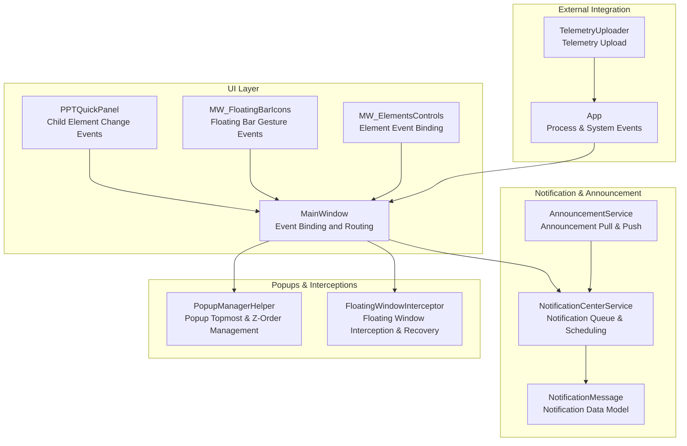
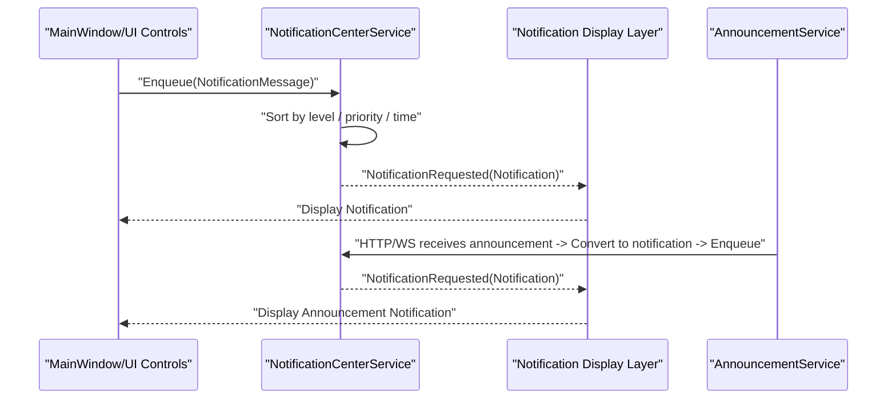
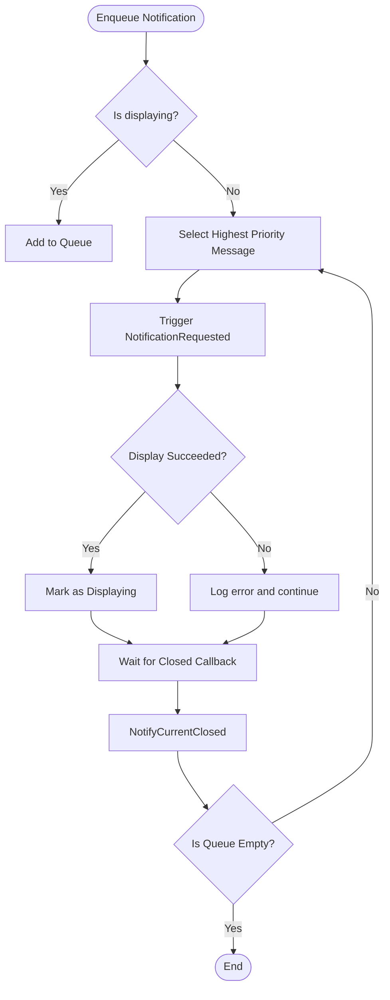
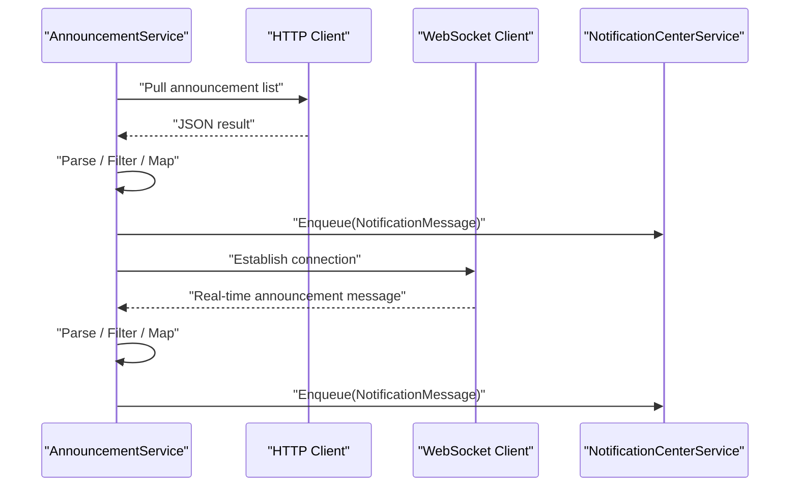
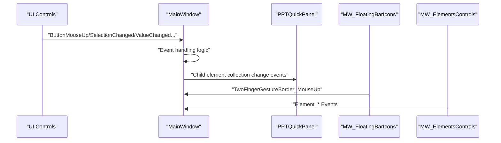
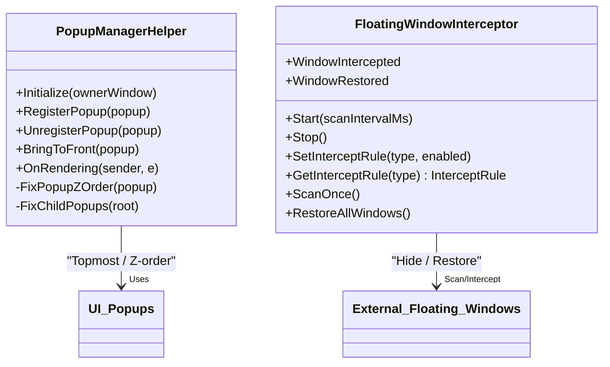
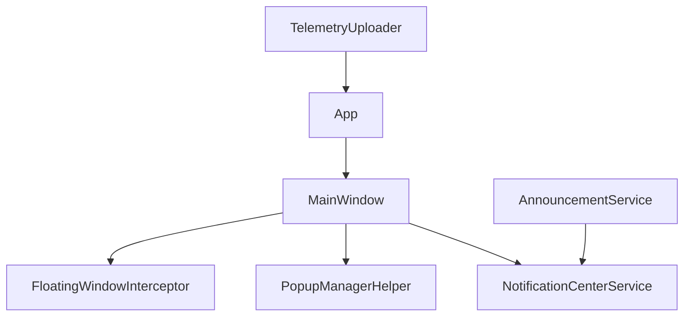

# Event-Driven Architecture

## Introduction
This document systematically reviews the event-driven architecture of InkCanvasForClass, offering a deep analysis of MainWindow's event bus pattern, message propagation mechanisms, and asynchronous processing. It primarily covers event classification and hierarchies (user interaction events, system state events, business logic events, external integration events), registration and management of event handlers (subscriptions, priorities, lifecycles), event propagation and routing (bubbling/tunnelling/interception policies), event data serialization and version compatibility, extension guides (developing custom event types and handlers), and best practices for debugging and monitoring.

## Project Structure
The event system is mainly distributed across the following modules:
- UI Layer Event Binding and Routing: MainWindow and its child page controllers
- Notifications and Announcements: NotificationCenterService and AnnouncementService
- Popups and Interception Events: PopupManagerHelper and FloatingWindowInterceptor
- Event Data Model: NotificationMessage
- External Integration and Telemetry: App and TelemetryUploader

## Core Components
- Event Bus and Message Scheduling
  - NotificationCenterService: A static-queue and priority-based event scheduler responsible for queuing, history management, and dequeuing notification messages for display.
  - AnnouncementService: Asynchronous consumer of external announcement sources, supporting HTTP polling and WebSocket real-time push, converting received data into notification messages and pushing them to the queue.
- UI Event Binding and Routing
  - MainWindow: Centrally registers all types of control events (mouse, touch, stylus, and InkCanvas events), serving as the event bus entry point.
  - PPTQuickPanel: Listens to changes in the child elements collection of InkCanvas, acting as a bridge for business events.
  - MW_FloatingBarIcons, MW_ElementsControls: Respectively handle floating bar gestures and element-level interaction events.
- Popups and Interception Events
  - PopupManagerHelper: Maintains popup hierarchies and topmost window status, controlling Z-order via Win32 APIs and responding to open/close events.
  - FloatingWindowInterceptor: Scans and intercepts third-party floating windows, supporting rule-based matching and restoration.
- Event Data Model
  - NotificationMessage: A unified notification message structure containing metadata such as type, level, priority, source, and actions.

## Architecture Overview
The event-driven architecture employs a combined pattern of "Event Bus + Message Dispatching + Asynchronous Processing":
- Event Bus: MainWindow collects user interactions and system events as a single entry point.
- Message Dispatching: NotificationCenterService sorts messages by priority and level to trigger UI presentation.
- Asynchronous Processing: AnnouncementService polls and receives external messages via background tasks, preventing the UI thread from being blocked.
- Popups and Interception: PopupManagerHelper and FloatingWindowInterceptor coordinate via event callbacks and Win32 APIs to ensure consistent UI behaviors.

## Detailed Component Analysis

### Event Bus and Message Scheduling (NotificationCenterService)
- Design Points
  - Static Singleton: Global queue and history list, protected by locks for thread safety.
  - Event Publication: NotificationRequested acts as a unified event publisher subscribed to by the UI layer.
  - Sorting Strategy: Sorts by level (descending), priority (descending), and creation time (ascending) to guarantee that urgent and high-priority messages are presented first.
- Lifecycle
  - Enqueueing: Enqueue / EnqueueText, with automatic enforcement of history capacity limits.
  - Dequeueing: TryShowNext, allowing only one message to be displayed at a time to prevent concurrency conflicts.
  - Close Callback: NotifyCurrentClosed, used to switch to the next message awaiting display.
- Performance and Reliability
  - Exception Fallback: Logs failures when display fails and attempts to proceed with the next message.
  - History Limit: Fixed capacity prevents memory growth.

### External Announcements and Real-time Push (AnnouncementService)
- Data Sources
  - HTTP Polling: Polls the client announcement API, parses JSON responses, and converts them to notification messages.
  - WebSocket Real-time Push: Connects to candidate endpoints, loops reconnection, and automatically recovers from disconnection.
- Filtering and Version Compatibility
  - Version Filtering: Compares minimum/maximum required version numbers with the local application version.
  - Channel Filtering: Matches the current update channel with the announcement channels.
  - Read State: Filters duplicate or already read items based on a list of read IDs stored in settings.
- Message Mapping
  - Type Mapping: Maps announcement types to notification message types.
  - Level Mapping: Maps announcement levels to notification levels.
  - Localization: Multi-language text selection and summary generation.
- Asynchrony and Fault Tolerance
  - Background Tasks: Starts via StartAsync, stops via StopAsync, supporting cancellation tokens.
  - Reconnection Policy: Server 500 errors trigger a fallback to the HTTP polling channel with continuous retry.
  - Logging: Unifies log recording for failed scenarios to assist in diagnosis.

### UI Event Binding and Routing (MainWindow)
- Event Binding Strategy
  - Layered Registration: Centrally registers tools popups, background palettes, brush palettes, erasers, gestures, image options, and shape drawing to avoid scattered implementations.
  - InkCanvas Events: Captures preview mouse, stylus down/up, and right-clicks as core interaction entry points.
  - Child Element Changes: Listens to collection changes in InkCanvas child elements to fire business events.
- Event Routing
  - Events bubble up from UI controls to MainWindow, where event handlers convert them to internal messages or directly drive the UI.
  - Floating Bar and Element Events: Handled uniformly by MW_FloatingBarIcons and MW_ElementsControls to reduce cross-module coupling.
- Lifecycle
  - Initialization: Performs event binding and initial state setup in the constructor.
  - Cleanup: Unbinds events and releases resources when the window is closed or stopped.

### Popups and Interception (PopupManagerHelper and FloatingWindowInterceptor)
- PopupManagerHelper
  - Registration and Lifecycle: Registers popup Opened/Closed events, maintaining a collection of opened popups and handle caches.
  - Topmost and Z-order: Uses Win32 SetWindowPos to bring popups to the front and ensure consistent child-popup layering.
  - Rendering Callbacks: Periodically corrects Z-order and positions in CompositionTarget.Rendering.
- FloatingWindowInterceptor
  - Rule-based Interception: Defines multiple InterceptType categories and rules (process names, title/class patterns, window styles, dimensions, etc.).
  - Scanning and Interception: Periodically scans system windows, hiding and logging matches, and supports recovery.
  - Event Callbacks: WindowIntercepted/WindowRestored provide external awareness and extension points.

### Event Data Model (NotificationMessage)
- Fields Design
  - Identity and Source: Id, Source, ProviderId, AnnouncementId/Type.
  - Type and Level: Type (Update/Urgent/Important/Reminder/Other), Level (Low/Normal/High/Critical).
  - Presentation and Interaction: Title/Summary/Content, Icon, ActionText/ActionUrl, DisplaySeconds, ForcePopup, Priority.
  - Timestamp: CreatedAt.
- Serialization and Version Compatibility
  - Serialized using JSON, supporting multi-language content and summary generation.
  - Version Compatibility: AnnouncementService robustly checks field existence and formats during parsing.

## Dependency Analysis
- Component Coupling
  - MainWindow and Popups/Tool Controls: Tightly bound, serving as a centralized event entry point.
  - AnnouncementService and NotificationCenterService: One-way dependency; the former produces messages while the latter consumes them.
  - PopupManagerHelper and FloatingWindowInterceptor: Independent modules handling UI and system-level behaviors respectively.
- External Dependencies
  - System Events: Handles system session endings and console signals in App.xaml.cs.
  - Telemetry: Reports runtime information via TelemetryUploader integration with Sentry.

## Performance Considerations
- Asynchronous and Non-blocking
  - AnnouncementService utilizes background tasks and reconnection loops to avoid blocking the UI thread.
  - PopupManagerHelper corrects Z-orders periodically in rendering callbacks to minimize jitter from frequent UI changes.
- Resource Management
  - Limits notification history to a fixed capacity to prevent memory bloat.
  - FloatingWindowInterceptor restores all intercepted windows upon shutdown to prevent residual system state.
- Event Processing
  - Keeps event handlers lightweight, offloading complex operations to background tasks or deferred execution to avoid UI stuttering.

## Troubleshooting Guide
- Notification Not Showing
  - Verify if NotificationRequested is subscribed to correctly.
  - Check NotificationCenterService log output to verify if the message queued and determine the cause of display failure.
- Announcement Not Arriving
  - Confirm the configurations of AnnouncementService Token, API endpoint, and WebSocket URL.
  - Inspect reconnection logs to distinguish between HTTP poll and WebSocket push states.
- Popup Z-Order Anomaly
  - Check whether PopupManagerHelper topmost logic and rendering callbacks are functioning normally.
  - Confirm whether external floating window interception rules are active; call RestoreAllWindows if necessary.
- System Events and Crashes
  - Review log entries related to system session endings and console signal handling in App.xaml.cs.
  - Use telemetry reports to locate runtime issues, analyzing them in combination with Sentry user and device identifiers.

## Conclusion
InkCanvasForClass's event-driven architecture centers around MainWindow as the primary event entry point, integrating message scheduling from NotificationCenterService and external services from AnnouncementService to unify the handling of user interactions, system states, business logic, and external events. By coordinating UI and system behaviors via PopupManagerHelper and FloatingWindowInterceptor, the overall architecture offers excellent extensibility and maintainability. When extending new event types, it is recommended to follow existing naming and priority conventions, and strictly limit the complexity of event handlers to ensure robust asynchrony and fault tolerance.

## Appendix
- Event Classification and Hierarchies
  - User Interaction Events: Mouse, touch, stylus, and InkCanvas events.
  - System State Events: Window activation/deactivation, system session ending, console signals.
  - Business Logic Events: PPT quick panels, floating bar gestures, element dragging and transformation.
  - External Integration Events: Announcement polling and real-time push, floating window interception and recovery.
- Extension Guide
  - Custom Event Types: Add new enums or message structures, ensuring compatibility with NotificationMessage.
  - Event Handler Development: Follow existing registration patterns, paying attention to thread safety and exception handling.
  - Performance Optimization: Prioritize asynchronous and deferred execution, avoiding long-running operations on the UI thread.
- Debugging and Monitoring Best Practices
  - Use logs to record critical paths and exceptions.
  - Report runtime information via telemetry, combining it with user and device identifiers to troubleshoot issues.
  - Periodically clean up notification history and interception states to avoid resource leaks.
