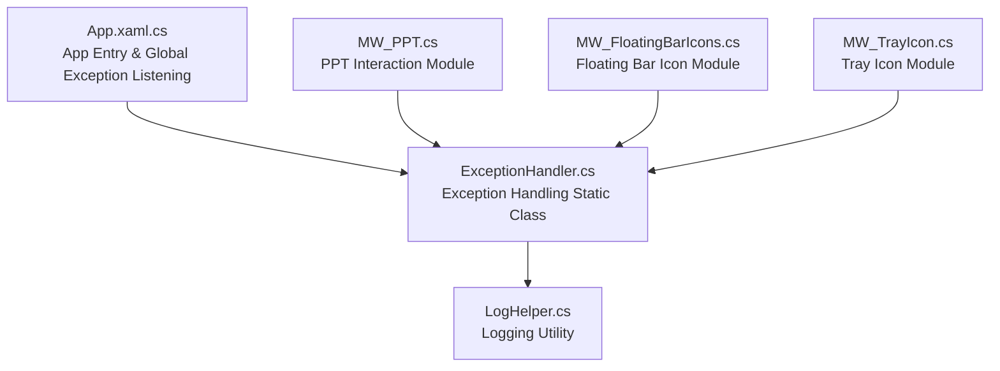
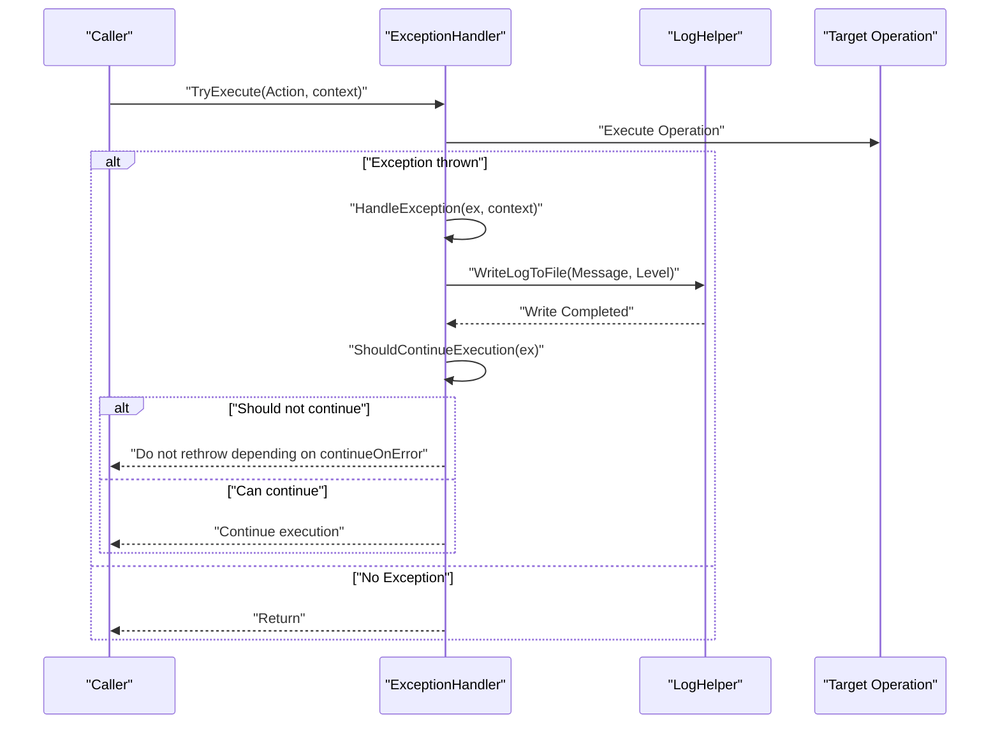
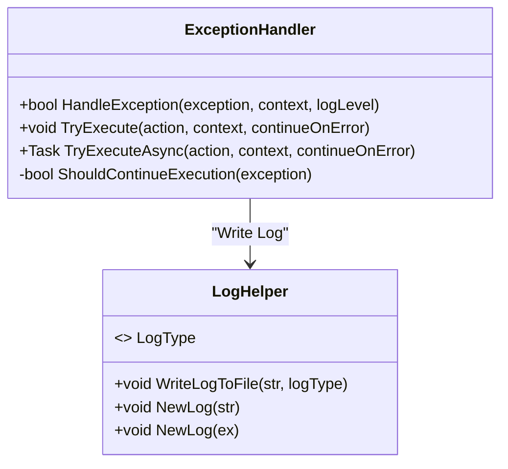
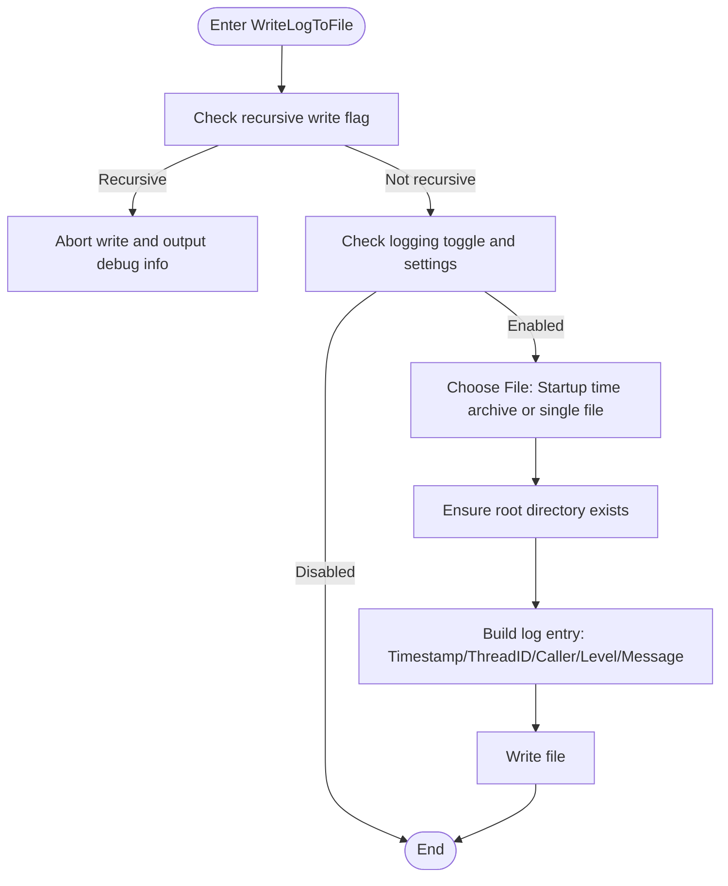
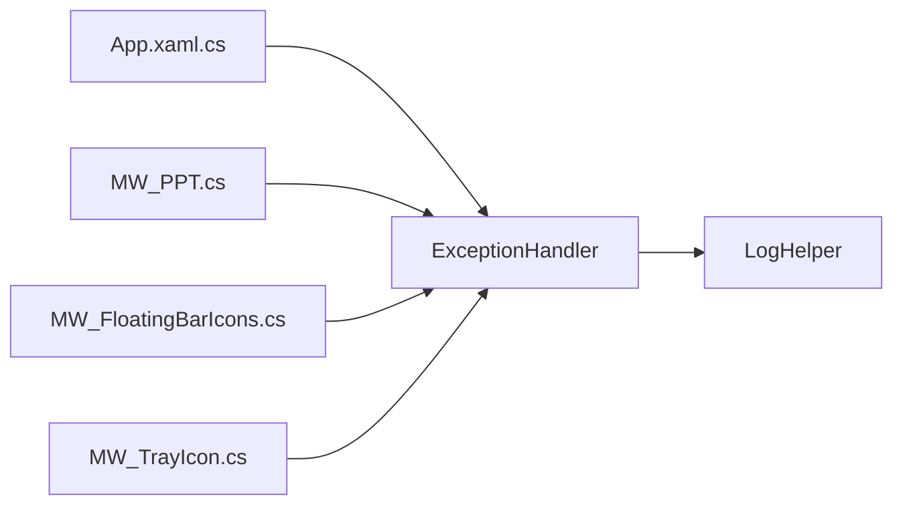

# Exception Handling Service

## Introduction
This document systematically reviews the exception handling service in the Ink Canvas project, focusing on the design and implementation of the ExceptionHandler class. It explains its global exception capture strategy, exception categorization, and processing workflow, details the implementation principles and use cases of HandleException, TryExecute, and TryExecuteAsync, and describes the decision-making mechanism of ShouldContinueExecution along with handling strategies for different exception types. Concurrently, combined with the integration of LogHelper, it explains the logging framework and log level management, provides best practices (logging context information, tracing inner exception chains, and user-friendly notifications), and offers guidelines for extensions and custom exception integrations.

## Project Structure
The exception handling service is located in the Ink Canvas/Helpers directory, with ExceptionHandler.cs and LogHelper.cs as core files. The application layer extensively utilizes exception handling and logging services in modules such as App.xaml.cs, MW_PPT.cs, MW_FloatingBarIcons.cs, and MW_TrayIcon.cs.

## Core Components
- ExceptionHandler: Provides a unified exception handling entry point, handles logging and continuation decisions, and wraps synchronous/asynchronous safe execution wrappers.
- LogHelper: Provides log writing capabilities, supporting date archiving, size-limit cleaning, recursive write protection, caller info injection, and multiple log levels.

## Architecture Overview
The exception handling service utilizes a collaborative pattern of "Static Utility Class + Logging Utility":
- ExceptionHandler is responsible for exception classification and continuation decisions, delegating file writes to LogHelper.
- LogHelper provides thread-safe, configurable file writing capabilities, supporting date-based archiving and cleanup.
- The application layer wraps potentially risky operations with ExceptionHandler's TryExecute/TryExecuteAsync to prevent exception propagation and ensure critical workflows continue.

## Detailed Component Analysis

### ExceptionHandler Design & Implementation
- Unified Entry: HandleException accepts an exception, context, and log level. It concatenates the context and exception messages, appends inner exception details when necessary, delegates writing to LogHelper, and determines if execution should continue based on the exception type.
- Decision Mechanism: ShouldContinueExecution returns false directly for fatal exceptions (such as OutOfMemoryException and AccessViolationException), permitting continuation for other exceptions by default.
- Safe Execution: TryExecute wraps Action execution, catching exceptions to invoke HandleException, and determines whether to rethrow exceptions based on the continueOnError parameter.
- Asynchronous Support: TryExecuteAsync provides asynchronous safe execution for `Func<Task>`, behaving consistently with TryExecute.

### Logging System & Level Management
- Writing Flow: WriteLogToFile implements recursive write protection via Interlocked to prevent log writes from triggering logs again. It selects between a single file or a startup-time archive based on settings, injecting timestamps, thread IDs, caller details, and log levels.
- Archiving & Cleanup: When date archiving is enabled, it automatically creates a Logs folder and limits its total capacity (default is 5MB), purging files and logging cleanup actions once the threshold is exceeded.
- Exception-Specific Logging: NewLog(Exception) automatically formats the exception type, message, stack trace, and inner exception chain details to assist in troubleshooting.

### Use Cases & Invocation Examples
- Global Exception Listening: App.xaml.cs registers unhandled exception listeners, logs exit states and device identifiers during termination, and coordinates with ExceptionHandler to log critical errors.
- PPT Interaction Module: During PPT playback and navigation, it wraps UI activations and other error-prone operations with TryExecute to prevent a single UI failure from interrupting the entire workflow.
- Icon & Tray Modules: When updating UI states or handling user interactions, it records warning-level exceptions via ExceptionHandler to ensure functionality remains available.

## Dependency Analysis
- ExceptionHandler depends on LogHelper for logging writes, maintaining generic utility by not directly depending on UI or business modules.
- The application layer (App.xaml.cs) and multiple business modules (MW_PPT.cs, MW_FloatingBarIcons.cs, MW_TrayIcon.cs) depend on ExceptionHandler and LogHelper, establishing unified exception and logging standards.

## Performance Considerations
- Recursive Write Protection: LogHelper utilizes Interlocked flags to avoid recursive calls during log writes, minimizing deadlock and duplicate write risks.
- Concurrent File Writing: Wraps file writes to reduce external exception interference with the logging system.
- Archiving & Cleanup: Startup-time archiving and size-limit cleanups prevent log files from growing indefinitely, protecting disk space and ensuring reading efficiency.
- Exception Handling Cost: TryExecute/TryExecuteAsync incurs additional overhead only when exceptions are thrown, keeping the normal path virtually cost-free.

## Troubleshooting Guide
- Common Issue Diagnosis
  - Logs Not Generated: Check MainWindow.Settings.Advanced.IsLogEnabled and IsSaveLogByDate configurations, and verify if the root directory is writable.
  - Logs Too Large: Confirm if the Logs directory cleanup threshold and cleanup logic are active.
  - Recursive Logging: If "recursive log" debug outputs appear, inspect if any log write callbacks are triggering log writes again.
- Exception Mitigation Strategies
  - Fatal exceptions like OutOfMemoryException and AccessViolationException terminate execution by default to prevent worsening of the application state.
  - Standard exceptions permit continuation by default, and continueOnError controls whether exceptions are rethrown.
- User-Friendly Notifications
  - Wrap critical operations with TryExecute in the UI layer to prevent exceptions from freezing the interface; log recoverable warning-class exceptions as Warning and alert the user.

## Conclusion
ExceptionHandler and LogHelper form the foundational exception and logging infrastructure for Ink Canvas: the former handles exception categorization and continuation decisions, while the latter delivers reliable, configurable logging. Working in coordination, they guarantee critical workflow stability and yield rich diagnostic information. By adopting unified TryExecute/TryExecuteAsync wrappers and logical log level management, developers can quickly integrate robust exception handling capabilities into complex business scenarios.

## Appendix

### Best Practices
- Logging Context Details: Provide clear context descriptions when invoking HandleException or TryExecute to facilitate log search and issue localization.
- Tracing Inner Exception Chains: Concatenate inner exception messages and record complete stack traces using LogHelper.NewLog(Exception) to preserve full exception chain details.
- User-Friendly Notifications: Log recoverable warning-class exceptions as Warning and notify the user; avoid continuing execution and record detailed diagnostics for fatal exceptions.
- Unified Exception Handling: Wrap UI interactions, COM object releases, file operations, and other error-prone scenarios uniformly with TryExecute/TryExecuteAsync.

### Extension Guide & Custom Exception Integrations
- Adding Exception Handling Strategies: Insert new exception type branches in ShouldContinueExecution to define whether they should terminate execution.
- Custom Log Levels: Select appropriate LogType categories (Info, Trace, Error, Event, Warning) according to business scenarios, and pass the corresponding level to HandleException.
- Unified Wrapper Interfaces: Provide a consistent exception handling style for new modules to ensure log consistency and maintainability.
