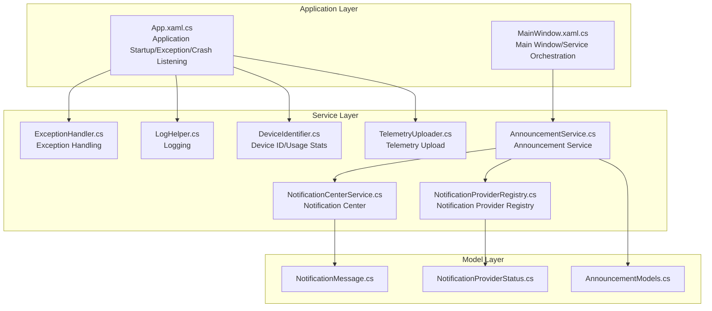
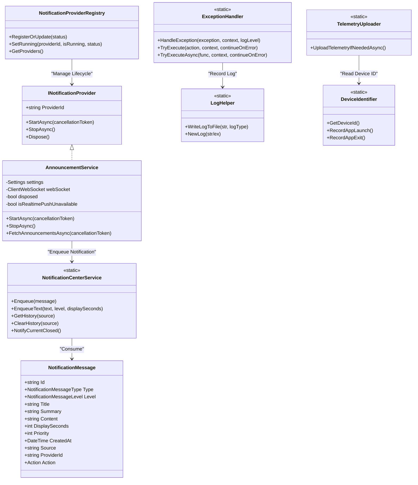
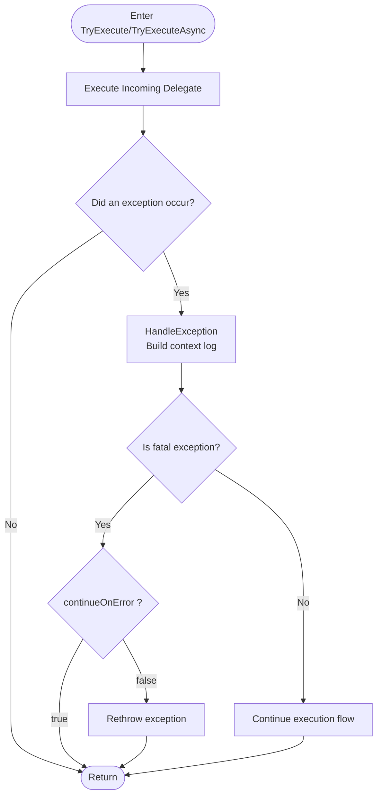
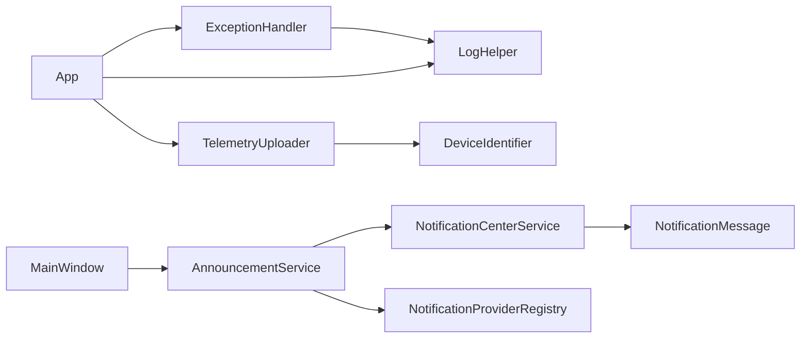

# Global Services Architecture

## Introduction
This document focuses on the global services architecture of InkCanvasForClass, covering the following topics:
- Design patterns and implementation mechanisms of global services in InkCanvasForClass (service registration, dependency injection, lifecycle management)
- Architectural design of the exception handling service (global exception capture, error categorization, logging, user notifications)
- Implementation principles of the notification center service (message dispatching, priority management, user interaction, persistent storage)
- Architectural design of the telemetry service (data collection, transmission protocols, privacy protection, performance monitoring)
- Inter-service communication mechanisms (event bus, message passing, asynchronous processing)
- Service extension and customization guide (new service development, interface design, integration testing)
- Service performance optimization strategies and fault recovery mechanisms

## Project Structure
Global services are primarily distributed in the Helpers and Models directories, coordinating with App and MainWindow startup and lifecycle management to form a loosely coupled, extensible service ecosystem.

## Core Components
- Exception Handling Service: Unifies exception capturing and categorization, determines whether to continue execution, and writes log files.
- Logging Service: Writes to log files in a thread-safe manner, supporting date archiving and size-limit cleanups.
- Notification Center Service: Centrally queues and dispatches notifications, supporting priorities and history records.
- Notification Provider Registry: Maintains the execution states and metadata of various notification providers.
- Announcement Service: Polls announcements, handles WebSocket real-time pushes, filters and localizes content, and tracks history and unread counts.
- Telemetry Upload Service: Sentry-based anonymous telemetry, featuring sensitive information anonymization and privacy controls.
- Device Identification Service: Generates and validates device IDs, recording usage statistics and update priorities.

## Architecture Overview
Global services employ a combined pattern of "Static Utility Classes + Interface Contracts + Data Models":
- Static utility classes (like exception handling, notification center, telemetry upload) provide global capabilities, implementing thread safety and decoupling internally via locks and events.
- Interface contracts (INotificationProvider) define service lifecycles to facilitate unified management in registries.
- Data models (notification messages, announcement items, provider states) guarantee data consistency and serialization compatibility across modules.

## Detailed Component Analysis

### Exception Handling Service (ExceptionHandler)
- Capability Summary
  - Unifies exception handling, constructs context logs, and decides whether to continue execution.
  - Provides synchronous and asynchronous execution wrappers, automatically invoking logging and exception categorization.
- Key Points
  - Identifies specific fatal exceptions (such as out-of-memory, access violations) directly as non-continuable.
  - Supports the continueOnError parameter to control whether exceptions are rethrown.
- Collaboration with Logging
  - Records exception stacks and inner exception chains via the log helper.

## Dependency Analysis
- Low Coupling and High Cohesion
  - The notification center and announcement service decouple via interface contracts and events, with registries managing lifecycles.
  - Telemetry upload depends on the device identification service to fetch device IDs, and logging services span exception and crash scenarios.
- External Dependencies
  - Sentry is used for telemetry event reporting.
  - WebSockets/HTTP are used for real-time push and polling of announcements.
- Circular Dependency Risks
  - The notification center is a purely static utility class, not holding service instances, avoiding circular dependencies.
  - The registry only maintains state objects, not holding concrete service instances.

## Performance Considerations
- Thread Safety & Concurrency
  - The notification center and registry protect shared states using locks to avoid race conditions.
  - The logging service utilizes atomic operations to prevent recursive writes.
- I/O & Network
  - The notification center dispatches messages only when idle to avoid blocking enqueue operations.
  - The announcement service implements exponential backoff and fast retry for WebSocket connection failures to minimize jitter.
- Storage & Cleanup
  - Limits notification history capacity to prevent infinite growth.
  - Controls log folder size limits, periodically pruning files that exceed thresholds.
- Telemetry & Privacy
  - Uploads only when privacy consent is granted and device IDs are valid, reducing useless requests.
  - Anonymizes sensitive information, lowering compliance risks and bandwidth consumption.

[This section is general guidance and does not list specific file sources]

## Troubleshooting Guide
- Announcement Service Fails to Receive Real-time Pushes
  - Check WebSocket URL construction and candidate addresses; confirm server status codes and exception categories.
  - Monitor registry state changes to verify if fallback to HTTP polling occurs.
- Notifications Not Showing or Piling Up
  - Check notification levels and priority sorting rules; verify if excessive history records are blocking enqueue operations.
  - Confirm if the UI has successfully subscribed to the NotificationRequested event.
- Telemetry Not Uploaded
  - Verify if privacy agreements are accepted, upload levels are enabled, and device IDs are valid.
  - Inspect logs for "Telemetry upload failed" warnings and examine Sentry event logs.
- Exceptions Not Caught or Repeated Crashes
  - Check the App's Dispatcher and AppDomain unhandled exception handling logic to confirm if they are safely processed.
  - Inspect crash log files to locate the latest error messages and system states.

## Conclusion
InkCanvasForClass's global services center around "Static Utility Classes + Interface Contracts + Data Models", achieving:
- Unified exception handling and logging to ensure stability and observability;
- Reliable notification centers and announcement services, balancing real-time delivery and availability;
- Balancing telemetry uploads and privacy controls to meet compliance requirements;
- Low-coupling collaboration among services via registries and event buses.

It is recommended to follow existing interface and model conventions when extending new services to ensure lifecycle and status visibility.

[This section is summary content and does not list specific file sources]

## Appendix

### Service Extension and Customization Guide
- Development Steps
  - Define the service interface (refer to INotificationProvider), declaring ProviderId, StartAsync, and StopAsync.
  - Register the service during the startup phase, reporting the initial status via the registry.
  - Enqueue notifications or trigger events at appropriate times, keeping decoupled from the notification center.
  - Release resources during the stop phase, updating status via the registry.
- Interface Design Key Points
  - Keep ProviderId unique and stable to assist registry identification.
  - Support cancellation tokens in StartAsync/StopAsync to ensure operations can be interrupted.
- Integration Testing Suggestions
  - Validate notification dispatch order and priorities using in-memory event subscriptions.
  - Simulate network anomalies and WebSocket disconnections to test fallback and retry logic.
  - Verify log and crash log integrity, as well as sensitive data anonymization effects.
