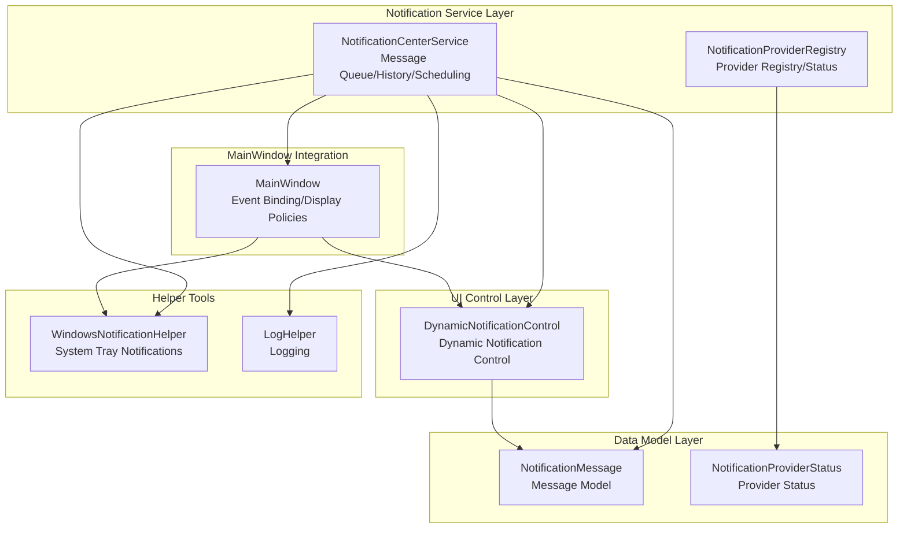
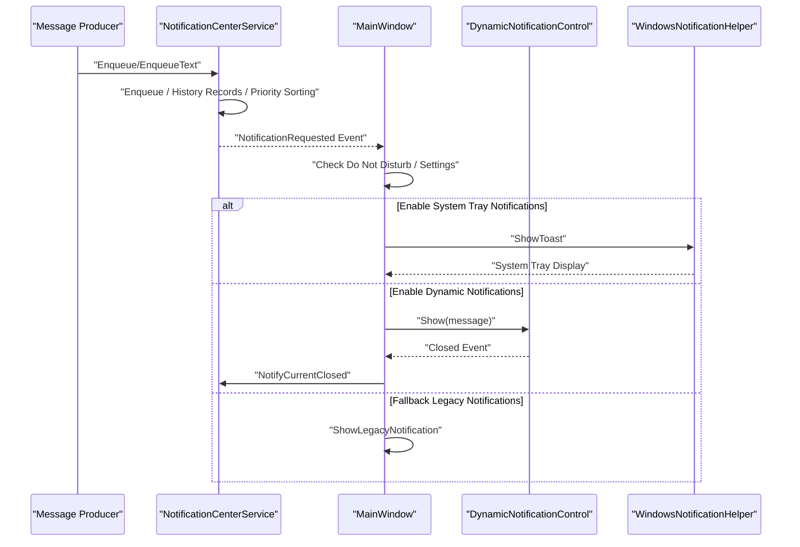
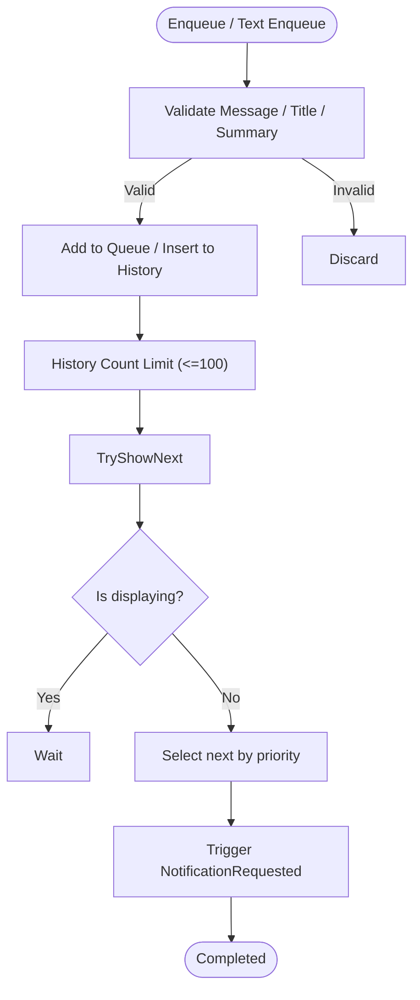
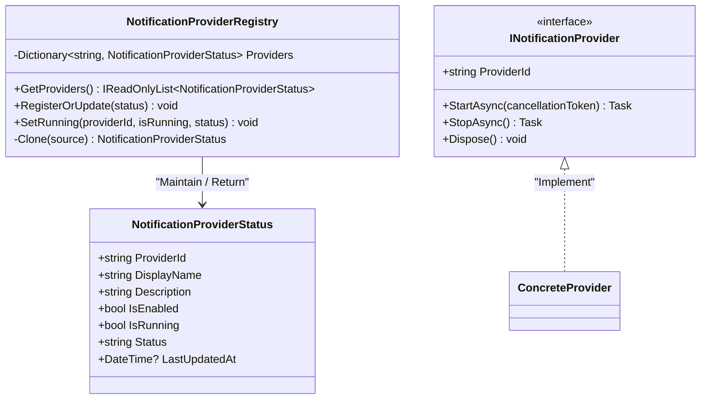
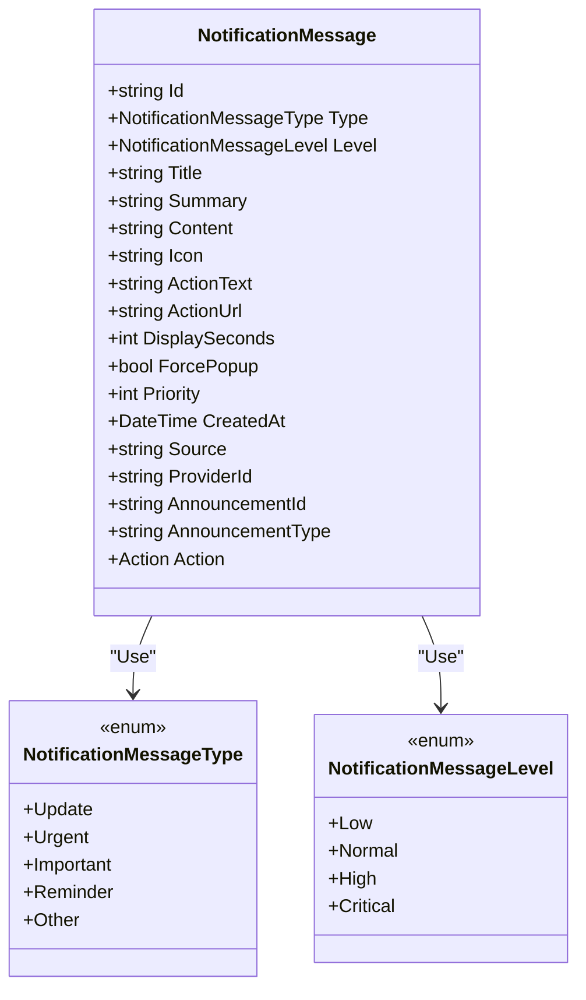
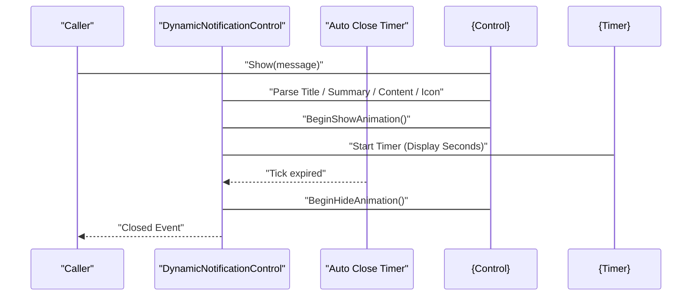
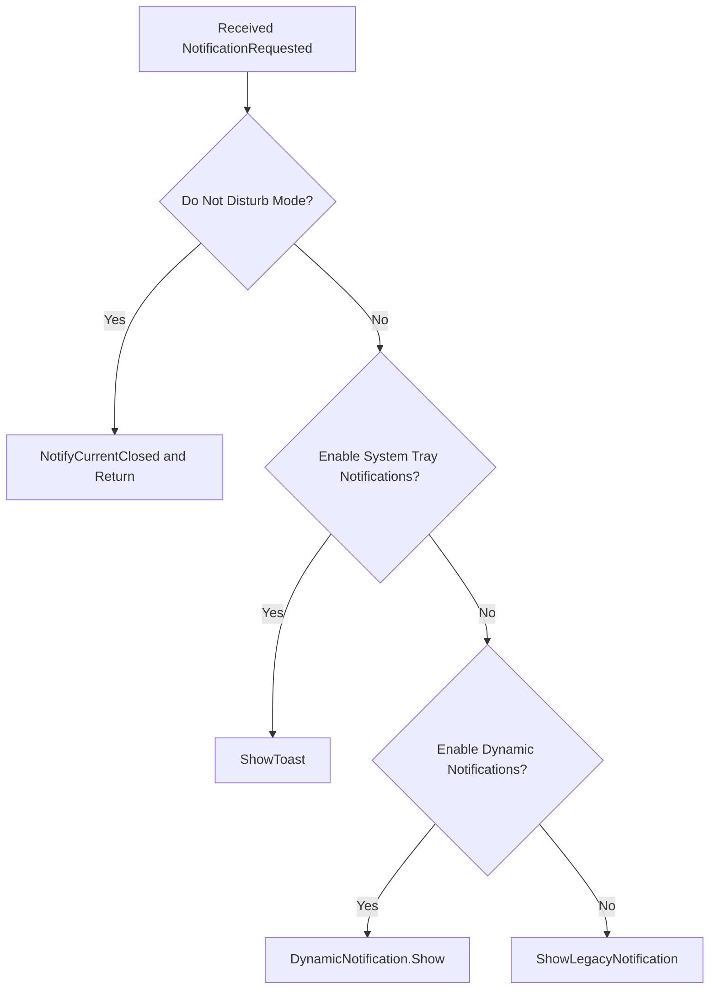
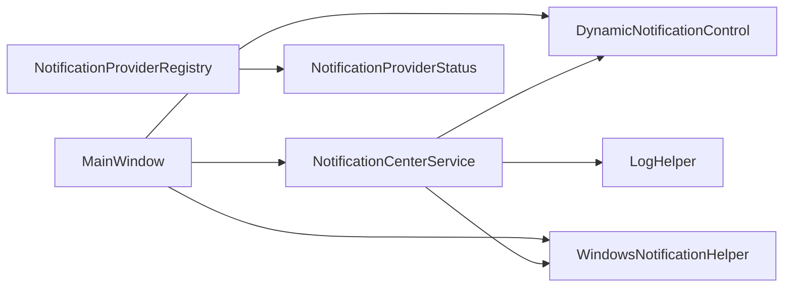

# Notification Center Service

## Introduction
This document serves as the comprehensive technical documentation for the notification center service. It delves into the architecture and implementation of NotificationCenterService, covering the creation, dispatch, and management mechanisms of notification messages; registration and lifecycle management of notification providers; design and priority strategies of notification data models; rendering and interaction of dynamic notification controls; notification display strategies (position, animation, close mechanisms); and guidelines for extensions and performance optimization. It is targeted at readers of different technical backgrounds, aiming to maintain accuracy while enhancing readability.

## Project Structure
The notification system is composed of the following modules:
- Notification Service Layer: Handles message queues, history logs, priority scheduling, and event dispatching.
- Notification Provider Registry: Maintains notification provider states and execution details.
- Data Model Layer: Defines data structures for notification messages and provider states.
- Dynamic Notification Control: Hosts the visual rendering and user interaction of notifications.
- MainWindow Integration: Listens to service events and coordinates various notification display strategies.
- Helper Tools: Windows tray notifications, logging, etc.

## Core Components
- Notification Center Service (NotificationCenterService)
  - Enqueues messages, maintains history records, sorts priorities, and dispatches events.
  - Provides text shortcut enqueuing interfaces, supporting level and display duration configurations.
  - Informs the display layer via events, featuring fallback mechanisms and auto-retry capabilities.
- Notification Provider Registry (NotificationProviderRegistry)
  - Maintains a registry status dictionary, supporting querying, registering updates, and execution status tagging.
  - Provides read-only snapshots and thread-safe accesses.
- Notification Message Model (NotificationMessage)
  - Defines message type, level, title, summary, icon, actions, display duration, priority, source, and provider identifiers.
  - Supports serialization while ignoring specific fields.
- Dynamic Notification Control (DynamicNotificationControl)
  - Manages visual rendering and interaction, supporting expand/collapse, hover-to-pause, auto-close, and action clicks.
  - Provides show/hide animations and event callbacks.
- MainWindow Integration (MainWindow)
  - Subscribes to notification request events, choosing between system tray notifications or dynamic notifications based on settings.
  - Implements "Do Not Disturb" suppression policies and legacy notification fallbacks.
- Windows Tray Notifications (WindowsNotificationHelper)
  - Delivers tray balloon prompts compatible across versions based on system notification frameworks.
- Log Helper (LogHelper)
  - Provides unified logging writes and directory cleanup policies to protect stability and observability.

## Architecture Overview
The notification system utilizes a layered "Service-Control-MainWindow" architecture:
- The service layer centrally processes messages and statuses, decoupling display strategies.
- The control layer concentrates on UI performance and interactions, simplifying extensions and substitutions.
- MainWindow selects the optimal display path based on user configurations and scenarios.
- The registry and log helper provide runtime governance and observability support.

## Detailed Component Analysis

### Notification Center Service (NotificationCenterService)
- Message Queue & History Management
  - Uses thread-safe collections and locks to ensure concurrent safety.
  - Restricts the history list capacity to retain the latest 100 records.
- Enqueueing & Priority Scheduling
  - Validates title/summary before enqueuing to prevent invalid messages.
  - Sorting Rules: Level (descending) → Priority (descending) → Creation Time (ascending).
- Text Shortcut Enqueueing
  - Automatically generates unique IDs, type mappings, icons, and priorities.
  - Fallback and Auto Recovery: Logs failures on dispatch exceptions and triggers closing of the current notification to prevent blocking subsequent messages.

### Notification Provider Registry (NotificationProviderRegistry)
- Provider Status Dictionary
  - Key is the provider ID (case-insensitive), value is a clone of the status object.
- Querying & Updates
  - Returns read-only snapshots sorted by ID to ensure UI consistency.
  - Records the last update timestamp when updating, supporting running status tags.
- Lifecycle Management
  - Starts/stops via concrete providers implementing the interface (INotificationProvider).

### Notification Message Model (NotificationMessage)
- Property Framework
  - Identity & Source: Id, Source, ProviderId, AnnouncementId/Type
  - Visual & Behavioral: Title, Summary, Content, Icon, ActionText, ActionUrl, ForcePopup
  - Time & Display: DisplaySeconds, CreatedAt
  - Strategy & Priority: Type (Message Type), Level (Level), Priority
  - Executable Actions: Action (Delegate)
- Serialization Control
  - Certain properties (e.g., Action) are ignored during JSON serialization to prevent serialization overheads and security risks.

### Dynamic Notification Control (DynamicNotificationControl)
- Rendering Logic
  - Selects icons based on message level and type.
  - Calculates display duration automatically, supporting force-popup modes.
  - Expands/collapses panels to reveal summaries and details.
- User Interaction
  - Left click toggles the expand state.
  - Close button and auto timer close.
  - Hover to pause, leave to resume countdown.
  - Action buttons support executing delegates or opening URLs.
- Animation & Visibility
  - Entrance: Fade-in + translate easing.
  - Exit: Fade-out + translate rollback, resetting status and triggering close events upon completion.

### MainWindow Integration & Display Policies (MainWindow)
- Event Binding
  - Subscribes to notification request events, handling Do Not Disturb settings and display policies.
- Display Policies
  - System Tray Notifications: Invokes system notifications when enabled.
  - Dynamic Notifications: Delegates rendering to controls when enabled.
  - Legacy Notifications: Serves as a fallback, using slide-in/fade-out animations.
- Do Not Disturb Mode
  - Determines whether to suppress notifications based on settings and active modes (presentation/whiteboard).

### Windows Tray Notifications (WindowsNotificationHelper)
- Compatibility Strategy
  - Win7 uses taskbar balloon prompts.
  - Modern Windows uses system notification builders.
- Parameter Adaptation
  - Prioritizes titles and summaries/contents to guarantee message readability.

### Logging & Error Handling (LogHelper)
- Logging Writes
  - Supports startup-time archiving and size-limit cleanups.
  - Prevents recursive writes to avoid log storms.
- Fallback Safeguards
  - The notification service and MainWindow log errors and close the active notification on exceptions to prevent thread blockages.

## Dependency Analysis
- Component Coupling
  - Service layers decouple from UI controls via events, easing display strategy replacements.
  - MainWindow acts as an orchestrator, relying on settings and environment states to determine display paths.
- External Dependencies
  - System notification frameworks (Modern Windows) and third-party tray icon libraries.
  - WPF animation and event models.
- Circular Dependencies
  - No direct circular dependencies; control close events route back to the service layer, forming a one-way closed loop.

## Performance Considerations
- Queue & History Management
  - Protects shared states using locks and fixed history capacities to prevent memory bloat.
- Priority Sorting
  - Triggers only when new messages arrive or when no notification is active, reducing sorting overheads.
- UI Animation & Timers
  - Controls adopt lightweight animations and single-use timers to prevent resource leaks.
- Logging & IO
  - Log writes are locked and protected against recursion, archiving and cleaning up as needed to reduce disk footprints.
- Display Policies
  - Prioritizes system tray notifications under high-load scenarios to lower UI rendering pressures.

## Troubleshooting Guide
- Notification Not Showing
  - Check Do Not Disturb settings and the active scenario (presentation/whiteboard).
  - Verify if dynamic notifications are enabled and if the control instance is available.
  - Inspect log files to locate exceptions.
- Dynamic Notification Cannot Close
  - Verify mouse hover regions and button click events.
  - Confirm if the timer has been accidentally paused.
- System Tray Notification Fails
  - Verify system notification permissions and version compatibility.
  - Check the exception logs for detailed errors.
- History Log Anomaly
  - Verify history capacity limits and enqueueing logic to prevent duplicate or invalid messages.

## Conclusion
The notification center service implements reliable message enqueueing, intelligent scheduling, and multi-policy displays through its distinct layered design and event-driven mechanism. Coordinating with the provider registry and the logging framework, the system excels in extensibility, observability, and user experience. It is recommended during integration to pay attention to display policy configurations and performance monitoring, continuously optimizing priorities and animations.

## Appendix

### Extension Guide: Custom Notification Providers
- Implement the Interface
  - Implement the provider interface, defining ProviderId, and handle resource lifecycles during start/stop phases.
- Registration & Status Reporting
  - Report status via the registry, including enabled/running states and the last update timestamp.
- Service Integration
  - Start the provider at appropriate times, generating and enqueuing notification messages to utilize the existing event distribution system.

### Settings Page & Display Policy Configurations
- Settings Overview
  - Enable announcements, force popups, connection parameters (API/WS/Token), dynamic notification toggle, system tray notification toggle, and Do Not Disturb (with presentation/whiteboard details).
  - Notification positions (top center / top right / top left), animation modes (disabled/simple/standard), display duration sliders for each category, and test buttons.
- Configuration Application
  - MainWindow selects system tray or dynamic notifications based on configurations, falling back to legacy notifications when disabled.
