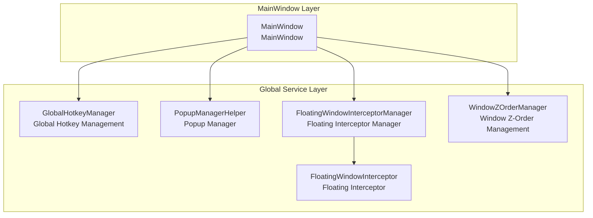
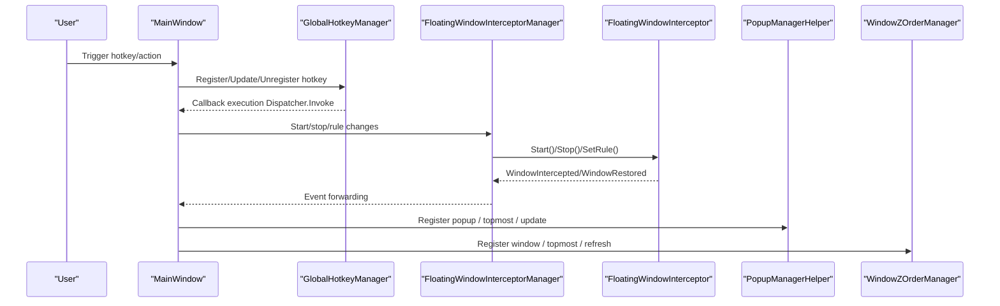
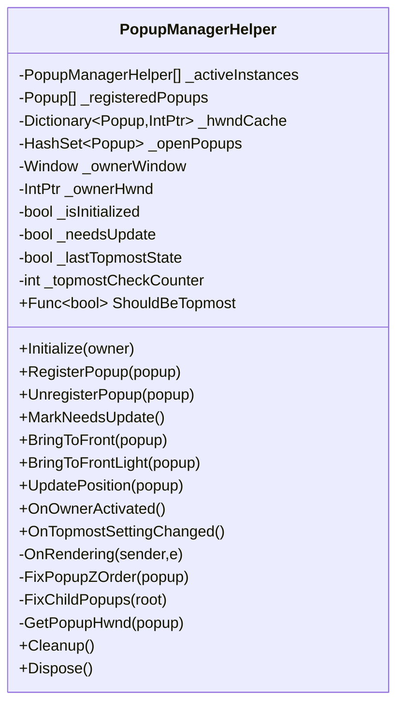
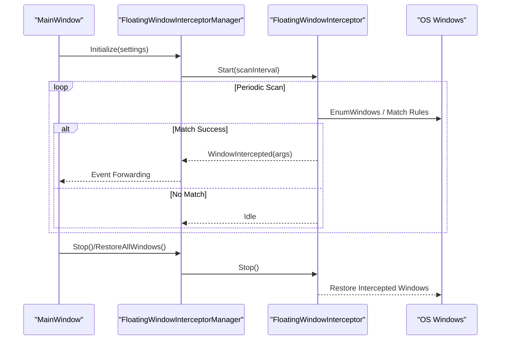
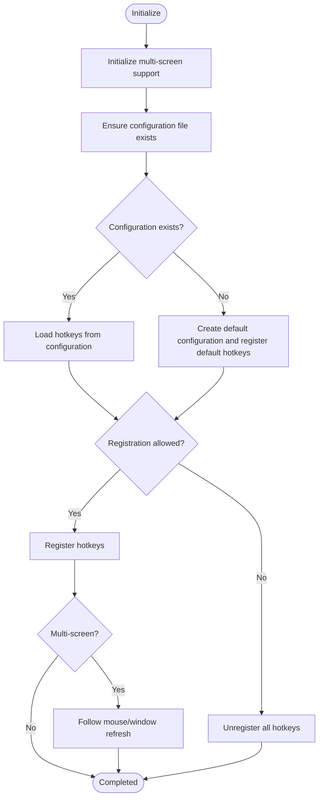
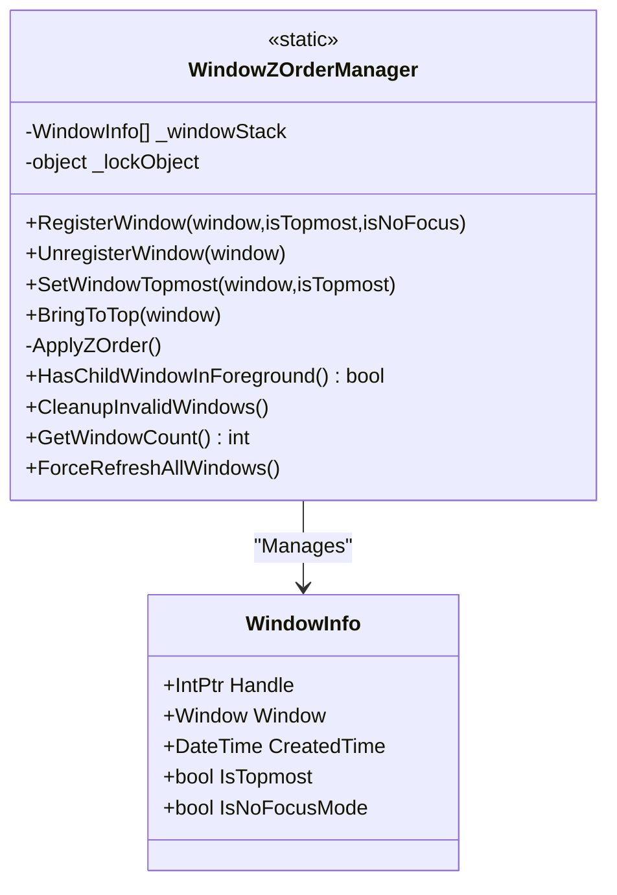
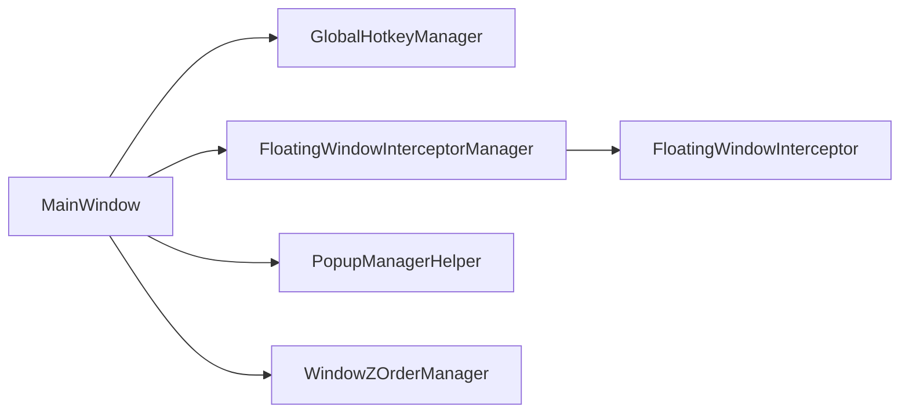

# Service Communication Patterns

## Introduction
This document focuses on the communication mechanisms and collaboration patterns among global services in InkCanvasForClass, structured around the following topics:
- Event dispatching and state synchronization in the popup manager
- Management strategies and priority handling in the floating window interceptor
- Keyboard event capture and shortcut responses in global hotkey management
- Architectural design and focus management in window Z-order management
- Best practices for inter-service communication (event-driven, message passing, asynchronous processing)
- Suggestions for performance optimization and concurrency safety

## Project Structure
InkCanvasForClass utilizes a "Main Window + Multiple Global Services" architecture. The main window handles aggregation and orchestration, and each global service communicates via loosely coupled events and method calls.

## Core Components
- Popup Manager (PopupManagerHelper)
  - Registers popups, handles open/close events, controls topmost Z-ordering, updates positions, and synchronizes child popups.
  - Key Points: Periodic rendering callback checks, HWND caching, and conditional topmost policies.
- Floating Window Interceptor (FloatingWindowInterceptor + Manager)
  - Manages interception rules, scanning threads, event dispatching (intercept/restore), statistics, and configuration applications.
  - Key Points: Parent-child rule interactions, scan intervals, and execution state maintenance.
- Global Hotkey Manager (GlobalHotkeyManager)
  - Implements global shortcut registrations, cross-screen support, smart enabling/disabling, and action scheduling based on NHotkey.
  - Key Points: Main thread dispatching, multi-screen and mouse tracking, and configuration persistence.
- Window Z-Order Manager (WindowZOrderManager)
  - Maintains the window stack, topmost strategies, focus and visibility evaluation, and force refreshes.
  - Key Points: Critical section locks, Win32 API invocations, and Z-ordering policies in no-focus modes.

## Architecture Overview
Global services are uniformly initialized and bridged via events in the main window, forming a collaborative pattern of "MainWindow Orchestration + Service Autonomy + Event-Driven".

## Detailed Component Analysis

### Popup Manager (PopupManagerHelper)
Responsibilities & Workflows
- Initialization & Registration: Binds to CompositionTarget.Rendering, registers popup Opened/Closed events, and caches HWNDs.
- State Synchronization: Periodically inspects and repairs Z-ordering; supports "conditional topmost" policies (ShouldBeTopmost).
- Event-Driven: Triggers synchronization when popups open/close, when the main window activates, or when topmost settings change.
- Position Updates: Triggers layout recalculation by fine-tuning offsets, guaranteeing visual consistency.

### Floating Window Interceptor (FloatingWindowInterceptor + Manager)
Responsibilities & Workflows
- Manager: Wraps interceptor lifecycles, event bridging, rule linkings, configuration applications, and statistics.
- Interceptor: Enumerates windows based on a scanning thread, hiding/restoring targets matching the rules, and publishing events.
- Priorities & Parent-Child Rules: Enabling/disabling parent rules affects child rules; enabling/disabling child rules affects parent rules.

### Global Hotkey Manager (GlobalHotkeyManager)
Responsibilities & Workflows
- Registration/Cancellation: Registers global shortcuts via NHotkey, avoiding conflicts and replacing duplicate registrations.
- Main Thread Dispatching: Executes business logic on the UI thread via Dispatcher.Invoke within callbacks.
- Multi-Screen & Smart Enabling: Dynamically refreshes hotkey registrations based on window locations, focus, and mouse positions.
- Configuration Persistence: Loads/saves configurations from JSON files, falling back to default shortcuts.

### Window Z-Order Manager (WindowZOrderManager)
Responsibilities & Workflows
- Registration/Cancellation: Maintains the window stack, tracking HWNDs, creation times, topmost settings, and no-focus flags.
- Topmost Strategy: Topmost and visible windows are grouped and set to top, correcting extended styles when necessary.
- Focus & Foreground: Detects child windows in the foreground, cleans invalid records, and forces refreshes.

### MainWindow Integration & Event Bridging
- Floating Interceptor Integration: The main window initializes the interceptor manager, subscribes to intercept/restore events, and controls start/stop operations and rule links through settings.
- Hotkey Event Bridging: The main window provides concrete UI actions (e.g., undo, redo, tool toggles) which are dispatched within callbacks by the hotkey manager.

## Dependency Analysis
- MainWindow Dependency on Global Services: MainWindow holds service instances, handling initialization and event bridging.
- Service Cohesion & Decoupling:
  - The popup manager and interceptor manager independently maintain states and events.
  - The hotkey manager and window Z-order manager interact indirectly through the main window.
- External Dependencies:
  - NHotkey (global hotkeys)
  - Win32 APIs (window Z-orders, styles, visibility)
  - WPF Dispatcher (UI thread scheduling)

## Performance Considerations
- Rendering Callback Throttling: The popup manager reduces topmost overheads using counters and minimum update intervals.
- Scanning Thread & Interval: The interceptor scans via timers, with scan intervals balanced to avoid high loads.
- UI Thread Dispatching: Hotkey callbacks switch to the UI thread via Dispatcher.Invoke, preventing cross-thread access.
- HWND Caching: The popup manager caches HWNDs, lowering query and validation costs.
- Concurrency Safety: The window Z-order manager protects shared states using locks to prevent race conditions.

## Troubleshooting Guide
- Popup Topmost Anomaly
  - Verify ShouldBeTopmost return values and check if owner activation events trigger.
  - Confirm HWND cache validity and check IsWindow evaluations.
- Interceptor Not Working
  - Verify rule statuses and check parent-child rule links.
  - Confirm scan intervals, running statuses, and verify that Start() was called.
- Hotkey Not Responding
  - Verify if registrations are allowed (check multi-screen, focus, and mouse position policies).
  - Confirm the configuration file exists and is readable, falling back to default settings if necessary.
- Window Z-Ordering Confused
  - Invoke ForceRefreshAllWindows or CleanupInvalidWindows.
  - Verify topmost and no-focus mode settings.

## Conclusion
InkCanvasForClass implements loosely coupled collaborations among global services through centralized orchestration in the main window, combining event-driven notifications and method calls. The popup manager, floating interceptor, global hotkeys, and window Z-order manager each perform distinct duties, ensuring stability and maintainability via clear lifecycles and event bridges. It is recommended in production environments to further refine logging levels, isolate exceptions, implement resource recovery strategies, and optimize scan and dispatch frequencies to balance performance and real-time responsiveness.

## Appendix
- Legacy System Hotkeys (Win32) Sample: Included for understanding underlying mechanisms; the project primarily uses NHotkey.
