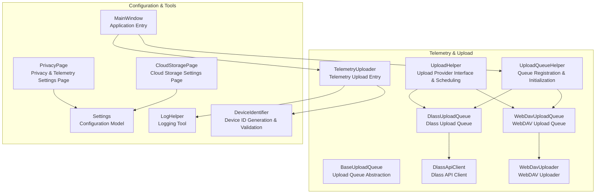
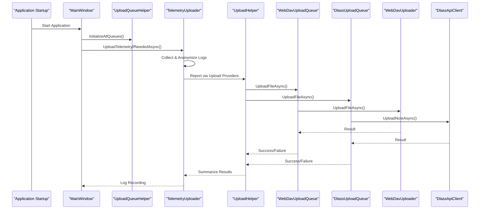
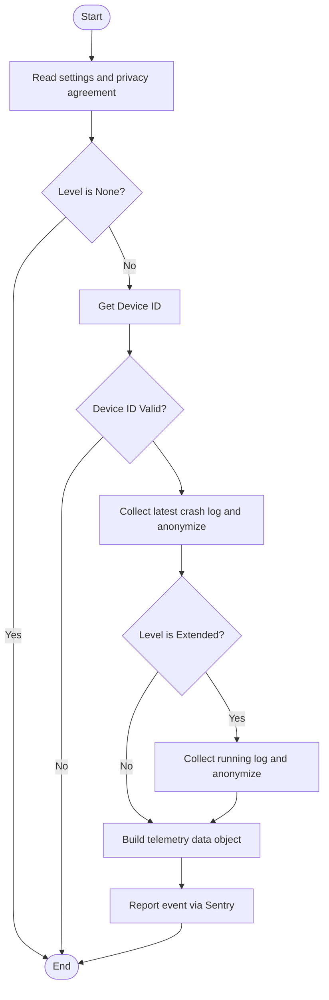
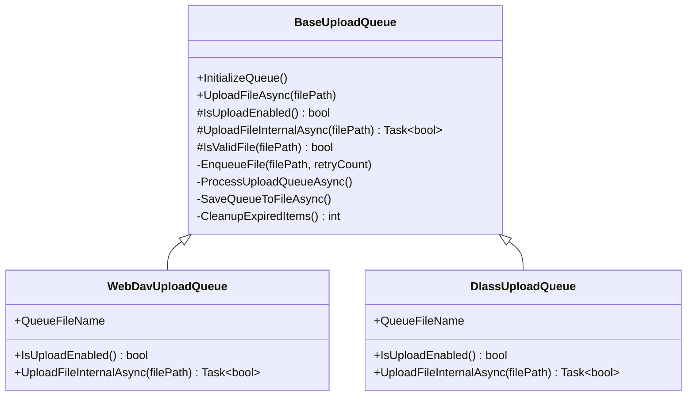
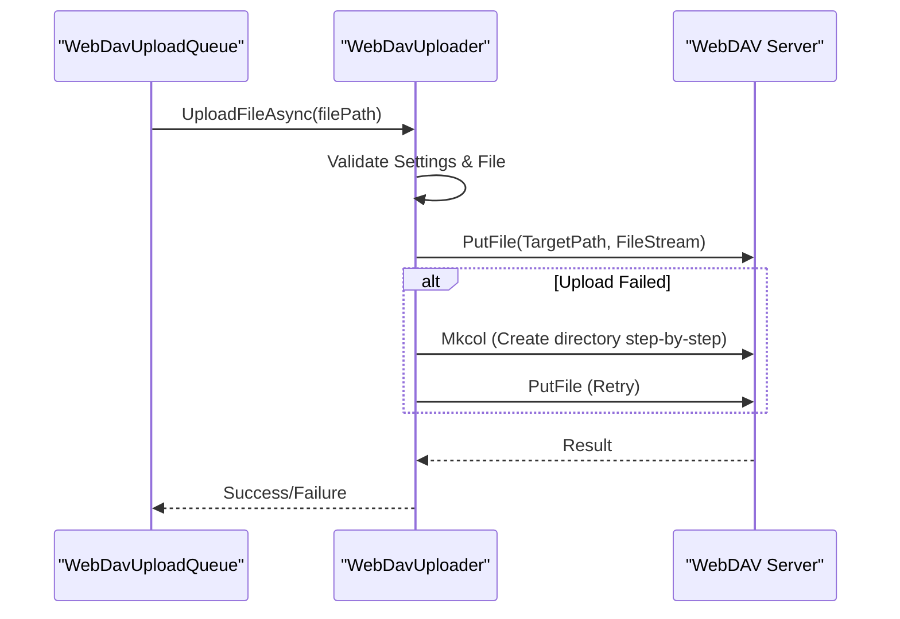
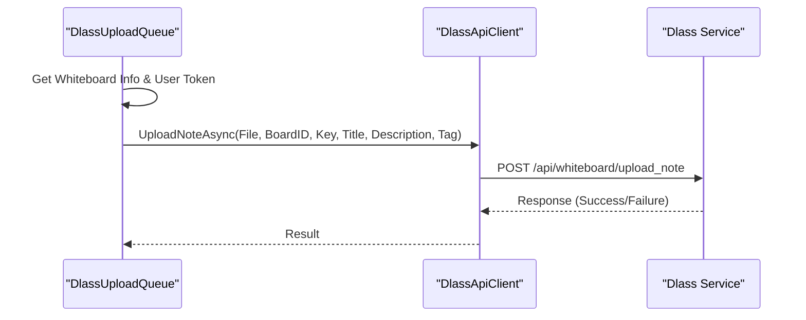
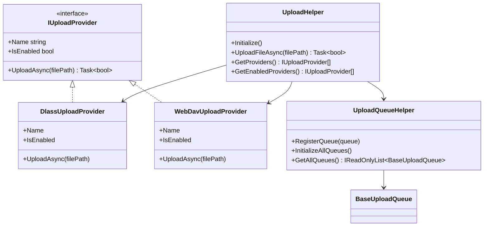
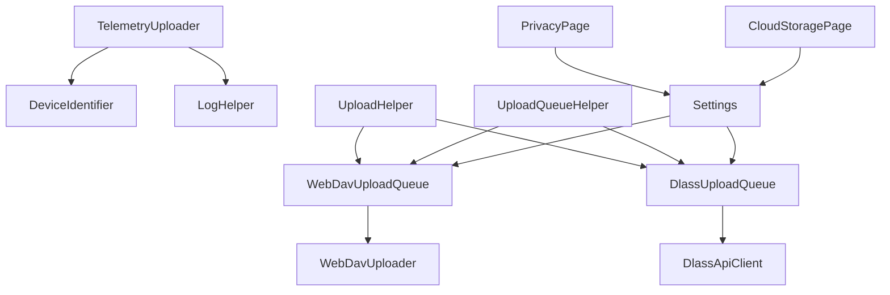

# Telemetry Service

## Introduction
This document focuses on the implementation and usage of the "Telemetry Service", centering on the architectural design and implementation details of TelemetryUploader. It covers telemetry data collection, anonymization, formatting, and reporting workflows; design and implementation of upload queue systems (BaseUploadQueue abstraction and WebDavUploadQueue/DlassUploadQueue concrete implementations); classification and priority management of telemetry data (handling policies and batch uploading mechanisms for different levels of data); security guarantees for data transmission (encrypted transmission, authentication, and data integrity checks); configuration management (upload frequency, data retention policies, and network status detection); and data analysis, visualization methods, performance optimization strategies, and fault recovery mechanisms.

## Project Structure
Telemetry-related code is primarily located in Ink Canvas\Helpers, which, in coordination with the settings pages and resource definitions, forms a complete telemetry system:
- Telemetry Upload Entry & Anonymization Logic: TelemetryUploader
- Upload Queue Abstraction & General Implementation: BaseUploadQueue
- Concrete Upload Providers & Queues: WebDavUploadQueue, DlassUploadQueue
- Upload Provider Interfaces & Consolidated Dispatching: UploadHelper, UploadQueueHelper
- Upload Clients & WebDAV Uploaders: DlassApiClient, WebDavUploader
- Device Identification & Logging Tools: DeviceIdentifier, LogHelper
- Configurations & Settings Pages: PrivacyPage, CloudStoragePage, Settings

## Core Components
- TelemetryUploader: Collects, anonymizes, and reports telemetry data. It supports Basic/Extended levels to upload crash logs and running logs respectively, reporting events via Sentry.
- BaseUploadQueue: The abstract base class for upload queues, defining general queue behaviors (initialization, enqueueing, batch processing, retries, persistence, expired cleanup, file validation, etc.).
- WebDavUploadQueue/DlassUploadQueue: Concrete upload queue implementations interfacing with WebDAV and Dlass services, wrapping upload logic and conditions checks.
- UploadHelper/UploadQueueHelper: Provides upload provider interfaces and unified dispatching, registering and initializing upload queues, and supporting delayed and concurrent uploads.
- WebDavUploader/DlassApiClient: Underlying uploaders and API clients handling network transmissions, authentications, and error handling.
- DeviceIdentifier/LogHelper: Device identifier generation and logging utilities, ensuring observability and traceability in telemetry and upload processes.
- Configurations & Settings Pages: PrivacyPage/CloudStoragePage and the Settings model, providing configurations for telemetry levels, privacy agreements, upload providers, and WebDAV/Dlass parameters.

## Architecture Overview
The telemetry service adopts a pipelined "Collection - Anonymization - Queue - Upload - Reporting" architecture. Upon application startup, MainWindow initializes the upload queues and triggers TelemetryUploader to execute telemetry reporting. The upload queues are uniformly dispatched via UploadHelper/UploadQueueHelper, supporting multiple upload providers, batch uploading, retries, and persistence.

## Detailed Component Analysis

### TelemetryUploader: Telemetry Data Collection, Anonymization & Reporting
- Data Collection & Level Control
  - Determines whether to collect and report based on TelemetryUploadLevel (None/Basic/Extended) in settings.
  - Basic Level: Collects the latest crash logs (anonymized).
  - Extended Level: Additionally collects running logs (anonymized).
- Anonymization Policy
  - Uses regular expressions to replace sensitive information in emails, phone numbers, IPv4, Windows paths, UNC paths, URL parameters, key-value pairs, and JSON fields.
- Device & Environment Information
  - Fetches the device ID via DeviceIdentifier, appending metadata like application version, OS version, and update channels.
- Reporting Channels
  - Reports events via the Sentry SDK, containing user details, telemetry data tags, and extra attachments.

### BaseUploadQueue: Upload Queue Abstraction & General Implementation
- Queues & Persistence
  - Uses concurrent queues to store pending uploads, supporting serialization to JSON files under the Configs directory to prevent loss across restarts.
- Batch Uploads & Concurrency
  - Defaults to a batch size of 10, executing asynchronous concurrent uploads and saving queue states upon completion.
- Retries & Error Handling
  - Max retry limit is 3; determines whether to retry based on error types (timeouts, network errors, specific HTTP status codes).
- File Validation & Expired Cleanup
  - Validates file extensions and sizes; prunes expired items older than 72 hours regularly.
- Concurrency Control
  - Uses semaphores to manage queue processing and saving concurrency, preventing race conditions and deadlocks.

### WebDavUploadQueue & WebDavUploader: WebDAV Upload Implementation
- WebDavUploadQueue
  - Queue filename is WebDavUploadQueue.json; upload enabling is evaluated via WebDavUploader.IsWebDavEnabled().
  - UploadFileInternalAsync invokes WebDavUploader.UploadFileAsync to complete the upload.
- WebDavUploader
  - Reads the WebDAV address, username, password, and root directory settings to construct target paths.
  - Attempts directory creation if the first upload fails, and retries the upload; supports cancellation tokens and exception handling.

### DlassUploadQueue & DlassApiClient: Dlass Upload Implementation
- DlassUploadQueue
  - Queue filename is DlassUploadQueue.json; upload is enabled if auto-upload is toggled on in settings.
  - UploadFileInternalAsync retrieves whiteboard info and user tokens, prepares upload parameters (title, description, tags), and calls DlassApiClient.UploadNoteAsync to upload.
- DlassApiClient
  - Supports OAuth to fetch access tokens or uses user tokens; handles GET/POST/PUT/DELETE requests and file uploads.
  - Injects whiteboard authentication headers (X-Board-ID, X-Secret-Key) and file contents during uploads.

### UploadHelper & UploadQueueHelper: Upload Provider & Queue Management
- UploadHelper
  - Defines the IUploadProvider interface, providing WebDavUploadProvider and DlassUploadProvider registered and bound to corresponding queues by default.
  - UploadFileAsync supports upload delay (minutes), file accessibility checks, concurrent uploads to multiple providers, and error logging.
- UploadQueueHelper
  - Registers and initializes all upload queues uniformly, ensuring queues are ready upon application startup.

## Dependency Analysis
- Component Coupling
  - TelemetryUploader depends on DeviceIdentifier and LogHelper to report telemetry events via Sentry.
  - Upload queues depend on UploadHelper/UploadQueueHelper for registration and initialization.
  - WebDavUploadQueue depends on WebDavUploader; DlassUploadQueue depends on DlassApiClient.
- External Dependencies
  - Sentry SDK for telemetry event reporting.
  - WebDav client library for WebDAV uploads.
  - HttpClient for Dlass API communications.
- Configuration Dependencies
  - The Settings model provides Dlass/WebDAV parameters and upload delays; PrivacyPage/CloudStoragePage provide user interaction interfaces.

## Performance Considerations
- Batch Uploads & Concurrency
  - Default batch size is 10 to reduce network connection overheads; concurrent uploading improves throughput.
- Queue Persistence & Recovery
  - Queue states are persisted to JSON files, automatically recovering upon restart to avoid duplicate uploads.
- Expired Cleanup & Capacity Controls
  - Limits maximum queue length and enforces a 72-hour expiration policy to prevent memory and disk expansion.
- Retry Strategies
  - Limits retries to 3 times, matching with retryable errors (timeouts, network issues, select HTTP codes) to lower failure rates.
- Upload Delays
  - UploadHelper supports minute-level upload delays to smooth out network loads.

## Troubleshooting Guide
- Telemetry Upload Fails
  - Verify if privacy agreements are accepted and check if TelemetryUploadLevel is set to None.
  - Confirm if the device ID is valid.
  - Review Warning / Error entries in log files.
- Upload Queue Anomaly
  - Verify if queue JSON files under Configs are corrupted or have permission issues.
  - Inspect queue recovery logs and expired cleanup records.
- WebDAV Upload Fails
  - Check WebDAV address, username, password, and root directory configurations.
  - Verify network connectivity and directory creation privileges.
- Dlass Upload Fails
  - Check user tokens, whiteboard info, and authentication header settings.
  - Inspect API base URLs and network states.

## Conclusion
The telemetry service implements telemetry data collection and anonymized reporting via TelemetryUploader, utilizing BaseUploadQueue abstractions and WebDavUploadQueue/DlassUploadQueue implementations to deliver robust batch uploading and retry mechanisms. UploadHelper/UploadQueueHelper provide unified upload providers and queue management, cooperating with Settings and settings pages to supply flexible controls and user experiences. The overall architecture exhibits excellent extensibility, observability, and fault tolerance.

## Appendix
- Configuration References
  - Telemetry levels and privacy agreements: PrivacyPage
  - Dlass/WebDAV parameters and auto uploads: CloudStoragePage
  - Upload delays and provider toggles: relevant fields for Upload/Dlass/WebDav in Settings
- Data Retention Policy
  - Clears log directories when size exceeds 5MB to prevent infinite disk growth.
- Network Status Detection
  - Uploaders identify network errors and timeouts via exceptions and HTTP status codes, combining with retry strategies to boost success rates.
