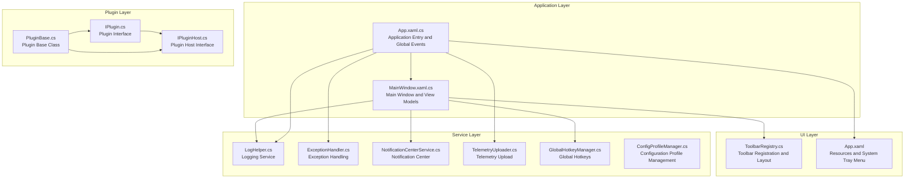
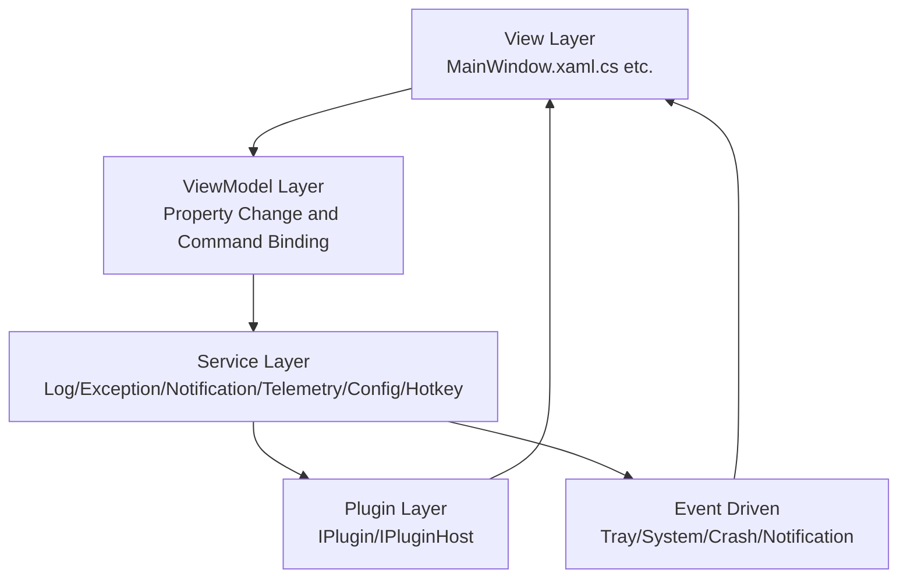
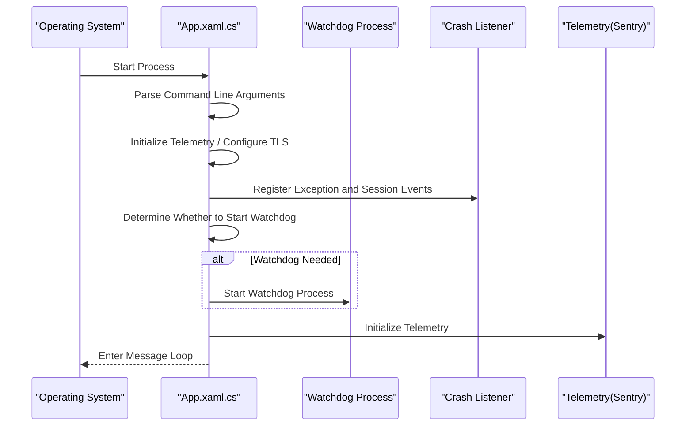
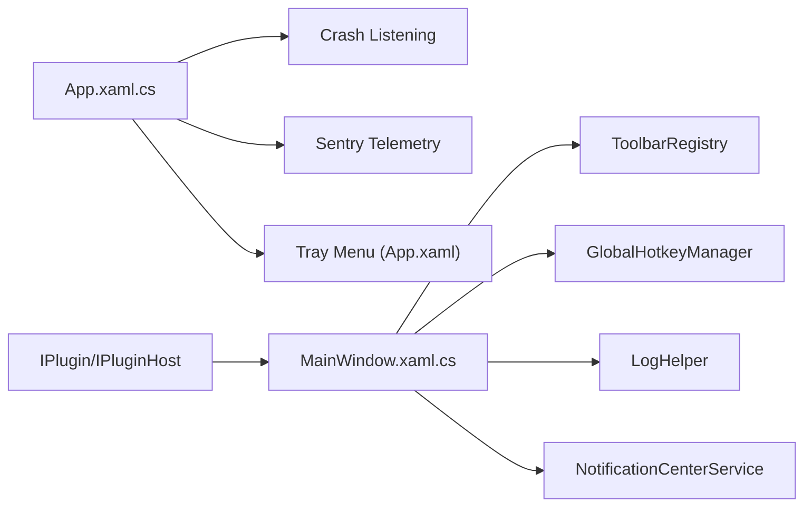

# System Architecture Design

## Introduction
This document focuses on the system architecture design of InkCanvasForClass, providing a comprehensive explanation of the MVVM architectural pattern, modular and layered design, application entry and startup workflows, global services and event-driven mechanisms, configuration management, and monitoring & diagnostics. It is intended to help developers and maintainers quickly understand the system's design philosophy, key implementations, and extension points.

## Project Structure
InkCanvasForClass adopts the WPF desktop application architecture combined with a modular and layered design to decouple UI, business logic, auxiliary services, and the plugin ecosystem. An overview of the core directories and their responsibilities is as follows:
- Ink Canvas: Main application project, containing UI, main window, toolbars, pop-up windows, settings views, internationalization resources, styles, and icon resources.
- Helpers: General services and infrastructure, such as logging, exception handling, configuration file management, telemetry, notification center, global hotkeys, PPT/COM helpers, etc.
- Controls: Reusable UI controls and toolbar systems, supporting dynamic layouts and rule-based rendering.
- Windows: Various windows and settings pages containing specific functional views.
- InkCanvas.PluginSdk: Plugin interfaces and host contracts, defining plugin lifecycles and service registration capabilities.
- Configuration & Resources: App.config, App.xaml, resource dictionaries, localized strings, etc.

## Core Components
- Application Entry & Lifecycle Management: App.xaml.cs is responsible for application startup, command line argument parsing, watchdog monitoring, crash listening, exception handling, tray menus, and resource initialization.
- Main Window & View Model: MainWindow.xaml.cs hosts the UI logic, toolbar injection, notifications, timers, PPT/COM integration, global hotkeys, page and canvas management.
- Logging & Exceptions: LogHelper provides unified log writing and archiving; ExceptionHandler provides exception handling and continue-execution strategies.
- Notification Center: NotificationCenterService provides message queuing, historical logs, and priority scheduling.
- Telemetry & Diagnostics: TelemetryUploader is responsible for anonymized telemetry data collection and reporting, as well as crash log and execution log gathering.
- Configuration Management: ConfigProfileManager supports saving, switching, and hot-reloading multiple configuration profiles.
- Toolbar System: ToolbarRegistry provides dynamic layout, rule-based display, and configuration persistence.
- Global Hotkeys: GlobalHotkeyManager provides cross-screen, context-aware hotkey registration and management.
- Plugin System: IPlugin/IPluginHost/PluginBase define plugin lifecycles and service registration contracts.

## Architecture Overview
InkCanvasForClass utilizes MVVM and modular layered architecture:
- View Layer (View): MainWindow and various windows/controls, responsible for rendering and user interaction.
- ViewModel Layer (ViewModel): MainWindow undertakes a significant portion of ViewModel responsibilities (Hybrid MVVM), implementing data-driven logic through property change notifications and command bindings.
- Service Layer (Service): Services such as logging, exceptions, notifications, telemetry, configuration, and hotkeys are provided as static classes or singletons.
- Plugin Layer (Plugin): Implements functional extensibility and lifecycle management via IPlugin/IPluginHost abstractions.
- Event-Driven: Global events (tray menu, system events, crash events), notification center events, and toolbar rule evaluations form a loosely coupled message flow.

[This diagram is a conceptual architectural representation and does not directly map to specific source code files]

## Detailed Component Analysis

### Application Entry and Startup Workflow (App.xaml.cs)
- Startup Phase: Parse command line arguments, set AppUserModelID, initialize telemetry (Sentry), and configure TLS protocols to ensure compatibility with Windows 7.
- Watchdog Monitoring: Recognize the --watchdog argument to launch the watchdog main loop; determine whether to start the watchdog based on crash behavior (silent restart).
- Crash Listening: Register handlers for unhandled exceptions, console interrupts, system session endings, process exits, etc., uniformly writing crash logs and cleaning up resources.
- Splash Screen: Conditionally load the splash screen, supporting progress and message updates.
- Global Exception Handling: UI thread and non-UI thread exceptions are handled separately, with safe degradation for specific COM exceptions.

## Dependency Analysis
- Component Coupling:
  - MainWindow and ToolbarRegistry are tightly coupled (injection and layout), but coupling is reduced through the rule system.
  - App is tightly coupled with crash listening, tray menus, and telemetry, reflecting its global service nature.
  - The plugin system is loosely coupled via IPluginHost to prevent the core from directly depending on extensions.
- External Dependencies:
  - Sentry is used for telemetry and crash reporting.
  - NHotkey is used for global hotkeys.
  - WPF/XAML resources and modern UI control libraries.

## Performance Considerations
- Startup Optimization: Splash screen and progress indicators reduce perceived waiting time; conditional loading and lazy initialization (e.g., log directories, configuration files).
- Thread Model: UI events run on the Dispatcher to avoid cross-thread UI access; global hotkey callbacks are dispatched on the main thread.
- I/O & Disk: Writing logs and configuration files uses write-protected directory creation and atomic write strategies; log folder size limits and cleanup.
- Exceptions & Stability: Safe degradation for WPF InkCanvas known thread access issues; crash listening and watchdogs ensure availability.
- Telemetry Overhead: Anonymized and asynchronous reporting avoids blocking the main thread.

[This section provides general performance recommendations and does not directly analyze specific code snippets]

## Troubleshooting Guide
- Crash Log Location: Crash logs are located in the Crashes folder in the application root directory, named by startup time, containing system state information such as memory/CPU/running duration.
- Log Viewing: LogHelper supports archiving by startup time or single file mode, featuring recursive logging protection and cleanup strategies.
- Exception Handling: ExceptionHandler provides exception logging and continuation strategies, distinguishing between fatal exceptions (memory/access violation) and recoverable ones.
- Watchdog: Watchdog processes are identified by the --watchdog parameter, terminating the main process if necessary to enter the monitoring loop.
- Telemetry Diagnostics: TelemetryUploader collects crash and execution logs (anonymized) to facilitate remote diagnostics.

## Conclusion
InkCanvasForClass achieves a stable, extensible, and easy-to-maintain desktop application architecture through MVVM and modular layered design, combined with event-driven and global services. The application entry startup workflow, crash monitoring, and watchdog ensure availability; configuration management and toolbar systems offer flexible layout and policy control; the plugin system lays the groundwork for ecosystem expansion. It is recommended in future iterations to further clarify MVVM boundaries, introduce dependency injection containers to enhance service decoupling, and improve unit testing and observability metrics.

## Appendix
- Configuration File Locations: Configs/Settings.json (currently active), Configs/Profiles/* (multi-profile), Configs/HotkeyConfig.json (hotkey configuration), Configs/ToolbarConfigs/* (toolbar layout).
- Resources & Themes: App.xaml aggregates resource dictionaries and modern UI resources; tray menus and icon resources are managed centrally.
- Runtime Configuration: App.config specifies the .NET runtime version and compatibility policies.
