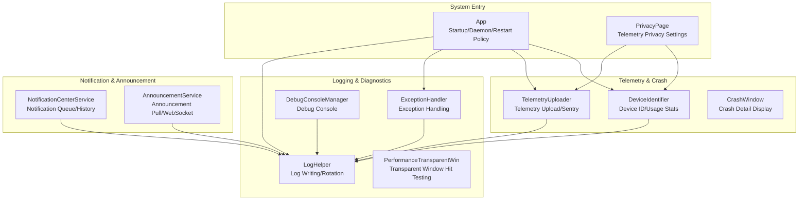
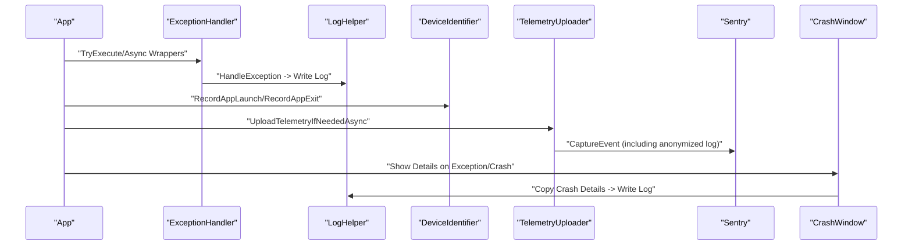
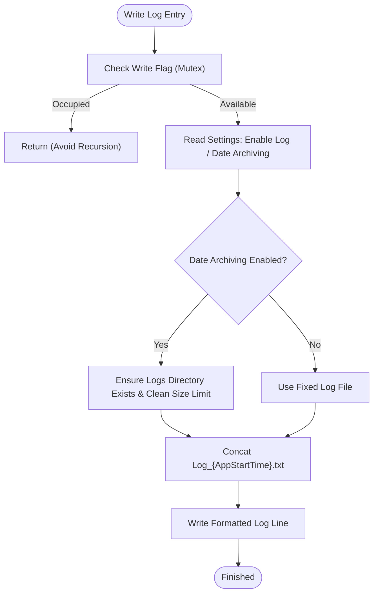
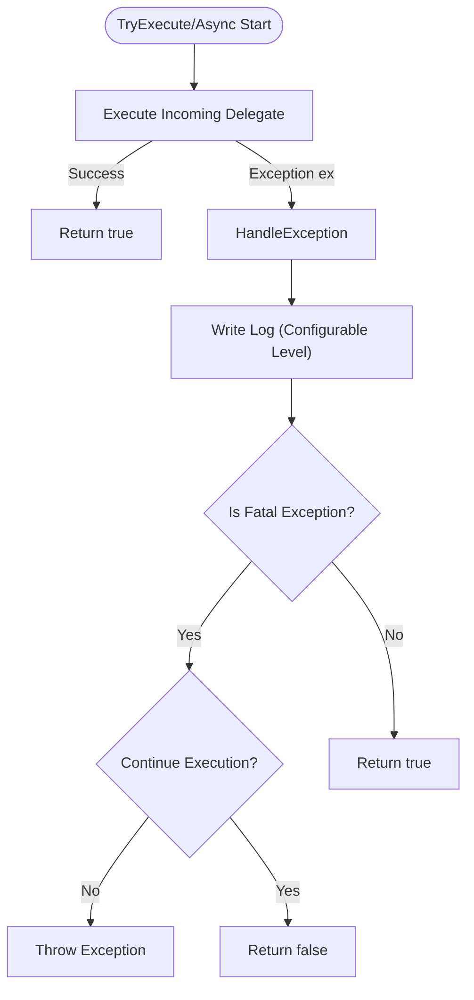
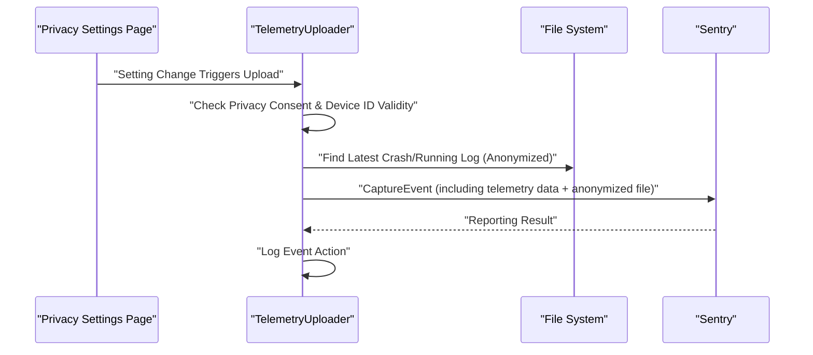
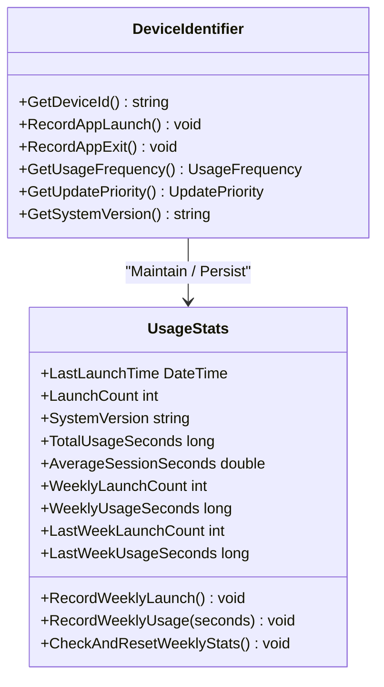
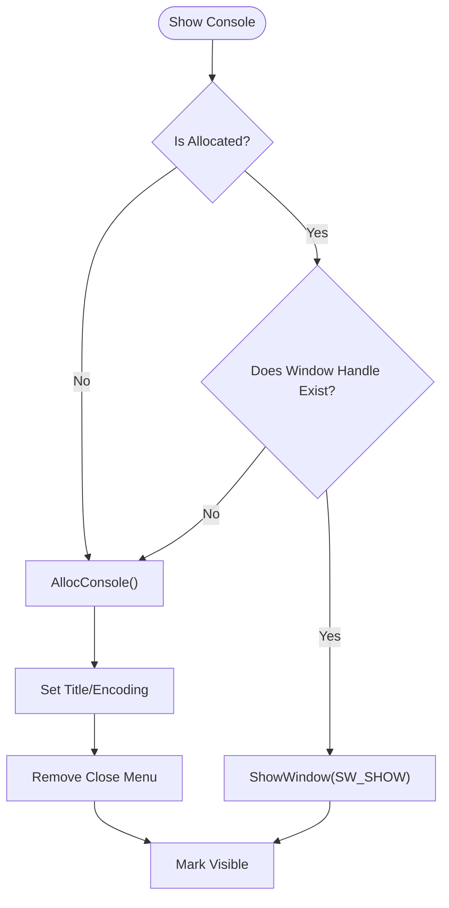
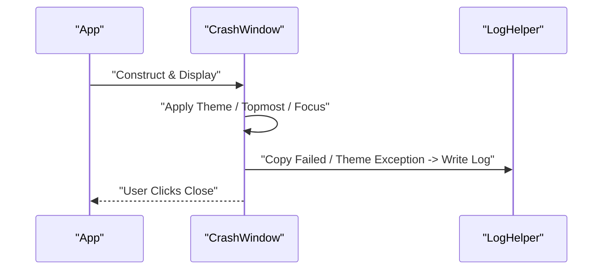
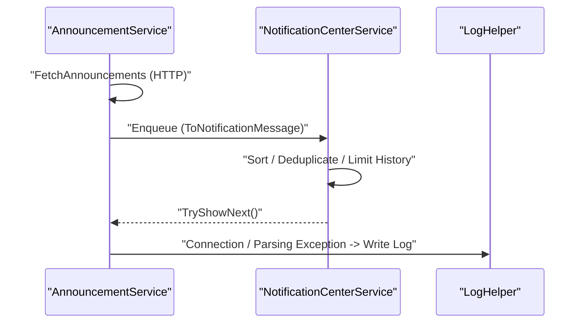
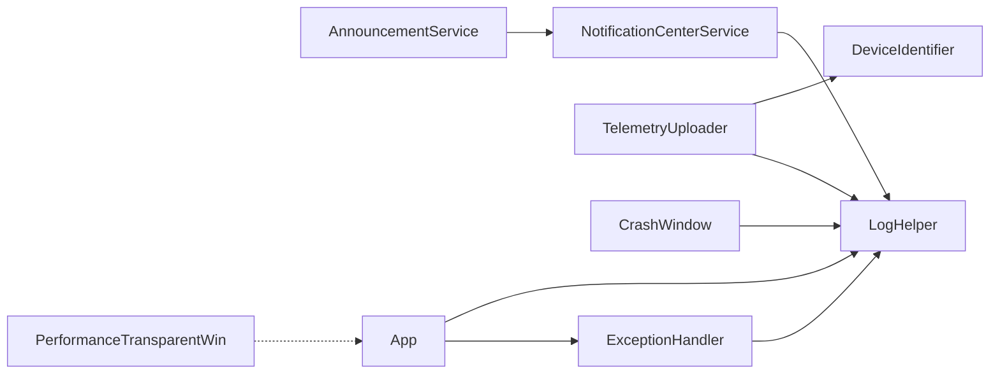

# Monitoring and Diagnostics System

## Introduction
This document focuses on the monitoring and diagnostics system of InkCanvasForClass, systematically reviewing its overall architecture and implementation key points, covering the following aspects:
- Performance monitoring and memory usage tracking
- Error log collection and system health checks
- Logging implementation mechanisms (levels, format, rotation, remote transmission)
- Telemetry data collection and analysis (user behavior stats, performance metrics, crash data analysis)
- Integration of diagnostics tools (debug console, performance analysis, memory leak detection helper)
- Monitoring alarm mechanisms (thresholds, rules, and notification policies)
- Extension and customization guide (custom metrics, monitoring panels, and reports)
- Privacy protection and compliance of monitoring data

## Project Structure
Monitoring and diagnostics code is mainly located in the following modules under `Ink Canvas/Helpers` and `Ink Canvas/Windows`:
- Logging & Exception Handling: LogHelper, ExceptionHandler, DebugConsoleManager
- Telemetry & Crash Reporting: TelemetryUploader, DeviceIdentifier
- System Health & Crash Window: App (Startup and Watchdog), CrashWindow
- Notification Center & Announcement: NotificationCenterService, AnnouncementService
- Performance Transparent Window: PerformanceTransparentWin (Rendering and Hit Testing)

## Core Components
- Logging System (LogHelper)
  - Supports archiving by startup time or fixed file mode, automatically cleaning up log folders that exceed the size limit to prevent disk expansion.
  - Provides a unified log writing interface, including timestamps, thread IDs, log levels, and caller information.
- Exception Handling (ExceptionHandler)
  - Unifies exception capture and log recording, distinguishing between fatal exceptions (such as out-of-memory, access violations) and recoverable ones.
  - Provides synchronous and asynchronous execution wrappers, supporting context strings and continue-execution strategies.
- Telemetry Upload (TelemetryUploader)
  - Reports telemetry events based on Sentry, including metadata like device ID, update channel, application version, and OS version.
  - Supports two levels: Basic / Extended. Extended will attach anonymized execution logs.
  - Automatically anonymizes sensitive information such as emails, phone numbers, IPs, paths, keys, and URL parameters.
- Device Identifier & Usage Statistics (DeviceIdentifier)
  - Generates a stable 25-character device ID, combining hardware fingerprints and check digits, with tolerance for cross-hardware changes.
  - Maintains usage statistics (launches, total duration, weekly stats, average session duration), and calculates usage frequency and update priorities.
- Debug Console (DebugConsoleManager)
  - Dynamically allocates/shows/hides the console window, removing the close menu to prevent users from accidentally closing the process.
- Crash Window (CrashWindow)
  - Displays crash details, supporting copy and close actions, coordinating with telemetry and logs to locate issues.
- Notification Center & Announcement (NotificationCenterService, AnnouncementService)
  - Unifies notification queues and histories, supporting real-time announcement push and HTTP fallback.

## Architecture Overview
The monitoring and diagnostics system is built around the closed loop of "Logs—Exceptions—Telemetry—Crash—Notifications—System Health". The key interactions are:

## Detailed Component Analysis

### Logging System (LogHelper)
- Log Levels: Info, Trace, Error, Event, Warning
- Log Format: Includes timestamp, thread ID, level, caller info, and message body.
- Archive Policy: Names log files by startup time, automatically cleaning up directory contents when date archiving is enabled (default limit is 5MB).
- Concurrency Safety: Uses atomic flags to avoid deadlocks caused by recursive writing.
- Output Location: Supports fixed file and startup time archive modes.

### Exception Handling (ExceptionHandler)
- Unifies exception capture, logging context, and inner exception chains.
- Decides whether to continue execution for fatal exceptions (out-of-memory, access violation).
- Provides synchronous and asynchronous TryExecute / TryExecuteAsync wrappers to simplify caller logic.

### Telemetry Upload (TelemetryUploader)
- Telemetry Level: None, Basic, Extended
- Data Content: Device ID, update channel, app version, OS version, and presence of crash/running logs.
- Anonymization Policy: Emails, phone numbers, IPv4, Windows paths, UNC paths, secret keys, JSON fields, URL parameters.
- Transmission Channel: Sentry event reporting, attached with user information and extra data.
- Trigger Conditions: Satisfies privacy consent, valid device ID, and upload level is not None.

### Device Identifier & Usage Statistics (DeviceIdentifier)
- Device ID Generation: Based on hardware fingerprints (CPU/motherboard/BIOS/disk/MachineGuid etc.) + SHA256 + check digits to ensure stability and uniqueness.
- Usage Statistics: Startup counts, total usage duration, average session duration, weekly statistics (launch counts and duration).
- Frequency and Priority: Groups into High/Medium/Low frequency based on a comprehensive score (activity, weekly startup counts, weekly usage duration, historical duration), mapped to update priorities.
- File Persistence: Device ID and usage statistics are persisted separately, featuring master files and backup files with automatic degradation upon anomalies.

### Debug Console (DebugConsoleManager)
- Dynamically allocates console window, setting title and encoding, and disabling the close menu.
- Provides show/hide/write interfaces to avoid duplicate allocations and exceptions.

### Crash Window (CrashWindow)
- Shows crash details text box, supporting copy and close actions.
- Adapts theme to system settings and logs errors on exceptions.

### Notification Center & Announcement (NotificationCenterService, AnnouncementService)
- Notification Center: Queues notifications, sorting by level/priority/creation time, and limiting history counts.
- Announcement Service: Supports HTTP pull and WebSocket real-time push, filtering expired/not started/version/channel mismatch items, supporting marking as read and unread counts.

## Dependency Analysis
- Logging & Exceptions: ExceptionHandler depends on LogHelper. App makes heavy use of logging and exception handling during startup, shutdown, and watchdog processes.
- Telemetry & Device: TelemetryUploader depends on DeviceIdentifier to retrieve the device ID; it checks privacy consent and device ID validity before uploading.
- Crash & Telemetry: Crash details can be copied via CrashWindow, which is subsequently logged by the logging system for later telemetry analysis.
- Notifications & Announcement: AnnouncementService coordinates with NotificationCenterService to form a unified message distribution and history management system.
- Performance & Hit Testing: PerformanceTransparentWin combines transparent hit testing with DWM/WindowChrome, reducing unnecessary drawing areas and indirectly boosting rendering performance.

## Performance Considerations
- Log writing uses a mutex flag to avoid recursion and concurrency conflicts, while date archiving and size limits lower IO and disk pressures.
- Telemetry upload executes on a background thread, and anonymization mitigates the risk of sensitive data leaks.
- Device ID and usage statistics caching (2 minutes) reduces frequent IO and computing overhead.
- Transparent window hit testing combined with DWM/WindowChrome reduces unnecessary drawing areas, improving rendering performance.
- Startup watchdog and silent restart strategies attempt recovery when the main thread freezes, safeguarding the user experience.

## Troubleshooting Guide
- Inspecting Logs
  - Fixed files or startup-time archived files are located in the application root directory or the Logs subdirectory. Pay attention to the 5MB size limit cleanup records.
  - Focus on Error / Warning / Event level logs to locate the exception context and caller details.
- Exception Handling
  - Wrap error-prone logic with TryExecute / TryExecuteAsync to ensure exceptions are caught and logged.
  - Terminate execution and report for fatal exceptions (out-of-memory, access violations).
- Telemetry & Crash
  - Confirm privacy consent and device ID validity. Extended level will attach anonymized running logs.
  - Crash details can be copied via CrashWindow, combined with logs to locate the issue.
- Notifications & Announcement
  - If real-time push fails, the service falls back to HTTP poll; check the network and announcement source URL.
- Debug Console
  - Display the console via DebugConsoleManager to view real-time output and interactions.

## Conclusion
The monitoring and diagnostics system, centered around logs, integrates exception handling, telemetry uploads, device identification statistics, crash windows, and notification centers to form a complete observability loop. The system prioritizes privacy protection (anonymization and minimal collection), performance optimization (size limits, caching, and transparent window hit testing), and user experience (silent restart, theme adaptation, real-time announcements). Through reasonable extension points and custom guides, custom metrics and reports can be introduced without disrupting existing mechanisms.

## Appendix

### Monitoring Alarm Mechanism (Recommended)
- Threshold Configuration
  - Log Level Threshold: Error/Warning high-frequency alarms; Event important events alarms.
  - Crash Rate Threshold: Crash count / total startups within a unit time.
  - Performance Threshold: Decrease in average session duration, abnormal fluctuations in weekly startup counts.
- Alarm Rules
  - Dynamically adjust alarm strategies based on DeviceIdentifier usage frequency and update priorities.
  - Telemetry event tags (device ID, update channel, OS version) are used for aggregation and comparison.
- Notification Policies
  - Notification center priority sorting, with Critical/Urgent notifications forcing popup windows.
  - Announcement service supports filtering by version/channel to avoid irrelevant alerts.

### Extension and Customization Guide
- Custom Metrics
  - Extend UsageStats fields in DeviceIdentifier, or add a standalone statistical module.
  - Extend telemetry data structures and anonymization rules in TelemetryUploader.
- Monitoring Panel
  - Build visualization panels based on log files and telemetry event tags (external tools recommended).
- Report Generation
  - Export weekly/monthly usage statistics and crash reports, processed with anonymization in compliance with privacy policies.

### Privacy Protection and Compliance
- Privacy Consent: User consent must be obtained prior to uploading telemetry.
- Data Minimization: Only upload anonymous device IDs, version, and system information.
- Anonymization: Replace emails, phone numbers, IPs, paths, keys, and URL parameters.
- File Cleanup: Automatically clean up when the log folder exceeds limits, keeping cleanup logs.
- Sync & Storage: Device ID and usage statistics files are stored using encrypted/secure paths.
