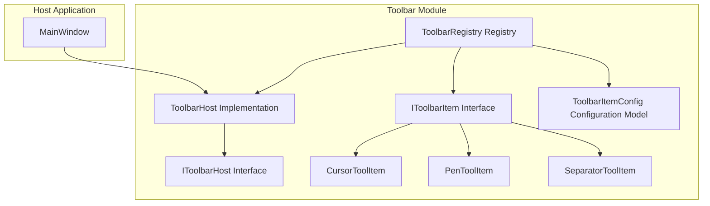
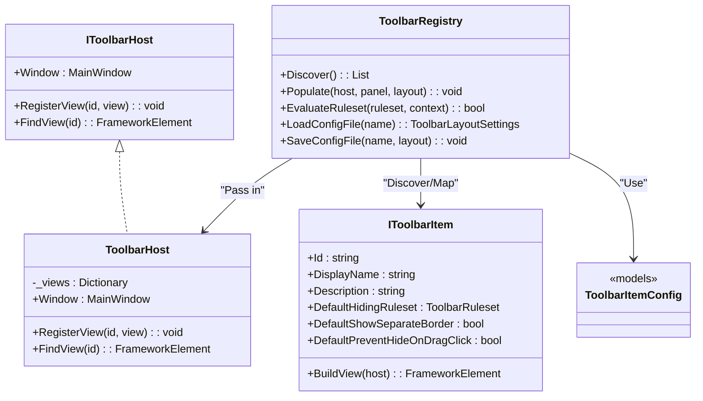
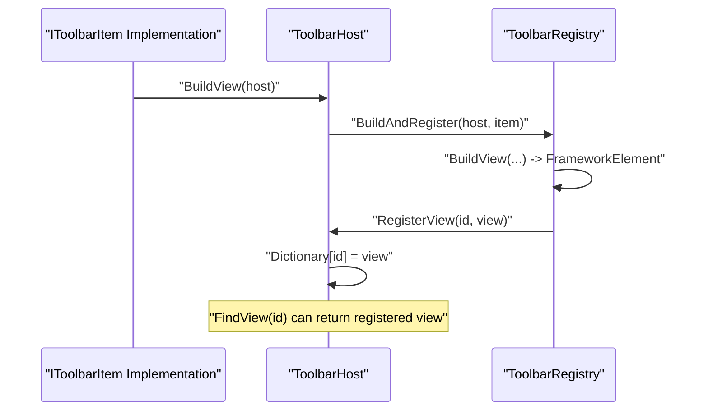
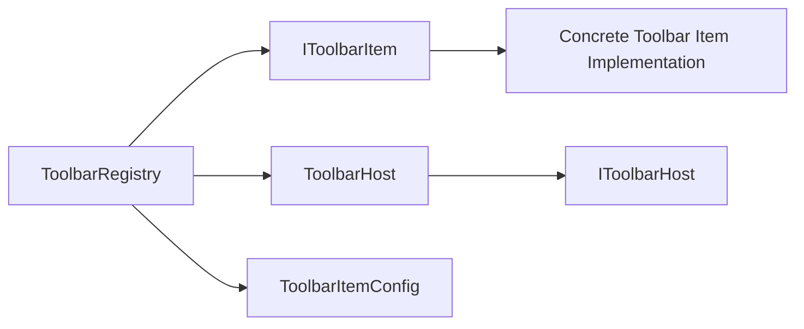

# Toolbar Architecture Design

## Introduction
This document focuses on the toolbar architecture design, centering on the ToolbarHost class and its role in the toolbar system. It systematically explains its design philosophy and operational mechanisms as the implementation of the IToolbarHost interface. It also analyzes in depth the toolbar initialization workflow, view registration and lookup mechanisms, and the configuration management capabilities of ToolbarItemConfig (layout, display attributes, and behaviors). At the same time, it dissects key design decisions in the architecture (dictionary storage, ID mapping, view caching strategies, etc.) and provides architecture and sequence diagrams to help developers understand the overall design and extension points.

## Project Structure
The toolbar-related code is centralized in the Ink Canvas/Controls/Toolbar directory, which contains modules such as interface definitions, host implementations, rule and configuration models, registry, and toolbar item implementations. MainWindow collaborates with ToolbarHost and ToolbarRegistry to accomplish dynamic injection and visibility control of the toolbar.

## Core Components
- IToolbarHost: Defines the host interface, providing the MainWindow reference, the ability to register views by id, and look up views by id. It serves as the bridge for interaction between plugins and the host.
- ToolbarHost: The implementation of IToolbarHost by MainWindow. Internally, it uses a dictionary to store views, provides registration and lookup methods, and supports safety checks for null and empty strings.
- IToolbarItem: The abstract interface for toolbar items. It defines the unique identifier, display name, description, default hiding rules, default border strategy, and the factory method for building views.
- ToolbarRegistry: The toolbar registry. It is responsible for discovering toolbar items, loading/saving layout configurations, constructing and injecting views, evaluating visibility, and segmented rendering.
- ToolbarItemConfig: The configuration model, which includes rulesets (Ruleset/RuleGroup/Rule), component entries (ComponentEntry), layout settings (LayoutSettings), and hiding rule enums, supporting show/hide logic under complex conditions.

## Architecture Overview
The toolbar system adopts a layered architecture of "interface constraint + host implementation + registry driven":
- IToolbarHost abstracts host capabilities, making plugins depend only on the interface, reducing coupling.
- ToolbarHost provides the minimum viable implementation, carrying view registration and lookup.
- ToolbarRegistry is responsible for assembly: discovering IToolbarItem implementations, generating views according to configurations, injecting them into containers, applying rulesets, and controlling visibility.
- ToolbarItemConfig provides serializable layout and rule configurations, supporting conditional combinations and inversion logic.

## Detailed Component Analysis

### ToolbarHost: Host Implementation and View Management
- Design Philosophy
  - Expose the capabilities of MainWindow as an interface. Plugins access host functions via host.Window, facilitating the gradual narrowing of the interface scope in the future.
  - Store views in a dictionary to provide O(1) lookup and registration, simplifying cross-component communication.
- Key Mechanisms
  - Registration: RegisterView(id, view). If the id or view is empty, it is directly ignored to avoid contaminating the dictionary.
  - Lookup: FindView(id). If the id is empty, it returns null; otherwise, it attempts to retrieve and return it.
- Error Handling
  - Defensive validation of empty inputs to ensure thread safety and robustness.
- Performance Characteristics
  - Dictionary lookup and insertion are both average O(1), suitable for high-frequency call scenarios.
  - No cache invalidation strategy; the view lifecycle is managed by the caller.

## Dependency Analysis
- Component Coupling
  - ToolbarRegistry depends on IToolbarItem discovery and mapping, depends on ToolbarHost for view registration, and depends on ToolbarItemConfig for rule and layout parsing.
  - IToolbarHost and ToolbarHost are loosely coupled, interacting only through the interface, which makes it easy to replace implementations.
- External Dependencies
  - The configuration file system depends on JSON serialization and file I/O; rule evaluation depends on a context dictionary.
- Circular Dependencies
  - No direct circular dependencies found; the dependency between the registry and the host is unidirectional.

## Performance Considerations
- Lookup and Registration
  - Dictionary O(1) lookup and insertion, suitable for high-frequency access; it is recommended to register centrally during the construction phase to avoid frequent changes at runtime.
- Rule Evaluation
  - The depth and branches of the rule tree affect the evaluation time; it is recommended to split rule groups reasonably to reduce unnecessary computations.
- File I/O
  - Configuration loading/saving involves disk I/O; it is recommended to make them asynchronous and execute them on background threads to avoid blocking the UI.
- Visibility Updates
  - Recursively traversing containers to update visibility; it is recommended to batch updates during mode transitions to reduce multiple redraws.

## Troubleshooting Guide
- Ruleset Not Taking Effect
  - Check if the context dictionary is correctly populated (annotation mode, PPT mode, user collapsed state).
  - Confirm if the ruleset is correctly attached to the dependency property of the element.
- View Not Found
  - Confirm that IToolbarItem.Id is consistent with the id in the configuration; check if it has been successfully registered to ToolbarHost.
- Configuration Loading Failed
  - Check the log output to verify if the main configuration file exists or is corrupted; the system will attempt to restore from a backup.
- Panel Not Updated
  - Confirm that UpdateVisibilityByMode has been called with the correct context.

## Conclusion
Through interface abstraction, host implementation, and registry drive, this toolbar architecture realizes a highly cohesive and loosely coupled extensible system. ToolbarHost provides stable view indexing capabilities with simple dictionary storage; ToolbarItemConfig provides powerful rule and layout expressions; ToolbarRegistry is responsible for assembly, injection, and visibility control, forming a complete closed loop of the toolbar lifecycle. This design not only meets the functional requirements of the current phase but also reserves space for subsequent interface convergence and performance optimization.

## Appendix
- Extension Point Suggestions
  - Adding a new toolbar item: Implement the IToolbarItem interface and return a view; the registry will automatically discover and assemble it.
  - Custom rules: Combine ToolbarRuleset/Group/Rule to express complex conditions, combined with the context dictionary to implement dynamic display.
  - Narrowing host capabilities: Gradually encapsulate concrete behaviors of MainWindow into ToolbarHost methods/events to narrow the interface exposure.
- Best Practices
  - Use InstanceId to distinguish multiple instances of the same type, avoiding id conflicts.
  - Centrally register views during the construction phase to reduce runtime lookup costs.
  - Perform exception handling and logging on configuration file operations to improve observability.
